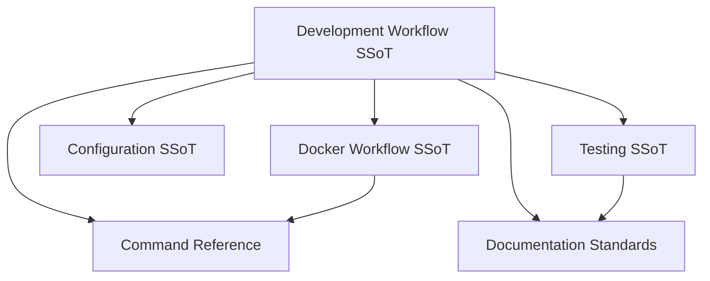

# Development Workflow

> **SSoT** for daily development procedures, adding features, and database management in effectful.

## SSoT Link Map



| Need | Link |
|------|------|
| Container policy | [Docker Workflow](docker_workflow.md) |
| Exact command syntax | [Command Reference](command_reference.md) |
| Environment variables | [Configuration](configuration.md) |
| Documentation rules | [Documentation Standards](documentation_standards.md) |
| Test sequencing | [Testing](testing.md#running-tests) |

## Daily Development Loop

1. `docker compose -f docker/docker-compose.yml up -d`
2. Make code changes
3. `poetry run check-code` (Black → MyPy → doc link verification; see [Code Quality](type_safety_enforcement.md))
4. `poetry run pytest` (see [Command Reference](command_reference.md))
5. Leave changes uncommitted (see Git Workflow Policy below)

## Adding New Effects

**9-step procedure** for introducing new effect types to the system:

1. **Define immutable effect dataclass** in `effectful/effects/`
   - Use `@dataclass(frozen=True)`
   - Include all parameters needed for execution
   - Follow naming convention: verb-noun (e.g., `GetUserById`, `SendText`)

2. **Add effect to AllEffects union** in `effectful/programs/program_types.py`
   ```python
   type AllEffects = (
       SendText
       | GetUserById
       | YourNewEffect  # Add here
       | ...
   )
   ```

3. **Update EffectResult union** if effect returns new type
   ```python
   type EffectResult = (
       User
       | ChatMessage
       | YourNewResult  # Add here
       | ...
   )
   ```

4. **Create specialized interpreter** in `effectful/interpreters/`
   - Inherit from `BaseInterpreter`
   - Implement `handle()` method returning `Result[T, E]`
   - Follow fail-fast error handling pattern

5. **Register interpreter** in `CompositeInterpreter`
   - Add to interpreter list during initialization
   - Ensure correct handler precedence

6. **Create real adapter** in `effectful/adapters/` (if needed)
   - Implement infrastructure protocol
   - Handle real I/O (database, network, etc.)
   - Follow adapter naming: `PostgresXRepository`, `RedisXCache`

7. **Write unit tests** with pytest-mock
   - Test interpreter logic with mocked infrastructure
   - See [Testing](testing.md) for anti-patterns to avoid
   - Use `mocker.AsyncMock(spec=Protocol)` for type safety

8. **Write integration tests** with real infrastructure
   - Test against real PostgreSQL/Redis/MinIO/Pulsar
   - Validate actual infrastructure operations
   - Ensure TRUNCATE + seed in fixtures for isolation

9. **Update documentation** in `documents/`
   - Add to API reference: `documents/api/effects.md`
   - Add tutorial if complex: `documents/tutorials/`
   - Update README.md if user-facing

## Adding New Domain Models

**5-step procedure** for introducing new domain types:

1. **Create ADT types** in `effectful/domain/`
   - All dataclasses `frozen=True`
   - Use union types for variants: `type Result = Success | Failure`
   - Follow naming convention: noun-based (e.g., `User`, `ChatMessage`)

2. **Update EffectResult** if model is returned from effects
   ```python
   type EffectResult = (
       User
       | YourNewDomainModel  # Add here
       | ...
   )
   ```

3. **Write exhaustive pattern matching examples**
   - Demonstrate handling all cases
   - Show type narrowing patterns
   - Include in docstrings or tests

4. **Add tests for domain model validation**
   - Test frozen dataclass behavior
   - Test field validation if applicable
   - Test ADT variant construction

5. **Update API documentation**
   - Add to `documents/api/` reference
   - Include usage examples
   - Document all fields and types

## Database Management

### Schema Migrations

**Integration tests use real PostgreSQL** with schema migrations.

**Schema location**: `effectful/infrastructure/schema.sql` (or similar)

**Migration process**:
1. Update schema file
2. Restart containers: `docker compose -f docker/docker-compose.yml down -v && docker compose -f docker/docker-compose.yml up -d`
3. Run integration tests to verify schema

### Test Data Seeding

**Auto-seeded before each integration test** (with TRUNCATE for isolation).

**Fixture pattern**:
```python
@pytest.fixture
async def seed_database(db_connection):
    # TRUNCATE all tables
    await db_connection.execute("TRUNCATE users CASCADE")

    # Seed test data
    await db_connection.execute(
        "INSERT INTO users (id, name, email) VALUES ($1, $2, $3)",
        user_id, "Alice", "alice@example.com"
    )
```

### Database Reset

**Full reset** (removes all data):
```bash
docker compose -f docker/docker-compose.yml down -v
docker compose -f docker/docker-compose.yml up -d
```

**Rationale**: Named volumes ensure consistent permissions (see [Docker Workflow](docker_workflow.md)).

## Git Workflow Policy

**Critical Rule**: Claude Code is NOT authorized to commit or push changes.

### Forbidden Git Operations

- ❌ **NEVER** run `git commit` (including `--amend`, `--no-verify`, etc.)
- ❌ **NEVER** run `git push` (including `--force`, `--force-with-lease`, etc.)
- ❌ **NEVER** run `git add` followed by commit operations
- ❌ **NEVER** create commits under any circumstances

### Required Workflow

- ✅ Make all code changes as requested
- ✅ Run tests and validation (see [Command Reference](command_reference.md))
- ✅ Leave ALL changes as **uncommitted** working directory changes
- ✅ User reviews changes using `git status` and `git diff`
- ✅ User manually commits and pushes when satisfied

**Rationale**: All changes must be human-reviewed before entering version control. This ensures code quality, prevents automated commit mistakes, and maintains clear authorship.

## Integration Test Setup

**Docker services required**:
- PostgreSQL 15+ (`postgres`)
- Redis 7+ (`redis`)
- MinIO S3 (`minio`)
- Apache Pulsar (`pulsar`)

**Start all services**:
```bash
docker compose -f docker/docker-compose.yml up -d
```

**Verify services**:
```bash
docker compose -f docker/docker-compose.yml ps
```

All services should show "Up" status.

**Run integration tests**:
```bash
docker compose -f docker/docker-compose.yml exec effectful poetry run test-integration
```

## Package Management

**Poetry manages all dependencies** via `pyproject.toml`.

**CRITICAL**: `poetry.toml` prevents virtualenv creation (`create = false`).

**Add runtime dependency**:
```bash
docker compose -f docker/docker-compose.yml exec effectful poetry add <package>
```

**Add dev dependency**:
```bash
docker compose -f docker/docker-compose.yml exec effectful poetry add --group dev <package>
```

**Forbidden**:
- ❌ No manual pip/pipx usage
- ❌ No `poetry install` outside Docker
- ❌ No requirements.txt files

**All dependencies declared in pyproject.toml**.

## See Also

- [Architecture](architecture.md) - 5-layer architecture design
- [Command Reference](command_reference.md) - All Docker commands
- [Code Quality](type_safety_enforcement.md) - check-code workflow
- [Testing](testing.md) - Testing standards and anti-patterns
- [Docker Workflow](docker_workflow.md) - Complete Docker policy

---

**Last Updated**: 2025-12-01
**Referenced by**: CLAUDE.md, README.md, contributing.md
