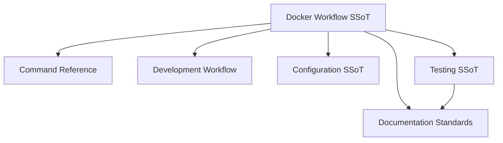

# Docker Development Doctrine

**Status**: Authoritative source\
**Supersedes**: none\
**Referenced by**: CLAUDE.md, command_reference.md, configuration.md, development_workflow.md, engineering/README.md, README.md, engineering/warnings_policy.md

> **Purpose**: Single Source of Truth for all Docker development workflow and environment setup in effectful.

______________________________________________________________________

## SSoT Link Map



| Need                       | Link                                                     |
| -------------------------- | -------------------------------------------------------- |
| Exact command syntax       | [Command Reference](command_reference.md)                |
| Daily loop                 | [Development Workflow](development_workflow.md)          |
| Environment variables      | [Docker & Environment Variables](docker.md)              |
| How to test                | [Testing](testing.md#running-tests)                      |
| Documentation requirements | [Documentation Standards](../documentation_standards.md) |

## Development Contract

- All engineering commands run **only** inside the Docker container (`docker compose ... exec effectful poetry run ...`).
- Host-level Python, Poetry, and pytest are out of scope; `poetry.toml` disables local virtualenvs.
- Infrastructure dependencies (PostgreSQL, Redis, MinIO, Pulsar, Prometheus) are provided by the compose stack; tests rely on them being running.

## Core Principle

**ALL development commands MUST run inside the Docker container. NEVER run commands directly on the host machine.**

This doctrine applies to:

- Type checking (mypy)
- Code formatting (black)
- Testing (pytest)
- Package management (poetry)
- Python execution
- Any development-related command

## Rationale

### Why Docker-Only Development?

1. **Environment Consistency**: Everyone uses the exact same Python version, dependencies, and system libraries
1. **No Local Setup Required**: Contributors don't need to manage Python versions or virtual environments locally
1. **Infrastructure Parity**: Tests run against the same PostgreSQL, Redis, MinIO, and Pulsar versions as production
1. **Reproducible Builds**: Build artifacts are identical regardless of host OS (macOS, Linux, Windows)
1. **Clean Host Machine**: No Poetry virtualenvs (enforced via `poetry.toml`), no Python version conflicts

### Why NOT Local Development?

1. **Dependency Hell**: Different Python versions cause subtle bugs
1. **Missing Infrastructure**: Local tests can't connect to PostgreSQL/Redis/MinIO/Pulsar/Prometheus
1. **False Confidence**: Tests pass locally but fail in CI due to environment differences
1. **Onboarding Friction**: New contributors spend hours setting up local environments

## Command Patterns

### Correct Pattern

All commands follow this structure:

```bash
# snippet
docker compose -f docker/docker-compose.yml exec effectful poetry run <command>
```

### Examples

| Task               | Correct Command                                                                                  |
| ------------------ | ------------------------------------------------------------------------------------------------ |
| Type check         | `docker compose -f docker/docker-compose.yml exec effectful poetry run check-code`               |
| All tests          | `docker compose -f docker/docker-compose.yml exec effectful poetry run pytest`                   |
| Unit tests         | `docker compose -f docker/docker-compose.yml exec effectful poetry run pytest tests/unit`        |
| Integration tests  | `docker compose -f docker/docker-compose.yml exec effectful poetry run pytest tests/integration` |
| Python shell       | `docker compose -f docker/docker-compose.yml exec effectful poetry run python`                   |
| Add dependency     | `docker compose -f docker/docker-compose.yml exec effectful poetry add <package>`                |
| Add dev dependency | `docker compose -f docker/docker-compose.yml exec effectful poetry add --group dev <package>`    |

### Port and server policy

- **Single port only**: Use the port exposed by the compose service (`8851` for HealthHub). Do not start ad-hoc uvicorn instances on alternate ports for testing or debugging.
- **No host-local servers**: The only accepted application server is the one started by `docker compose ... up` for the target service. Rely on that process for API/SPA endpoints.
- **E2E base URLs**: When running Playwright, point `E2E_FRONTEND_URL` and `E2E_BACKEND_URL` to the compose service port (e.g., `http://localhost:8851`). Do not override to alternate ports unless the compose definition itself changes.
- **Stability changes in git**: If you need to adjust server settings (e.g., disable `--reload`), change the compose service command in version control instead of launching sidecar uvicorn processes.

### Shell Alias (Optional)

For convenience, add to your shell profile:

```bash
# snippet
alias eff='docker compose -f docker/docker-compose.yml exec effectful poetry run'
```

Then use: `eff pytest`, `eff check-code`, etc.

## Forbidden Practices

### NEVER Do This

```bash
# FORBIDDEN - Running pytest locally
pytest tests/

# FORBIDDEN - Running poetry locally
poetry run pytest
poetry add some-package
poetry install

# FORBIDDEN - Running mypy locally
mypy effectful/

# FORBIDDEN - Installing packages locally
pip install effectful
pip install -r requirements.txt

# FORBIDDEN - Running Python scripts locally
python examples/01_hello_world.py

# FORBIDDEN - Creates or uses virtualenvs
python -m venv .venv
source .venv/bin/activate
```

### Why These Are Forbidden

1. **Local pytest**: Won't have access to PostgreSQL, Redis, MinIO, Pulsar
1. **Local poetry**: `poetry.toml` prevents virtualenv creation - commands will fail
1. **Local mypy**: May use different Python version, give false positives/negatives
1. **Local pip**: Pollutes global Python, causes conflicts

## Development Workflow

Docker-based development follows a consistent daily loop: start services, make changes, run quality checks, run tests, and leave changes uncommitted for review.

**See**: [Development Workflow - Daily Development Loop](development_workflow.md#daily-development-loop) for the complete workflow and [Command Reference](command_reference.md) for all Docker commands.

### Pull Request Checklist

Before submitting a PR:

- [ ] All tests pass (zero failures, zero skipped)
- [ ] Zero mypy errors (`check-code` exits 0)
- [ ] Code formatted (Black applied)
- [ ] No forbidden constructs (Any, cast, type: ignore)
- [ ] All dataclasses frozen (`frozen=True`)
- [ ] ADTs used instead of Optional
- [ ] Result type used for errors
- [ ] Error paths tested
- [ ] Docstrings on public APIs

### Git Workflow

**See**: [Development Workflow - Git Workflow Policy](development_workflow.md#git-workflow-policy) for complete Git restrictions and required workflow. All changes must be left uncommitted for human review.

### Viewing Logs

```bash
# All services
docker compose -f docker/docker-compose.yml logs -f

# Just the effectful container
docker compose -f docker/docker-compose.yml logs -f effectful
```

### Stopping Services

```bash
# Stop but keep data
docker compose -f docker/docker-compose.yml stop

# Stop and remove containers (keeps volumes)
docker compose -f docker/docker-compose.yml down

# Stop and remove everything including data
docker compose -f docker/docker-compose.yml down -v
```

## Poetry Configuration

**CRITICAL**: Poetry is configured to NOT create virtual environments.

### poetry.toml

The repository includes `poetry.toml` at the root:

```toml
# file: configs/docker_workflow.toml
[virtualenvs]
create = false
in-project = false
```

**Why This Matters**:

- Running `poetry install` on host machine will fail (no virtualenv created)
- Prevents accidental local dependency installation
- Forces all development through Docker
- Eliminates "works on my machine" issues from virtualenv mismatches

### .venv Directory

If you see a `.venv` directory in the project root, it should NOT exist:

```bash
# Remove it
rm -rf .venv

# Verify poetry.toml exists
cat poetry.toml
# Should show: create = false
```

**How It Got There**: Someone ran `poetry install` before `poetry.toml` was added.

**Fix**: Delete it and never run `poetry install` locally again.

## Container Services

The effectful Docker Compose stack includes multiple services that work together to provide a complete development environment.

**Sidecar isolation (SSoT rule)**: All infrastructure containers are sidecars to the main `effectful` container. Following the sidecar pattern, do not expose sidecar ports to the host. Keep traffic inside the Docker Compose bridge network (`effectful-network`) and access services via their container DNS names from inside the stack. If you temporarily need a UI on the host, use `docker compose port <service> <port>` instead of adding `ports:` blocks.

### Service Overview

| Service      | Purpose                 | Internal Ports             | Data Persistence              |
| ------------ | ----------------------- | -------------------------- | ----------------------------- |
| `effectful`  | Main Python container   | -                          | Code bind-mounted from host   |
| `postgres`   | PostgreSQL 15+          | 5432                       | Named volume `pgdata`         |
| `redis`      | Redis 7+ cache          | 6379                       | Named volume `redisdata`      |
| `minio`      | S3-compatible storage   | 9000 (API), 9001 (Console) | Named volume `miniodata`      |
| `pulsar`     | Apache Pulsar messaging | 6650 (broker), 8080 (HTTP) | Named volume `pulsardata`     |
| `prometheus` | Metrics collection      | 9090                       | Named volume `prometheusdata` |
| `grafana`    | Metrics visualization   | 3000                       | Named volume `grafanadata`    |

### Effectful Container

**Purpose**: Runs the effectful Python library code with all development tools.

**Key Features**:

- Python 3.12 with Poetry for dependency management
- Two entrypoints: main (library development) and mock-client (integration testing)
- Bind-mounted source code (`./effectful:/app/effectful`, `./tests:/app/tests`)
- Connects to all infrastructure services

**Environment Variables**:

```bash
# snippet
POSTGRES_HOST=postgres
REDIS_HOST=redis
MINIO_ENDPOINT=minio:9000
PULSAR_URL=pulsar://pulsar:6650
PROMETHEUS_URL=http://prometheus:9090
```

### PostgreSQL Container

**Purpose**: Database backend for repository pattern testing.

**Version**: PostgreSQL 15+

**Data Persistence**: Named volume ensures data survives container restarts.

**Why Named Volumes?**: Bind mounts cause permission issues on Docker Desktop for Mac. Named volumes have correct ownership automatically.

### Redis Container

**Purpose**: Caching and session storage for cache effect testing.

**Version**: Redis 7+

**Data Persistence**: Named volume `redisdata`.

### MinIO Container

**Purpose**: S3-compatible object storage for storage effect testing.

**Version**: MinIO latest

**Access**:

- API: http://minio:9000 (inside Compose network only)
- Console: http://minio:9001 (port-forward temporarily if you need the UI on host)
- Credentials: `minioadmin` / `minioadmin`

**Data Persistence**: Named volume `miniodata`.

### Apache Pulsar Container

**Purpose**: Pub/sub messaging for messaging effect testing.

**Version**: Pulsar latest

**Access**:

- Broker: pulsar://pulsar:6650 (inside Compose network only)
- HTTP: http://pulsar:8080 (port-forward temporarily if you need Pulsar admin from host)

**Data Persistence**: Named volume `pulsardata`.

### Prometheus Container

**Purpose**: Metrics collection and time-series database for observability.

**Version**: Prometheus latest

**Configuration**:

- Config file: `docker/prometheus/prometheus.yml`
- Alert rules: `docker/prometheus/alerts.yml`
- Scrape interval: 15 seconds (default)

**Access**: http://prometheus:9090 (internal-only; port-forward if you need the UI on host)

**Key Features**:

- Scrapes `/metrics` endpoint from effectful applications
- Evaluates alert rules defined in `alerts.yml`
- Forwards alerts to Alertmanager (if configured)
- Time-series data stored in named volume

**Data Persistence**: Named volume `prometheusdata`.

**See Also**: `documents/engineering/observability.md` for metrics philosophy.

### Grafana Container

**Purpose**: Metrics visualization, dashboards, and alerting UI.

**Version**: Grafana latest

**Access**: http://grafana:3000 (internal-only; port-forward if you need the UI on host)

**Default Credentials**: `admin` / `admin` (change on first login)

**Key Features**:

- Pre-configured Prometheus datasource
- Dashboard provisioning from `docker/grafana/dashboards/`
- Alert notification channels (Slack, PagerDuty, Email)
- Query builder for PromQL expressions

**Data Persistence**: Named volume `grafanadata`.

**See Also**: `documents/tutorials/grafana_dashboards.md` for dashboard creation.

## IDE Integration

### VS Code

The devcontainer support allows VS Code to run inside the Docker container:

1. Install "Dev Containers" extension
1. Open command palette: "Dev Containers: Reopen in Container"
1. VS Code now runs all commands inside Docker automatically

### PyCharm

Configure a remote Python interpreter pointing to the Docker container:

1. Settings > Project > Python Interpreter
1. Add Interpreter > Docker Compose
1. Select `docker/docker-compose.yml` and service `effectful`

### Other Editors

Edit files on host, run commands via Docker exec as shown above.

## Environment Variables

All environment variables are defined exclusively in `docker/Dockerfile` following the SSoT principle.

**Key variables**:

- `PYTHONPATH=/app` - Enables `from effectful import ...` style imports
- `PYTHONPYCACHEPREFIX=/opt/pycache` - Centralizes Python bytecode cache
- `MYPY_CACHE_DIR=/opt/effectful/mypy_cache` - MyPy type checker cache
- `PYTEST_CACHE_DIR=/opt/effectful/pytest_cache` - Pytest cache
- `RUFF_CACHE_DIR=/opt/effectful/ruff_cache` - Ruff linter cache
- `XDG_CACHE_HOME=/opt/effectful/cache` - General tool cache

**See**: [Docker & Environment Variables](docker.md) for complete documentation of all environment variables, rationale, and enforcement policy.

## Cache Management

All build artifacts and caches live under `/opt/` with project namespacing:

**Effectful Namespace** (`/opt/effectful/`):

- `/opt/effectful/cache` - General cache (XDG_CACHE_HOME)
- `/opt/effectful/mypy_cache` - MyPy type checker cache
- `/opt/effectful/pytest_cache` - Pytest cache
- `/opt/effectful/ruff_cache` - Ruff linter cache

**Shared** (not namespaced):

- `/opt/pycache` - Python bytecode cache (shared across containers for performance)

**Why `/opt/effectful/` namespace?** Prevents conflicts when multiple containers run simultaneously. Demo applications (like HealthHub) use their own namespaces (e.g., `/opt/healthhub/`).

**PYTHONPYCACHEPREFIX impact**: Python now generates and caches `.pyc` files in `/opt/pycache`, improving import performance. Source directories stay clean.

## Troubleshooting

### "Container not running"

```bash
# Start the containers
docker compose -f docker/docker-compose.yml up -d
```

### "Permission denied"

```bash
# Reset volumes (loses data)
docker compose -f docker/docker-compose.yml down -v
docker compose -f docker/docker-compose.yml up -d
```

### "Poetry install failed"

```bash
# Rebuild the container
docker compose -f docker/docker-compose.yml build --no-cache effectful
docker compose -f docker/docker-compose.yml up -d
```

### "Tests can't connect to postgres/redis"

Ensure all infrastructure services are running:

```bash
# snippet
docker compose -f docker/docker-compose.yml ps
# Should show: effectful, postgres, redis, minio, pulsar, prometheus, grafana all "Up"
```

## See Also

- [Command Reference](command_reference.md) - Complete Docker command table
- [Code Quality](code_quality.md) - Type safety + purity doctrines
- [Testing](testing.md) - Test organization and 22 anti-patterns
- [Observability](observability.md) - Prometheus/Grafana integration
- [Development Workflow](development_workflow.md) - Daily development loop
- [Monitoring & Alerting](monitoring_and_alerting.md) - Metric/alert policy executed from Docker

## Cross-References

- [Command Reference](command_reference.md)
- [Development Workflow](development_workflow.md)
- [Configuration](configuration.md)
- [Testing](testing.md)
- [Warnings Policy](warnings_policy.md)
- [Documentation Standards](../documentation_standards.md)
