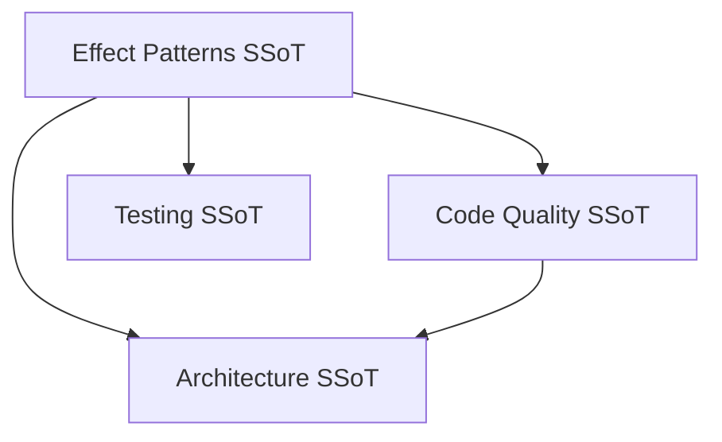

# Effect Program Patterns

**Status**: Authoritative source\
**Supersedes**: none\
**Referenced by**: engineering/README.md

> **Purpose**: SSoT for effect program composition, error handling, and real-world code examples in effectful.

## SSoT Link Map



| Need                                    | Link                                                         |
| --------------------------------------- | ------------------------------------------------------------ |
| Purity + type doctrine backing patterns | [Code Quality](code_quality.md)                              |
| Type signatures and unions              | [Code Quality](code_quality.md#type-safety-doctrines)        |
| How to test programs                    | [Testing](testing.md#part-4-four-layer-testing-architecture) |
| Where patterns sit in layers            | [Architecture](architecture.md#core-abstractions)            |

## Overview

This document provides **real-world patterns** for writing effect programs using effectful's generator-based DSL.

**Core Principle**: Programs are pure generators that yield effects and receive typed results.

For complete purity and type safety rules, see [Code Quality](code_quality.md).

## State Machines

- Model workflow states as ADTs with state-specific fields (no shared nullable fields).
- Validate every transition explicitly; return a result ADT (e.g., `TransitionSuccess | TransitionInvalid`) instead of raising.
- Detect terminal states and refuse further transitions to protect integrity and auditability.
- Encode role/time constraints in pure functions; keep side effects out of validation.
- Testing: exhaustively cover valid/invalid transitions and role/time-based constraints.

Use this pattern for any multi-step workflow (payments, provisioning, billing, healthcare) to make illegal states unrepresentable and to keep effect code pure.

## Pattern 1: Generator-Based DSL

**Use Case**: All effect programs use this pattern as the foundation.

```python
# file: examples/effect_patterns.py
from collections.abc import Generator
from effectful import (
    AllEffects,
    EffectResult,
    GetUserById,
    SendText,
    SaveChatMessage,
)
from effectful.domain import User, ChatMessage

def greet_user(user_id: UUID) -> Generator[AllEffects, EffectResult, bool]:
    """Effect program that looks up user and sends personalized greeting."""

    # Yield effect, receive result
    user = yield GetUserById(user_id=user_id)

    # Type narrowing
    if not isinstance(user, User):
        yield SendText(text="Error: User not found")
        return False

    # Use narrowed type
    greeting = f"Hello {user.name}!"
    yield SendText(text=greeting)

    # Type narrowing for next effect
    message = yield SaveChatMessage(user_id=user_id, text=greeting)
    assert isinstance(message, ChatMessage)

    yield SendText(text=f"Message saved with ID: {message.id}")
    return True
```

**Key Points**:

- **Type signature**: `Generator[AllEffects, EffectResult, ReturnType]`
- **Yield pattern**: `result = yield Effect(...)`
- **Type narrowing**: Use `isinstance()` checks before using result
- **Return value**: Any type (bool, str, ADT, etc.)

**See**: [Code Quality](code_quality.md#6-type-narrowing-for-union-types) - Doctrine 6: Type Narrowing for Union Types.

______________________________________________________________________

## Pattern 2: Fail-Fast Error Propagation

**Use Case**: Handle errors from effect execution at the program boundary.

```python
# file: examples/effect_patterns.py
from effectful import run_ws_program
from effectful.algebraic.result import Ok, Err

async def execute() -> None:
    result = await run_ws_program(greet_user(user_id), interpreter)

    # run_ws_program returns Err immediately on first effect failure
    match result:
        case Ok(success):
            print(f"Program completed: {success}")
        case Err(error):
            print(f"Program failed: {error}")
            # error is one of: DatabaseError | WebSocketClosedError | CacheError | etc.
```

**Key Points**:

- **First effect failure stops program**: No partial execution
- **Error type is union**: `DatabaseError | WebSocketClosedError | ...`
- **Pattern match required**: Caller must handle Ok and Err cases
- **No exceptions**: All errors returned as Result types

**Rationale**: Fail-fast prevents cascading failures and inconsistent state.

**See**: [Code Quality](code_quality.md#3-result-type-for-error-handling) - Doctrine 3: Result Type for Error Handling.

______________________________________________________________________

## Pattern 3: Composing Programs

**Use Case**: Build complex workflows from smaller, reusable programs.

```python
# file: examples/effect_patterns.py
def lookup_and_cache_profile(
    user_id: UUID
) -> Generator[AllEffects, EffectResult, ProfileData | None]:
    """Reusable program: lookup user, create profile, cache it."""
    user = yield GetUserById(user_id=user_id)

    if not isinstance(user, User):
        return None

    profile = ProfileData(id=str(user.id), name=user.name, email=user.email)
    yield PutCachedProfile(user_id=user.id, profile_data=profile, ttl_seconds=300)
    return profile

def greet_with_caching(user_id: UUID) -> Generator[AllEffects, EffectResult, str]:
    """Compose smaller programs into larger workflows."""

    # Check cache first
    cached = yield GetCachedProfile(user_id=user_id)
    if isinstance(cached, ProfileData):
        greeting = f"Hello {cached.name} (from cache)!"
    else:
        # Cache miss - lookup and cache
        profile = yield from lookup_and_cache_profile(user_id)
        if profile is None:
            return "User not found"
        greeting = f"Hello {profile.name}!"

    yield SendText(text=greeting)
    return greeting
```

**Key Points**:

- **yield from**: Delegates to sub-program
- **Reusable sub-programs**: `lookup_and_cache_profile` can be used anywhere
- **Type safety**: Sub-program return type flows through
- **Composition pattern**: Build complex from simple

**Rationale**: Encourages modularity and code reuse.

**See**: [Code Quality](code_quality.md#purity-doctrines) for functional composition patterns.

______________________________________________________________________

## Pattern 4: Recording Metrics (Don't Fail on Metric Errors)

**Use Case**: Record metrics without causing business logic to fail.

```python
# file: examples/effect_patterns.py
from effectful.effects.metrics import IncrementCounter, ObserveHistogram
from effectful.domain.metrics_result import MetricRecorded, MetricRecordingFailed
import time

def process_task_with_metrics(
    task_type: str,
    task_id: str,
) -> Generator[AllEffects, EffectResult, bool]:
    """Process task and record metrics."""

    # Start timer
    start = time.perf_counter()

    # Execute business logic
    result = yield ProcessTask(task_id=task_id)

    # Calculate duration
    duration = time.perf_counter() - start
    status = "success" if isinstance(result, TaskCompleted) else "failed"

    # Record counter metric
    counter_result = yield IncrementCounter(
        metric_name="tasks_processed_total",
        labels={"task_type": task_type, "status": status},
        value=1.0,
    )

    # Record histogram metric
    histogram_result = yield ObserveHistogram(
        metric_name="task_duration_seconds",
        labels={"task_type": task_type},
        value=duration,
    )

    # Pattern match on results
    match (counter_result, histogram_result):
        case (MetricRecorded(), MetricRecorded()):
            return True
        case (MetricRecordingFailed(reason=r), _):
            # Log error but don't fail the task
            print(f"⚠️  Counter metric failed: {r}")
            return isinstance(result, TaskCompleted)
        case (_, MetricRecordingFailed(reason=r)):
            print(f"⚠️  Histogram metric failed: {r}")
            return isinstance(result, TaskCompleted)
```

**Key Points**:

- **Metrics effects return ADT**: `MetricRecorded | MetricRecordingFailed`
- **Don't fail on metric errors**: Business logic proceeds even if metrics fail
- **Pattern match results**: Exhaustive handling of metric outcomes
- **Log failures**: Record metric errors for debugging

**Rationale**: Metrics are observability, not critical path. Metric failures shouldn't break features.

**See**: [Observability](observability.md) for complete metrics philosophy.

______________________________________________________________________

## Pattern 5: Exhaustive Pattern Matching

**Use Case**: Handle all possible result variants from effects.

```python
# file: examples/effect_patterns.py
from effectful.domain import UserFound, UserNotFound

def handle_user_lookup(user_id: UUID) -> Generator[AllEffects, EffectResult, str]:
    """Demonstrate exhaustive pattern matching."""

    lookup_result = yield LookupUser(user_id=user_id)

    # Exhaustive match - all cases handled
    match lookup_result:
        case UserFound(user=user, source="database"):
            yield SendText(text=f"Found {user.name} in database")
            return "database_hit"

        case UserFound(user=user, source="cache"):
            yield SendText(text=f"Found {user.name} in cache")
            return "cache_hit"

        case UserNotFound(user_id=uid, reason="does_not_exist"):
            yield SendText(text=f"User {uid} does not exist")
            return "not_found"

        case UserNotFound(user_id=uid, reason="deleted"):
            yield SendText(text=f"User {uid} was deleted")
            return "deleted"

        case UserNotFound(user_id=uid, reason="access_denied"):
            yield SendText(text=f"Access denied for user {uid}")
            return "access_denied"
```

**Key Points**:

- **All cases handled**: MyPy enforces exhaustiveness
- **Nested pattern matching**: Extract fields from ADT variants
- **Type narrowing**: After match, type is narrowed to specific variant
- **Unreachable code detected**: MyPy warns if case is impossible

**Rationale**: Prevents forgotten error cases, ensures all paths handled.

**See**: [Code Quality](code_quality.md#5-exhaustive-pattern-matching) - Doctrine 5: Exhaustive Pattern Matching.

______________________________________________________________________

## Common Mistakes

### Mistake 1: Forgetting Type Narrowing

**❌ WRONG**:

```python
# file: examples/effect_patterns.py
def greet_user(user_id: UUID) -> Generator[AllEffects, EffectResult, str]:
    user = yield GetUserById(user_id=user_id)
    # MyPy error: user might not be User, could be None or error type
    return f"Hello {user.name}!"
```

**✅ CORRECT**:

```python
# file: examples/effect_patterns.py
def greet_user(user_id: UUID) -> Generator[AllEffects, EffectResult, str]:
    user = yield GetUserById(user_id=user_id)

    if not isinstance(user, User):
        return "User not found"

    # Type narrowed - user is definitely User
    return f"Hello {user.name}!"
```

### Mistake 2: Calling Infrastructure Directly

**❌ WRONG**:

```python
# file: examples/effect_patterns.py
async def greet_user(user_id: UUID, db: UserRepository) -> str:
    user = await db.get_by_id(user_id)  # Forbidden!
    return f"Hello {user.name}!"
```

**✅ CORRECT**:

```python
# file: examples/effect_patterns.py
def greet_user(user_id: UUID) -> Generator[AllEffects, EffectResult, str]:
    user = yield GetUserById(user_id=user_id)
    # ...
```

**See**: [Code Quality](code_quality.md#anti-pattern-index-routing-to-canonical-fixes) - Anti-pattern routing.

### Mistake 3: Ignoring Effect Results

**❌ WRONG**:

```python
# file: examples/effect_patterns.py
def save_message(user_id: UUID, text: str) -> Generator[AllEffects, EffectResult, None]:
    yield SaveChatMessage(user_id=user_id, text=text)
    # Ignored result! Don't know if save succeeded
```

**✅ CORRECT**:

```python
# file: examples/effect_patterns.py
def save_message(user_id: UUID, text: str) -> Generator[AllEffects, EffectResult, bool]:
    result = yield SaveChatMessage(user_id=user_id, text=text)

    if not isinstance(result, ChatMessage):
        return False

    return True
```

______________________________________________________________________

## Pattern 6: Boundary Normalization for OptionalValue

### The Problem: Ergonomic APIs vs Type Safety

Users want ergonomic APIs when constructing effects:

```python
# Ergonomic: pass dict directly, or None, or OptionalValue
yield PutObject(bucket="x", key="y", content=b"z", metadata={"k": "v"})
yield PutObject(bucket="x", key="y", content=b"z")  # metadata absent
yield PutObject(bucket="x", key="y", content=b"z", metadata=Absent(reason="redacted"))
```

But effects should store normalized OptionalValue[T] internally for type safety and pattern matching.

### The Solution: Local Type-Specific Normalization

**CANONICAL PATTERN** - Replicate this in your effects:

```python
# snippet
from dataclasses import dataclass
from effectful.domain.optional_value import OptionalValue, Provided, Absent, to_optional_value

# Local normalization - type-specific, 4 lines, simple
def _normalize_optional_value(
    value: dict[str, str] | OptionalValue[dict[str, str]] | None,
) -> OptionalValue[dict[str, str]]:
    """Normalize plain values into OptionalValue ADT."""
    if isinstance(value, (Provided, Absent)):
        return value
    return to_optional_value(value)

@dataclass(frozen=True, init=False)
class PutObject:
    bucket: str
    key: str
    content: bytes
    metadata: OptionalValue[dict[str, str]]  # Always OptionalValue internally

    def __init__(
        self,
        bucket: str,
        key: str,
        content: bytes,
        metadata: dict[str, str] | OptionalValue[dict[str, str]] | None = None,
    ) -> None:
        """Create PutObject effect with ergonomic metadata parameter.

        Args:
            bucket: S3 bucket name
            key: Object key
            content: Object content bytes
            metadata: Optional metadata dict (normalized to OptionalValue)
        """
        # Normalize to OptionalValue before storing
        object.__setattr__(self, "bucket", bucket)
        object.__setattr__(self, "key", key)
        object.__setattr__(self, "content", content)
        object.__setattr__(self, "metadata", _normalize_optional_value(metadata))

### Apply the same rule to Pydantic/FastAPI request models

- **Total Pure Modelling** forbids nullable gaps: request DTOs are boundaries that must not leak `None` into domain code.
- **Do this**: accept ergonomics in the Pydantic model, then immediately normalize fields to `OptionalValue` or a domain ADT before any business logic.
- **Do not do this**: carry `str | None` / `UUID | None` through handlers or programs—replace with `Absent(reason=...)`/`Provided(...)` at the boundary.
- **Reference**: [total_pure_modelling.md](total_pure_modelling.md) for “no illegal states” and `OptionalValue` doctrine; keep backend/frontend shapes aligned to these ADTs.
```

### Why Local (Not Shared)?

**This is NOT duplication to fix.** Each normalization function:

1. **Type-specific** - Handles concrete types (dict[str, str], int, str)
1. **Simple** - 4 lines, single isinstance check
1. **Local** - Used only in one module's __init__ methods
1. **Pattern** - Intentionally replicated, like frozen=True

Extracting to shared utility would:

- Lose type specificity (requires complex generics)
- Add unnecessary indirection
- Create import dependencies
- Violate locality principle

### Testing Pattern

```python
# snippet
def test_put_object_normalizes_metadata() -> None:
    # Test with dict (normalized to Provided)
    effect = PutObject(bucket="b", key="k", content=b"", metadata={"x": "y"})
    assert isinstance(effect.metadata, Provided)
    assert effect.metadata.value == {"x": "y"}

    # Test with None (normalized to Absent)
    effect = PutObject(bucket="b", key="k", content=b"")
    assert isinstance(effect.metadata, Absent)
    assert effect.metadata.reason == "not_provided"

    # Test with OptionalValue (idempotent)
    effect = PutObject(bucket="b", key="k", content=b"", metadata=Absent(reason="custom"))
    assert effect.metadata.reason == "custom"
```

### When to Use This Pattern

Use local normalization when:

- Effect has optional parameters
- Want ergonomic API (allow T, None, or OptionalValue[T])
- Need type-safe storage (always OptionalValue[T] internally)
- Each parameter has concrete type (not generic across effects)

**See**: [OptionalValue API Reference](../api/optional_value.md#pattern-3-effect-parameters-the-canonical-normalization-pattern) for complete documentation.

______________________________________________________________________

## See Also

- [Code Quality](code_quality.md) - Type safety and purity doctrines
- [Testing](testing.md) - Generator testing and anti-patterns
- [Observability](observability.md) - Metrics and monitoring

______________________________________________________________________

## Cross-References

- [Code Quality](code_quality.md)
- [Testing](testing.md)
- [Architecture](architecture.md)
- [Documentation Standards](../documentation_standards.md)
