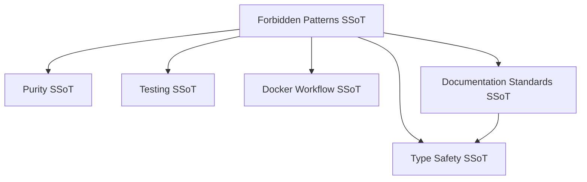
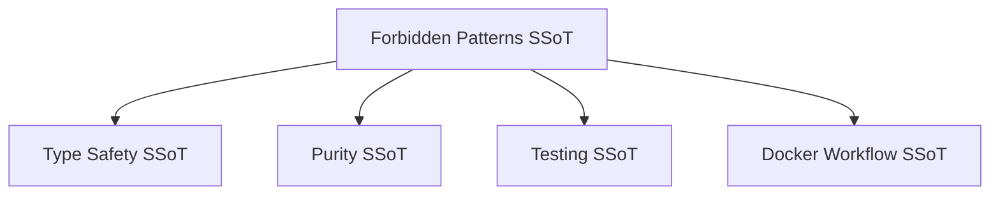
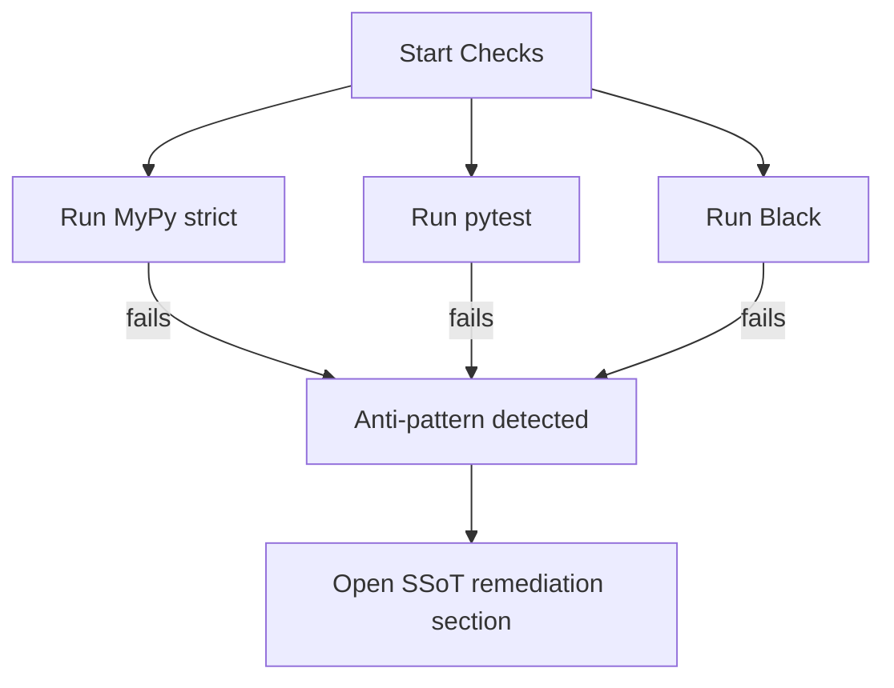
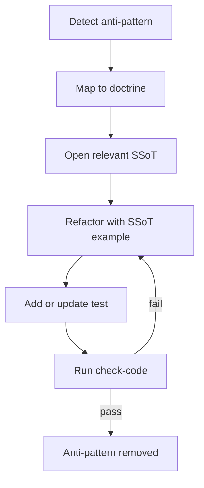

# Forbidden Patterns

> **Single Source of Truth (SSoT)** for anti-patterns and prohibited constructs in effectful. All remediation details live here; other documents link in for standards and doctrine.

## Overview

This document centralizes every forbidden pattern and links directly to the canonical standards that define how to fix them. Treat this as the only hub for anti-pattern navigation—each entry points to the SSoT that owns the corrective guidance.

**Core Philosophy**: Make invalid states unrepresentable through the type system. Link to the SSoT that enforces that rule instead of duplicating fixes here.

---

## SSoT Link Map



| Need | Link |
|------|------|
| Fix type-system violations | [Type Safety Enforcement](type_safety_enforcement.md) |
| Purity doctrines | [Purity](purity.md) |
| Test anti-pattern coverage | [Testing](testing.md#part-7-test-anti-patterns-1-22) |
| Docker-only contract | [Docker Workflow](docker_workflow.md#development-contract) |
| Documentation rules | [Documentation Standards](documentation_standards.md) |

## Anti-Pattern Index (SSoT Link Map)

| Anti-Pattern | Impact | Canonical Fix |
|--------------|--------|---------------|
| **Using `Any` Types** | Destroys type safety | [Type Safety Enforcement](type_safety_enforcement.md#anti-pattern-detection) |
| **Using `cast()`** | Bypasses type checker | [Type Safety Enforcement](type_safety_enforcement.md#anti-pattern-detection) |
| **Using `# type: ignore`** | Silences type errors | [Type Safety Enforcement](type_safety_enforcement.md#anti-pattern-detection) |
| **Mutable Domain Models** | Breaks immutability | [Type Safety Enforcement](type_safety_enforcement.md#doctrine-4-immutability) |
| **Optional for Domain Logic** | Loses type information | [Type Safety Enforcement](type_safety_enforcement.md#doctrine-2-adt-over-optional) |
| **Exceptions for Expected Errors** | Hidden error paths | [Type Safety Enforcement](type_safety_enforcement.md#doctrine-3-result-for-errors) |
| **Imperative Effect Execution** | Couples logic to infrastructure | [Purity](purity.md#doctrine-3-yield-dont-call) |
| **Immutability Libraries in Adapters** | Over-engineering, unnecessary dependencies | [Purity](purity.md#doctrine-4-immutability) |
| **While Loops in Programs** | Breaks purity (exception: trampoline) | [Purity](purity.md#doctrine-1-expressions-over-statements) |
| **Direct Infrastructure Calls** | Violates separation of concerns | [Purity](purity.md#doctrine-3-yield-dont-call) |
| **Skipped Tests (`pytest.skip()`)** | Masks broken features | [Testing](testing.md#anti-pattern-2-skipped-tests) |
| **Tests Without Assertions** | Provides false confidence | [Testing](testing.md#anti-pattern-5-no-assertions) |
| **Running pytest Locally** | No infrastructure access | [Docker Workflow](docker_workflow.md#development-contract) |
| **Running poetry Locally** | Bypasses Docker environment | [Docker Workflow](docker_workflow.md#development-contract) |

**Link hygiene**: Each row points to the authoritative remediation section. Add new anti-patterns only when the target SSoT exists.



---

## Detection Strategies

### Automated Detection

**Tools (link to SSoT runbooks):**
- **MyPy** (`mypy --strict`): [Type Safety Enforcement](type_safety_enforcement.md#anti-pattern-detection)
- **pytest**: [Testing](testing.md#running-tests)
- **Black**: [Development Workflow](development_workflow.md#code-quality-loop)



### Manual Detection

**Code review catches (link to remediation SSoT):**
- Mutable domain models (missing `frozen=True`) → [Type Safety Enforcement](type_safety_enforcement.md#doctrine-4-immutability)
- Optional instead of ADTs → [Type Safety Enforcement](type_safety_enforcement.md#doctrine-2-adt-over-optional)
- Exceptions instead of `Result` → [Type Safety Enforcement](type_safety_enforcement.md#doctrine-3-result-for-errors)
- Imperative effect execution → [Purity](purity.md#doctrine-3-yield-dont-call)
- Immutability library usage in adapters → [Purity](purity.md#doctrine-4-immutability)

**Grep patterns (use only as pointers to SSoT fixes):**
```bash
# Find mutable dataclasses
grep -r "@dataclass" effectful/ | grep -v "frozen=True"

# Find Optional in domain
grep -r "Optional\\[" effectful/domain/

# Find exceptions in business logic
grep -r "raise " effectful/programs/ effectful/domain/

# Find Any types
grep -r "Any" effectful/ tests/
```

---

## Remediation Workflow

**When anti-pattern detected:**

1. **Stop immediately** - freeze the branch until fixed
2. **Identify doctrine** - map violation to SSoT entry:
   - Type safety → [Type Safety Enforcement](type_safety_enforcement.md)
   - Purity → [Purity](purity.md)
   - Testing → [Testing](testing.md)
   - Docker → [Docker Workflow](docker_workflow.md)
3. **Refactor** - apply SSoT example verbatim
4. **Add test** - mirror guidance in [Testing](testing.md#part-3-coverage-doctrine)
5. **Verify** - run `docker compose -f docker/docker-compose.yml exec effectful poetry run check-code`
6. **Link back** - update docs/tests to reference the SSoT section if new pattern discovered



---

## SSoT Documents

**Core Engineering Standards:**
- [Type Safety Enforcement](type_safety_enforcement.md) - Eight doctrines, zero-tolerance policy
- [Purity](purity.md) - Six doctrines, functional programming patterns
- [Testing](testing.md) - 22 test anti-patterns and remedies
- [Docker Workflow](docker_workflow.md) - Docker-only development contract
- [Architecture](architecture.md) - Layer boundaries that prevent anti-patterns

**Supporting Documentation:**
- [Command Reference](command_reference.md) - Docker commands and test execution
- [Development Workflow](development_workflow.md) - Daily development loop and quality gates
- [Effect Patterns](effect_patterns.md) - Correct patterns to replace anti-patterns
- [Documentation Standards](documentation_standards.md) - SSoT, DRY, mermaid safety

---

---

**Last Updated**: 2025-12-01
**Referenced by**: README.md, CLAUDE.md, type_safety_enforcement.md, purity.md, testing.md, docker_workflow.md, documentation_standards.md
