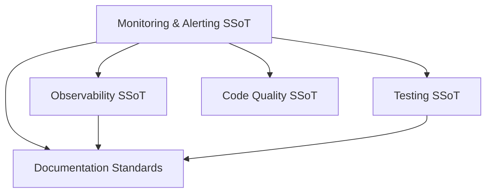

# Monitoring and Alerting

> **Single Source of Truth (SSoT)** for monitoring standards and alerting policy in Effectful. This replaces `monitoring_standards.md` and `alerting.md` to keep observability guidance DRY and cross-linked.

## SSoT Link Map

| Need | Link |
|------|------|
| Metrics/registry architecture | [Observability](observability.md) |
| Effect metrics + adapters | [Observability](observability.md#metrics-pipeline) |
| Alert testing patterns | [Testing](testing.md#part-5-testing-patterns) |
| Doc/link hygiene | [Documentation Standards](documentation_standards.md) |
| Type/purity guarantees around metrics | [Code Quality](code_quality.md) |

---

## Overview

Monitoring tracks **what is happening**; alerting pages humans when thresholds breach. Both share the same naming, labeling, and routing discipline so dashboards and runbooks stay predictable. Prefer links to canonical sections below instead of duplicating guidance in app-specific docs.

---

## Monitoring Standards

### Metric Naming
- Format: `<namespace>_<subsystem>_<metric>_<unit>`
- Namespace: `effectful` for framework metrics, `<app>` for app metrics.
- Units required (`seconds`, `bytes`, `_total` for counters); avoid redundant words.

**Examples**
- `effectful_effect_duration_seconds`, `effectful_programs_total`
- `healthhub_appointments_created_total`, `healthhub_prescription_creation_duration_seconds`

### Label Standards
- Snake_case keys; lowercase, underscore-separated values.
- Pre-register label schemas in registries; all labels are required unless documented optional.
- Hard cap cardinality: keep total combinations under ~10k; never use IDs, timestamps, or free text as labels.
- Boolean labels are `"true"` / `"false"` only.

### Cardinality Anti-Patterns
- ❌ Unbounded labels (`user_id`, `session_id`, `trace_id`)
- ❌ Timestamps/UUIDs as labels
- ✅ Replace with categorical buckets (`user_tier`, `hour_of_day`, `trace_prefix`)

### Default Effectful Metrics
- `effectful_effects_total` (counter) — labels: `effect_type`, `result`
- `effectful_effect_duration_seconds` (histogram) — labels: `effect_type`
- `effectful_effects_in_progress` (gauge) — labels: `effect_type`
- `effectful_programs_total` (counter) — labels: `program_name`, `result`
- `effectful_program_duration_seconds` (histogram) — labels: `program_name`

### Registry Pattern
- Metrics must be defined in frozen registries before use.
- Collectors validate names, labels, and conflicts at startup; runtime records validate label sets and cardinality.
- See [observability.md](observability.md#metrics-registry-pattern) for full API and examples.

---

## Alerting Policy

### Core Principles
- Alerts are **actionable code**: version-controlled rules with code review.
- Severity drives routing: critical pages, warning notifies, info informs.
- Every alert includes a runbook URL and clear description.

### Severity Levels
- **Critical** — page immediately; SLO breach or imminent outage (e.g., effect error rate > 5%, DB pool exhaustion).
- **Warning** — investigate soon; degraded but service operates (e.g., p95 latency > 5s, cache hit rate < 80%).
- **Info** — FYI; trend or deployment notifications.

### Rule Patterns
- Error-rate alerts use ratios over windows with `for:` to filter spikes.
- Latency alerts use histogram quantiles (`histogram_quantile`) per component.
- Capacity alerts monitor saturation (connections, disk, queue depth) against safe thresholds.
- Security/compliance alerts fire on any occurrence with minimal `for:` delay.

### Routing via Alertmanager
- Group by `alertname` + `component`; throttle with `group_wait`, `group_interval`, `repeat_interval`.
- Route by `severity` label (critical → PagerDuty, warning → Slack, info → email) — keep labels consistent.

### Testing Alerts
- Unit-parse PromQL expressions and assert key selectors.
- Integration: drive metrics via effects, wait for scrape, query active alerts.
- Enforce runbook coverage for critical/warning severities in CI.

---

## Anti-Pattern Index

| Anti-Pattern | Impact | Fix |
|--------------|--------|-----|
| High-cardinality labels (IDs, UUIDs) | Memory blowups, unusable dashboards | See [Label Standards](#label-standards) |
| Missing units in metric names | Ambiguous data, bad aggregation | See [Metric Naming](#metric-naming) |
| Dynamic metric names | Fragmented series, hidden cardinality | Use static names + labels |
| Alerts without runbooks | Unactionable pages, slow MTTR | Add `runbook_url` + remediation steps |
| Severity misuse | Wrong routing, alert fatigue | Align to [Severity Levels](#severity-levels) |

---

## Cross-References

- **Observability pipeline**: [observability.md](observability.md) — dual-layer metrics, collectors, and dashboards.
- **Testing strategy**: [testing.md](testing.md#part-5-testing-patterns) — alert expression tests and integration coverage.
- **Documentation hygiene**: [documentation_standards.md](documentation_standards.md) — link-first, DRY policy for observability docs.
- **Code quality**: [code_quality.md](code_quality.md) — purity/type guarantees around metrics and interpreters.

---

**Last Updated**: 2025-12-01  
**Supersedes**: alerting.md, monitoring_standards.md  
**Referenced by**: README.md, observability.md, documentation_standards.md, testing.md
