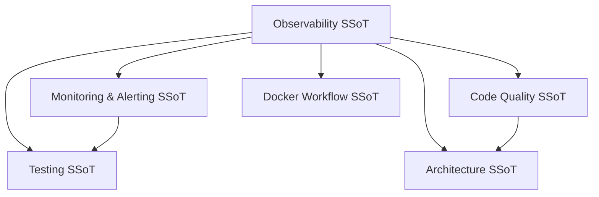
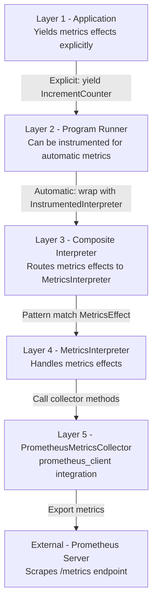

# Observability

**effectful** - Pure functional observability through type-safe metrics effects.

This is the Single Source of Truth (SSoT) for the Effectful observability architecture, metrics philosophy, and Prometheus/Grafana integration.

## SSoT Link Map



| Need | Link |
|------|------|
| Naming + label policy | [Monitoring & Alerting](monitoring_and_alerting.md#monitoring-standards) |
| Alert rules + runbooks | [Monitoring & Alerting](monitoring_and_alerting.md#alerting-policy) |
| Where observability fits in architecture | [Architecture](architecture.md#5-layer-architecture) |
| Container and tooling setup | [Docker Workflow](docker_workflow.md) |
| Testing metrics flows | [Testing](testing.md#part-5-testing-patterns) |

## Overview

Observability in effectful follows the same pure functional principles as all effect handling: metrics are **immutable data structures** that describe observations, not imperative side effects. This approach ensures type safety, testability, and composition.

**Three Pillars of Observability:**
1. **Metrics** - Numerical measurements over time (counters, gauges, histograms, summaries)
2. **Logs** - Structured event records (future: via logging effects)
3. **Traces** - Distributed request tracking (future: via tracing effects)

This doctrine focuses on **metrics** as the primary observability mechanism, integrated with Prometheus for collection and Grafana for visualization.

### Core Design Principle

> Metrics are pure data structures yielded as effects. The interpreter boundary handles all impure operations (Prometheus client interaction, time sampling, cardinality validation).

This maintains effectful's purity doctrine while enabling production-grade observability.

---

## Metrics Philosophy

### Type-Safe Metrics

All metrics are defined upfront in a **frozen, immutable registry**. This prevents:

1. **Runtime cardinality explosion** - Label names fixed at compile time
2. **Typos in metric names** - MyPy validates all references
3. **Label mismatch errors** - Registry enforces label schema
4. **Undocumented metrics** - Registry serves as self-documentation

**Example Registry:**

```python
from effectful.observability import (
    MetricsRegistry,
    CounterDefinition,
    HistogramDefinition,
)

APP_METRICS = MetricsRegistry(
    counters=(
        CounterDefinition(
            name="appointments_created_total",
            help_text="Total appointments created",
            label_names=("doctor_specialization", "appointment_type"),
        ),
    ),
    gauges=(),
    histograms=(
        HistogramDefinition(
            name="appointment_duration_seconds",
            help_text="Appointment duration distribution",
            label_names=("doctor_id", "status"),
            buckets=(60, 300, 600, 1800, 3600),  # 1m to 1h
        ),
    ),
    summaries=(),
)
```

**Type Safety Guarantees:**
- `frozen=True` - Registry cannot be modified at runtime
- `tuple` types - Immutable sequences for counters/gauges/histograms/summaries
- `label_names: tuple[str, ...]` - Fixed label schema per metric
- MyPy validates all metric names and label references

### Compile-Time Validation

```python
# ✅ VALID - Metric registered, labels match schema
yield IncrementCounter(
    metric_name="appointments_created_total",
    labels={"doctor_specialization": "cardiology", "appointment_type": "scheduled"},
    value=1.0,
)

# ❌ INVALID - MyPy error: "appointments_total" not in registry
yield IncrementCounter(
    metric_name="appointments_total",  # Typo!
    labels={"doctor_id": "123"},
    value=1.0,
)

# ❌ INVALID - Runtime error: Label "specialty" not in schema
# (Returns MetricRecordingFailed ADT, not exception)
yield IncrementCounter(
    metric_name="appointments_created_total",
    labels={"specialty": "cardiology"},  # Wrong label name!
    value=1.0,
)
```

---

## Four Metric Types

Effectful supports the four standard Prometheus metric types, each with distinct semantics:

### 1. Counter - Monotonically Increasing Values

**Use Cases:**
- Request counts (`http_requests_total`)
- Error counts (`errors_total`)
- Events processed (`messages_published_total`)
- Items created (`appointments_created_total`)

**Properties:**
- Only increases (never decreases)
- Resets to zero on restart
- Rate calculation via `rate()` or `irate()` in PromQL

**Effect:**

```python
@dataclass(frozen=True)
class IncrementCounter:
    """Increment a counter metric by value.

    Attributes:
        metric_name: Name of registered counter metric
        labels: Label key-value pairs (must match registry schema)
        value: Amount to increment (default: 1.0)
    """
    metric_name: str
    labels: dict[str, str]
    value: float = 1.0
```

**Example:**

```python
def create_appointment_program(
    patient_id: UUID, doctor_id: UUID
) -> Generator[AllEffects, EffectResult, Appointment]:
    appointment = yield CreateAppointment(patient_id=patient_id, doctor_id=doctor_id)
    assert isinstance(appointment, Appointment)

    # Track business metric
    yield IncrementCounter(
        metric_name="appointments_created_total",
        labels={
            "doctor_specialization": appointment.doctor.specialization,
            "appointment_type": "scheduled",
        },
        value=1.0,
    )

    return appointment
```

### 2. Gauge - Current State Values

**Use Cases:**
- Queue depth (`queue_depth_current`)
- Active connections (`active_websockets`)
- Memory usage (`memory_bytes`)
- Temperature/humidity (`room_temperature_celsius`)

**Properties:**
- Can increase or decrease
- Represents current value at scrape time
- Set to specific value (not incremented)

**Effect:**

```python
@dataclass(frozen=True)
class SetGauge:
    """Set a gauge metric to value.

    Attributes:
        metric_name: Name of registered gauge metric
        labels: Label key-value pairs (must match registry schema)
        value: Value to set gauge to
    """
    metric_name: str
    labels: dict[str, str]
    value: float
```

**Example:**

```python
def update_queue_depth_program(
    queue_name: str
) -> Generator[AllEffects, EffectResult, int]:
    # Get current queue state
    depth = yield GetQueueDepth(queue_name=queue_name)
    assert isinstance(depth, int)

    # Update gauge to reflect current state
    yield SetGauge(
        metric_name="queue_depth_current",
        labels={"queue": queue_name, "priority": "high"},
        value=float(depth),
    )

    return depth
```

### 3. Histogram - Distribution Tracking

**Use Cases:**
- Request latency (`http_request_duration_seconds`)
- Response sizes (`response_size_bytes`)
- Database query duration (`db_query_duration_seconds`)
- Any distribution you want percentiles for

**Properties:**
- Tracks value distribution in configurable buckets
- Automatically provides count and sum
- Enables percentile queries (`histogram_quantile()`)

**Effect:**

```python
@dataclass(frozen=True)
class ObserveHistogram:
    """Observe a value in a histogram.

    Attributes:
        metric_name: Name of registered histogram metric
        labels: Label key-value pairs (must match registry schema)
        value: Observed value (e.g., duration in seconds)
    """
    metric_name: str
    labels: dict[str, str]
    value: float
```

**Example:**

```python
import time

def process_lab_result_program(
    lab_result_id: UUID
) -> Generator[AllEffects, EffectResult, LabResult]:
    start_time = time.perf_counter()

    # Process lab result
    result = yield ProcessLabResult(lab_result_id=lab_result_id)
    assert isinstance(result, LabResult)

    # Track processing duration
    duration = time.perf_counter() - start_time
    yield ObserveHistogram(
        metric_name="lab_result_processing_duration_seconds",
        labels={"test_type": result.test_type, "is_critical": str(result.is_critical)},
        value=duration,
    )

    return result
```

**Bucket Configuration:**

```python
HistogramDefinition(
    name="http_request_duration_seconds",
    help_text="HTTP request duration",
    label_names=("method", "endpoint"),
    buckets=(
        0.005, 0.01, 0.025, 0.05, 0.1, 0.25, 0.5, 1.0, 2.5, 5.0, 10.0
    ),  # 5ms to 10s
)
```

**PromQL Query (p95 latency):**

```promql
histogram_quantile(0.95,
  sum by (le, endpoint) (
    rate(http_request_duration_seconds_bucket[5m])
  )
)
```

### 4. Summary - Streaming Quantiles

**Use Cases:**
- Latency percentiles (when histograms too expensive)
- Client-side percentile calculation
- Custom quantiles (e.g., p50, p90, p99)

**Properties:**
- Calculates quantiles over sliding time window
- More accurate than histogram for specific percentiles
- Higher memory/CPU cost than histograms

**Effect:**

```python
@dataclass(frozen=True)
class RecordSummary:
    """Record a value in a summary.

    Attributes:
        metric_name: Name of registered summary metric
        labels: Label key-value pairs (must match registry schema)
        value: Observed value
    """
    metric_name: str
    labels: dict[str, str]
    value: float
```

**When to Use Summary vs Histogram:**
- **Use Histogram**: Most cases (aggregatable, efficient, supports any percentile)
- **Use Summary**: When you need exact percentiles client-side, small cardinality

---

## Dual-Layer Architecture

Effectful provides two complementary approaches to metrics:

### Layer 1: Explicit Metrics Effects (User-Defined Business Metrics)

**Purpose**: Track domain-specific business metrics that matter to your application.

**Characteristics:**
- Yielded explicitly in effect programs
- Full control over labels and values
- Domain-driven naming (e.g., `appointments_created_total`, `revenue_usd_total`)
- Tested like any other effect

**Example:**

```python
def schedule_appointment_program(
    patient_id: UUID, doctor_id: UUID
) -> Generator[AllEffects, EffectResult, Appointment]:
    # Business logic
    appointment = yield CreateAppointment(patient_id=patient_id, doctor_id=doctor_id)

    # Explicit business metric
    yield IncrementCounter(
        metric_name="appointments_created_total",
        labels={"doctor_specialization": doctor.specialization},
        value=1.0,
    )

    return appointment
```

### Layer 2: Automatic Instrumentation (Framework Metrics)

**Purpose**: Zero-code observability of effect system internals.

**Characteristics:**
- Automatically tracks effect executions
- No code changes required
- Consistent across all effectful applications
- Opt-in via `InstrumentedInterpreter` wrapper

**Default Metrics** (when instrumentation enabled):

| Metric | Type | Labels | Description |
|--------|------|--------|-------------|
| `effectful_effects_total` | Counter | `effect_type`, `result` | Total effect executions (ok/error) |
| `effectful_effect_duration_seconds` | Histogram | `effect_type` | Effect execution time distribution |
| `effectful_effects_in_progress` | Gauge | `effect_type` | Currently executing effects |
| `effectful_programs_total` | Counter | `program_name`, `result` | Total program executions (ok/error) |
| `effectful_program_duration_seconds` | Histogram | `program_name` | Program execution time distribution |

**Example Setup:**

```python
from effectful.observability import create_instrumented_composite

# Wrap interpreters for automatic metrics
composite_interpreter = create_instrumented_composite(
    interpreters=[db_interp, cache_interp, ws_interp],
    metrics_collector=prometheus_collector,
    enable_instrumentation=True,
)
```

**Benefits:**
- Track effect error rates across system
- Identify slow effects (p95/p99 latency)
- Monitor effect concurrency
- Debug production issues without code changes

**When to Use Each Layer:**
- **Explicit**: Business KPIs, SLOs, domain events
- **Automatic**: System health, debugging, performance monitoring

---

## Integration with 5-Layer Architecture

Metrics integrate seamlessly into effectful's existing architecture:



### Layer Integration Details

**Layer 1 (Application):**
- Effect programs yield metrics effects alongside domain effects
- Metrics treated as first-class effects (same semantics as database, cache, etc.)

**Layer 2 (Program Runner):**
- Standard runner for explicit metrics
- `InstrumentedProgramRunner` for automatic program-level metrics

**Layer 3 (Composite Interpreter):**
- Routes `MetricsEffect` to `MetricsInterpreter`
- Can be wrapped with `InstrumentedInterpreter` for effect-level metrics

**Layer 4 (MetricsInterpreter):**
- Handles all metrics effects via pattern matching
- Returns `Result[EffectReturn[MetricRecordingResult], InterpreterError]`
- Domain failures (metric not registered) → ADT in `Ok()`
- Infrastructure failures (network error) → `Err(MetricsError)`

**Layer 5 (PrometheusMetricsCollector):**
- Implements `MetricsCollector` protocol
- Wraps `prometheus_client.CollectorRegistry`
- Validates metrics against registry
- Exports metrics in Prometheus text format

---

## Type Safety Guarantees

### Immutable Registry

```python
@dataclass(frozen=True)
class MetricsRegistry:
    """Type-safe registry of all application metrics.

    Attributes:
        counters: Tuple of counter metric definitions
        gauges: Tuple of gauge metric definitions
        histograms: Tuple of histogram metric definitions
        summaries: Tuple of summary metric definitions
    """
    counters: tuple[CounterDefinition, ...]
    gauges: tuple[GaugeDefinition, ...]
    histograms: tuple[HistogramDefinition, ...]
    summaries: tuple[SummaryDefinition, ...]
```

**Type Safety Properties:**
1. `frozen=True` - Cannot modify after creation
2. `tuple` types - Immutable sequences
3. No `Any`, `cast()`, or `# type: ignore`
4. MyPy strict compliance

### ADT Return Types

```python
@dataclass(frozen=True)
class MetricRecorded:
    """Successful metric recording."""
    metric_name: str
    metric_type: Literal["counter", "gauge", "histogram", "summary"]
    labels: dict[str, str]
    value: float

@dataclass(frozen=True)
class MetricRecordingFailed:
    """Failed metric recording (domain failure)."""
    metric_name: str
    reason: Literal[
        "metric_not_registered",
        "invalid_labels",
        "cardinality_limit_exceeded",
    ]
    message: str

type MetricRecordingResult = MetricRecorded | MetricRecordingFailed
```

**Error Handling:**
- **Domain failures** (metric not found) → `Ok(MetricRecordingFailed(...))`
- **Infrastructure failures** (network error) → `Err(MetricsError(...))`

### Pattern Matching

```python
result = yield IncrementCounter(
    metric_name="test_counter",
    labels={"env": "prod"},
    value=1.0,
)

match result:
    case MetricRecorded(metric_name=name):
        # Success - metric recorded
        logger.info(f"Recorded {name}")
    case MetricRecordingFailed(reason="metric_not_registered", message=msg):
        # Domain error - metric not in registry
        logger.error(f"Metric not registered: {msg}")
    case MetricRecordingFailed(reason=reason, message=msg):
        # Other domain errors
        logger.warning(f"Metric recording failed: {reason} - {msg}")
```

---

## Cardinality Management

**Cardinality Explosion** is the primary failure mode of production metrics systems. Effectful prevents this through:

### 1. Pre-Registered Metrics

All metrics must be registered upfront. No runtime metric creation.

```python
# ❌ FORBIDDEN - Runtime metric creation
metric_name = f"user_{user_id}_requests"  # Unbounded cardinality!
yield IncrementCounter(metric_name=metric_name, labels={}, value=1.0)

# ✅ CORRECT - Pre-registered metric with user_id as label
yield IncrementCounter(
    metric_name="user_requests_total",
    labels={"user_tier": user.tier},  # Bounded cardinality (e.g., "free", "premium")
    value=1.0,
)
```

### 2. Fixed Label Names

Label names are fixed per metric at definition time.

```python
CounterDefinition(
    name="http_requests_total",
    help_text="Total HTTP requests",
    label_names=("method", "endpoint", "status_code"),  # Fixed schema
)
```

**Validation:**
- PrometheusMetricsCollector validates labels match schema
- Returns `MetricRecordingFailed(reason="invalid_labels")` if mismatch

### 3. Bounded Label Values

Use categorical values with known upper bounds.

```python
# ✅ GOOD - Bounded cardinality
labels = {
    "doctor_specialization": "cardiology",  # ~20-30 specializations
    "appointment_status": "confirmed",      # 4-5 statuses
}

# ❌ BAD - Unbounded cardinality
labels = {
    "patient_id": str(patient_id),  # 1M+ unique patients
    "doctor_id": str(doctor_id),    # 100+ unique doctors
}
```

**Rule of Thumb**: Label cardinality product should be < 10,000 unique combinations.

Example:
- `doctor_specialization` (20 values) × `appointment_status` (5 values) = 100 combinations ✅
- `patient_id` (1M values) × `doctor_id` (100 values) = 100M combinations ❌

### 4. Cardinality Limits

PrometheusMetricsCollector can enforce cardinality limits per metric:

```python
result = yield IncrementCounter(metric_name="test", labels=labels, value=1.0)

match result:
    case MetricRecordingFailed(reason="cardinality_limit_exceeded", message=msg):
        # Too many unique label combinations
        logger.error(f"Cardinality limit exceeded: {msg}")
```

**Default Limit**: 10,000 unique label combinations per metric (configurable)

---

## Testing Strategy

### Unit Testing (Mocked Collector)

```python
from pytest_mock import MockerFixture
from effectful.infrastructure.metrics import MetricsCollector

@pytest.mark.asyncio
async def test_appointment_metrics(mocker: MockerFixture) -> None:
    # Mock metrics collector
    mock_collector = mocker.AsyncMock(spec=MetricsCollector)
    mock_collector.increment_counter.return_value = MetricRecorded(
        metric_name="appointments_created_total",
        metric_type="counter",
        labels={"doctor_specialization": "cardiology"},
        value=1.0,
    )

    # Create interpreter with mock
    metrics_interp = MetricsInterpreter(collector=mock_collector)
    composite = CompositeInterpreter(interpreters=[metrics_interp, ...])

    # Run program
    def program() -> Generator[AllEffects, EffectResult, bool]:
        yield IncrementCounter(
            metric_name="appointments_created_total",
            labels={"doctor_specialization": "cardiology"},
            value=1.0,
        )
        return True

    result = await run_ws_program(program(), composite)
    assert_ok(result)

    # Verify mock called
    mock_collector.increment_counter.assert_called_once_with(
        "appointments_created_total",
        {"doctor_specialization": "cardiology"},
        1.0,
    )
```

### Integration Testing (Real Collector)

```python
from prometheus_client import CollectorRegistry
from effectful.adapters.prometheus_adapter import PrometheusMetricsCollector

@pytest.mark.asyncio
async def test_metrics_workflow() -> None:
    # Real Prometheus registry
    registry = CollectorRegistry()

    # Real collector
    collector = PrometheusMetricsCollector(
        registry=registry,
        metrics_registry=APP_METRICS,
    )

    # Real interpreter
    metrics_interp = MetricsInterpreter(collector=collector)
    composite = CompositeInterpreter(interpreters=[metrics_interp, ...])

    # Run program
    def program() -> Generator[AllEffects, EffectResult, bool]:
        yield IncrementCounter(
            metric_name="appointments_created_total",
            labels={"doctor_specialization": "cardiology"},
            value=1.0,
        )
        return True

    result = await run_ws_program(program(), composite)
    assert_ok(result)

    # Verify metric in registry
    metrics_output = collector.export_metrics().decode("utf-8")
    assert 'appointments_created_total{doctor_specialization="cardiology"} 1.0' in metrics_output
```

---

## Cross-References

> **Core Doctrine**: For 5-layer architecture, see [architecture.md](./architecture.md)

> **Core Doctrine**: For purity and effects as data, see [code_quality.md](./code_quality.md#purity-doctrines)

> **Core Doctrine**: For type safety patterns, see [code_quality.md](./code_quality.md#type-safety-doctrines)

> **Core Doctrine**: For testing strategies, see [testing.md](./testing.md)

> **Core Doctrine**: For Docker integration, see [docker_workflow.md](./docker_workflow.md)

---

## See Also

- [Monitoring & Alerting](./monitoring_and_alerting.md) - Metric naming conventions, labeling best practices, and alert rules
- [Metrics API Reference](../api/metrics.md) - Complete metrics effects API
- [Metrics Quickstart](../tutorials/11_metrics_quickstart.md) - Get started in 15 minutes

---

**Status**: Single Source of Truth (SSoT) for observability architecture
**Last Updated**: 2025-12-01
**Referenced by**: monitoring_and_alerting.md, README.md
