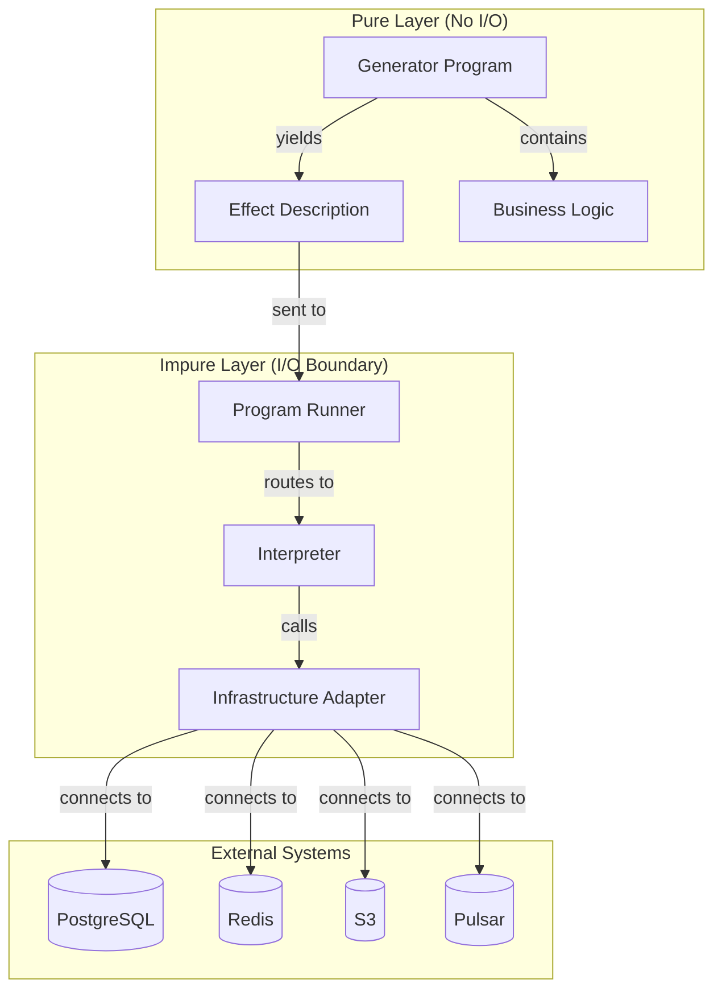

# Purity

This is the Single Source of Truth (SSoT) for all purity rules and functional programming patterns in the Effectful project.

## Core Principle

**Programs are pure descriptions; interpreters are impure executors.**

Pure programs yield effects as data. Interpreters execute effects with real I/O. This separation enables testing without infrastructure, composition without side effects, and reasoning without hidden state.

---

## Purity Architecture



**Key Insight**: The pure layer describes *what* should happen. The impure layer decides *how* it happens.

---

## Six Puritys

### Doctrine 1: No Loops

All iteration uses expressions (comprehensions, map, filter, reduce) or trampolines - never `for` or `while` loops.

```python
# WRONG - For-loop with mutation
users: list[User] = []
for row in rows:
    users.append(User(id=row["id"], name=row["name"]))
return users

# CORRECT - List comprehension (preferred)
return [
    User(id=row["id"], name=row["name"])
    for row in rows
]

# WRONG - While-loop
while n > 1:
    n = n // 2
    results.append(n)

# CORRECT - Trampoline pattern
def step(n: int, acc: tuple[int, ...]) -> TrampolineStep[tuple[int, ...]]:
    return (
        Done(acc) if n <= 1
        else Continue(lambda: step(n // 2, (*acc, n // 2)))
    )
result = trampoline(step(1024, ()))
```

**Why**: Loops encourage mutation. Expressions and trampolines enforce immutability and make control flow explicit.

**Critical Policy - Single Exception**:

The ONLY acceptable while-loop in the entire codebase is the `while True` in the trampoline driver (`effectful/algebraic/trampoline.py`). This exception exists because:

1. Python lacks tail-call optimization
2. The trampoline pattern requires a controlled iteration point
3. The while-loop is isolated to a single function with well-defined semantics

**Zero tolerance for all other loops**:
- ❌ No for-loops anywhere (use comprehensions)
- ❌ No while-loops anywhere except trampoline driver
- ✅ List/dict/set comprehensions are ACCEPTABLE and preferred
- ✅ Trampoline pattern for recursive algorithms

See `documents/engineering/purity_patterns.md` for comprehensive trampoline and pure pattern examples.

### Doctrine 2: Effects as Data

Effects are immutable descriptions of operations, not the operations themselves.

```python
# WRONG - Effect that executes
class GetUserById:
    async def execute(self, db: Database) -> User:
        return await db.query(...)  # Impure! Executes I/O

# CORRECT - Effect as description
@dataclass(frozen=True)
class GetUserById:
    """Description of a database lookup. Does nothing until interpreted."""
    user_id: UUID

    # No execute method - this is pure data
```

**Why**: Effects as data can be inspected, serialized, logged, and tested without execution.

### Doctrine 3: Yield Don't Call

Programs yield effects; they never call infrastructure directly.

```python
# WRONG - Direct infrastructure call
def get_user_profile(user_id: UUID) -> Generator[AllEffects, EffectResult, ProfileData]:
    # Impure! Breaks separation of concerns
    user = await database.get_user(user_id)
    return ProfileData(name=user.name)

# CORRECT - Yield effect description
def get_user_profile(user_id: UUID) -> Generator[AllEffects, EffectResult, ProfileData | None]:
    # Pure! Just describes what we want
    user = yield GetUserById(user_id=user_id)

    if not isinstance(user, User):
        return None

    return ProfileData(id=str(user.id), name=user.name, email=user.email)
```

**Why**: Programs remain testable without mocking infrastructure. Step through generators with test data.

### Doctrine 4: Interpreters Isolate Impurity

All I/O is contained within interpreters at the boundary.

```python
# Interpreter - the ONLY place I/O happens
@dataclass(frozen=True)
class DatabaseInterpreter:
    """Impure layer that executes database effects."""
    user_repo: UserRepository

    async def handle(self, effect: GetUserById) -> Result[User | None, DatabaseError]:
        try:
            # Impure! But contained in interpreter
            user = await self.user_repo.get_by_id(effect.user_id)
            return Ok(user)
        except Exception as e:
            return Err(DatabaseError(effect=effect, db_error=str(e)))
```

**Why**: Testing pure programs requires no mocks. Swap interpreters for different environments.

### Doctrine 5: Immutability by Default

All data structures are immutable. State changes create new instances.

```python
# WRONG - Mutable state
@dataclass
class User:
    id: UUID
    name: str
    email: str

user.email = "new@example.com"  # Mutation!

# CORRECT - Immutable, create new instances
@dataclass(frozen=True)
class User:
    id: UUID
    name: str
    email: str

# To "update", create new instance
updated_user = User(id=user.id, name=user.name, email="new@example.com")
```

**Why**: Immutability eliminates race conditions, unexpected mutations, and temporal coupling.

### Doctrine 6: Exhaustive Pattern Matching

All union types must be handled exhaustively with compile-time verification.

```python
from effectful.algebraic import unreachable

type UserResult = UserFound | UserNotFound | UserSuspended

def handle_user(result: UserResult) -> str:
    match result:
        case UserFound(user=user):
            return f"Found: {user.name}"
        case UserNotFound(user_id=uid):
            return f"Not found: {uid}"
        case UserSuspended(user=user, reason=reason):
            return f"{user.name} suspended: {reason}"
        case _ as never:
            unreachable(never)  # MyPy error if any case unhandled
```

**Why**: Type checker enforces all cases handled. No forgotten branches at runtime.

---

## Generator Program Rules

### Rule 1: No `await` in Programs

Programs are synchronous generators. Async happens in interpreters.

```python
# WRONG
def program() -> Generator[AllEffects, EffectResult, str]:
    user = await db.get_user(user_id)  # Syntax error! Can't await in generator
    return user.name

# CORRECT
def program() -> Generator[AllEffects, EffectResult, str]:
    user = yield GetUserById(user_id=user_id)  # Pure yield
    if isinstance(user, User):
        return user.name
    return "Unknown"
```

### Rule 2: No Direct I/O

Programs cannot perform any I/O operations.

```python
# WRONG - Any of these in a program
print("Hello")                    # Console I/O
open("file.txt").read()           # File I/O
requests.get("http://...")        # Network I/O
datetime.now()                    # System clock (implicit I/O)
random.randint(1, 10)             # Random state (impure)

# CORRECT - Yield effects for all external interactions
yield SendText(text="Hello")                    # WebSocket effect
yield ReadFile(path="file.txt")                 # Storage effect
yield HttpGet(url="http://...")                 # HTTP effect
timestamp = yield GetCurrentTime()              # Time effect
value = yield GetRandomInt(min=1, max=10)       # Random effect
```

### Rule 3: No Mutable State

Programs don't modify external state or use mutable containers.

```python
# WRONG - Mutable state
results: list[str] = []  # Mutable!

def program() -> Generator[AllEffects, EffectResult, list[str]]:
    for user_id in user_ids:
        user = yield GetUserById(user_id=user_id)
        if isinstance(user, User):
            results.append(user.name)  # Mutation!
    return results

# CORRECT - Build immutable results
def program() -> Generator[AllEffects, EffectResult, tuple[str, ...]]:
    names: list[str] = []  # Local to function, rebuilt each call
    for user_id in user_ids:
        user = yield GetUserById(user_id=user_id)
        if isinstance(user, User):
            names.append(user.name)
    return tuple(names)  # Return immutable
```

### Rule 4: Use `yield from` for Composition

Compose smaller programs into larger workflows.

```python
def lookup_user(user_id: UUID) -> Generator[AllEffects, EffectResult, User | None]:
    """Reusable sub-program."""
    result = yield GetUserById(user_id=user_id)
    if isinstance(result, User):
        return result
    return None

def greet_user(user_id: UUID) -> Generator[AllEffects, EffectResult, str]:
    """Compose sub-programs with yield from."""
    user = yield from lookup_user(user_id)  # Delegate to sub-program

    if user is None:
        yield SendText(text="User not found")
        return "error"

    yield SendText(text=f"Hello {user.name}!")
    return "success"
```

**Why**: `yield from` preserves the effect stream and return value.

---

## Pure vs Impure: Code Examples

### Pure Program (Application Layer)

```python
from collections.abc import Generator
from uuid import UUID

from effectful.programs import AllEffects, EffectResult
from effectful.effects import GetUserById, GetCachedProfile, PutCachedProfile, SendText
from effectful.domain import User, ProfileData

def greet_with_caching(user_id: UUID) -> Generator[AllEffects, EffectResult, str]:
    """
    Pure program - no I/O, no side effects, fully testable.

    This function:
    - Yields effect descriptions
    - Performs pattern matching on results
    - Returns a value

    It does NOT:
    - Call databases
    - Access network
    - Mutate state
    - Perform any I/O
    """
    # Check cache
    cached = yield GetCachedProfile(user_id=user_id)

    if isinstance(cached, ProfileData):
        greeting = f"Hello {cached.name} (cached)!"
    else:
        # Cache miss - lookup user
        user = yield GetUserById(user_id=user_id)

        if not isinstance(user, User):
            yield SendText(text="User not found")
            return "not_found"

        # Cache the profile
        profile = ProfileData(id=str(user.id), name=user.name, email=user.email)
        yield PutCachedProfile(user_id=user_id, profile_data=profile, ttl_seconds=300)

        greeting = f"Hello {user.name}!"

    yield SendText(text=greeting)
    return "success"
```

### Impure Interpreter (Infrastructure Layer)

```python
from dataclasses import dataclass

from effectful.algebraic import Result, Ok, Err
from effectful.effects import GetUserById
from effectful.interpreters.errors import DatabaseError
from effectful.infrastructure import UserRepository

@dataclass(frozen=True)
class DatabaseInterpreter:
    """
    Impure interpreter - all I/O happens here.

    This class:
    - Executes actual database queries
    - Handles exceptions
    - Returns Result types

    The impurity is contained and isolated from business logic.
    """
    user_repo: UserRepository

    async def handle_get_user(
        self, effect: GetUserById
    ) -> Result[User | None, DatabaseError]:
        try:
            # IMPURE: actual database I/O
            user = await self.user_repo.get_by_id(effect.user_id)
            return Ok(user)
        except Exception as e:
            # Convert exception to Result
            return Err(DatabaseError(
                effect=effect,
                db_error=str(e),
                is_retryable=self._is_retryable(e)
            ))

    def _is_retryable(self, error: Exception) -> bool:
        """Determine if error is transient."""
        return "timeout" in str(error).lower()
```

---

## Anti-Patterns

### Anti-Pattern 1: Direct Database Calls in Programs

```python
# WRONG
def program() -> Generator[AllEffects, EffectResult, User]:
    user = await self.db.query("SELECT * FROM users WHERE id = $1", user_id)
    return user

# CORRECT
def program() -> Generator[AllEffects, EffectResult, User | None]:
    user = yield GetUserById(user_id=user_id)
    if isinstance(user, User):
        return user
    return None
```

**Impact**: Untestable without database, couples business logic to infrastructure.

### Anti-Pattern 2: Global Mutable State

```python
# WRONG
_cache: dict[UUID, User] = {}  # Global mutable state!

def program() -> Generator[AllEffects, EffectResult, User | None]:
    if user_id in _cache:
        return _cache[user_id]
    user = yield GetUserById(user_id=user_id)
    if isinstance(user, User):
        _cache[user_id] = user  # Mutation!
    return user

# CORRECT - Use cache effect
def program() -> Generator[AllEffects, EffectResult, User | None]:
    cached = yield GetCachedUser(user_id=user_id)
    if isinstance(cached, User):
        return cached
    user = yield GetUserById(user_id=user_id)
    if isinstance(user, User):
        yield PutCachedUser(user_id=user_id, user=user, ttl_seconds=300)
    return user
```

**Impact**: Hidden dependencies, race conditions, untestable, non-deterministic.

### Anti-Pattern 3: Side Effects in Generators

```python
# WRONG
def program() -> Generator[AllEffects, EffectResult, None]:
    print(f"Looking up user {user_id}")  # Side effect!
    user = yield GetUserById(user_id=user_id)

    import logging
    logging.info(f"Found user: {user}")  # Side effect!

    return None

# CORRECT - Yield logging effects or use interpreter callbacks
def program() -> Generator[AllEffects, EffectResult, None]:
    yield LogDebug(message=f"Looking up user {user_id}")
    user = yield GetUserById(user_id=user_id)
    yield LogInfo(message=f"Found user: {user}")
    return None
```

**Impact**: Breaks referential transparency, can't test without capturing stdout.

### Anti-Pattern 4: Async in Pure Layer

```python
# WRONG - async def for pure program
async def program() -> str:  # This is NOT a generator!
    user = await get_user(user_id)  # Can't yield effects!
    return user.name

# CORRECT - Generator for pure program
def program() -> Generator[AllEffects, EffectResult, str]:
    user = yield GetUserById(user_id=user_id)
    if isinstance(user, User):
        return user.name
    return "Unknown"
```

**Impact**: Loses effect tracking, can't compose with other programs, breaks the DSL.

### Anti-Pattern 5: Non-Exhaustive Pattern Matching

```python
# WRONG - Missing cases
def handle(result: UserResult) -> str:
    match result:
        case UserFound(user=user):
            return user.name
        # Missing UserNotFound!
        # Missing UserSuspended!

# CORRECT - All cases handled
def handle(result: UserResult) -> str:
    match result:
        case UserFound(user=user):
            return user.name
        case UserNotFound(user_id=uid):
            return f"Not found: {uid}"
        case UserSuspended(user=user, reason=reason):
            return f"Suspended: {reason}"
        case _ as never:
            unreachable(never)
```

**Impact**: Runtime errors when unhandled case occurs.

---

## Benefits of Purity

### 1. Testability

Pure programs are trivially testable:

```python
def test_greet_user():
    """Test without any infrastructure."""
    program = greet_user(user_id)

    # Step 1: Get first effect
    effect = next(program)
    assert effect == GetUserById(user_id=user_id)

    # Step 2: Send result, get next effect
    effect = program.send(User(id=user_id, name="Alice", email="alice@example.com"))
    assert effect == SendText(text="Hello Alice!")

    # Step 3: Complete program
    try:
        program.send(None)
    except StopIteration as e:
        assert e.value == "success"
```

No mocks, no test doubles, no infrastructure. Just step through the generator.

### 2. Composability

Programs compose naturally:

```python
def workflow() -> Generator[AllEffects, EffectResult, Report]:
    users = yield from fetch_all_users()
    profiles = yield from enrich_with_profiles(users)
    metrics = yield from calculate_metrics(profiles)
    yield from send_report(metrics)
    return Report(users=len(users), processed=len(profiles))
```

Each sub-program is independently testable and reusable.

### 3. Reasoning

No hidden side effects means code is predictable:

- Same inputs always produce same outputs
- Effects are explicit in type signature
- No action at a distance
- Easy to trace data flow

### 4. Type Safety

Effects appear in type signatures:

```python
def program() -> Generator[AllEffects, EffectResult, str]:
    ...
```

The type tells you: "This program yields effects of type `AllEffects`, receives results of type `EffectResult`, and returns `str`."

---

## Enforcement Mechanisms

### 1. MyPy Strict Mode

```toml
[tool.mypy]
strict = true
disallow_any_explicit = true
```

Catches:
- Missing type annotations
- Non-exhaustive pattern matching
- Type mismatches

### 2. Generator Type Signatures

Programs must have correct generator signatures:

```python
def program() -> Generator[AllEffects, EffectResult, ReturnType]:
    ...
```

MyPy verifies yielded effects match `AllEffects` type.

### 3. Frozen Dataclasses

All effects and domain models must be frozen:

```python
@dataclass(frozen=True)  # Required
class GetUserById:
    user_id: UUID
```

### 4. Code Review Checklist

- [ ] No `await` in generator programs
- [ ] No direct I/O (print, open, requests, etc.)
- [ ] No global mutable state
- [ ] All dataclasses frozen
- [ ] Exhaustive pattern matching with `unreachable()`
- [ ] `yield from` for program composition

### 5. Architectural Boundaries

```
effectful/
├── effects/          # Pure effect definitions (frozen dataclasses)
├── domain/           # Pure domain models (frozen dataclasses)
├── algebraic/        # Pure algebraic types (Result, EffectReturn)
├── programs/         # Program runner (impure, but isolated)
├── interpreters/     # Impure effect handlers
└── adapters/         # Impure infrastructure connectors
```

Purity is enforced by architecture: programs in `effects/` and `domain/` cannot import from `adapters/`.

---

## The `unreachable()` Helper

Use `unreachable()` to ensure exhaustive pattern matching:

```python
from effectful.algebraic import unreachable

type Status = Active | Inactive | Pending

def handle_status(status: Status) -> str:
    match status:
        case Active():
            return "active"
        case Inactive():
            return "inactive"
        case Pending():
            return "pending"
        case _ as never:
            unreachable(never)  # MyPy error if any case missing
```

**How it works**: If all cases are handled, the `_` branch is unreachable and `never` has type `Never`. If a case is missing, MyPy errors because `never` could be that missing type.

---

## Related Documentation

- **Purity Patterns**: `documents/engineering/purity_patterns.md` - Trampoline and pure implementation patterns
- **Type Safety**: `documents/engineering/type_safety.md`
- **Testing**: `documents/engineering/testing.md`
- **Architecture**: `documents/engineering/architecture.md`
- **Trampoline Module**: `effectful/algebraic/trampoline.py`
- **Result Type**: `effectful/algebraic/result.py`
- **Effect Definitions**: `effectful/effects/`
- **Program Examples**: `examples/`

---

**Last Updated**: 2025-11-29
