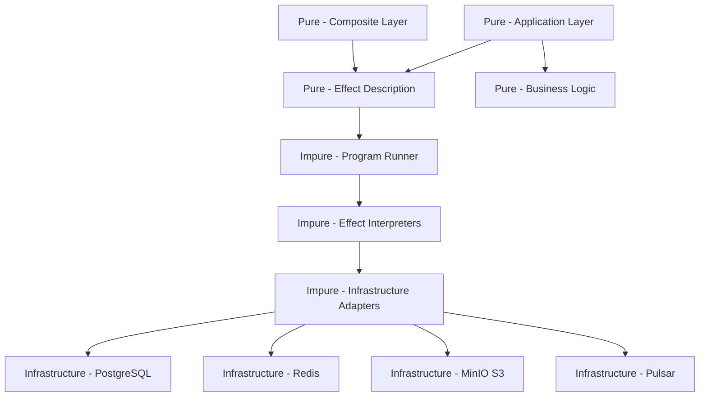

# Purity

> **Single Source of Truth (SSoT)** for all purity practices in Effectful.

## Overview

**Programs are pure descriptions; interpreters are impure executors.**

Pure programs yield effects as data. Interpreters execute effects with real I/O. This separation enables testing without infrastructure, composition without side effects, and reasoning without hidden state.

**Core Philosophy**: Pure functions use expressions, not control-flow statements. No `for`, `if`, or `while` loops - only comprehensions, conditional expressions, `match`/`case`, and trampolines.

---

## Architecture



**Key Insight**: The pure layer describes *what* should happen. The impure layer decides *how* it happens.

---

## Six Purity Doctrines

### Doctrine 1: No Loops

All iteration uses expressions (comprehensions, map, filter, reduce) or trampolines - never `for` or `while` loops.

```python
# WRONG - For-loop with mutation
users: list[User] = []
for row in rows:
    users.append(User(id=row["id"], name=row["name"]))
return users

# CORRECT - List comprehension (preferred)
return [
    User(id=row["id"], name=row["name"])
    for row in rows
]

# WRONG - While-loop
while n > 1:
    n = n // 2
    results.append(n)

# CORRECT - Trampoline pattern
def step(n: int, acc: tuple[int, ...]) -> TrampolineStep[tuple[int, ...]]:
    return (
        Done(acc) if n <= 1
        else Continue(lambda: step(n // 2, (*acc, n // 2)))
    )
result = trampoline(step(1024, ()))
```

**Why**: Loops encourage mutation. Expressions and trampolines enforce immutability and make control flow explicit.

#### Critical Policy - Single Exception

The ONLY acceptable while-loop in the entire codebase is the `while True` in the trampoline driver (`effectful/algebraic/trampoline.py`). This exception exists because:

1. Python lacks tail-call optimization
2. The trampoline pattern requires a controlled iteration point
3. The while-loop is isolated to a single function with well-defined semantics

**Zero tolerance for all other loops**:
- ❌ No for-loops anywhere (use comprehensions)
- ❌ No while-loops anywhere except trampoline driver
- ✅ List/dict/set comprehensions are ACCEPTABLE and preferred
- ✅ Trampoline pattern for recursive algorithms

#### Comprehensions and Purity

Comprehensions (list/dict/set/generator expressions) are syntactic sugar for loops but are treated as pure constructs in effectful because:

1. **Functional composition**: Comprehensions are expressions that produce values, not statements that execute side effects
2. **Local scope**: Variables in comprehensions are scoped to the expression
3. **Immutability**: Comprehensions build new collections rather than mutating existing ones

**Critical requirement**: Comprehensions are pure **only when the internal logic is pure**.

✅ **PURE comprehensions** - Acceptable everywhere:
```python
# Pure transformation - creates new User objects
users = [User(id=row["id"], name=row["name"]) for row in rows]

# Pure filtering - no side effects
active_users = [u for u in users if u.status == "active"]

# Pure dict transformation
user_map = {user.id: user.name for user in users}

# Pure computation
squares = [x * x for x in range(10)]
```

❌ **IMPURE comprehensions** - Forbidden:
```python
# Side effect: I/O operation inside comprehension
results = [print(f"Processing {x}") for x in items]  # NO!

# Side effect: logging inside comprehension
values = [log.info(x) or x for x in data]  # NO!

# Mutation: modifying external state
total = 0
sums = [total := total + x for x in numbers]  # NO! (walrus operator with mutation)

# Side effect: calling impure function
users = [save_to_database(user) for user in new_users]  # NO!
```

**Rule of thumb**: If the comprehension's internal logic could be extracted to a pure function, the comprehension is pure.

**Examples of pure internal logic**:
- Object construction: `User(id=..., name=...)`
- Arithmetic: `x * 2`, `a + b`
- String operations: `name.upper()`, `f"Hello {name}"`
- Attribute access: `user.name`, `item.price`
- Comparison: `x > 10`, `status == "active"`
- Boolean logic: `is_valid and is_active`

**Examples of impure internal logic**:
- I/O operations: `print()`, `open()`, `requests.get()`
- Logging: `log.info()`, `logger.debug()`
- Mutations: Assignment with `:=`, `list.append()`, `dict.update()`
- Random: `random.randint()`, `uuid4()`
- Time: `datetime.now()`, `time.time()`

#### The Trampoline Pattern

**Why Trampolines?**

Python doesn't optimize tail calls, so naive recursion causes stack overflows:

```python
# WRONG - Stack overflow for large n
def factorial(n: int) -> int:
    if n <= 1:
        return 1
    return n * factorial(n - 1)  # Stack frame per call

factorial(10000)  # RecursionError!
```

The trampoline pattern converts recursion to iteration while preserving functional semantics.

**Trampoline Implementation**:

```python
from dataclasses import dataclass
from typing import Generic, TypeVar, Callable
from collections.abc import Awaitable

T = TypeVar('T')

@dataclass(frozen=True)
class Continue(Generic[T]):
    """Signal to continue with another step."""
    thunk: Callable[[], 'TrampolineStep[T]']

@dataclass(frozen=True)
class Done(Generic[T]):
    """Signal that computation is complete."""
    value: T

type TrampolineStep[T] = Continue[T] | Done[T]

def trampoline(step: TrampolineStep[T]) -> T:
    """Execute trampoline steps until completion."""
    current = step
    while True:  # Single controlled iteration point
        match current:
            case Done(value=value):
                return value
            case Continue(thunk=thunk):
                current = thunk()

async def async_trampoline(step: TrampolineStep[Awaitable[T]]) -> T:
    """Async version for effect interpretation."""
    current = step
    while True:
        match current:
            case Done(value=awaitable):
                return await awaitable
            case Continue(thunk=thunk):
                current = thunk()
```

**Using Trampolines**:

```python
# Pure recursive logic expressed with trampolines
def factorial_step(n: int, acc: int = 1) -> TrampolineStep[int]:
    return (
        Done(acc) if n <= 1
        else Continue(lambda n=n, acc=acc: factorial_step(n - 1, n * acc))
    )

# Usage
result = trampoline(factorial_step(10000))  # No stack overflow!
```

#### Replacing For-Loops

**List Comprehensions**:

```python
# WRONG - Imperative for-loop with mutation
users: list[User] = []
for row in rows:
    if isinstance(row["id"], UUID):
        users.append(User(id=row["id"], email=row["email"], name=row["name"]))
return users

# CORRECT - List comprehension
return [
    User(id=row["id"], email=row["email"], name=row["name"])
    for row in rows
    if isinstance(row["id"], UUID) and isinstance(row["email"], str) and isinstance(row["name"], str)
]
```

**Dict Comprehensions**:

```python
# WRONG - For-loop building dict
result: dict[str, int] = {}
for item in items:
    result[item.key] = item.value
return result

# CORRECT - Dict comprehension
return {item.key: item.value for item in items}
```

**Set Comprehensions**:

```python
# WRONG - For-loop building set
unique: set[str] = set()
for user in users:
    unique.add(user.email)
return unique

# CORRECT - Set comprehension
return {user.email for user in users}
```

**Generator Expressions**:

```python
# WRONG - Building full list unnecessarily
emails = []
for user in users:
    emails.append(user.email)

# CORRECT - Generator expression (lazy)
emails = (user.email for user in users)

# Usage in pure code - map/filter style
processed = [process(email) for email in (user.email for user in users)]
```

#### Replacing While-Loops

**With Recursion + Trampoline**:

```python
# WRONG - While loop with mutation
def find_root(n: int) -> int:
    while n > 1:
        n = n // 2
    return n

# CORRECT - Recursive with trampoline
def find_root_step(n: int) -> TrampolineStep[int]:
    return (
        Done(n) if n <= 1
        else Continue(lambda n=n: find_root_step(n // 2))
    )

result = trampoline(find_root_step(1024))
```

**With itertools**:

```python
from itertools import takewhile, dropwhile, accumulate

# WRONG - While loop collecting items
results = []
i = 0
while items[i].valid:
    results.append(items[i])
    i += 1

# CORRECT - takewhile
results = list(takewhile(lambda x: x.valid, items))
```

#### Replacing Mutations

**Accumulator Pattern with reduce**:

```python
from functools import reduce

# WRONG - Mutation with +=
total = 0
for value in values:
    total += value
return total

# CORRECT - reduce
return reduce(lambda acc, x: acc + x, values, 0)

# Or simply
return sum(values)
```

**Building Complex Results with reduce**:

```python
# WRONG - Multiple mutations
stats = {"found": 0, "not_found": 0}
for result in results:
    if result.found:
        stats["found"] += 1
    else:
        stats["not_found"] += 1

# CORRECT - reduce with immutable updates
from functools import reduce

return reduce(
    lambda acc, r: (
        {**acc, "found": acc["found"] + 1} if r.found
        else {**acc, "not_found": acc["not_found"] + 1}
    ),
    results,
    {"found": 0, "not_found": 0}
)
```

### Doctrine 2: Effects as Data

Effects are immutable descriptions of operations, not the operations themselves.

```python
# WRONG - Effect that executes
class GetUserById:
    async def execute(self, db: Database) -> User:
        return await db.query(...)  # Impure! Executes I/O

# CORRECT - Effect as description
@dataclass(frozen=True)
class GetUserById:
    """Description of a database lookup. Does nothing until interpreted."""
    user_id: UUID

    # No execute method - this is pure data
```

**Why**: Effects as data can be inspected, serialized, logged, and tested without execution.

### Doctrine 3: Yield Don't Call

Programs yield effects; they never call infrastructure directly.

```python
# WRONG - Direct infrastructure call
def get_user_profile(user_id: UUID) -> Generator[AllEffects, EffectResult, ProfileData]:
    # Impure! Breaks separation of concerns
    user = await database.get_user(user_id)
    return ProfileData(name=user.name)

# CORRECT - Yield effect description
def get_user_profile(user_id: UUID) -> Generator[AllEffects, EffectResult, ProfileData | None]:
    # Pure! Just describes what we want
    user = yield GetUserById(user_id=user_id)

    if not isinstance(user, User):
        return None

    return ProfileData(id=str(user.id), name=user.name, email=user.email)
```

**Why**: Programs remain testable without mocking infrastructure. Step through generators with test data.

### Doctrine 4: Interpreters Isolate Impurity

All I/O is contained within interpreters at the boundary.

```python
# Interpreter - the ONLY place I/O happens
@dataclass(frozen=True)
class DatabaseInterpreter:
    """Impure layer that executes database effects."""
    user_repo: UserRepository

    async def handle(self, effect: GetUserById) -> Result[User | None, DatabaseError]:
        try:
            # Impure! But contained in interpreter
            user = await self.user_repo.get_by_id(effect.user_id)
            return Ok(user)
        except Exception as e:
            return Err(DatabaseError(effect=effect, db_error=str(e)))
```

**Why**: Testing pure programs requires no mocks. Swap interpreters for different environments.

#### Immutability in Adapters: Native Python Preferred

**Key insight**: `frozen=True` prevents field reassignment but allows field mutation.

Adapters at the infrastructure boundary may hold mutable state (database connections, metric collectors). Use native Python frozen dataclasses with mutable fields rather than immutability libraries.
/
```python
# CORRECT - frozen=True with mutable fields
@dataclass(frozen=True)
class InMemoryMetricsCollector:
    """frozen=True prevents field reassignment, allows field mutation."""
    _counters: dict[str, dict[str, float]] = field(default_factory=dict, init=False)
    _histograms: dict[str, list[float]] = field(default_factory=dict, init=False)

    async def increment_counter(self, name: str, value: float) -> MetricResult:
        # Direct mutation - no hacks needed
        if name not in self._counters:
            self._counters[name] = {}
        self._counters[name][label] = value
        return MetricRecorded(timestamp=time.time())
```

**Why frozen=True is sufficient**:
- Prevents accidental field reassignment (`collector.\_counters = {}`)
- Allows controlled mutation within the adapter
- No external immutability library dependencies
- Better performance than persistent data structures
- Simpler debugging and inspection

**Reference implementation**: `effectful/adapters/prometheus_metrics.py`

### Doctrine 5: Immutability by Default

All data structures are immutable. State changes create new instances.

```python
# WRONG - Mutable state
@dataclass
class User:
    id: UUID
    name: str
    email: str

user.email = "new@example.com"  # Mutation!

# CORRECT - Immutable, create new instances
@dataclass(frozen=True)
class User:
    id: UUID
    name: str
    email: str

# To "update", create new instance
updated_user = User(id=user.id, name=user.name, email="new@example.com")
```

**Why**: Immutability eliminates race conditions, unexpected mutations, and temporal coupling.

#### Immutable Data Updates

**Dataclass Updates**:

```python
from dataclasses import replace

# WRONG - Mutation (requires non-frozen)
user.email = "new@example.com"

# CORRECT - Create new instance with replace
updated = replace(user, email="new@example.com")
```

**Dict Updates**:

```python
# WRONG - Mutation
config["timeout"] = 30

# CORRECT - Spread operator (creates new dict)
updated_config = {**config, "timeout": 30}
```

**List Updates**:

```python
# WRONG - Mutation
items.append(new_item)

# CORRECT - Tuple concatenation
updated_items = (*items, new_item)

# Or new list
updated_items = [*items, new_item]
```

**Removing from Dict**:

```python
# WRONG - Mutation with del
del data[key]

# CORRECT - Dict comprehension excluding key
updated = {k: v for k, v in data.items() if k != key}
```

### Doctrine 6: Exhaustive Pattern Matching

All union types must be handled exhaustively with compile-time verification.

```python
from typing import assert_never

type UserResult = UserFound | UserNotFound | UserSuspended

def handle_user(result: UserResult) -> str:
    match result:
        case UserFound(user=user):
            return f"Found: {user.name}"
        case UserNotFound(user_id=uid):
            return f"Not found: {uid}"
        case UserSuspended(user=user, reason=reason):
            return f"{user.name} suspended: {reason}"
        case _ as never:
            assert_never(never)  # MyPy error if any case unhandled
```

**Why**: Type checker enforces all cases handled. No forgotten branches at runtime.

#### The `assert_never()` Helper

Use `assert_never()` from Python's typing module to ensure exhaustive pattern matching:

```python
from typing import assert_never

type Status = Active | Inactive | Pending

def handle_status(status: Status) -> str:
    match status:
        case Active():
            return "active"
        case Inactive():
            return "inactive"
        case Pending():
            return "pending"
        case _ as never:
            assert_never(never)  # MyPy error if any case missing
```

**How it works**: If all cases are handled, the `_` branch is unreachable and `never` has type `Never`. If a case is missing, MyPy errors because `never` could be that missing type.

The `assert_never()` function is allowed to `raise` because:
- It's a compile-time exhaustiveness check
- It should **never** execute at runtime
- If it executes, it indicates a programming error (missing case)

---

## Generator Program Rules

### Rule 1: No `await` in Programs

Programs are synchronous generators. Async happens in interpreters.

```python
# WRONG
def program() -> Generator[AllEffects, EffectResult, str]:
    user = await db.get_user(user_id)  # Syntax error! Can't await in generator
    return user.name

# CORRECT
def program() -> Generator[AllEffects, EffectResult, str]:
    user = yield GetUserById(user_id=user_id)  # Pure yield
    if isinstance(user, User):
        return user.name
    return "Unknown"
```

### Rule 2: No Direct I/O

Programs cannot perform any I/O operations.

```python
# WRONG - Any of these in a program
print("Hello")                    # Console I/O
open("file.txt").read()           # File I/O
requests.get("http://...")        # Network I/O
datetime.now()                    # System clock (implicit I/O)
random.randint(1, 10)             # Random state (impure)

# CORRECT - Yield effects for all external interactions
yield SendText(text="Hello")                    # WebSocket effect
yield ReadFile(path="file.txt")                 # Storage effect
yield HttpGet(url="http://...")                 # HTTP effect
timestamp = yield GetCurrentTime()              # Time effect
value = yield GetRandomInt(min=1, max=10)       # Random effect
```

### Rule 3: No Mutable State

Programs don't modify external state or use mutable containers.

```python
# WRONG - Mutable state
results: list[str] = []  # Mutable!

def program() -> Generator[AllEffects, EffectResult, list[str]]:
    for user_id in user_ids:
        user = yield GetUserById(user_id=user_id)
        if isinstance(user, User):
            results.append(user.name)  # Mutation!
    return results

# CORRECT - Build immutable results
def program() -> Generator[AllEffects, EffectResult, tuple[str, ...]]:
    names: list[str] = []  # Local to function, rebuilt each call
    for user_id in user_ids:
        user = yield GetUserById(user_id=user_id)
        if isinstance(user, User):
            names.append(user.name)
    return tuple(names)  # Return immutable
```

### Rule 4: Use `yield from` for Composition

Compose smaller programs into larger workflows.

```python
def lookup_user(user_id: UUID) -> Generator[AllEffects, EffectResult, User | None]:
    """Reusable sub-program."""
    result = yield GetUserById(user_id=user_id)
    if isinstance(result, User):
        return result
    return None

def greet_user(user_id: UUID) -> Generator[AllEffects, EffectResult, str]:
    """Compose sub-programs with yield from."""
    user = yield from lookup_user(user_id)  # Delegate to sub-program

    if user is None:
        yield SendText(text="User not found")
        return "error"

    yield SendText(text=f"Hello {user.name}!")
    return "success"
```

**Why**: `yield from` preserves the effect stream and return value.

---

## Code Examples

### Pure Program (Application Layer)

```python
from collections.abc import Generator
from uuid import UUID

from effectful.programs import AllEffects, EffectResult
from effectful.effects import GetUserById, GetCachedProfile, PutCachedProfile, SendText
from effectful.domain import User, ProfileData

def greet_with_caching(user_id: UUID) -> Generator[AllEffects, EffectResult, str]:
    """
    Pure program - no I/O, no side effects, fully testable.

    This function:
    - Yields effect descriptions
    - Performs pattern matching on results
    - Returns a value

    It does NOT:
    - Call databases
    - Access network
    - Mutate state
    - Perform any I/O
    """
    # Check cache
    cached = yield GetCachedProfile(user_id=user_id)

    if isinstance(cached, ProfileData):
        greeting = f"Hello {cached.name} (cached)!"
    else:
        # Cache miss - lookup user
        user = yield GetUserById(user_id=user_id)

        if not isinstance(user, User):
            yield SendText(text="User not found")
            return "not_found"

        # Cache the profile
        profile = ProfileData(id=str(user.id), name=user.name, email=user.email)
        yield PutCachedProfile(user_id=user_id, profile_data=profile, ttl_seconds=300)

        greeting = f"Hello {user.name}!"

    yield SendText(text=greeting)
    return "success"
```

### Impure Interpreter (Infrastructure Layer)

```python
from dataclasses import dataclass

from effectful.algebraic import Result, Ok, Err
from effectful.effects import GetUserById
from effectful.interpreters.errors import DatabaseError
from effectful.infrastructure import UserRepository

@dataclass(frozen=True)
class DatabaseInterpreter:
    """
    Impure interpreter - all I/O happens here.

    This class:
    - Executes actual database queries
    - Handles exceptions
    - Returns Result types

    The impurity is contained and isolated from business logic.
    """
    user_repo: UserRepository

    async def handle_get_user(
        self, effect: GetUserById
    ) -> Result[User | None, DatabaseError]:
        try:
            # IMPURE: actual database I/O
            user = await self.user_repo.get_by_id(effect.user_id)
            return Ok(user)
        except Exception as e:
            # Convert exception to Result
            return Err(DatabaseError(
                effect=effect,
                db_error=str(e),
                is_retryable=self._is_retryable(e)
            ))

    def _is_retryable(self, error: Exception) -> bool:
        """Determine if error is transient."""
        return "timeout" in str(error).lower()
```

---

## Anti-Patterns

### Anti-Pattern 1: Direct Database Calls in Programs

```python
# WRONG
def program() -> Generator[AllEffects, EffectResult, User]:
    user = await self.db.query("SELECT * FROM users WHERE id = $1", user_id)
    return user

# CORRECT
def program() -> Generator[AllEffects, EffectResult, User | None]:
    user = yield GetUserById(user_id=user_id)
    if isinstance(user, User):
        return user
    return None
```

**Impact**: Untestable without database, couples business logic to infrastructure.

### Anti-Pattern 2: Impure Comprehensions

```python
# WRONG - Side effects inside comprehension
results = [print(f"Item: {item}") or process(item) for item in items]

# WRONG - Mutation inside comprehension
cache: dict[str, int] = {}
values = [cache.update({k: v}) or v for k, v in pairs]  # Mutation!

# CORRECT - Extract side effects, use pure comprehension
for item in items:
    print(f"Item: {item}")  # Side effect in impure layer
results = [process(item) for item in items]  # Pure comprehension

# CORRECT - Use effects instead
def program() -> Generator[AllEffects, EffectResult, list[Result]]:
    results = []
    for item in items:
        yield LogDebug(message=f"Item: {item}")  # Effect instead of print
        result = yield ProcessItem(item=item)
        results.append(result)
    return results
```

**Impact**: Side effects in comprehensions break referential transparency and make code unpredictable.

### Anti-Pattern 3: Global Mutable State

```python
# WRONG
_cache: dict[UUID, User] = {}  # Global mutable state!

def program() -> Generator[AllEffects, EffectResult, User | None]:
    if user_id in _cache:
        return _cache[user_id]
    user = yield GetUserById(user_id=user_id)
    if isinstance(user, User):
        _cache[user_id] = user  # Mutation!
    return user

# CORRECT - Use cache effect
def program() -> Generator[AllEffects, EffectResult, User | None]:
    cached = yield GetCachedUser(user_id=user_id)
    if isinstance(cached, User):
        return cached
    user = yield GetUserById(user_id=user_id)
    if isinstance(user, User):
        yield PutCachedUser(user_id=user_id, user=user, ttl_seconds=300)
    return user
```

**Impact**: Hidden dependencies, race conditions, untestable, non-deterministic.

### Anti-Pattern 4: Side Effects in Generators

```python
# WRONG
def program() -> Generator[AllEffects, EffectResult, None]:
    print(f"Looking up user {user_id}")  # Side effect!
    user = yield GetUserById(user_id=user_id)

    import logging
    logging.info(f"Found user: {user}")  # Side effect!

    return None

# CORRECT - Yield logging effects or use interpreter callbacks
def program() -> Generator[AllEffects, EffectResult, None]:
    yield LogDebug(message=f"Looking up user {user_id}")
    user = yield GetUserById(user_id=user_id)
    yield LogInfo(message=f"Found user: {user}")
    return None
```

**Impact**: Breaks referential transparency, can't test without capturing stdout.

### Anti-Pattern 5: Async in Pure Layer

```python
# WRONG - async def for pure program
async def program() -> str:  # This is NOT a generator!
    user = await get_user(user_id)  # Can't yield effects!
    return user.name

# CORRECT - Generator for pure program
def program() -> Generator[AllEffects, EffectResult, str]:
    user = yield GetUserById(user_id=user_id)
    if isinstance(user, User):
        return user.name
    return "Unknown"
```

**Impact**: Loses effect tracking, can't compose with other programs, breaks the DSL.

### Anti-Pattern 6: Non-Exhaustive Pattern Matching

```python
# WRONG - Missing cases
def handle(result: UserResult) -> str:
    match result:
        case UserFound(user=user):
            return user.name
        # Missing UserNotFound!
        # Missing UserSuspended!

# CORRECT - All cases handled
def handle(result: UserResult) -> str:
    match result:
        case UserFound(user=user):
            return user.name
        case UserNotFound(user_id=uid):
            return f"Not found: {uid}"
        case UserSuspended(user=user, reason=reason):
            return f"Suspended: {reason}"
        case _ as never:
            assert_never(never)
```

**Impact**: Runtime errors when unhandled case occurs.

---

## Benefits of Purity

### 1. Testability

Pure programs are trivially testable:

```python
def test_greet_user():
    """Test without any infrastructure."""
    program = greet_user(user_id)

    # Step 1: Get first effect
    effect = next(program)
    assert effect == GetUserById(user_id=user_id)

    # Step 2: Send result, get next effect
    effect = program.send(User(id=user_id, name="Alice", email="alice@example.com"))
    assert effect == SendText(text="Hello Alice!")

    # Step 3: Complete program
    try:
        program.send(None)
    except StopIteration as e:
        assert e.value == "success"
```

No mocks, no test doubles, no infrastructure. Just step through the generator.

### 2. Composability

Programs compose naturally:

```python
def workflow() -> Generator[AllEffects, EffectResult, Report]:
    users = yield from fetch_all_users()
    profiles = yield from enrich_with_profiles(users)
    metrics = yield from calculate_metrics(profiles)
    yield from send_report(metrics)
    return Report(users=len(users), processed=len(profiles))
```

Each sub-program is independently testable and reusable.

### 3. Reasoning

No hidden side effects means code is predictable:

- Same inputs always produce same outputs
- Effects are explicit in type signature
- No action at a distance
- Easy to trace data flow

### 4. Type Safety

Effects appear in type signatures:

```python
def program() -> Generator[AllEffects, EffectResult, str]:
    ...
```

The type tells you: "This program yields effects of type `AllEffects`, receives results of type `EffectResult`, and returns `str`."

---

## Implementation Patterns

### Constructor Validation Pattern

When dataclass construction requires validation, use **factory functions** instead of `__post_init__` that raises:

#### Before (Impure - raises)

```python
from dataclasses import dataclass

@dataclass(frozen=True)
class BoundSpec:
    lower: float
    upper: float

    def __post_init__(self) -> None:
        if self.lower >= self.upper:
            raise ValueError(f"lower ({self.lower}) must be < upper ({self.upper})")
```

#### After (Pure - factory returns Result)

```python
from dataclasses import dataclass
from effectful.algebraic import Result, Success, Failure

@dataclass(frozen=True)
class BoundSpec:
    """Validated bound specification - only constructible via factory."""
    lower: float
    upper: float

@dataclass(frozen=True)
class InvalidBoundsError:
    """Error when lower >= upper."""
    lower: float
    upper: float

def bound_spec(lower: float, upper: float) -> Result[BoundSpec, InvalidBoundsError]:
    """Create BoundSpec, returning Failure if bounds are invalid."""
    return (
        Failure(InvalidBoundsError(lower=lower, upper=upper))
        if lower >= upper
        else Success(BoundSpec(lower=lower, upper=upper))
    )
```

#### Usage Pattern

```python
def use_bounds(lower: float, upper: float) -> Result[float, InvalidBoundsError]:
    """Example of using factory function."""
    match bound_spec(lower, upper):
        case Success(bounds):
            return Success((bounds.upper - bounds.lower) / 2)
        case Failure(error):
            return Failure(error)
```

### Functional Builder Pattern

For complex object construction:

```python
from dataclasses import dataclass, replace
from typing import Self

@dataclass(frozen=True)
class QueryBuilder:
    """Immutable query builder using functional pattern."""
    table: str
    columns: tuple[str, ...] = ("*",)
    conditions: tuple[str, ...] = ()
    limit_value: int | None = None
    offset_value: int | None = None

    def select(self, *cols: str) -> Self:
        return replace(self, columns=cols)

    def where(self, condition: str) -> Self:
        return replace(self, conditions=(*self.conditions, condition))

    def limit(self, n: int) -> Self:
        return replace(self, limit_value=n)

    def offset(self, n: int) -> Self:
        return replace(self, offset_value=n)

    def build(self) -> tuple[str, tuple[str, ...]]:
        parts = (
            f"SELECT {', '.join(self.columns)} FROM {self.table}",
            f" WHERE {' AND '.join(self.conditions)}" if self.conditions else "",
            f" LIMIT {self.limit_value}" if self.limit_value else "",
            f" OFFSET {self.offset_value}" if self.offset_value else "",
        )
        return "".join(parts), self.conditions

# Usage - method chaining with immutable updates
query = (
    QueryBuilder("users")
    .select("id", "name", "email")
    .where("active = true")
    .limit(10)
    .build()
)
```

### Parameter Building Pattern

For SQL query parameters:

```python
# WRONG - Index mutation
param_idx = 1
updates = []
params = []
if email:
    updates.append(f"email = ${param_idx}")
    params.append(email)
    param_idx += 1
if name:
    updates.append(f"name = ${param_idx}")
    params.append(name)
    param_idx += 1

# CORRECT - Enumerate with filter
fields = tuple(
    (field, value)
    for field, value in [("email", email), ("name", name)]
    if value is not None
)
updates = tuple(f"{field} = ${i+1}" for i, (field, _) in enumerate(fields))
params = tuple(value for _, value in fields)
```

### Expression-Based Conditionals

**Ternary Expressions**:

```python
# WRONG - If-statement for assignment
if user:
    name = user.name
else:
    name = "Anonymous"

# CORRECT - Ternary expression
name = user.name if user else "Anonymous"
```

**Match Expressions**:

```python
# WRONG - If-elif chain
if status == "active":
    result = handle_active()
elif status == "pending":
    result = handle_pending()
else:
    result = handle_default()

# CORRECT - Match expression
result = (
    handle_active() if status == "active"
    else handle_pending() if status == "pending"
    else handle_default()
)

# Or with match statement (when all branches return)
match status:
    case "active":
        return handle_active()
    case "pending":
        return handle_pending()
    case _:
        return handle_default()
```

### Effect Program Patterns

**Sequential Effects**:

```python
# Note: Generator programs may use for-loops with yield
# since `yield` can't be in comprehensions
# The key is avoiding mutable accumulation

names = []
for user_id in user_ids:
    user = yield GetUserById(user_id=user_id)
    names = [*names, user.name] if isinstance(user, User) else names
return tuple(names)  # Return immutable
```

**Parallel Effect Collection**:

```python
# For bulk operations, create dedicated batch effect
results = yield GetUsersByIds(user_ids=user_ids)
names = [user.name for user in results if isinstance(user, User)]
```

---

## Enforcement Mechanisms

### MyPy Strict Mode

```toml
[tool.mypy]
strict = true
disallow_any_explicit = true
```

Catches:
- Missing type annotations
- Non-exhaustive pattern matching
- Type mismatches

### Generator Type Signatures

Programs must have correct generator signatures:

```python
def program() -> Generator[AllEffects, EffectResult, ReturnType]:
    ...
```

MyPy verifies yielded effects match `AllEffects` type.

### Frozen Dataclasses

All effects and domain models must be frozen:

```python
@dataclass(frozen=True)  # Required
class GetUserById:
    user_id: UUID
```

### Static Analysis & Grep Audits

MyPy cannot detect all purity violations. Use code review and grep audits:

```bash
# Check for for-loops in pure code (manual review needed)
grep -rn "^\s*for " effectful/ | grep -v "# IMPURE OK:" | grep -v "tests/"

# Check for if-statements in pure code (manual review needed)
grep -rn "^\s*if " effectful/ | grep -v "# IMPURE OK:" | grep -v "tests/"

# Check for raise statements (should only be assert_never or test code)
grep -rn "^\s*raise " effectful/ | grep -v "assert_never" | grep -v "# IMPURE OK:" | grep -v "tests/"

# Check for print statements
grep -rn "print(" effectful/ | grep -v "tests/" && echo "FOUND print()" || echo "OK"

# Check for logging in pure modules
grep -rn "logger\." effectful/ | grep -v "# EFFECT:" | grep -v "interpreters/" | grep -v "adapters/"
```

### Code Review Checklist

- [ ] No `await` in generator programs
- [ ] No direct I/O (print, open, requests, etc.)
- [ ] No global mutable state
- [ ] All dataclasses frozen
- [ ] Exhaustive pattern matching with `assert_never()`
- [ ] `yield from` for program composition
- [ ] No `for` loops (use comprehensions)
- [ ] No `if` statements (use conditional expressions or `match`/`case`)
- [ ] No `while` loops (use comprehensions or trampoline)
- [ ] No `raise` except in `assert_never()` or system boundaries
- [ ] No `print()` or `logger.*()` in pure functions
- [ ] Factory functions return `Result` for validation
- [ ] Comprehensions have no side effects

### Architectural Boundaries

```
effectful/
├── effects/          # Pure effect definitions (frozen dataclasses)
├── domain/           # Pure domain models (frozen dataclasses)
├── algebraic/        # Pure algebraic types (Result, EffectReturn)
├── programs/         # Program runner (impure, but isolated)
├── interpreters/     # Impure effect handlers
└── adapters/         # Impure infrastructure connectors
```

Purity is enforced by architecture: programs in `effects/` and `domain/` cannot import from `adapters/`.

---

## Acceptable Impurities

Some controlled impurity is acceptable at specific boundaries:

### 1. Trampoline While-Loop

**The ONLY acceptable while-loop in the entire codebase.** Located in `effectful/algebraic/trampoline.py`.

```python
def trampoline(step: TrampolineStep[T]) -> T:
    current = step
    while True:  # The ONLY acceptable while-loop
        match current:
            case Done(value):
                return value
            case Continue(thunk):
                current = thunk()
```

This exception exists because:
- Python lacks tail-call optimization
- The trampoline pattern requires a controlled iteration point
- The while-loop is isolated to a single function with well-defined semantics

### 2. Adapter Mutable State

Infrastructure adapters may hold mutable connections:

```python
@dataclass(frozen=True)
class PostgresAdapter:
    _conn: asyncpg.Connection  # Mutable connection - acceptable for I/O boundary
```

### 3. Test Setup/Teardown

Test code may use imperative patterns for clarity:

```python
def test_feature():
    # Setup (imperative is fine)
    results = []
    for i in range(3):
        results.append(create_fixture(i))

    # Assertions
    assert len(results) == 3
```

Tests verify behavior; they are not business logic.

### 4. System Boundaries

At system boundaries (CLI commands, HTTP handlers), impure code is acceptable:
- Logging at entry/exit points
- `raise` after exhaustive Result handling
- I/O operations

Mark system boundary code with `# IMPURE OK: system boundary` comment.

---

## Migration Checklist

When refactoring existing code to pure patterns:

- [ ] Replace `for` loops with list/dict/set comprehensions
- [ ] Replace `if` statements with conditional expressions or `match`/`case`
- [ ] Replace `if-else` assignment with ternary
- [ ] Replace `if-elif-else` chains with `match`/`case`
- [ ] Replace `while` loops with recursion + trampoline
- [ ] Replace `+=` accumulation with `reduce`
- [ ] Replace `.append()` with tuple spread or comprehension
- [ ] Replace `del` with dict comprehension filter
- [ ] Replace mutable defaults with `None` + expression
- [ ] Replace `__post_init__` validation with factory functions returning Result
- [ ] Use `replace()` for dataclass updates
- [ ] Use dict spread for dict updates
- [ ] Replace `unreachable()` with `assert_never()` from typing

---

## Purity Summary Table

| Construct | Pure? | Use Instead |
|-----------|-------|-------------|
| `for` loop | No | Comprehension: `[f(x) for x in items]` |
| `if` statement | No | Conditional: `x if cond else y` or `match`/`case` |
| `while` loop | No | Comprehension, recursion, or `next()` with generator |
| `raise` | No | Return `Result[T, E]` type |
| `try`/`except` | No | Pattern match on `Result` |
| `print()` | No | Effect ADT |
| `logger.*()` | No | Effect ADT |
| `match`/`case` | **Yes** | (on pure types) |
| Comprehension | **Yes** | (if no side effects) |
| Conditional expr | **Yes** | |
| `def`/`class` | **Yes** | |
| `return` | **Yes** | |
| `assert_never()` | **Yes** | (compile-time exhaustiveness) |

---

## See Also

- **Type Safety**: [type_safety_enforcement.md](type_safety_enforcement.md)
- **Testing**: [testing.md](testing.md)
- **Architecture**: [architecture.md](architecture.md)
- **Forbidden Patterns**: [forbidden_patterns.md](forbidden_patterns.md)
- **Effect Patterns**: [effect_patterns.md](effect_patterns.md)
- **Trampoline Module**: `effectful/algebraic/trampoline.py`
- **Result Type**: `effectful/algebraic/result.py`
- **Effect Definitions**: `effectful/effects/`
- **Program Examples**: `examples/`

---

**Last Updated**: 2025-11-30
**Referenced by**:
  - CLAUDE.md
  - README.md
  - documents/README.md
  - documents/CONTRIBUTING.md
  - documents/engineering/README.md
  - documents/engineering/forbidden_patterns.md
  - documents/engineering/observability.md
  - documents/engineering/testing.md
  - documents/engineering/effect_patterns.md
