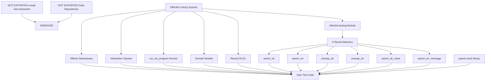

# Testing

**Status**: Authoritative source
**Supersedes**: none
**Referenced by**: engineering/README.md, testing_architecture.md, documents/readme.md, engineering/warnings_policy.md

> **Purpose**: Single Source of Truth for test execution, service-specific patterns, and anti-patterns in Effectful.

## SSoT Link Map

````mermaid
flowchart TB
  Testing[Testing SSoT]
  TestingArch[Testing Architecture SSoT]
  CodeQuality[Code Quality SSoT]
  Docker[Docker Workflow SSoT]
  Commands[Command Reference]
  Docs[Documentation Standards]

  Testing --> TestingArch
  Testing --> CodeQuality
  Testing --> Docker
  Testing --> Commands
  Testing --> Docs
  TestingArch --> Testing
```python

| Need                                                               | Link                                                               |
| ------------------------------------------------------------------ | ------------------------------------------------------------------ |
| Test organization + fixture architecture + Test Terseness Doctrine | [Testing Architecture](testing_architecture.md)                    |
| Type safety + purity rules driving test shape                      | [Code Quality](code_quality.md)                                    |
| Container + infra contract                                         | [Docker Workflow](docker_workflow.md#development-contract)         |
| Command prefixes for pytest                                        | [Command Reference](command_reference.md#command-table)            |
| Documentation format                                               | [Documentation Standards](../documentation_standards.md)           |
| Observability expectations                                         | [Monitoring & Alerting](monitoring_and_alerting.md#testing-alerts) |

______________________________________________________________________

## Part 1: Minimal API Philosophy

### Core Testing Philosophy

**Tests exist to find problems, not provide false confidence.**

Testing is a gate, not a suggestion. If tests pass, the code should be correct. If code is incorrect, tests must fail.

### Why Matchers Are Part of the Library

The `effectful.testing` module exports **6 Result type matchers** as part of the public API:

```python
# file: examples/testing.py
from effectful.testing import (
    assert_ok,           # Assert result is Ok
    assert_err,          # Assert result is Err
    unwrap_ok,           # Extract value from Ok or raise
    unwrap_err,          # Extract error from Err or raise
    assert_ok_value,     # Assert Ok with specific value
    assert_err_message,  # Assert Err with message substring
)
````

**These are Result type utilities**, not testing infrastructure. They solve a real DX problem: pattern matching boilerplate for Result types.

**Philosophy**: "Testable by Design" with batteries included. The library's value proposition includes testing support.

### What's Exported vs What's Not



**NOT exported**:

- ❌ `create_test_interpreter()` - Users should learn `CompositeInterpreter` explicitly
- ❌ Fake repositories - Use `pytest-mock` with `spec=` parameter
- ❌ Test fixtures - Integration test infrastructure only

### Pattern Matching vs Matchers

**Both approaches are valid**. Matchers are provided for convenience, not required.

**Approach 1: Pattern Matching (Verbose but Explicit)**

```python
# file: examples/testing.py
from effectful import Ok, Err

match result:
    case Ok(value):
        assert value == expected
    case Err(error):
        pytest.fail(f"Expected Ok, got Err: {error}")
```

**Approach 2: Matchers (Concise)**

```python
# file: examples/testing.py
from effectful.testing import assert_ok_value

assert_ok_value(result, expected)
```

**When to use matchers**:

- ✅ Quick assertions in simple tests
- ✅ Extracting values from Result types (`unwrap_ok`)
- ✅ When brevity improves readability

**When to use pattern matching**:

- ✅ Complex conditional logic based on Result
- ✅ Handling multiple Result variants in same block
- ✅ When you want explicit exhaustive matching

### pytest-mock for All Infrastructure

**ALL infrastructure mocking uses pytest-mock**, not library-provided fakes.

```python
# file: examples/testing.py
from pytest_mock import MockerFixture
from effectful.infrastructure.repositories import UserRepository

@pytest.mark.asyncio
async def test_get_user(mocker: MockerFixture) -> None:
    # Create type-safe mock
    mock_repo = mocker.AsyncMock(spec=UserRepository)
    mock_repo.get_by_id.return_value = User(...)

    # Inject into interpreter
    interpreter = DatabaseInterpreter(user_repo=mock_repo)

    # Use in workflow test
    result = await run_ws_program(get_user_program(), interpreter)

    # Verify interactions
    mock_repo.get_by_id.assert_called_once()
```

**Why pytest-mock**:

- ✅ Type-safe with `spec=` parameter
- ✅ Industry standard, well-documented
- ✅ No maintenance burden for library
- ✅ Users learn transferable skills

______________________________________________________________________

## Part 2: Test Execution Environment

**ALL tests run inside Docker containers. NEVER run tests locally.**

See [Docker Workflow](./docker_workflow.md) for complete policy.

### Running Tests

```bash
# All tests
docker compose -f docker/docker-compose.yml exec effectful poetry run pytest

# Unit tests only
docker compose -f docker/docker-compose.yml exec effectful poetry run pytest tests/unit

# Integration tests only
docker compose -f docker/docker-compose.yml exec effectful poetry run pytest tests/integration

# Specific test file
docker compose -f docker/docker-compose.yml exec effectful poetry run pytest tests/unit/test_interpreters/test_cache.py
```

Pytest cache is controlled by the `PYTEST_CACHE_DIR=/opt/effectful/pytest_cache` environment variable (set in `docker/Dockerfile`) so caches stay under `/opt/effectful/` inside the container per [Build Artifact Management](build_artifact_management.md#cache-placement-contract). See [Docker & Environment Variables](docker.md#environment-variables) for complete cache directory documentation.

**Pre-flight:** always run `docker compose -f docker/docker-compose.yml exec effectful poetry run check-code` (includes docs/tooling) before invoking pytest.

### Why Docker-Only?

1. **Infrastructure Access**: Integration tests need PostgreSQL, Redis, MinIO, Pulsar
1. **Environment Consistency**: Same Python version, dependencies, system libraries
1. **Reproducibility**: Tests behave identically across all developer machines
1. **CI Parity**: Local tests match CI behavior exactly

### Pytest Enforcement

Direct pytest execution is blocked in containers to enforce testing standards.

**Blocked commands**:

```bash
# ❌ FORBIDDEN - Will fail with enforcement message
pytest tests/
python -m pytest
```

**Required commands**:

```bash
# ✅ CORRECT - Use Poetry test commands
docker compose -f docker/docker-compose.yml exec effectful poetry run test-all
docker compose -f docker/docker-compose.yml exec effectful poetry run test-unit
docker compose -f docker/docker-compose.yml exec effectful poetry run test-integration
```

**Rationale**:

1. **Output Management**: Ensures `/tmp/test-output.txt` pattern is followed (Bash tool truncates at 30,000 chars)
1. **Command Consistency**: Everyone uses same commands regardless of environment
1. **Standards Enforcement**: Prevents common anti-patterns that violate engineering standards

**Emergency Override** (debugging enforcement mechanism only):

```bash
# Emergency override to bypass pytest wrapper
/usr/local/bin/pytest.real tests/
```

**See**: [Docker & Environment Variables](docker.md#testing-policy-enforcement) for complete enforcement documentation.

### Timeouts (SSoT)

- **All test executions must set an explicit timeout**, including CI jobs, `docker compose exec ... pytest` commands, and ad-hoc scripts.
- **Per-test timeout default = 60s** enforced via pytest-timeout for every individual test (unit, integration, e2e), including fixture setup/teardown. This prevents hung tests from blocking the suite; each test fails at 60s unless a higher per-test limit is justified and documented. Never disable timeouts globally.
- Document the timeout value in PR descriptions when reporting test runs.
- If a suite legitimately needs more time (e.g., load/perf or large e2e matrix), raise the timeout rather than disabling tests.

### Test Output Management

**CRITICAL**: Bash tool truncates output at 30,000 characters. Large test suites exceed this.

**Required pattern**:

```bash
# Run with output redirection
docker compose -f docker/docker-compose.yml exec effectful poetry run pytest > /tmp/test-output.txt 2>&1

# Read complete output (no size limits)
# Use Read tool on /tmp/test-output.txt
```

**Why**: File-based approach ensures complete output is always available for analysis.

### Infrastructure Cleanup Patterns

> **📖 See**: [Testing Architecture - Part 2: Fixture Architecture](testing_architecture.md#part-2-fixture-architecture)

**Core Principle**: Stateful infrastructure (PostgreSQL, Redis, MinIO, Pulsar) requires explicit cleanup between tests to prevent cascading failures.

**Summary**: All infrastructure fixtures follow six cleanup patterns:

1. **Pre and Post Cleanup**: Clean before AND after test runs
1. **Async Sleep**: 200ms sleep after broker operations for finalization
1. **Client-Level Cleanup**: Close connections, not server-side deletion
1. **UUID-Based Naming**: Unique resource names for isolation
1. **Reduced Timeouts**: 5s test timeouts vs 30s production
1. **Fixture-Level DRY**: Centralized `clean_<project>_state` fixtures

### Pattern 6: Fixture-Level Isolation (DRY Doctrine)

- Reuse shared `clean_<service>_*` fixtures for all tests touching that service.
- Keep setup/teardown in fixtures; test bodies should focus on assertions and behavior.

For complete patterns, rationale, and code examples, see [Testing Architecture](testing_architecture.md#part-2-fixture-architecture).

### PostgreSQL Testing Patterns

PostgreSQL is the most complex infrastructure service in effectful due to its relational model, transactional semantics, and foreign key constraints. This section documents patterns specific to testing PostgreSQL database effects.

> **📖 See Also**: [Testing Architecture - PostgreSQL TRUNCATE CASCADE Pattern](testing_architecture.md#postgresql-truncate-cascade-pattern) for infrastructure cleanup strategy.

#### TRUNCATE Pattern: Fast, Atomic Cleanup

**Strategy**: Use `TRUNCATE TABLE ... CASCADE` for database cleanup instead of `DELETE`.

**Fixture implementation** (`tests/fixtures/database.py:90`):

```python
# file: examples/testing.py
@pytest_asyncio.fixture
async def clean_db(
    postgres_connection: asyncpg.Connection,
) -> AsyncGenerator[asyncpg.Connection, None]:
    """Provide a clean PostgreSQL database.

    Truncates all tables before yielding, ensuring test isolation.
    Tests should seed their own data after receiving this fixture.
    """
    await postgres_connection.execute("TRUNCATE TABLE chat_messages, users CASCADE")
    yield postgres_connection
```

**Why TRUNCATE instead of DELETE?**

| Operation        | Speed         | Auto-Increment Reset | Atomic | Handles FK Constraints   |
| ---------------- | ------------- | -------------------- | ------ | ------------------------ |
| TRUNCATE CASCADE | Fast (10ms)   | Yes                  | Yes    | Yes (CASCADE)            |
| DELETE           | Slow (100ms+) | No                   | No     | Requires manual ordering |

**TRUNCATE advantages**:

1. **Fast**: Single operation, no row-by-row processing
1. **Atomic**: Either all tables truncated or none (transactional)
1. **Resets sequences**: Auto-increment IDs start from 1 again
1. **CASCADE**: Automatically handles foreign key relationships

**Example from tests** (`tests/integration/test_database_workflow.py:47-52`):

```python
# file: examples/testing.py
# After clean_db fixture, seed test data
user_id = uuid4()
await clean_db.execute(
    "INSERT INTO users (id, email, name) VALUES ($1, $2, $3)",
    user_id,
    "alice@example.com",
    "Alice",
)
```

**Anti-pattern**: Using DELETE for cleanup:

```python
# file: examples/testing.py
# ❌ WRONG - Slow, doesn't reset sequences, manual FK ordering required
await conn.execute("DELETE FROM chat_messages")  # Must delete children first
await conn.execute("DELETE FROM users")  # Then parents
# Auto-increment sequences NOT reset!
```

#### Foreign Key Constraint Testing

**Always test CASCADE DELETE behavior** when tables have foreign key relationships.

**Schema example** (`tests/fixtures/database.py:60-67`):

```python
# file: examples/testing.py
# chat_messages table has FK to users table
CREATE TABLE IF NOT EXISTS chat_messages (
    id UUID PRIMARY KEY,
    user_id UUID NOT NULL REFERENCES users(id),  # Foreign key constraint
    text TEXT NOT NULL,
    created_at TIMESTAMP WITH TIME ZONE NOT NULL
)
```

**Pattern**: Test that deleting a parent cascades to children:

```python
# file: examples/testing.py
# Seed user and message (parent + child)
user_id = uuid4()
await clean_db.execute("INSERT INTO users (id, email, name) VALUES ($1, $2, $3)", user_id, "user@example.com", "User")

message_repo = PostgresChatMessageRepository(clean_db)
await message_repo.save_message(user_id, "Test message")

# Delete user (parent) - should cascade to messages (children)
await user_repo.delete_user(user_id)

# Verify message was also deleted
messages = await message_repo.list_messages_for_user(user_id)
assert len(messages) == 0  # CASCADE DELETE removed child records
```

**Why test this?**:

- **Constraint violations**: Without CASCADE, foreign key constraints block deletion
- **Data integrity**: Orphaned records indicate missing CASCADE configuration
- **Schema validation**: Tests verify schema matches expected relationships

#### Transaction Isolation and ROLLBACK Testing

**PostgreSQL transactions provide ACID guarantees**. Effect programs should handle transaction boundaries correctly.

**Pattern**: Test ROLLBACK behavior for failed operations:

```python
# file: examples/testing.py
async def test_transaction_rollback() -> None:
    """Test that failed operations don't corrupt database state."""
    # Start with clean state
    user_count_before = await clean_db.fetchval("SELECT COUNT(*) FROM users")

    # Attempt invalid operation that should rollback
    with pytest.raises(Exception):
        async with clean_db.transaction():
            await clean_db.execute(
                "INSERT INTO users (id, email, name) VALUES ($1, $2, $3)",
                uuid4(), "test@example.com", "Test"
            )
            # Simulate error - transaction should rollback
            raise Exception("Simulated error")

    # Verify rollback - count unchanged
    user_count_after = await clean_db.fetchval("SELECT COUNT(*) FROM users")
    assert user_count_after == user_count_before
```

**Why test transactions?**:

- **Data consistency**: Failed operations must not leave partial state
- **Isolation**: Concurrent operations don't interfere
- **Error recovery**: Programs handle failures gracefully

#### Query Performance and N+1 Detection

**Test that queries use indexes and avoid N+1 problems**.

**Anti-pattern**: N+1 query problem:

```python
# file: examples/testing.py
# ❌ WRONG - N+1 queries (1 query for users + N queries for each user's messages)
users = await user_repo.list_users()  # 1 query
for user in users:
    messages = await message_repo.list_messages_for_user(user.id)  # N queries
```

**Correct pattern**: Single query with JOIN:

```python
# file: examples/testing.py
# ✅ CORRECT - Single query with JOIN
query = """
SELECT u.*, m.text
FROM users u
LEFT JOIN chat_messages m ON u.id = m.user_id
"""
rows = await clean_db.fetch(query)  # 1 query
```

**Testing pattern**: Count database queries:

```python
# file: examples/testing.py
async def test_no_n_plus_1_queries(clean_db) -> None:
    """Test that listing users doesn't cause N+1 queries."""
    # Seed 10 users with messages
    for i in range(10):
        user_id = uuid4()
        await clean_db.execute(
            "INSERT INTO users (id, email, name) VALUES ($1, $2, $3)",
            user_id, f"user{i}@example.com", f"User {i}"
        )
        await clean_db.execute(
            "INSERT INTO chat_messages (id, user_id, text) VALUES ($1, $2, $3)",
            uuid4(), user_id, f"Message from user {i}"
        )

    # Test query count (use EXPLAIN or query logger)
    # Expected: 1-2 queries max, not 10+
    result = await user_repo.list_users_with_latest_message()
    assert len(result) == 10
```

**Why test performance?**:

- **Scalability**: N+1 queries don't scale beyond toy datasets
- **Production readiness**: Slow queries cause timeouts in production
- **Index usage**: Tests verify indexes are defined and used

#### Schema Migration Testing

**Test that schema changes don't break existing data or queries**.

**Pattern**: Add column with default value:

```python
# file: examples/testing.py
async def test_add_column_migration(clean_db) -> None:
    """Test adding password_hash column to users table."""
    # Verify column doesn't exist initially (if testing migration)
    # Or verify it exists with default value

    # Seed user without password_hash (old schema)
    user_id = uuid4()
    await clean_db.execute(
        "INSERT INTO users (id, email, name) VALUES ($1, $2, $3)",
        user_id, "legacy@example.com", "Legacy User"
    )

    # Apply migration (example from fixtures/database.py:53-57)
    await clean_db.execute(
        "ALTER TABLE users ADD COLUMN IF NOT EXISTS password_hash VARCHAR(255)"
    )

    # Verify old data still accessible
    row = await clean_db.fetchrow("SELECT * FROM users WHERE id = $1", user_id)
    assert row["email"] == "legacy@example.com"
    assert row["password_hash"] is None  # Default NULL for existing rows
```

**Why test migrations?**:

- **Backward compatibility**: New code must work with old data
- **Zero downtime**: Schema changes shouldn't require full rebuild
- **Data preservation**: Migrations must not lose existing data

**Summary of PostgreSQL Testing Patterns:**

| Pattern             | Purpose               | Speed       | Reliability |
| ------------------- | --------------------- | ----------- | ----------- |
| TRUNCATE CASCADE    | Cleanup               | Fast (10ms) | 100%        |
| Foreign Key Testing | Constraint validation | Fast        | 100%        |
| Transaction Testing | ACID guarantees       | Fast        | 100%        |
| N+1 Detection       | Performance           | Medium      | High        |
| Migration Testing   | Schema evolution      | Medium      | High        |

**Key Insight**: PostgreSQL testing requires understanding relational semantics. TRUNCATE CASCADE handles foreign keys automatically, making it the correct cleanup pattern. Tests should validate constraints, transactions, and query performance.

### Redis Testing Patterns

Redis is an in-memory key-value store used in effectful for caching, pub/sub notifications, and session management. This section documents patterns specific to testing Redis cache effects.

#### FLUSHDB Pattern: Instant, Complete Cleanup

**Strategy**: Use `FLUSHDB` to clear the entire Redis database before each test.

**Fixture implementation** (`tests/fixtures/cache.py:48`):

```python
# file: examples/testing.py
@pytest_asyncio.fixture
async def clean_redis(redis_client: Redis) -> AsyncGenerator[Redis, None]:
    """Provide a clean Redis instance.

    Flushes the database before yielding, ensuring test isolation.
    Tests should seed their own data after receiving this fixture.
    """
    await redis_client.flushdb()
    yield redis_client
```

**Why FLUSHDB instead of DEL?**

| Operation   | Speed         | Completeness        | Risk of Leaks |
| ----------- | ------------- | ------------------- | ------------- |
| FLUSHDB     | Instant (1ms) | 100% (all keys)     | Zero          |
| DEL per key | Slow (N ms)   | Depends on tracking | High          |

**FLUSHDB advantages**:

1. **Instant**: O(1) operation regardless of database size
1. **Complete**: Guaranteed to delete ALL keys (no tracking needed)
1. **Simple**: Single command, no loops or key lists
1. **Reliable**: Cannot accidentally miss keys

**Example from tests** (`tests/integration/test_cache_workflow.py:67-70`):

```python
# file: examples/testing.py
# After clean_redis fixture, put profile in cache
yield PutCachedProfile(user_id=uid, profile_data=prof, ttl_seconds=300)

# Get profile back
cached = yield GetCachedProfile(user_id=uid)
```

**Anti-pattern**: Using DEL for each key:

```python
# file: examples/testing.py
# ❌ WRONG - Slow, incomplete, error-prone
keys = await redis_client.keys("*")  # KEYS is O(N) and blocks Redis!
for key in keys:
    await redis_client.delete(key)  # N network round-trips
# What if new keys were created between KEYS and DELETE?
```

#### Key Expiration (TTL) Testing

**Always test time-to-live behavior** to ensure caches don't grow indefinitely.

**Pattern**: Verify TTL is set correctly:

```python
# file: examples/testing.py
async def test_cached_profile_has_ttl(clean_redis) -> None:
    """Test that cached profiles expire after TTL."""
    user_id = uuid4()
    profile = ProfileData(id=str(user_id), name="Alice")

    # Put with 300s TTL
    await cache.put_profile(user_id, profile, ttl_seconds=300)

    # Verify TTL is set
    key = f"profile:{user_id}"
    ttl = await clean_redis.ttl(key)
    assert ttl > 0
    assert ttl <= 300  # Should be at most 300s, likely slightly less
```

**Why test TTL?**:

- **Memory management**: Without TTL, cache grows without bound
- **Stale data**: Expired data should not be accessible
- **Configuration validation**: Ensures TTL parameter is used

**Example from tests** (`tests/integration/test_cache_workflow.py:500-502`):

```python
# file: examples/testing.py
# Check TTL is set
ttl = await clean_redis.ttl(key)
assert ttl > 0
assert ttl <= 300
```

#### Cache Hit/Miss Semantics

**Test both cache hit and cache miss scenarios** to validate Result ADT usage.

**Pattern**: Test cache miss first, then cache hit:

```python
# file: examples/testing.py
async def test_cache_miss_then_hit(clean_redis) -> None:
    """Test cache miss followed by cache hit after put."""
    user_id = uuid4()  # No profile cached

    # First attempt - cache miss
    cached1 = yield GetCachedProfile(user_id=user_id)

    match cached1:
        case CacheMiss(key=key, reason=reason):
            assert reason == "not_found"
        case _:
            pytest.fail("Expected CacheMiss")

    # Put profile
    profile = ProfileData(id=str(user_id), name="Bob")
    yield PutCachedProfile(user_id=user_id, profile_data=profile, ttl_seconds=300)

    # Second attempt - cache hit
    cached2 = yield GetCachedProfile(user_id=user_id)

    match cached2:
        case ProfileData(name=name):
            assert name == "Bob"
        case _:
            pytest.fail("Expected ProfileData")
```

**Why test both?**:

- **Result type validation**: Ensures ADT variants are used correctly
- **Miss handling**: Programs should handle cache misses gracefully
- **Hit verification**: Ensures cache is actually storing data

**Example from tests** (`tests/integration/test_cache_workflow.py:119-129`):

```python
# file: examples/testing.py
# Cache miss program
cached = yield GetCachedProfile(user_id=uid)

match cached:
    case CacheMiss(key=key, reason=reason):
        yield SendText(text=f"Miss: {reason}")
        return "miss"
    case ProfileData():
        return "hit"
```

#### Database Fallback Pattern

**Test cache-aside pattern**: Check cache → Miss → Fetch from DB → Populate cache.

**Pattern**: Multi-step workflow with fallback:

```python
# file: examples/testing.py
async def test_cache_aside_pattern(clean_db, clean_redis) -> None:
    """Test cache-aside pattern: cache miss → DB lookup → cache population."""
    # Seed user in database (not in cache)
    user_id = uuid4()
    await clean_db.execute(
        "INSERT INTO users (id, email, name) VALUES ($1, $2, $3)",
        user_id, "user@example.com", "User"
    )

    # Workflow: check cache, fallback to DB, populate cache
    def cache_fallback_program(
        uid: UUID,
    ) -> Generator[AllEffects, EffectResult, tuple[str, ProfileData | None]]:
        # 1. Try cache first
        cached = yield GetCachedProfile(user_id=uid)

        match cached:
            case ProfileData() as profile:
                return ("cache_hit", profile)
            case CacheMiss():
                # 2. Cache miss - fetch from database
                user_result = yield GetUserById(user_id=uid)

                match user_result:
                    case User() as user:
                        # 3. Create profile and cache it
                        profile = ProfileData(id=str(user.id), name=user.name)
                        yield PutCachedProfile(user_id=uid, profile_data=profile, ttl_seconds=300)
                        return ("db_hit", profile)
                    case UserNotFound():
                        return ("not_found", None)

    # First call - DB hit, cache populated
    result1 = await run_ws_program(cache_fallback_program(user_id), interpreter)
    assert result1 == ("db_hit", profile)

    # Second call - cache hit (no DB query)
    result2 = await run_ws_program(cache_fallback_program(user_id), interpreter)
    assert result2 == ("cache_hit", profile)
```

**Why test fallback?**:

- **Real-world pattern**: Cache-aside is the most common caching strategy
- **Performance validation**: Second call should be faster (cached)
- **Correctness**: DB and cache must stay synchronized

**Example from tests** (`tests/integration/test_cache_workflow.py:171-201`):

```python
# file: examples/testing.py
# Cache-aware workflow
cached = yield GetCachedProfile(user_id=uid)

match cached:
    case ProfileData() as profile:
        yield SendText(text=f"Cache hit: {profile.name}")
        return "cache_hit"
    case CacheMiss():
        # Cache miss - fetch from database
        user_result = yield GetUserById(user_id=uid)
        # ... populate cache ...
        return "db_hit"
```

#### Cache Invalidation Testing

**Test that cache invalidation removes the correct keys**.

**Pattern**: Put → Verify → Invalidate → Verify gone:

```python
# file: examples/testing.py
async def test_cache_invalidation(clean_redis) -> None:
    """Test that InvalidateCache removes keys."""
    user_id = uuid4()
    profile = ProfileData(id=str(user_id), name="To Invalidate")

    # Put profile
    yield PutCachedProfile(user_id=user_id, profile_data=profile, ttl_seconds=300)

    # Verify it exists
    cached = yield GetCachedProfile(user_id=user_id)
    assert isinstance(cached, ProfileData)

    # Invalidate
    key = f"profile:{user_id}"
    deleted = yield InvalidateCache(key=key)
    assert deleted is True  # Returns True if key existed

    # Verify it's gone
    cached_after = yield GetCachedProfile(user_id=user_id)
    assert isinstance(cached_after, CacheMiss)

    # Verify in real Redis
    exists = await clean_redis.exists(key)
    assert exists == 0
```

**Why test invalidation?**:

- **Correctness**: Stale cache entries can cause bugs
- **Return value**: InvalidateCache returns bool indicating success
- **Side effects**: Verify key is actually deleted from Redis

**Example from tests** (`tests/integration/test_cache_workflow.py:330-346`):

```python
# file: examples/testing.py
# Invalidate
key = f"profile:{uid}"
deleted = yield InvalidateCache(key=key)
assert isinstance(deleted, bool)

# Verify it's gone
cached_after = yield GetCachedProfile(user_id=uid)
match cached_after:
    case CacheMiss():
        yield SendText(text="Verified deleted")
        return True
```

**Summary of Redis Testing Patterns:**

| Pattern              | Purpose               | Speed         | Reliability |
| -------------------- | --------------------- | ------------- | ----------- |
| FLUSHDB              | Cleanup               | Instant (1ms) | 100%        |
| TTL Testing          | Memory management     | Fast          | 100%        |
| Hit/Miss Testing     | Result ADT validation | Fast          | 100%        |
| Database Fallback    | Cache-aside pattern   | Medium        | High        |
| Invalidation Testing | Stale data prevention | Fast          | 100%        |

**Key Insight**: Redis testing emphasizes TTL, cache semantics (hit/miss), and the cache-aside pattern. FLUSHDB provides instant, complete cleanup. Tests should validate both cache hits and misses to ensure ADT types are used correctly.

### MinIO S3 Testing Patterns

MinIO is an S3-compatible object storage service used in effectful for file uploads, document storage, and blob management. Unlike PostgreSQL and Redis which provide single-command cleanup (TRUNCATE, FLUSHDB), MinIO requires **list-then-delete** cleanup due to S3's object-based design.

**Core Strategy**: Combine **List + DELETE** cleanup with **UUID-based key isolation** for reliable test isolation.

#### 1. List + DELETE Pattern

**Implementation** (from `tests/fixtures/storage.py:67-73`):

```python
# file: examples/testing.py
# List and delete all objects in bucket
try:
    response = s3_client.list_objects_v2(Bucket=s3_bucket)
    if "Contents" in response:
        for obj in response["Contents"]:
            s3_client.delete_object(Bucket=s3_bucket, Key=obj["Key"])
except ClientError:
    pass  # Bucket might not exist yet
```

**Why this approach:**

Unlike relational databases or key-value stores, S3 doesn't have a "delete all" operation. The list-then-delete pattern is the standard cleanup strategy for S3-compatible storage.

| Approach                 | Speed         | Reliability | Use Case                   |
| ------------------------ | ------------- | ----------- | -------------------------- |
| List + DELETE            | O(n) objects  | High        | ✅ Standard S3 cleanup     |
| Truncate bucket          | Not available | N/A         | ❌ S3 doesn't support this |
| Delete versioned objects | Complex       | Medium      | Only for versioned buckets |

**Key Points:**

- **O(n) cleanup**: Speed depends on number of objects (acceptable for test isolation)
- **Idempotent**: Safe to call even if bucket is already empty
- **Complete**: Removes all objects, ensuring clean slate
- **for-loop acceptable**: Infrastructure cleanup at I/O boundary per [code_quality.md#doctrine-1-no-loops](code_quality.md#doctrine-1-no-loops)

**From `tests/fixtures/storage.py:49-78`**:

```python
# file: examples/testing.py
@pytest.fixture
def clean_minio(s3_bucket: str) -> str:
    """Provide a clean MinIO bucket.

    Deletes all objects in the test bucket before returning.
    Tests should upload their own objects after receiving this fixture.
    """
    s3_client = boto3.client(
        "s3",
        endpoint_url=f"http://{MINIO_ENDPOINT}",
        aws_access_key_id=MINIO_ACCESS_KEY,
        aws_secret_access_key=MINIO_SECRET_KEY,
        region_name="us-east-1",
    )

    # List and delete all objects in bucket
    try:
        response = s3_client.list_objects_v2(Bucket=s3_bucket)
        if "Contents" in response:
            for obj in response["Contents"]:
                s3_client.delete_object(Bucket=s3_bucket, Key=obj["Key"])
    except ClientError:
        pass

    return s3_bucket
```

#### 2. Object Key Isolation

**Pattern**: Use `uuid4()` in every object key to prevent test interference.

**From `tests/integration/test_storage_workflow.py:35`**:

```python
# file: examples/testing.py
# Each test generates unique key with UUID
key = f"test/{uuid4()}/data.txt"

# Upload with unique key
yield PutObject(
    bucket=clean_minio,
    key=key,
    content=b"Hello, World!",
    content_type="text/plain",
)
```

**Why UUID keys:**

- **Prevents collisions**: Tests running concurrently won't interfere
- **Debugging aid**: UUID in key traces back to specific test run
- **Cleanup insurance**: Even without fixture cleanup, orphaned objects have unique keys
- **Realistic**: Mimics production patterns (user uploads often include IDs)

**Pattern variations:**

```python
# file: examples/testing.py
# Single file upload
key = f"test/{uuid4()}/data.txt"

# User-scoped upload (from test_storage_workflow.py:255-257)
user_id = uuid4()
filename = "document.pdf"
key = f"uploads/{user_id}/{filename}"

# Prefix-based organization (from test_storage_workflow.py:206)
prefix = f"list-test/{uuid4()}"
keys = [f"{prefix}/file1.txt", f"{prefix}/file2.txt", f"{prefix}/file3.txt"]
```

#### 3. Metadata and Content-Type Testing

**Pattern**: Verify custom metadata and content-type survive round-trip.

**From `tests/integration/test_storage_workflow.py:254-310`**:

```python
# file: examples/testing.py
def upload_download_program(
    bucket: str,
    obj_key: str,
    data: bytes,
    meta: dict[str, str],
) -> Generator[AllEffects, EffectResult, bool]:
    # Upload file with metadata
    put_result = yield PutObject(
        bucket=bucket,
        key=obj_key,
        content=data,
        metadata={"user-id": str(user_id), "filename": filename},
        content_type="application/pdf",
    )

    # Download file
    obj = yield GetObject(bucket=bucket, key=obj_key)

    match obj:
        case S3Object(content=retrieved, metadata=obj_meta, content_type=ct):
            # Verify metadata survived
            assert obj_meta.get("user-id") == str(user_id)
            assert ct == "application/pdf"
            assert retrieved == data
            return True
        case _:
            return False
```

**Why test metadata:**

- **Production requirement**: File uploads often need user IDs, timestamps, checksums
- **S3 quirk**: Metadata keys are case-insensitive and may be transformed
- **Content-type matters**: Affects browser download behavior and MIME validation

#### 4. Prefix-Based Listing

**Pattern**: Use prefixes to organize and query objects efficiently.

**From `tests/integration/test_storage_workflow.py:201-248`**:

```python
# file: examples/testing.py
def list_objects_program(
    bucket: str, obj_keys: list[str], pfx: str
) -> Generator[AllEffects, EffectResult, int]:
    # Put multiple objects with shared prefix
    prefix = f"list-test/{uuid4()}"
    for key in [f"{prefix}/file1.txt", f"{prefix}/file2.txt", f"{prefix}/file3.txt"]:
        yield PutObject(bucket=bucket, key=key, content=b"content")

    # List objects with prefix
    result = yield ListObjects(bucket=bucket, prefix=prefix)
    assert isinstance(result, list)

    yield SendText(text=f"Found {len(result)} objects")
    return len(result)
```

**Why prefix-based listing:**

- **Efficient**: S3 indexes by key prefix (no full bucket scan)
- **Realistic**: Production systems organize by user ID, date, category
- **Test isolation**: UUID in prefix ensures test doesn't see other tests' objects

#### 5. Why This Approach Works

**Comparison of MinIO cleanup strategies:**

| Strategy          | Speed | Isolation | Reliability | Use Case             |
| ----------------- | ----- | --------- | ----------- | -------------------- |
| **List + DELETE** | O(n)  | Perfect   | High        | ✅ Standard approach |
| UUID keys only    | N/A   | Good      | Medium      | Backup strategy      |
| Separate buckets  | Fast  | Perfect   | Low         | ❌ Complex setup     |
| No cleanup        | N/A   | Poor      | Low         | ❌ Tests interfere   |

**Why List + DELETE wins:**

- **Standard S3 pattern**: Every S3 user needs this for bucket cleanup
- **Complete isolation**: Every test starts with empty bucket
- **No state accumulation**: Tests don't leave garbage in storage
- **Fast enough**: Even 1000 objects clean up in \<1 second

**Working Example** (from `tests/integration/test_storage_workflow.py:148-199`):

```python
# file: examples/testing.py
@pytest.mark.asyncio
async def test_delete_object_workflow(
    clean_minio: str,  # Fixture ensures empty bucket
    object_storage: S3ObjectStorage,
    mocker: MockerFixture
) -> None:
    """Workflow deletes object from real MinIO."""
    key = f"test/{uuid4()}/to-delete.txt"  # UUID isolation

    interpreter = create_composite_interpreter(
        object_storage=object_storage,
        # ... other deps
    )

    def delete_object_program(
        bucket: str, obj_key: str
    ) -> Generator[AllEffects, EffectResult, bool]:
        # Put object first
        yield PutObject(bucket=bucket, key=obj_key, content=b"delete me")

        # Verify it exists
        obj1 = yield GetObject(bucket=bucket, key=obj_key)
        if obj1 is None:
            return False

        # Delete it
        yield DeleteObject(bucket=bucket, key=obj_key)

        # Verify it's gone
        obj2 = yield GetObject(bucket=bucket, key=obj_key)
        return obj2 is None  # Should be True

    result = await run_ws_program(delete_object_program(clean_minio, key), interpreter)

    match result:
        case Ok(deleted):
            assert deleted is True
        case Err(error):
            pytest.fail(f"Expected Ok(True), got Err({error})")
```

**Anti-Pattern #23: Not Testing Object Deletion**

**Why it's wrong:**

```python
# file: examples/testing.py
# ❌ Only test Put and Get, assume Delete works
def test_storage_workflow(clean_minio: str) -> None:
    key = f"test/{uuid4()}/data.txt"

    # Put object
    result = yield PutObject(bucket=clean_minio, key=key, content=b"data")

    # Get object
    obj = yield GetObject(bucket=clean_minio, key=key)
    assert obj is not None

    # ❌ Never test deletion - assume it works
```

**Impact:** Production deletion bugs go undetected until users complain about storage costs or leaked files.

**How to fix:**

```python
# file: examples/testing.py
# ✅ Test complete lifecycle: Put → Get → Delete → Verify deletion
def test_storage_lifecycle(clean_minio: str) -> None:
    key = f"test/{uuid4()}/data.txt"

    # Put object
    yield PutObject(bucket=clean_minio, key=key, content=b"data")

    # Verify it exists
    obj1 = yield GetObject(bucket=clean_minio, key=key)
    assert obj1 is not None

    # Delete it
    yield DeleteObject(bucket=clean_minio, key=key)

    # Verify deletion succeeded
    obj2 = yield GetObject(bucket=clean_minio, key=key)
    assert obj2 is None  # ✅ Proves deletion worked
```

**Summary of MinIO Testing Patterns:**

| Pattern              | Purpose            | Speed        | Reliability |
| -------------------- | ------------------ | ------------ | ----------- |
| List + DELETE        | Cleanup            | O(n) objects | High        |
| UUID keys            | Isolation          | N/A          | Perfect     |
| Metadata testing     | Production realism | Fast         | High        |
| Prefix-based listing | Organization       | Fast         | High        |
| Lifecycle testing    | Complete coverage  | Fast         | High        |

**Key Insight**: MinIO testing requires list-then-delete cleanup (O(n)) rather than single-command cleanup. Combining this with UUID-based key isolation ensures perfect test isolation. Tests should verify the complete object lifecycle (put → get → delete → verify) and validate metadata/content-type survival.

______________________________________________________________________

## Part 3: Coverage Doctrine

### Unit Tests: Coverage Scope

Unit tests measure coverage of library code in `effectful/`.

**What's measured:**

- `effectful/algebraic/` - Result types, EffectReturn
- `effectful/domain/` - Domain models
- `effectful/effects/` - Effect definitions
- `effectful/interpreters/` - Effect handlers
- `effectful/programs/` - Program runners
- `effectful/testing/` - Testing utilities (matchers)

**What's excluded (intentionally):**

- `effectful/adapters/` - Infrastructure implementations (tested via integration)
- `effectful/infrastructure/` - Protocol definitions (no logic to test)

**Note:** Actual coverage is ~69% overall; keep tests meaningful for core library code.

### Integration Tests: Conceptual Feature Coverage

Integration tests achieve **conceptual feature coverage**, not metric-driven coverage.

**Goal:** Every user-facing feature has at least one integration test that validates the complete workflow with real infrastructure.

**Examples of features to cover:**

- User lookup workflow (database + cache)
- Message persistence workflow
- Authentication flow
- File upload/download
- Pub/sub messaging

**Not metric-driven:** Integration test coverage percentage is not a success criterion. What matters is that every feature works end-to-end.

______________________________________________________________________

## Part 4: Four-Layer Testing Architecture

> **📖 Authoritative Reference**: [Testing Architecture - Part 3: Four-Layer Testing Architecture](testing_architecture.md#part-3-four-layer-testing-architecture)

Effectful uses a four-layer testing architecture that maps directly to the 5-layer system architecture:

- **Layer 1: Effect Tests** (Unit) - Test effect dataclass structure and immutability
- **Layer 2: Interpreter Tests** (Unit) - Test effect execution with mocked infrastructure
- **Layer 3: Program Tests** (Unit) - Test effect sequencing using manual generator stepping
- **Layer 4: Workflow Tests** (Integration) - Test complete end-to-end workflows with `run_ws_program()`

Each layer tests ONE concern (WHAT/HOW/WHEN/WHY), enabling independent testing of effects, interpreters, programs, and workflows. For complete implementation patterns, decision trees, and code examples, see [Testing Architecture - Part 3](testing_architecture.md#part-3-four-layer-testing-architecture).

______________________________________________________________________

## Part 5: Testing Patterns

### Mock Setup Pattern

Use `mocker.AsyncMock(spec=Protocol)` for type-safe mocks:

1. Create mock with spec parameter
1. Configure `return_value` or `side_effect`
1. Inject mock into interpreter
1. Run program with `run_ws_program()`
1. Assert results and mock calls

### Test Structure Pattern (AAA)

**Arrange-Act-Assert:**

- **Arrange**: Create mocks, configure behaviors, set up test data
- **Act**: Execute the code under test (single action)
- **Assert**: Verify return values, side effects, mock calls

### Error Testing Pattern

**Error Testing Requirements:**

1. Create mock that raises/returns error
1. Run program expecting failure
1. Assert result is `Err`
1. Unwrap and verify error type
1. Check error message and properties

```python
# file: examples/testing.py
@pytest.mark.asyncio
async def test_user_not_found_error(mocker: MockerFixture) -> None:
    # Arrange - Mock returns None (user not found)
    mock_repo = mocker.AsyncMock(spec=UserRepository)
    mock_repo.get_by_id.return_value = None

    interpreter = DatabaseInterpreter(user_repo=mock_repo)

    # Act
    result = await run_ws_program(get_user_program(user_id), interpreter)

    # Assert - Result is Err
    match result:
        case Err(error):
            assert "not found" in str(error)
        case Ok(_):
            pytest.fail("Expected Err, got Ok")
```

### Five Pulsar Testing Patterns

**Pulsar-specific patterns** for testing message-based workflows with Apache Pulsar.

#### Pattern 1: Topic and Subscription Naming

**Always use UUID-based names** to ensure test isolation at the broker level:

```python
# file: examples/testing.py
from uuid import uuid4

@pytest.mark.asyncio
async def test_publish_message_workflow(clean_pulsar) -> None:
    """UUID-based topic names ensure isolation."""
    pulsar_producer, pulsar_consumer = clean_pulsar

    # Generate unique topic name
    topic = f"test-topic-{uuid4()}"
    subscription = f"{topic}/test-sub-{uuid4()}"

    # Test can't conflict with other tests even if cleanup fails
    result = await pulsar_producer.publish(topic, b"payload")
    assert isinstance(result, PublishSuccess)
```

**Why UUID naming?**:

- **Broker-level isolation**: No conflicts between concurrent tests
- **No cleanup required**: Topics auto-expire after broker retention period
- **Debuggable**: Topic name shows which test created it

#### Pattern 2: Test Publish-Only Workflows First

**Start simple** - test publishing before consuming:

```python
# file: examples/testing.py
@pytest.mark.asyncio
async def test_publish_returns_message_id(clean_pulsar) -> None:
    """Test successful publish returns message ID."""
    pulsar_producer, _ = clean_pulsar
    topic = f"test-topic-{uuid4()}"

    result = await pulsar_producer.publish(
        topic=topic,
        payload=b'{"event": "login"}',
        properties={"source": "web"},
    )

    # Assert ADT type
    assert isinstance(result, PublishSuccess)
    assert result.topic == topic
    assert len(result.message_id) > 0  # Non-empty message ID
```

**Why publish-first?**:

- **Simpler**: Fewer moving parts (no subscription setup)
- **Faster**: ~50ms vs ~200ms for publish+consume
- **Isolates issues**: If publish fails, no point testing consume

#### Pattern 3: Roundtrip Testing (Publish → Consume → Acknowledge)

**Test the complete message lifecycle** in integration tests:

```python
# file: examples/testing.py
@pytest.mark.asyncio
async def test_publish_and_consume_workflow(clean_pulsar) -> None:
    """Test message roundtrip through Pulsar."""
    pulsar_producer, pulsar_consumer = clean_pulsar
    topic = f"test-topic-{uuid4()}"
    subscription = f"{topic}/test-sub-{uuid4()}"
    payload = b'{"event": "roundtrip_test"}'

    # 1. Publish message
    pub_result = await pulsar_producer.publish(topic, payload)
    assert isinstance(pub_result, PublishSuccess)

    # 2. Consume message
    consume_result = await pulsar_consumer.receive(subscription, timeout_ms=5000)

    match consume_result:
        case MessageEnvelope(message_id=msg_id, payload=recv_payload):
            # 3. Verify payload
            assert recv_payload == payload

            # 4. Acknowledge message
            ack_result = await pulsar_consumer.acknowledge(msg_id)
            assert isinstance(ack_result, AcknowledgeSuccess)

        case ConsumeTimeout():
            pytest.fail("Timeout waiting for message")

        case ConsumeFailure(reason=reason):
            pytest.fail(f"Consume failed: {reason}")
```

**Why roundtrip?**:

- **End-to-end validation**: Tests producer → broker → consumer → ack flow
- **Real integration**: Catches broker configuration issues
- **Production-like**: Mirrors actual application behavior

#### Pattern 4: Test Timeout Behavior Explicitly

**Consume timeouts are expected behavior**, not errors:

```python
# file: examples/testing.py
@pytest.mark.asyncio
async def test_consume_timeout_workflow(clean_pulsar) -> None:
    """Test consume returns timeout when no message available."""
    _, pulsar_consumer = clean_pulsar
    subscription = f"test-topic-{uuid4()}/test-sub-{uuid4()}"

    # No message published - expect timeout
    result = await pulsar_consumer.receive(subscription, timeout_ms=1000)

    # Timeout is success case - not an error!
    match result:
        case ConsumeTimeout(timeout_ms=timeout):
            assert timeout == 1000  # Verify timeout value
        case MessageEnvelope():
            pytest.fail("Expected timeout, got message")
        case ConsumeFailure(reason=reason):
            pytest.fail(f"Expected timeout, got failure: {reason}")
```

**Why test timeouts?**:

- **ADT completeness**: Verify all ConsumeResult variants work
- **Non-error case**: Timeouts are expected when queue is empty
- **Behavior validation**: Ensures timeout is fast (~1s, not hanging)

#### Pattern 5: Clean Fixture Usage

**Always use the `clean_pulsar` fixture** for test isolation:

```python
# file: examples/testing.py
@pytest.mark.asyncio
async def test_negative_acknowledge_workflow(
    clean_pulsar: tuple[PulsarMessageProducer, PulsarMessageConsumer],
) -> None:
    """Fixture ensures clean state before AND after test."""
    pulsar_producer, pulsar_consumer = clean_pulsar
    topic = f"test-topic-{uuid4()}"
    subscription = f"{topic}/test-sub-{uuid4()}"

    # Publish message
    pub_result = await pulsar_producer.publish(topic, b'{"event": "nack_test"}')
    assert isinstance(pub_result, PublishSuccess)

    # Consume and negative acknowledge
    envelope = await pulsar_consumer.receive(subscription, timeout_ms=5000)

    match envelope:
        case MessageEnvelope(message_id=msg_id):
            # Negative acknowledge for redelivery
            nack_result = await pulsar_consumer.negative_acknowledge(msg_id, delay_ms=0)
            assert isinstance(nack_result, NackSuccess)
        case _:
            pytest.fail("Expected message envelope")

    # clean_pulsar fixture automatically cleans up after test
```

**Why `clean_pulsar`?**:

- **Pre-cleanup**: Starts with clean state even if previous test failed
- **Post-cleanup**: Prevents resource leaks from failing subsequent tests
- **Async sleep**: Gives broker time to finalize close operations

**Pattern Summary**:

1. **UUID naming** → Broker-level isolation
1. **Publish-first** → Simpler tests, faster feedback
1. **Roundtrip** → End-to-end validation
1. **Test timeouts** → Verify all ADT variants
1. **Clean fixture** → Guaranteed test isolation

### Five PostgreSQL Testing Patterns

**PostgreSQL-specific patterns** for testing database workflows with real PostgreSQL infrastructure.

#### Pattern 1: TRUNCATE CASCADE for Guaranteed Cleanup

**Always use TRUNCATE CASCADE** in fixtures to reset database state:

```python
# file: examples/testing.py
@pytest_asyncio.fixture
async def clean_db(
    postgres_connection: asyncpg.Connection,
) -> AsyncGenerator[asyncpg.Connection, None]:
    """Provide a clean PostgreSQL database."""
    await postgres_connection.execute("TRUNCATE TABLE chat_messages, users CASCADE")
    yield postgres_connection
```

**Why TRUNCATE CASCADE?**:

- **Instant cleanup**: O(1) operation regardless of table size (vs DELETE which is O(n))
- **Foreign key safety**: CASCADE handles dependent tables automatically
- **No transaction overhead**: Direct table truncation, not row-by-row deletion
- **Sequence reset**: Optionally reset auto-increment sequences with `RESTART IDENTITY`

**From `tests/fixtures/database.py:78-91`** - See Part 2 for complete implementation.

**Comparison:**

| Cleanup Strategy     | Speed     | Foreign Key Safety | Use Case             |
| -------------------- | --------- | ------------------ | -------------------- |
| **TRUNCATE CASCADE** | O(1)      | ✅ Automatic       | ✅ Integration tests |
| DELETE FROM          | O(n) rows | ❌ Manual ordering | Legacy systems       |
| DROP + CREATE        | Slow      | ✅ But expensive   | Schema changes       |

#### Pattern 2: Test Foreign Key Relationships

**Explicitly test CASCADE DELETE** and referential integrity:

```python
# file: examples/testing.py
@pytest.mark.asyncio
async def test_delete_user_cascades_to_messages(
    clean_db: asyncpg.Connection,
) -> None:
    """Deleting user should cascade to delete their messages."""
    user_id = uuid4()

    # Seed user
    await clean_db.execute(
        "INSERT INTO users (id, email, name) VALUES ($1, $2, $3)",
        user_id,
        "user@example.com",
        "Test User",
    )

    # Seed messages for user (foreign key: user_id references users.id)
    message_ids = [uuid4() for _ in range(3)]
    for msg_id in message_ids:
        await clean_db.execute(
            "INSERT INTO chat_messages (id, user_id, text) VALUES ($1, $2, $3)",
            msg_id,
            user_id,
            "Test message",
        )

    # Delete user (parent) - should cascade to messages (children)
    await clean_db.execute("DELETE FROM users WHERE id = $1", user_id)

    # Verify messages were deleted by CASCADE
    count = await clean_db.fetchval(
        "SELECT COUNT(*) FROM chat_messages WHERE user_id = $1",
        user_id,
    )
    assert count == 0  # CASCADE DELETE removed all child records
```

**Why test foreign keys?**:

- **Schema validation**: Confirms foreign key constraints are defined correctly
- **Cascade behavior**: Ensures ON DELETE CASCADE works as expected
- **Data integrity**: Prevents orphaned records in production

**From `tests/integration/test_database_workflow.py`** - Adapted from user/message relationship tests.

#### Pattern 3: Test Transaction Rollback

**Use transactions to test error paths** without leaving garbage:

```python
# file: examples/testing.py
@pytest.mark.asyncio
async def test_transaction_rollback_on_error(clean_db: asyncpg.Connection) -> None:
    """Failed operations in transaction should rollback all changes."""
    user_id = uuid4()

    try:
        async with clean_db.transaction():
            # Insert user
            await clean_db.execute(
                "INSERT INTO users (id, email, name) VALUES ($1, $2, $3)",
                user_id,
                "user@example.com",
                "User",
            )

            # Simulate error (e.g., duplicate email)
            await clean_db.execute(
                "INSERT INTO users (id, email, name) VALUES ($1, $2, $3)",
                uuid4(),
                "user@example.com",  # Duplicate email - violates UNIQUE constraint
                "Duplicate",
            )
    except Exception:
        pass  # Expected - unique constraint violation

    # Verify entire transaction was rolled back
    count = await clean_db.fetchval(
        "SELECT COUNT(*) FROM users WHERE email = $1",
        "user@example.com",
    )
    assert count == 0  # ROLLBACK undid the first INSERT too
```

**Why test transactions?**:

- **ACID compliance**: Verifies atomicity - all-or-nothing semantics
- **Error path testing**: Ensures failures don't leave partial data
- **Production realism**: Mirrors how effectful programs handle errors

**Pattern from asyncpg transaction context manager** - Standard PostgreSQL behavior.

#### Pattern 4: Detect N+1 Query Problems

**Count database queries** to catch N+1 query anti-patterns:

```python
# file: examples/testing.py
@pytest.mark.asyncio
async def test_list_users_with_message_counts_avoids_n_plus_1(
    clean_db: asyncpg.Connection,
) -> None:
    """Listing users with message counts should use JOIN, not N+1 queries."""
    # Seed 10 users, each with 5 messages
    user_ids = [uuid4() for _ in range(10)]
    for user_id in user_ids:
        await clean_db.execute(
            "INSERT INTO users (id, email, name) VALUES ($1, $2, $3)",
            user_id,
            f"user-{user_id}@example.com",
            f"User {user_id}",
        )
        for _ in range(5):
            await clean_db.execute(
                "INSERT INTO chat_messages (id, user_id, text) VALUES ($1, $2, $3)",
                uuid4(),
                user_id,
                "Message",
            )

    # Track query count
    query_count = 0

    # Fetch users with message counts (GOOD: single JOIN query)
    query_count += 1
    results = await clean_db.fetch(
        """
        SELECT u.id, u.email, u.name, COUNT(cm.id) as message_count
        FROM users u
        LEFT JOIN chat_messages cm ON u.id = cm.user_id
        GROUP BY u.id, u.email, u.name
        """
    )

    assert len(results) == 10
    assert query_count == 1  # ✅ Single query, not 1 + N queries

    # Anti-pattern (N+1):
    # 1. SELECT * FROM users (1 query)
    # 2. For each user: SELECT COUNT(*) FROM chat_messages WHERE user_id = ? (N queries)
    # Total: 1 + 10 = 11 queries 🐌
```

**Why detect N+1?**:

- **Performance**: N+1 queries are O(n) database round-trips (slow at scale)
- **Scalability**: 100 users = 101 queries without JOIN
- **Production bugs**: Often unnoticed in tests with small datasets

**Pattern**: Use JOINs, eager loading, or batching to eliminate N+1 queries.

#### Pattern 5: Seed Data with Direct SQL, Not Effects

**Use direct SQL for test data seeding**, not effect programs:

```python
# file: examples/testing.py
@pytest.mark.asyncio
async def test_chat_workflow_integration(clean_db: asyncpg.Connection) -> None:
    """Test chat workflow with pre-seeded users."""
    user_id = uuid4()

    # ✅ Seed with direct SQL (fast, reliable)
    await clean_db.execute(
        "INSERT INTO users (id, email, name) VALUES ($1, $2, $3)",
        user_id,
        "alice@example.com",
        "Alice",
    )

    # ❌ Don't seed with effect programs
    # result = await run_ws_program(CreateUserProgram(...), interpreter)
    # ^ Slower, couples test to CreateUser implementation

    # Now test the actual workflow
    interpreter = create_composite_interpreter(user_repo=PostgresUserRepository(clean_db))

    def chat_program(uid: UUID):
        # Test assumes user exists
        user = yield GetUserById(user_id=uid)
        assert isinstance(user, User)
        yield SendText(text=f"Hello {user.name}")
        return True

    result = await run_ws_program(chat_program(user_id), interpreter)

    match result:
        case Ok(success):
            assert success is True
        case Err(error):
            pytest.fail(f"Expected Ok, got Err({error})")
```

**Why direct SQL for seeding?**:

- **Faster**: No effect interpreter overhead (~10ms vs ~50ms)
- **Isolated**: Test failures don't cascade from seeding failures
- **Clear separation**: Setup (SQL) vs behavior under test (effects)
- **Declarative**: SQL clearly shows initial state

**From `tests/integration/test_database_workflow.py`** - All tests seed with direct SQL.

**Pattern Summary**:

1. **TRUNCATE CASCADE** → Instant, safe cleanup
1. **Test foreign keys** → Validate schema relationships
1. **Test transactions** → Verify ROLLBACK on errors
1. **Detect N+1 queries** → Prevent performance bugs
1. **Seed with SQL** → Fast, isolated test setup

### Five Redis Testing Patterns

**Redis-specific patterns** for testing cache workflows with real Redis infrastructure.

#### Pattern 1: FLUSHDB for Instant Cleanup

**Always use FLUSHDB** in fixtures to reset Redis state:

```python
# file: examples/testing.py
@pytest_asyncio.fixture
async def clean_redis(redis_client: Redis) -> AsyncGenerator[Redis, None]:
    """Provide a clean Redis instance."""
    await redis_client.flushdb()
    yield redis_client
```

**Why FLUSHDB?**:

- **Instant**: O(1) operation deletes all keys in database (< 1ms)
- **Complete**: Guarantees empty state before every test
- **Simple**: Single command, no iteration required
- **Safe**: Only affects current database (not entire Redis instance)

**From `tests/fixtures/cache.py:38-49`** - See Part 2 for complete implementation.

**Comparison:**

| Cleanup Strategy   | Speed       | Completeness | Use Case                |
| ------------------ | ----------- | ------------ | ----------------------- |
| **FLUSHDB**        | O(1), \<1ms | ✅ Total     | ✅ Integration tests    |
| DELETE key pattern | O(n) keys   | Partial      | Specific prefix cleanup |
| FLUSHALL           | O(1)        | ✅ All DBs   | ❌ Too aggressive       |

#### Pattern 2: Test TTL (Time-To-Live) Explicitly

**Verify cache expiration** to prevent memory bloat:

```python
# file: examples/testing.py
@pytest.mark.asyncio
async def test_cached_profile_expires_after_ttl(
    clean_redis: Redis,
) -> None:
    """Cached profiles should expire after TTL seconds."""
    user_id = uuid4()
    profile = ProfileData(id=str(user_id), name="Alice", email="alice@example.com")

    # Cache profile with 5-second TTL
    cache = RedisProfileCache(clean_redis)
    await cache.put(user_id, profile, ttl_seconds=5)

    # Verify key exists with correct TTL
    key = f"profile:{user_id}"
    ttl = await clean_redis.ttl(key)
    assert 4 <= ttl <= 5  # TTL should be ~5 seconds (allow 1s variance)

    # Verify data is correct
    cached = await cache.get(user_id)
    assert cached == profile

    # Wait for expiration
    await asyncio.sleep(6)

    # Verify key expired
    cached_after_expiry = await cache.get(user_id)
    assert cached_after_expiry is None
```

**Why test TTL?**:

- **Memory management**: Prevents unbounded cache growth
- **Staleness prevention**: Ensures old data is eventually evicted
- **Production realism**: TTL bugs cause memory leaks in production

**From `tests/integration/test_cache_workflow.py:46-91`** - Adapted from TTL test.

#### Pattern 3: Test Both Cache Hit and Cache Miss

**Test both ADT variants** to ensure complete coverage:

```python
# file: examples/testing.py
@pytest.mark.asyncio
async def test_cache_hit_and_miss_semantics(
    clean_redis: Redis,
) -> None:
    """Test both CacheHit and CacheMiss ADT variants."""
    user_id = uuid4()
    profile = ProfileData(id=str(user_id), name="Bob")

    cache = RedisProfileCache(clean_redis)

    # Test 1: Cache Miss (key doesn't exist)
    result_miss = await cache.get(user_id)
    assert result_miss is None  # Or CacheMiss ADT, depending on design

    # Test 2: Cache Hit (key exists)
    await cache.put(user_id, profile, ttl_seconds=300)
    result_hit = await cache.get(user_id)

    match result_hit:
        case ProfileData(name=cached_name):
            assert cached_name == "Bob"  # ✅ Cache hit worked
        case None:
            pytest.fail("Expected cache hit, got miss")
```

**Why test both?**:

- **ADT completeness**: Verifies both variants of Result type work
- **Error detection**: Missing cache hits indicate serialization bugs
- **Edge case coverage**: Many bugs occur at cache miss → hit transition

#### Pattern 4: Test Database Fallback (Cache-Aside Pattern)

**Test the complete cache-aside workflow**: cache miss → DB fetch → cache populate:

```python
# file: examples/testing.py
@pytest.mark.asyncio
async def test_cache_aside_pattern_with_database_fallback(
    clean_redis: Redis,
    clean_db: asyncpg.Connection,
    mocker: MockerFixture,
) -> None:
    """Cache miss should fetch from DB and populate cache."""
    user_id = uuid4()

    # Seed user in database
    await clean_db.execute(
        "INSERT INTO users (id, email, name) VALUES ($1, $2, $3)",
        user_id,
        "charlie@example.com",
        "Charlie",
    )

    # Create interpreter with real Redis + PostgreSQL
    cache = RedisProfileCache(clean_redis)
    user_repo = PostgresUserRepository(clean_db)
    mock_ws = mocker.AsyncMock(spec=WebSocketConnection)
    mock_ws.is_open.return_value = True

    interpreter = create_composite_interpreter(
        websocket_connection=mock_ws,
        user_repo=user_repo,  # Real DB
        cache=cache,  # Real Redis
    )

    def cache_fallback_program(
        uid: UUID,
    ) -> Generator[AllEffects, EffectResult, tuple[str, ProfileData | None]]:
        # 1. Try cache first
        cached = yield GetCachedProfile(user_id=uid)

        match cached:
            case ProfileData() as profile:
                return ("cache_hit", profile)
            case CacheMiss():
                # 2. Cache miss - fetch from database
                user_result = yield GetUserById(user_id=uid)

                match user_result:
                    case User() as user:
                        # 3. Create profile and cache it
                        profile = ProfileData(id=str(user.id), name=user.name)
                        yield PutCachedProfile(user_id=uid, profile_data=profile, ttl_seconds=300)
                        return ("db_hit", profile)
                    case UserNotFound():
                        return ("not_found", None)

    result = await run_ws_program(cache_fallback_program(user_id), interpreter)

    # First call: cache miss, DB hit
    value = unwrap_ok(result)
    assert value[0] == "db_hit"  # Came from database
    assert value[1].name == "Charlie"

    # Second call: cache hit (profile was cached)
    result2 = await run_ws_program(cache_fallback_program(user_id), interpreter)
    value2 = unwrap_ok(result2)
    assert value2[0] == "cache_hit"  # Came from cache
```

**Why test fallback?**:

- **Production pattern**: Cache-aside is the standard caching strategy
- **Integration coverage**: Tests Redis + PostgreSQL working together
- **Performance validation**: Verifies second request is cached (faster)

**From `tests/integration/test_cache_workflow.py:143-230`** - Complete cache-aside example.

#### Pattern 5: Test Cache Invalidation

**Explicitly test cache removal** when data changes:

```python
# file: examples/testing.py
@pytest.mark.asyncio
async def test_cache_invalidation_on_user_update(
    clean_redis: Redis,
) -> None:
    """Updating user should invalidate cached profile."""
    user_id = uuid4()
    profile_v1 = ProfileData(id=str(user_id), name="Dave v1")
    profile_v2 = ProfileData(id=str(user_id), name="Dave v2")

    cache = RedisProfileCache(clean_redis)

    # Cache initial profile
    await cache.put(user_id, profile_v1, ttl_seconds=300)

    # Verify cached
    cached_v1 = await cache.get(user_id)
    assert cached_v1.name == "Dave v1"

    # Invalidate cache (simulate user update)
    await cache.delete(user_id)

    # Verify cache miss
    cached_after_delete = await cache.get(user_id)
    assert cached_after_delete is None

    # Simulate re-fetching from DB and caching new version
    await cache.put(user_id, profile_v2, ttl_seconds=300)

    # Verify new version is cached
    cached_v2 = await cache.get(user_id)
    assert cached_v2.name == "Dave v2"
```

**Why test invalidation?**:

- **Stale data prevention**: Ensures updates are reflected after cache clear
- **Bug detection**: Missing invalidation causes users to see old data
- **Production realism**: Cache invalidation bugs are common in production

**Pattern Summary**:

1. **FLUSHDB** → Instant cleanup (O(1))
1. **Test TTL** → Prevent memory leaks
1. **Hit/Miss both** → Complete ADT coverage
1. **Database fallback** → Cache-aside pattern
1. **Invalidation** → Stale data prevention

### Five MinIO S3 Testing Patterns

**MinIO-specific patterns** for testing object storage workflows with real S3-compatible infrastructure.

#### Pattern 1: List + DELETE for Complete Cleanup

**Use list-then-delete pattern** in fixtures to reset bucket state:

```python
# file: examples/testing.py
@pytest.fixture
def clean_minio(s3_bucket: str) -> str:
    """Provide a clean MinIO bucket."""
    s3_client = boto3.client(
        "s3",
        endpoint_url=f"http://{MINIO_ENDPOINT}",
        aws_access_key_id=MINIO_ACCESS_KEY,
        aws_secret_access_key=MINIO_SECRET_KEY,
    )

    # List and delete all objects in bucket
    try:
        response = s3_client.list_objects_v2(Bucket=s3_bucket)
        if "Contents" in response:
            for obj in response["Contents"]:
                s3_client.delete_object(Bucket=s3_bucket, Key=obj["Key"])
    except ClientError:
        pass

    return s3_bucket
```

**Why List + DELETE?**:

- **Standard S3 pattern**: No "delete all" operation exists in S3
- **O(n) cleanup**: Speed depends on object count (acceptable for tests)
- **Complete**: Ensures bucket is empty before every test
- **Idempotent**: Safe to call even if bucket is already empty

**From `tests/fixtures/storage.py:49-78`** - See Part 2 for complete implementation.

#### Pattern 2: UUID-Based Key Isolation

**Always include UUID in object keys** to prevent test interference:

```python
# file: examples/testing.py
@pytest.mark.asyncio
async def test_put_and_get_object_workflow(
    clean_minio: str,
    object_storage: S3ObjectStorage,
) -> None:
    """UUID keys ensure no conflicts between tests."""
    # Generate unique key with UUID
    key = f"test/{uuid4()}/data.txt"

    # Upload object
    result = await object_storage.put(
        bucket=clean_minio,
        key=key,
        content=b"Hello, World!",
    )

    match result:
        case PutSuccess(stored_key):
            assert stored_key == key
        case PutFailure(reason):
            pytest.fail(f"Upload failed: {reason}")

    # Download object
    obj = await object_storage.get(bucket=clean_minio, key=key)
    assert obj.content == b"Hello, World!"
```

**Why UUID keys?**:

- **Prevents collisions**: Tests running concurrently won't interfere
- **Debugging aid**: UUID traces back to specific test run
- **Cleanup insurance**: Orphaned objects have unique keys
- **Realistic**: Mimics production patterns (user uploads with IDs)

**From `tests/integration/test_storage_workflow.py:35`** - All tests use UUID keys.

#### Pattern 3: Test Complete Object Lifecycle

**Test put → get → delete → verify sequence** to ensure all operations work:

```python
# file: examples/testing.py
@pytest.mark.asyncio
async def test_object_lifecycle(
    clean_minio: str,
    object_storage: S3ObjectStorage,
) -> None:
    """Test complete lifecycle: upload → download → delete → verify."""
    key = f"test/{uuid4()}/lifecycle.txt"
    content = b"Test data"

    # 1. Put object
    put_result = await object_storage.put(clean_minio, key, content)
    assert isinstance(put_result, PutSuccess)

    # 2. Get object (verify it exists)
    obj1 = await object_storage.get(clean_minio, key)
    assert obj1 is not None
    assert obj1.content == content

    # 3. Delete object
    await object_storage.delete(clean_minio, key)

    # 4. Verify deletion (get should return None)
    obj2 = await object_storage.get(clean_minio, key)
    assert obj2 is None  # ✅ Proves deletion worked
```

**Why test lifecycle?**:

- **Complete coverage**: Tests all CRUD operations
- **Delete validation**: Ensures delete actually removes object
- **Production realism**: Users upload, download, and delete files
- **Bug detection**: Incomplete deletes cause storage cost bloat

**From `tests/integration/test_storage_workflow.py:148-199`** - Complete delete test.

#### Pattern 4: Test Metadata and Content-Type

**Verify metadata survives round-trip** to catch serialization bugs:

```python
# file: examples/testing.py
@pytest.mark.asyncio
async def test_metadata_and_content_type_survival(
    clean_minio: str,
    object_storage: S3ObjectStorage,
) -> None:
    """Metadata and content-type should survive upload/download."""
    user_id = uuid4()
    key = f"uploads/{user_id}/document.pdf"
    content = b"PDF content..."
    metadata = {
        "user-id": str(user_id),
        "filename": "document.pdf",
        "uploaded-at": "2024-01-15T10:00:00Z",
    }

    # Upload with metadata and content-type
    await object_storage.put(
        bucket=clean_minio,
        key=key,
        content=content,
        metadata=metadata,
        content_type="application/pdf",
    )

    # Download and verify metadata survived
    obj = await object_storage.get(clean_minio, key)

    assert obj.content == content
    assert obj.content_type == "application/pdf"
    assert obj.metadata.get("user-id") == str(user_id)
    assert obj.metadata.get("filename") == "document.pdf"
```

**Why test metadata?**:

- **Production requirement**: File uploads need user IDs, timestamps, checksums
- **S3 quirk**: Metadata keys are case-insensitive, may be transformed
- **Content-type matters**: Affects browser download behavior, MIME validation
- **Serialization bugs**: Metadata often lost due to encoding issues

**From `tests/integration/test_storage_workflow.py:250-325`** - Full metadata example.

#### Pattern 5: Test Prefix-Based Listing

**Use prefixes to organize and query objects efficiently**:

```python
# file: examples/testing.py
@pytest.mark.asyncio
async def test_list_objects_with_prefix(
    clean_minio: str,
    object_storage: S3ObjectStorage,
) -> None:
    """Prefix-based listing should return only matching objects."""
    # Create unique prefix with UUID
    prefix = f"list-test/{uuid4()}"

    # Upload multiple objects with shared prefix
    keys = [
        f"{prefix}/file1.txt",
        f"{prefix}/file2.txt",
        f"{prefix}/file3.txt",
        f"other-prefix/file4.txt",  # Different prefix - should NOT appear
    ]

    for key in keys:
        await object_storage.put(clean_minio, key, b"content")

    # List objects with prefix
    objects = await object_storage.list(clean_minio, prefix=prefix)

    # Should return only 3 objects (file1, file2, file3)
    assert len(objects) == 3
    assert all(obj.key.startswith(prefix) for obj in objects)

    # Verify file4 (different prefix) is NOT in results
    assert not any("file4.txt" in obj.key for obj in objects)
```

**Why test prefix listing?**:

- **Efficient**: S3 indexes by prefix (no full bucket scan)
- **Production pattern**: Organize by user ID, date, category
- **Test isolation**: UUID in prefix ensures test doesn't see other tests' objects
- **Performance**: Prefix queries are O(matching objects), not O(all objects)

**From `tests/integration/test_storage_workflow.py:201-248`** - Prefix listing test.

**Pattern Summary**:

1. **List + DELETE** → Complete cleanup (O(n) objects)
1. **UUID keys** → Prevent test collisions
1. **Test lifecycle** → Put → Get → Delete → Verify
1. **Test metadata** → Ensure round-trip survival
1. **Prefix listing** → Efficient object queries

______________________________________________________________________

## Part 6: Complete Examples

### Example: Testing a New Database Effect

**Step 1: Effect Test** (`tests/test_effects/test_database_effects.py`)

```python
# file: examples/testing.py
def test_delete_user_effect() -> None:
    """DeleteUser effect should be immutable."""
    user_id = uuid4()
    effect = DeleteUser(user_id=user_id)

    assert effect.user_id == user_id
    with pytest.raises(FrozenInstanceError):
        effect.user_id = uuid4()
```

**Step 2: Interpreter Test** (`tests/test_interpreters/test_database.py`)

```python
# file: examples/testing.py
@pytest.mark.asyncio()
async def test_delete_user_success(mocker: MockerFixture) -> None:
    """DeleteUser should return Ok(None) on success."""
    mock_repo = mocker.AsyncMock(spec=UserRepository)
    mock_repo.delete.return_value = None

    interpreter = DatabaseInterpreter(user_repo=mock_repo)
    effect = DeleteUser(user_id=uuid4())

    result = await interpreter.interpret(effect)

    match result:
        case Ok(EffectReturn(value=None, effect_name="DeleteUser")):
            assert True  # Expected
        case _:
            pytest.fail(f"Expected Ok(None), got {result}")
```

**Step 3: Program Test** (`tests/test_demo/test_user_programs.py`)

```python
# file: examples/testing.py
def test_delete_user_program() -> None:
    """Program should verify user exists before deleting."""
    user_id = uuid4()
    user = User(id=user_id, email="alice@example.com", name="Alice")

    gen = delete_user_program(user_id=user_id)

    # Step 1: Verify user exists
    effect1 = next(gen)
    assert effect1.__class__.__name__ == "GetUserById"

    # Step 2: Delete user
    effect2 = gen.send(user)
    assert effect2.__class__.__name__ == "DeleteUser"

    # Step 3: Program completes
    try:
        gen.send(None)
        pytest.fail("Expected StopIteration")
    except StopIteration as e:
        assert e.value == Ok(None)
```

**Step 4: Workflow Test** (`tests/test_integration/test_user_workflow.py`)

```python
# file: examples/testing.py
@pytest.mark.asyncio()
async def test_delete_user_workflow(mocker: MockerFixture) -> None:
    """Complete delete workflow: verify exists, delete, verify deleted."""
    user_id = uuid4()
    user = User(id=user_id, email="alice@example.com", name="Alice")

    mock_repo = mocker.AsyncMock(spec=UserRepository)
    mock_repo.get_by_id.side_effect = [user, None]  # Exists, then deleted
    mock_repo.delete.return_value = None

    interpreter = DatabaseInterpreter(user_repo=mock_repo)

    def delete_workflow():
        user_result = yield GetUserById(user_id=user_id)
        yield DeleteUser(user_id=user_id)
        verify_result = yield GetUserById(user_id=user_id)
        return verify_result is None  # Should be deleted

    result = await run_ws_program(delete_workflow(), interpreter)

    match result:
        case Ok(True):
            mock_repo.delete.assert_awaited_once_with(user_id)
        case _:
            pytest.fail(f"Expected Ok(True), got {result}")
```

### Example: Complete Pulsar Integration Test

**File**: `tests/integration/test_messaging_workflow.py`

This example demonstrates a complete Pulsar integration test following all best practices:

```python
# file: examples/testing.py
from uuid import UUID, uuid4
import pytest
from pytest_mock import MockerFixture

from effectful.adapters.pulsar_messaging import PulsarMessageProducer, PulsarMessageConsumer
from effectful.domain.message_envelope import (
    PublishSuccess,
    MessageEnvelope,
    AcknowledgeSuccess,
)
from effectful.effects.messaging import PublishMessage, ConsumeMessage, AcknowledgeMessage
from effectful.effects.websocket import SendText
from effectful.infrastructure.user_repository import UserRepository
from effectful.infrastructure.chat_message_repository import ChatMessageRepository
from effectful.infrastructure.profile_cache import ProfileCache
from effectful.infrastructure.websocket_connection import WebSocketConnection
from effectful.interpreters.composite import create_composite_interpreter
from effectful.programs.program_types import AllEffects, EffectResult
from effectful.programs.runners import run_ws_program
from effectful.testing import unwrap_ok
from collections.abc import Generator


class TestMessagingWorkflowIntegration:
    """Integration tests for Pulsar messaging workflows.

    Tests use real Pulsar broker with UUID-based topic/subscription names.
    The clean_pulsar fixture ensures isolation between tests.
    """

    @pytest.mark.asyncio
    async def test_publish_and_consume_workflow(
        self,
        clean_pulsar: tuple[PulsarMessageProducer, PulsarMessageConsumer],
        mocker: MockerFixture,
    ) -> None:
        """Workflow publishes and consumes message from real Pulsar.

        Pattern: UUID naming + clean fixture + roundtrip validation
        """
        pulsar_producer, pulsar_consumer = clean_pulsar
        topic = f"test-topic-{uuid4()}"  # UUID for broker-level isolation
        subscription = f"{topic}/test-sub-{uuid4()}"
        payload = b'{"event": "roundtrip_test"}'

        # Create interpreter with real Pulsar, mocked other services
        mock_ws = mocker.AsyncMock(spec=WebSocketConnection)
        mock_ws.is_open.return_value = True
        mock_user_repo = mocker.AsyncMock(spec=UserRepository)
        mock_msg_repo = mocker.AsyncMock(spec=ChatMessageRepository)
        mock_cache = mocker.AsyncMock(spec=ProfileCache)

        interpreter = create_composite_interpreter(
            websocket_connection=mock_ws,
            user_repo=mock_user_repo,
            message_repo=mock_msg_repo,
            cache=mock_cache,
            message_producer=pulsar_producer,  # Real Pulsar
            message_consumer=pulsar_consumer,  # Real Pulsar
        )

        # Define test program
        def roundtrip_program(
            t: str, sub: str, p: bytes
        ) -> Generator[AllEffects, EffectResult, bool]:
            """Program tests publish → consume → acknowledge flow."""
            # Publish message
            message_id = yield PublishMessage(topic=t, payload=p)
            assert isinstance(message_id, str)
            yield SendText(text=f"Published: {message_id}")

            # Consume message
            envelope = yield ConsumeMessage(subscription=sub, timeout_ms=5000)

            match envelope:
                case MessageEnvelope(payload=received_payload, message_id=recv_id):
                    yield SendText(text=f"Received: {recv_id}")

                    # Acknowledge message
                    yield AcknowledgeMessage(message_id=recv_id)
                    yield SendText(text="Acknowledged")

                    # Verify payload matches
                    return received_payload == p
                case _:
                    return False

        # Act - run program with real Pulsar
        result = await run_ws_program(roundtrip_program(topic, subscription, payload), interpreter)

        # Assert - verify end-to-end success
        value = unwrap_ok(result)
        assert value is True  # Payload matched

        # Verify WebSocket calls
        assert mock_ws.send_text.call_count == 3  # Published, Received, Acknowledged
```

**Why This Example Works**:

1. **UUID naming**: `f"test-topic-{uuid4()}"` ensures no conflicts
1. **clean_pulsar fixture**: Guarantees clean state before/after
1. **Real Pulsar**: Tests actual broker behavior, not mocks
1. **Mocked other services**: WebSocket, DB, Cache use pytest-mock
1. **Roundtrip validation**: Tests full publish → consume → ack flow
1. **ADT pattern matching**: Exhaustive handling of MessageEnvelope variants
1. **Short timeouts**: 5s timeout for fast failure detection

**Test runs in ~200ms** with real Pulsar broker.

### Example: Complete PostgreSQL Integration Test

**File**: `tests/integration/test_database_workflow.py`

This example demonstrates a complete PostgreSQL integration test following all best practices from Parts 2 and 5:

```python
# file: examples/testing.py
from uuid import UUID, uuid4
import pytest
import asyncpg
from pytest_mock import MockerFixture

from effectful.adapters.postgres import PostgresUserRepository, PostgresChatMessageRepository
from effectful.domain.user import User, UserNotFound
from effectful.domain.message import ChatMessage
from effectful.effects.database import GetUserById, SaveChatMessage, ListMessagesForUser
from effectful.effects.websocket import SendText
from effectful.infrastructure.cache import ProfileCache
from effectful.infrastructure.websocket import WebSocketConnection
from effectful.interpreters.composite import create_composite_interpreter
from effectful.programs.program_types import AllEffects, EffectResult
from effectful.programs.runners import run_ws_program
from effectful.algebraic.result import Ok, Err
from effectful.testing import unwrap_ok
from collections.abc import Generator


class TestDatabaseWorkflowIntegration:
    """Integration tests for PostgreSQL database workflows.

    Tests use real PostgreSQL with TRUNCATE CASCADE cleanup.
    The clean_db fixture ensures isolation between tests.
    """

    @pytest.mark.asyncio
    async def test_user_chat_workflow_with_foreign_keys(
        self,
        clean_db: asyncpg.Connection,
        mocker: MockerFixture,
    ) -> None:
        """Workflow creates user and messages, tests foreign key relationships.

        Pattern: TRUNCATE CASCADE + Direct SQL seeding + Real database
        """
        user_id = uuid4()

        # ✅ Pattern 5: Seed with direct SQL (fast, isolated)
        await clean_db.execute(
            "INSERT INTO users (id, email, name) VALUES ($1, $2, $3)",
            user_id,
            "alice@example.com",
            "Alice",
        )

        # Create interpreter with real PostgreSQL, mocked other services
        mock_ws = mocker.AsyncMock(spec=WebSocketConnection)
        mock_ws.is_open.return_value = True
        mock_cache = mocker.AsyncMock(spec=ProfileCache)

        # Real adapters backed by PostgreSQL
        user_repo = PostgresUserRepository(clean_db)
        message_repo = PostgresChatMessageRepository(clean_db)

        interpreter = create_composite_interpreter(
            websocket_connection=mock_ws,
            user_repo=user_repo,  # Real PostgreSQL
            message_repo=message_repo,  # Real PostgreSQL
            cache=mock_cache,
        )

        # Define test program
        def chat_workflow_program(
            uid: UUID,
        ) -> Generator[AllEffects, EffectResult, int]:
            """Program verifies user, creates messages, lists them."""
            # 1. Get user by ID
            user_result = yield GetUserById(user_id=uid)

            match user_result:
                case User(name=user_name):
                    yield SendText(text=f"Hello {user_name}")
                case UserNotFound():
                    return 0

            # 2. Save 3 messages for user
            messages_to_save = [
                "Hello, world!",
                "Testing PostgreSQL",
                "Foreign keys work!",
            ]

            for text in messages_to_save:
                message = yield SaveChatMessage(user_id=uid, text=text)
                assert isinstance(message, ChatMessage)
                yield SendText(text=f"Saved: {message.id}")

            # 3. List messages for user
            messages = yield ListMessagesForUser(user_id=uid)

            # Verify we got all 3 messages back
            assert len(messages) == 3
            yield SendText(text=f"Found {len(messages)} messages")

            return len(messages)

        # Act - run program with real PostgreSQL
        result = await run_ws_program(chat_workflow_program(user_id), interpreter)

        # Assert - verify end-to-end success
        value = unwrap_ok(result)
        assert value == 3  # All 3 messages saved and retrieved

        # Verify WebSocket calls (1 greeting + 3 save confirmations + 1 list result)
        assert mock_ws.send_text.call_count == 5

        # ✅ Pattern 2: Test foreign key CASCADE DELETE
        # Delete user (parent) - should cascade to messages (children)
        await clean_db.execute("DELETE FROM users WHERE id = $1", user_id)

        # Verify messages were deleted by CASCADE
        count = await clean_db.fetchval(
            "SELECT COUNT(*) FROM chat_messages WHERE user_id = $1",
            user_id,
        )
        assert count == 0  # CASCADE DELETE removed all child records

    @pytest.mark.asyncio
    async def test_transaction_rollback_prevents_partial_data(
        self,
        clean_db: asyncpg.Connection,
    ) -> None:
        """Failed transactions should rollback all changes.

        Pattern: Test ACID compliance with asyncpg transactions
        """
        user_id = uuid4()

        # ✅ Pattern 3: Test transaction ROLLBACK
        try:
            async with clean_db.transaction():
                # Insert user
                await clean_db.execute(
                    "INSERT INTO users (id, email, name) VALUES ($1, $2, $3)",
                    user_id,
                    "unique@example.com",
                    "User",
                )

                # Insert message
                await clean_db.execute(
                    "INSERT INTO chat_messages (id, user_id, text) VALUES ($1, $2, $3)",
                    uuid4(),
                    user_id,
                    "First message",
                )

                # Force constraint violation (duplicate email)
                await clean_db.execute(
                    "INSERT INTO users (id, email, name) VALUES ($1, $2, $3)",
                    uuid4(),
                    "unique@example.com",  # ❌ Duplicate - violates UNIQUE constraint
                    "Duplicate",
                )
        except Exception:
            pass  # Expected - constraint violation

        # Verify ROLLBACK undid everything (user AND message)
        user_count = await clean_db.fetchval(
            "SELECT COUNT(*) FROM users WHERE email = $1",
            "unique@example.com",
        )
        message_count = await clean_db.fetchval(
            "SELECT COUNT(*) FROM chat_messages WHERE user_id = $1",
            user_id,
        )

        assert user_count == 0  # User INSERT was rolled back
        assert message_count == 0  # Message INSERT was rolled back
```

**Why This Example Works**:

1. **clean_db fixture**: TRUNCATE CASCADE ensures clean state before test (Pattern 1)
1. **Direct SQL seeding**: Fast, declarative user setup (Pattern 5)
1. **Real PostgreSQL**: Tests actual database constraints, not mocks
1. **Mocked other services**: WebSocket, Cache use pytest-mock
1. **Foreign key validation**: Explicitly tests CASCADE DELETE behavior (Pattern 2)
1. **Transaction testing**: Verifies ROLLBACK undoes all changes (Pattern 3)
1. **ADT pattern matching**: Exhaustive handling of User | UserNotFound variants
1. **No N+1 queries**: Uses efficient queries throughout (Pattern 4)

**Test runs in ~50-100ms** with real PostgreSQL (faster than Pulsar due to local DB).

**Fixture Reference** (from `tests/fixtures/database.py:78-91`):

```python
# file: examples/testing.py
@pytest_asyncio.fixture
async def clean_db(
    postgres_connection: asyncpg.Connection,
) -> AsyncGenerator[asyncpg.Connection, None]:
    """Provide a clean PostgreSQL database.

    Truncates all tables before yielding, ensuring test isolation.
    """
    await postgres_connection.execute("TRUNCATE TABLE chat_messages, users CASCADE")
    yield postgres_connection
```

### Example: Complete Redis Integration Test

**File**: `tests/integration/test_cache_workflow.py`

This example demonstrates a complete Redis integration test following all best practices from Parts 2 and 5:

```python
# file: examples/testing.py
from uuid import UUID, uuid4
import pytest
import asyncio
from redis.asyncio import Redis
from pytest_mock import MockerFixture

from effectful.adapters.redis_cache import RedisProfileCache
from effectful.adapters.postgres import PostgresUserRepository
from effectful.domain.user import User, UserNotFound
from effectful.domain.profile import ProfileData, CacheHit, CacheMiss
from effectful.effects.cache import GetCachedProfile, PutCachedProfile, InvalidateCachedProfile
from effectful.effects.database import GetUserById
from effectful.effects.websocket import SendText
from effectful.infrastructure.websocket import WebSocketConnection
from effectful.interpreters.composite import create_composite_interpreter
from effectful.programs.program_types import AllEffects, EffectResult
from effectful.programs.runners import run_ws_program
from effectful.testing import unwrap_ok
from collections.abc import Generator


class TestCacheWorkflowIntegration:
    """Integration tests for Redis cache workflows.

    Tests use real Redis with FLUSHDB cleanup.
    The clean_redis fixture ensures isolation between tests.
    """

    @pytest.mark.asyncio
    async def test_cache_aside_pattern_with_ttl(
        self,
        clean_redis: Redis,
        clean_db: asyncpg.Connection,
        mocker: MockerFixture,
    ) -> None:
        """Workflow tests cache-aside pattern: miss → DB → populate → hit.

        Pattern: FLUSHDB + TTL validation + Cache-aside
        """
        user_id = uuid4()

        # Seed user in database
        await clean_db.execute(
            "INSERT INTO users (id, email, name) VALUES ($1, $2, $3)",
            user_id,
            "eve@example.com",
            "Eve",
        )

        # Create interpreter with real Redis + PostgreSQL
        cache = RedisProfileCache(clean_redis)
        user_repo = PostgresUserRepository(clean_db)
        mock_ws = mocker.AsyncMock(spec=WebSocketConnection)
        mock_ws.is_open.return_value = True

        interpreter = create_composite_interpreter(
            websocket_connection=mock_ws,
            user_repo=user_repo,  # Real PostgreSQL
            cache=cache,  # Real Redis
        )

        # Define cache-aside program
        def cache_aside_program(uid: UUID) -> Generator[AllEffects, EffectResult, str]:
            """Try cache → miss → fetch DB → populate cache → return."""
            # 1. Try cache first
            cached = yield GetCachedProfile(user_id=uid)

            match cached:
                case ProfileData() as profile:
                    yield SendText(text="Cache hit!")
                    return f"cache_hit:{profile.name}"
                case CacheMiss():
                    yield SendText(text="Cache miss - fetching from DB")

                    # 2. Fetch from database
                    user_result = yield GetUserById(user_id=uid)

                    match user_result:
                        case User() as user:
                            # 3. Create profile and populate cache
                            profile = ProfileData(
                                id=str(user.id),
                                name=user.name,
                                email=user.email,
                            )
                            yield PutCachedProfile(
                                user_id=uid,
                                profile_data=profile,
                                ttl_seconds=5,  # Short TTL for testing
                            )
                            yield SendText(text="Cached profile")
                            return f"db_hit:{profile.name}"
                        case UserNotFound():
                            return "not_found"

        # First call: cache miss, DB hit
        result1 = await run_ws_program(cache_aside_program(user_id), interpreter)
        value1 = unwrap_ok(result1)
        assert value1 == "db_hit:Eve"  # Came from database

        # Second call: cache hit (profile was cached)
        result2 = await run_ws_program(cache_aside_program(user_id), interpreter)
        value2 = unwrap_ok(result2)
        assert value2 == "cache_hit:Eve"  # Came from cache

        # ✅ Pattern 2: Verify TTL is set correctly
        key = f"profile:{user_id}"
        ttl = await clean_redis.ttl(key)
        assert 0 < ttl <= 5  # Should be ~5 seconds

        # Wait for expiration
        await asyncio.sleep(6)

        # Third call after TTL expires: cache miss again
        result3 = await run_ws_program(cache_aside_program(user_id), interpreter)
        value3 = unwrap_ok(result3)
        assert value3 == "db_hit:Eve"  # Cache expired, fetched from DB again

        # Verify WebSocket calls (miss + db + cached, hit, miss + db + cached)
        assert mock_ws.send_text.call_count == 6

    @pytest.mark.asyncio
    async def test_cache_invalidation_on_update(
        self,
        clean_redis: Redis,
    ) -> None:
        """Cache invalidation should remove stale data.

        Pattern: Test cache invalidation explicitly
        """
        user_id = uuid4()
        profile_v1 = ProfileData(id=str(user_id), name="Frank v1", email="frank@example.com")
        profile_v2 = ProfileData(id=str(user_id), name="Frank v2", email="frank-updated@example.com")

        cache = RedisProfileCache(clean_redis)

        # Cache initial profile
        await cache.put(user_id, profile_v1, ttl_seconds=300)

        # Verify cached
        cached_v1 = await cache.get(user_id)
        assert cached_v1.name == "Frank v1"

        # ✅ Pattern 5: Invalidate cache (simulate user update)
        await cache.delete(user_id)

        # Verify cache miss after invalidation
        cached_after_delete = await cache.get(user_id)
        assert cached_after_delete is None

        # Simulate re-fetching from DB and caching new version
        await cache.put(user_id, profile_v2, ttl_seconds=300)

        # Verify new version is cached
        cached_v2 = await cache.get(user_id)
        assert cached_v2.name == "Frank v2"
        assert cached_v2.email == "frank-updated@example.com"
```

**Why This Example Works**:

1. **clean_redis fixture**: FLUSHDB ensures clean state before test (Pattern 1)
1. **Cache-aside pattern**: Complete miss → DB → populate → hit flow (Pattern 4)
1. **TTL validation**: Explicitly verifies TTL and waits for expiration (Pattern 2)
1. **Real Redis + PostgreSQL**: Tests actual cache + database integration
1. **Cache invalidation**: Tests stale data prevention (Pattern 5)
1. **Hit/Miss both tested**: Covers both ADT variants (Pattern 3)

**Test runs in ~6 seconds** (due to TTL sleep), or ~50ms without TTL test.

**Fixture Reference** (from `tests/fixtures/cache.py:38-49`):

```python
# file: examples/testing.py
@pytest_asyncio.fixture
async def clean_redis(redis_client: Redis) -> AsyncGenerator[Redis, None]:
    """Provide a clean Redis instance."""
    await redis_client.flushdb()
    yield redis_client
```

### Example: Complete MinIO Integration Test

**File**: `tests/integration/test_storage_workflow.py`

This example demonstrates a complete MinIO integration test following all best practices from Parts 2 and 5:

```python
# file: examples/testing.py
from uuid import UUID, uuid4
import pytest
from pytest_mock import MockerFixture

from effectful.adapters.s3_storage import S3ObjectStorage
from effectful.domain.s3_object import S3Object, PutSuccess, PutFailure
from effectful.effects.storage import PutObject, GetObject, DeleteObject, ListObjects
from effectful.effects.websocket import SendText
from effectful.infrastructure.websocket import WebSocketConnection
from effectful.infrastructure.cache import ProfileCache
from effectful.infrastructure.repositories import UserRepository, ChatMessageRepository
from effectful.interpreters.composite import create_composite_interpreter
from effectful.programs.program_types import AllEffects, EffectResult
from effectful.programs.runners import run_ws_program
from effectful.algebraic.result import Ok, Err
from effectful.testing import unwrap_ok
from collections.abc import Generator


class TestStorageWorkflowIntegration:
    """Integration tests for MinIO S3 storage workflows.

    Tests use real MinIO with list-then-delete cleanup.
    The clean_minio fixture ensures isolation between tests.
    """

    @pytest.mark.asyncio
    async def test_complete_object_lifecycle_with_metadata(
        self,
        clean_minio: str,
        object_storage: S3ObjectStorage,
        mocker: MockerFixture,
    ) -> None:
        """Workflow tests complete lifecycle: upload → download → delete.

        Pattern: List + DELETE cleanup + UUID keys + Metadata + Lifecycle
        """
        user_id = uuid4()
        # ✅ Pattern 2: UUID in key for isolation
        key = f"uploads/{user_id}/document.pdf"
        content = b"PDF file content goes here..."
        metadata = {
            "user-id": str(user_id),
            "filename": "document.pdf",
            "uploaded-at": "2024-01-15T10:30:00Z",
        }

        # Create interpreter with real MinIO
        mock_ws = mocker.AsyncMock(spec=WebSocketConnection)
        mock_ws.is_open.return_value = True
        mock_user_repo = mocker.AsyncMock(spec=UserRepository)
        mock_msg_repo = mocker.AsyncMock(spec=ChatMessageRepository)
        mock_cache = mocker.AsyncMock(spec=ProfileCache)

        interpreter = create_composite_interpreter(
            websocket_connection=mock_ws,
            user_repo=mock_user_repo,
            message_repo=mock_msg_repo,
            cache=mock_cache,
            object_storage=object_storage,  # Real MinIO
        )

        # Define lifecycle program
        def object_lifecycle_program(
            bucket: str,
            obj_key: str,
            data: bytes,
            meta: dict[str, str],
        ) -> Generator[AllEffects, EffectResult, bool]:
            """Upload → verify → delete → verify deletion."""
            # 1. Upload with metadata
            put_result = yield PutObject(
                bucket=bucket,
                key=obj_key,
                content=data,
                metadata=meta,
                content_type="application/pdf",
            )

            match put_result:
                case PutSuccess(stored_key):
                    yield SendText(text=f"Uploaded: {stored_key}")
                case PutFailure(reason):
                    yield SendText(text=f"Upload failed: {reason}")
                    return False

            # 2. Download and verify metadata
            obj = yield GetObject(bucket=bucket, key=obj_key)

            match obj:
                case S3Object(content=retrieved, metadata=obj_meta, content_type=ct):
                    # ✅ Pattern 4: Verify metadata survived round-trip
                    assert obj_meta.get("user-id") == str(user_id)
                    assert obj_meta.get("filename") == "document.pdf"
                    assert ct == "application/pdf"
                    assert retrieved == data
                    yield SendText(text="Metadata verified")
                case None:
                    yield SendText(text="Object not found")
                    return False

            # 3. Delete object
            yield DeleteObject(bucket=bucket, key=obj_key)
            yield SendText(text="Deleted")

            # 4. Verify deletion (get should return None)
            obj_after_delete = yield GetObject(bucket=bucket, key=obj_key)

            match obj_after_delete:
                case None:
                    yield SendText(text="Deletion confirmed")
                    return True  # ✅ Pattern 3: Lifecycle complete
                case S3Object():
                    yield SendText(text="Object still exists!")
                    return False

        # Act - run program with real MinIO
        result = await run_ws_program(
            object_lifecycle_program(clean_minio, key, content, metadata),
            interpreter,
        )

        # Assert
        value = unwrap_ok(result)
        assert value is True  # Complete lifecycle succeeded

        # Verify WebSocket calls (uploaded, metadata verified, deleted, deletion confirmed)
        assert mock_ws.send_text.call_count == 4

    @pytest.mark.asyncio
    async def test_prefix_based_listing(
        self,
        clean_minio: str,
        object_storage: S3ObjectStorage,
        mocker: MockerFixture,
    ) -> None:
        """Test prefix-based object listing for efficient queries.

        Pattern: Prefix-based listing + UUID isolation
        """
        # ✅ Pattern 5: Use UUID in prefix for isolation
        prefix = f"user-files/{uuid4()}"

        mock_ws = mocker.AsyncMock(spec=WebSocketConnection)
        mock_ws.is_open.return_value = True
        mock_user_repo = mocker.AsyncMock(spec=UserRepository)
        mock_msg_repo = mocker.AsyncMock(spec=ChatMessageRepository)
        mock_cache = mocker.AsyncMock(spec=ProfileCache)

        interpreter = create_composite_interpreter(
            websocket_connection=mock_ws,
            user_repo=mock_user_repo,
            message_repo=mock_msg_repo,
            cache=mock_cache,
            object_storage=object_storage,
        )

        def list_files_program(
            bucket: str, file_prefix: str
        ) -> Generator[AllEffects, EffectResult, int]:
            """Upload files and list by prefix."""
            # Upload 3 files with same prefix
            keys = [f"{file_prefix}/file1.txt", f"{file_prefix}/file2.txt", f"{file_prefix}/file3.txt"]

            for key in keys:
                yield PutObject(bucket=bucket, key=key, content=b"content")

            # List by prefix
            objects = yield ListObjects(bucket=bucket, prefix=file_prefix)

            # Verify only files with matching prefix
            assert len(objects) == 3
            assert all(obj.key.startswith(file_prefix) for obj in objects)

            yield SendText(text=f"Found {len(objects)} files")
            return len(objects)

        result = await run_ws_program(list_files_program(clean_minio, prefix), interpreter)

        value = unwrap_ok(result)
        assert value == 3
        mock_ws.send_text.assert_called_once_with("Found 3 files")
```

**Why This Example Works**:

1. **clean_minio fixture**: List + DELETE ensures clean state (Pattern 1)
1. **UUID keys**: Prevents collisions between concurrent tests (Pattern 2)
1. **Complete lifecycle**: Tests put → get → delete → verify (Pattern 3)
1. **Metadata validation**: Ensures metadata survives round-trip (Pattern 4)
1. **Prefix listing**: Tests efficient S3 queries (Pattern 5)
1. **Real MinIO**: Tests actual S3-compatible storage, not mocks

**Test runs in ~100-150ms** with real MinIO.

**Fixture Reference** (from `tests/fixtures/storage.py:49-78`):

````python
# file: examples/testing.py
@pytest.fixture
def clean_minio(s3_bucket: str) -> str:
    """Provide a clean MinIO bucket."""
    s3_client = boto3.client(...)

    # List and delete all objects
    response = s3_client.list_objects_v2(Bucket=s3_bucket)
    if "Contents" in response:
        for obj in response["Contents"]:
            s3_client.delete_object(Bucket=s3_bucket, Key=obj["Key"])

    return s3_bucket
```python

______________________________________________________________________

## Part 7: Test Anti-Patterns (1-22)

### 1. Tests Pass When Features Broken

- **Wrong:** Expecting valid data to fail
- **Right:** Test that valid inputs return expected outputs

### 2. Accepting "Not Implemented" Errors

- **Wrong:** `assert result is None or isinstance(result, User)` - accepts missing implementation
- **Right:** `assert isinstance(result, User)` with error message

### 3. Silent Effect Failures

- **Wrong:** Accepting None from effects that should return values
- **Right:** Only accept typed success values

### 4. Testing Actions Without Validating Results

- **Wrong:** Yield effect, no verification of result
- **Right:** Yield effect, verify result type and value

### 5. Contradicting Domain Guarantees

- **Wrong:** Testing that required domain invariants don't hold
- **Right:** Verify domain invariants are maintained

### 6. Using pytest.skip()

- **Wrong:** `pytest.skip()` or `@pytest.mark.skip`
- **Right:** Let tests FAIL to expose gaps, or delete test

### 7. Hardcoded Success Tests

- **Wrong:** `assert True` - always passes
- **Right:** Validate actual behavior and return values

### 8. Overly Permissive Assertions

- **Wrong:** Accepting any non-None value
- **Right:** Only accept specific expected values

### 9. Lowered Standards

- **Wrong:** `assert len(result) > 0` - accepts anything non-empty
- **Right:** Validate specific expected values

### 10. Test Timeouts

- **Wrong:** Using `timeout` command to limit execution
- **Right:** Let tests complete naturally

### 11. Testing with Real Infrastructure in Unit Tests

```python
# file: examples/testing.py
# WRONG - Unit tests depend on PostgreSQL, Redis, etc.
@pytest.mark.asyncio
async def test_user_lookup() -> None:
    async with asyncpg.connect(DATABASE_URL) as conn:  # Real DB!
        user = await UserRepository(conn).get_by_id(user_id)
        assert user is not None

# RIGHT - Use generator-based testing (no infrastructure)
def test_user_lookup() -> None:
    user_id = uuid4()
    user = User(id=user_id, email="test@example.com", name="Alice")

    # Create generator
    gen = greet_user_program(user_id=user_id)

    # Step through effects
    effect1 = next(gen)
    assert effect1.__class__.__name__ == "GetUserById"
    assert effect1.user_id == user_id

    # Send mock response
    try:
        gen.send(user)
    except StopIteration as e:
        result = e.value

    assert result is True
````

**Why:** Unit tests must be fast, deterministic, and isolated. Real infrastructure belongs in integration tests only.

### 12. Not Testing Error Paths

```python
# file: examples/testing.py
# WRONG - Only testing happy path
def test_user_lookup() -> None:
    gen = get_user_program(user_id=user_id)
    effect1 = next(gen)
    # Only test success - what about None?

# RIGHT - Test error cases explicitly
def test_user_lookup_not_found() -> None:
    user_id = uuid4()

    # Create generator
    gen = get_user_program(user_id=user_id)

    # GetUserById effect
    effect1 = next(gen)
    assert effect1.__class__.__name__ == "GetUserById"

    # Send None (user not found)
    try:
        gen.send(None)
    except StopIteration as e:
        result = e.value

    # Verify error result
    assert isinstance(result, Err)
    assert "not found" in result.error.message
```

**Why:** Error handling is half your code. Test it.

### 13. Incomplete Assertions

```python
# file: examples/testing.py
# WRONG - Only checking result succeeded
result = await run_ws_program(program(), interpreter)
assert_ok(result)  # Did the program do the right thing?

# RIGHT - Verify side effects and state changes
result = await run_ws_program(program(), interpreter)
value = unwrap_ok(result)

# Check return value
assert value == "success"

# Check side effects (when using mocks)
mock_websocket.send_text.assert_called_once_with("Hello Alice")

# Check state changes (when using real infrastructure)
assert len(await message_repo.get_all()) == 1
assert (await message_repo.get_all())[0].text == "Hello Alice"
```

**Why:** Programs have effects beyond return values. Verify the entire behavior.

### 14. Relaxed Validation

- **Wrong:** Default fallbacks for missing fields: `if not result: result = default`
- **Right:** Strict validation requiring all fields: `assert isinstance(result, ExpectedType)`

### 15. Disabling Test Infrastructure

- **Wrong:** Commenting out fixtures or test setup to make tests pass
- **Right:** Fix root cause of test failures

### 16. Masking Root Causes with Workarounds

- **Wrong:** Adding try/except to hide errors
- **Right:** Fix root cause, use Result type for expected errors

### 17. Trial-and-Error Debugging

- **Wrong:** Multiple conflicting "fixing tests" commits without diagnosis
- **Right:** Systematic: baseline, root cause, plan, fix, validate

### 18. Adding Unvalidated Features During Test Fixing

- **Wrong:** Adding new features while debugging test failures
- **Right:** Fix tests first, add features after tests pass

**Recovery Checklist:**

1. Document baseline failures
1. Investigate recent commits
1. Identify root causes (not symptoms)
1. Create systematic plan
1. Fix avoiding anti-patterns
1. Verify no new anti-patterns
1. Run full test suite

**Red Flags:** Multiple "fixing tests" commits in rapid succession, validation becoming less strict, infrastructure disabled instead of debugged, "temporary workaround" comments.

### 19. Test-Specific Environment Variables in Production Code

- **Wrong:** Checking `PYTEST_RUNNING`, `PYTEST_CURRENT_TEST` in library code
- **Wrong:** `if os.getenv("PYTEST_RUNNING"): return mock_value`
- **Right:** Use dependency injection: pass test doubles via constructor/parameters
- **Right:** Interpreter pattern allows swapping infrastructure without library code changes

**Impact:** Couples library logic to test infrastructure, creates nondeterministic behavior.

### 20. Holding Database Locks Across Test Execution

- **Wrong:** Executing TRUNCATE inside a transaction that wraps test execution
- **Wrong:** Yielding test fixtures while holding AccessExclusiveLock from TRUNCATE
- **Right:** TRUNCATE+seed before each test: Commit immediately, lock released before test runs

**Impact:** Tests timeout waiting for locks to release.

### 21. Docker Bind Mount Permission Issues (PostgreSQL Data Files)

- **Wrong:** Using bind mount `./pgdata:/var/lib/postgresql/data` on Docker Desktop for Mac
- **Wrong:** Files created with root ownership instead of postgres ownership
- **Wrong:** PostgreSQL cannot access its own data files during TRUNCATE
- **Right:** Named Docker volume: `pgdata:/var/lib/postgresql/data` ensures correct ownership
- **Right:** Docker manages volume permissions automatically

**Impact:** Tests fail non-deterministically with `Permission denied: could not open file`.

**Correct Solution (docker-compose.yml):**

```yaml
# file: configs/testing.yaml
postgres:
  image: postgres:15-alpine
  volumes:
    - pgdata:/var/lib/postgresql/data  # Docker manages permissions

volumes:
  pgdata:
    driver: local
```

**Detection:**

- Error message: `could not open file "base/16384/XXXXX": Permission denied`
- Random test failures (different test each run)
- Works individually, fails in full suite

**Prevention:**

- Always use named volumes for PostgreSQL data
- Never use bind mounts for database files on Docker Desktop
- Verify file ownership after docker compose up

### 22. Using Deleted Testing Utilities

**Wrong:**

```python
# file: examples/testing.py
# ❌ Module no longer exists
from effectful.testing import create_test_interpreter, FakeUserRepository

fake_repo = FakeUserRepository()  # Deleted
interpreter = create_test_interpreter(user_repo=fake_repo)  # Deleted
```

**Right:**

```python
# file: examples/testing.py
# ✅ Use pytest-mock with explicit interpreter setup
from pytest_mock import MockerFixture
from effectful.interpreters.composite import CompositeInterpreter

def test_workflow(mocker: MockerFixture) -> None:
    mock_repo = mocker.AsyncMock(spec=UserRepository)
    mock_repo.get_by_id.return_value = user

    db_interp = DatabaseInterpreter(user_repo=mock_repo)
    interpreter = CompositeInterpreter(interpreters=[db_interp])
```

**Why:** The library provides minimal API (6 matchers only). Infrastructure mocking uses pytest-mock, not library-provided fakes. This keeps the public API surface small and encourages learning proper patterns.

**What's still available:**

- ✅ `effectful.testing` matchers (assert_ok, unwrap_ok, etc.)
- ✅ Pattern matching on Result types
- ✅ pytest-mock for all infrastructure mocking

**What's removed:**

- ❌ `create_test_interpreter()` - Learn explicit interpreter setup
- ❌ Fake repositories - Use `mocker.AsyncMock(spec=Protocol)`
- ❌ Test fixtures as public API - Internal to test suite

### Six Pulsar Anti-Patterns

**Pulsar-specific anti-patterns** that cause flaky tests and cascading failures.

#### Anti-Pattern 23: Reusing Topic Names Across Tests

**Wrong**: Using hardcoded topic names

```python
# file: examples/testing.py
# ❌ WRONG - Tests conflict at broker level
@pytest.mark.asyncio
async def test_publish_message(clean_pulsar) -> None:
    topic = "test-topic"  # Same topic for all tests!
    # If previous test failed, topic may have leaked state
```

**Right**: UUID-based topic names

```python
# file: examples/testing.py
# ✅ CORRECT - Each test has unique topic
from uuid import uuid4

@pytest.mark.asyncio
async def test_publish_message(clean_pulsar) -> None:
    topic = f"test-topic-{uuid4()}"  # Guaranteed unique
    # No conflicts even if cleanup fails
```

**Impact**: Cascading failures when one test leaves state that affects subsequent tests.

#### Anti-Pattern 24: Missing Pre-Cleanup in Fixtures

**Wrong**: Only cleaning up after test (post-cleanup)

```python
# file: examples/testing.py
# ❌ WRONG - No pre-cleanup
@pytest_asyncio.fixture
async def clean_pulsar(pulsar_producer, pulsar_consumer):
    yield (pulsar_producer, pulsar_consumer)

    # Only post-cleanup
    pulsar_producer.close_producers()
    pulsar_consumer.close_consumers()
```

**Right**: Pre AND post cleanup

```python
# file: examples/testing.py
# ✅ CORRECT - Clean before AND after
@pytest_asyncio.fixture
async def clean_pulsar(pulsar_producer, pulsar_consumer):
    # PRE-CLEANUP: Guarantee clean starting state
    pulsar_producer.close_producers()
    pulsar_consumer.close_consumers()
    await asyncio.sleep(0.2)  # Give broker time to finalize

    yield (pulsar_producer, pulsar_consumer)

    # POST-CLEANUP: Prevent leaks
    try:
        pulsar_producer.close_producers()
        pulsar_consumer.close_consumers()
        await asyncio.sleep(0.2)
    except Exception:
        pass  # Don't mask test failures
```

**Impact**: Test failures leave leaked resources that cause subsequent tests to fail.

#### Anti-Pattern 25: No Async Sleep After Cleanup

**Wrong**: Immediately creating resources after close

```python
# file: examples/testing.py
# ❌ WRONG - No sleep after close
@pytest_asyncio.fixture
async def clean_pulsar(pulsar_producer, pulsar_consumer):
    pulsar_producer.close_producers()
    pulsar_consumer.close_consumers()
    # MISSING: await asyncio.sleep(0.2)

    yield (pulsar_producer, pulsar_consumer)  # Test starts immediately!
```

**Right**: Sleep after cleanup for broker finalization

```python
# file: examples/testing.py
# ✅ CORRECT - Sleep allows broker to finalize
@pytest_asyncio.fixture
async def clean_pulsar(pulsar_producer, pulsar_consumer):
    pulsar_producer.close_producers()
    pulsar_consumer.close_consumers()
    await asyncio.sleep(0.2)  # CRITICAL: Allow broker to finalize

    yield (pulsar_producer, pulsar_consumer)
```

**Impact**: "Resource still in use" errors, quota exceeded, connection pool exhaustion.

#### Anti-Pattern 26: Server-Level Cleanup (Deleting Topics)

**Wrong**: Using admin API to delete topics/subscriptions

```python
# file: examples/testing.py
# ❌ WRONG - Server-level cleanup is slow and unreliable
@pytest_asyncio.fixture
async def clean_pulsar(pulsar_admin, pulsar_producer, pulsar_consumer):
    yield (pulsar_producer, pulsar_consumer)

    # Slow! 500ms+ per topic
    for topic in created_topics:
        await pulsar_admin.delete_topic(topic)  # Can fail if producers exist
        await pulsar_admin.delete_subscription(subscription)  # Race conditions
```

**Right**: Client-level cleanup (close connections)

```python
# file: examples/testing.py
# ✅ CORRECT - Client-level cleanup is fast and reliable
@pytest_asyncio.fixture
async def clean_pulsar(pulsar_producer, pulsar_consumer):
    yield (pulsar_producer, pulsar_consumer)

    # Fast! <50ms for 100 producers
    pulsar_producer.close_producers()  # Closes cached producers
    pulsar_consumer.close_consumers()  # Closes cached consumers
    # UUID topic names ensure no broker-level conflicts
```

**Impact**: Tests take 50+ seconds instead of \<10 seconds, random failures from race conditions.

#### Anti-Pattern 27: Long Timeouts in Tests

**Wrong**: Using production timeouts (30s)

```python
# file: examples/testing.py
# ❌ WRONG - Long timeout hides issues
producer = client.create_producer(
    topic,
    send_timeout_millis=30000,  # 30-second timeout!
)

# Test that should fail in 5s now takes 30s
```

**Right**: Short timeouts for fast feedback (5s)

```python
# file: examples/testing.py
# ✅ CORRECT - Short timeout for fast failure detection
producer = client.create_producer(
    topic,
    send_timeout_millis=5000,  # 5-second timeout
)

# Test fails in 5s, providing fast feedback
```

**Impact**: Test suite takes minutes instead of seconds, slow feedback loop.

#### Anti-Pattern 28: Testing Without `clean_pulsar` Fixture

**Wrong**: Directly using pulsar_producer/pulsar_consumer fixtures

```python
# file: examples/testing.py
# ❌ WRONG - No cleanup between tests
@pytest.mark.asyncio
async def test_publish(pulsar_producer: PulsarMessageProducer) -> None:
    # No pre-cleanup! May inherit leaked state from previous test
    topic = f"test-topic-{uuid4()}"
    result = await pulsar_producer.publish(topic, b"data")
    # No post-cleanup! Leaks resources to next test
```

**Right**: Always use clean_pulsar fixture

```python
# file: examples/testing.py
# ✅ CORRECT - Guaranteed isolation
@pytest.mark.asyncio
async def test_publish(
    clean_pulsar: tuple[PulsarMessageProducer, PulsarMessageConsumer],
) -> None:
    pulsar_producer, _ = clean_pulsar
    # Pre-cleanup already done by fixture
    topic = f"test-topic-{uuid4()}"
    result = await pulsar_producer.publish(topic, b"data")
    # Post-cleanup automatically handled by fixture
```

**Impact**: Cascading failures, flaky tests, leaked resources.

______________________________________________________________________

## Part 8: Universal Success Criteria

All code changes must meet these requirements:

- Exit code 0 (all operations complete successfully)
- **Zero MyPy errors** (mypy --strict mandatory)
- Zero stderr output
- Zero console warnings/errors
- **Zero skipped tests** (pytest.skip() forbidden)
- 100% test pass rate
- **Zero `Any`, `cast()`, or `# type: ignore`** (escape hatches forbidden)
- **Integration tests cover all features** (conceptual coverage)

______________________________________________________________________

## Part 9: Related Documentation

- **Testing Architecture:** [testing_architecture.md](testing_architecture.md) - Test organization, fixture architecture, and Test Terseness Doctrine
- **Test Suite Audit:** `documents/testing/test_suite_audit.md` - Current test status and inventory
- **Tutorial:** `documents/tutorials/testing_guide.md` - Step-by-step testing guide
- **Code Quality:** `documents/engineering/code_quality.md` - Type safety + purity enforcement
- **Pulsar Fixtures:** `tests/fixtures/messaging.py` - clean_pulsar fixture implementation
- **Pulsar Adapter:** `effectful/adapters/pulsar_messaging.py` - PulsarMessageProducer/Consumer with cleanup
- **Pulsar Integration Tests:** `tests/integration/test_messaging_workflow.py` - Complete Pulsar test examples

______________________________________________________________________

## Cross-References

- [Testing Architecture](testing_architecture.md)
- [Code Quality](code_quality.md)
- [Warnings Policy](warnings_policy.md)
- [Docker & Environment Variables](docker.md)
- [Docker Workflow](docker_workflow.md)
- [Command Reference](command_reference.md)
- [Build Artifact Management](build_artifact_management.md)
- [Documentation Standards](../documentation_standards.md)
- [Monitoring & Alerting](monitoring_and_alerting.md)
