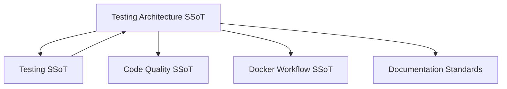
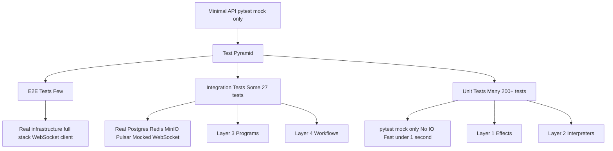

# Testing Architecture

**Status**: Authoritative source
**Supersedes**: none
**Referenced by**: engineering/README.md, testing.md, code_quality.md

> **Purpose**: Single Source of Truth for test organization, fixture architecture, and DRY patterns in Effectful.

## SSoT Link Map



| Need                             | Link                                                     |
| -------------------------------- | -------------------------------------------------------- |
| Test execution and patterns      | [Testing](testing.md)                                    |
| Type safety driving test shape   | [Code Quality](code_quality.md)                          |
| Docker-based testing environment | [Docker Workflow](docker_workflow.md)                    |
| Documentation standards          | [Documentation Standards](../documentation_standards.md) |

______________________________________________________________________

## Part 1: Test Suite Boundaries

Before executing any suite, run `docker compose -f docker/docker-compose.yml exec effectful poetry run check-code` to ensure code + documentation gates pass (formatter, linter, link/spell/custom doc checks, functional catalogue).

### Unit Tests (tests/unit/)

**Scope**: Test single functions or classes in isolation with no infrastructure dependencies.

**Characteristics**:

- No real infrastructure (no PostgreSQL, Redis, MinIO, Pulsar)
- Use pytest-mock exclusively (`mocker.AsyncMock(spec=Protocol)`)
- Fast (\<1 second total execution time)
- Many tests (200+)

**Fixture Strategy**:

- Mock all external dependencies
- Use `spec=` parameter for type safety
- Focus on logic correctness and Result types

**Example**: Testing an interpreter with mocked repository

```python
# file: tests/unit/test_interpreters/test_database.py
from pytest_mock import MockerFixture

@pytest.mark.asyncio
async def test_get_user_interpreter(mocker: MockerFixture) -> None:
    """Test DatabaseInterpreter.interpret() with mocked repository."""
    mock_repo = mocker.AsyncMock(spec=UserRepository)
    mock_repo.get_by_id.return_value = User(...)

    interpreter = DatabaseInterpreter(user_repo=mock_repo)
    result = await interpreter.interpret(GetUserById(...))

    assert_ok(result)
```

### Integration Tests (tests/integration/)

**Scope**: Test effects and interpreters against real infrastructure services running in Docker.

**Characteristics**:

- Real infrastructure (PostgreSQL, Redis, MinIO, Pulsar)
- Tests run inside Docker containers
- Medium speed (~1 second per test)
- Some tests (27+)

**Fixture Strategy**:

- Use `clean_*` fixtures that provide real infrastructure
- Pre and post cleanup for isolation
- Focus on infrastructure integration correctness

**Example**: Testing cache workflow with real Redis

```python
# file: tests/integration/test_cache_workflow.py
@pytest.mark.asyncio
async def test_cache_workflow(clean_redis: Redis) -> None:
    """Test cache workflow with real Redis instance."""
    # clean_redis fixture ensures clean state before test
    result = await cache.set("key", "value")
    assert_ok(result)
```

### E2E Tests (tests/e2e/ or demo/\*/tests/)

**Scope**: Test complete workflows end-to-end with full system integration.

**Characteristics**:

- Full stack (all infrastructure + application layer)
- Real data flows from start to finish
- Slow (multiple seconds per test)
- Few tests (focus on critical paths)

**Fixture Strategy**:

- Use `base_state` or `clean_<project>_state` fixtures
- Pre-loaded seed data for deterministic testing
- Minimal mocking (only external services)

**Example**: E2E test with seeded data

```python
# file: demo/healthhub/tests/pytest/e2e/test_patient_workflows.py
@pytest.mark.e2e
@pytest.mark.asyncio
async def test_patient_view_prescriptions(
    authenticated_patient_page: Page
) -> None:
    """Test patient viewing prescriptions (full workflow)."""
    # auto_clean_healthhub_state ensures Alice has Lisinopril prescription
    await page.goto("/prescriptions")
    prescriptions = page.locator('text=Lisinopril')
    assert await prescriptions.count() > 0
```

______________________________________________________________________

## Part 2: Fixture Architecture

### Fixture Organization Doctrine

**Rule**: All fixtures MUST be defined in `tests/fixtures/` and imported via root `conftest.py`.

**Directory Structure**:

```text
# tests directory layout
tests/
├── conftest.py          # Root: imports and re-exports all fixtures
├── fixtures/
│   ├── __init__.py
│   ├── base_state.py    # Cross-suite test data (ALICE, BOB, CHARLIE)
│   ├── database.py      # PostgreSQL fixtures
│   ├── cache.py         # Redis fixtures
│   ├── storage.py       # MinIO S3 fixtures
│   ├── messaging.py     # Pulsar fixtures
│   ├── auth.py          # Auth service fixtures
│   └── config.py        # Configuration constants
├── unit/
│   ├── conftest.py      # Suite-specific fixtures (optional)
│   └── test_*.py
├── integration/
│   ├── conftest.py      # Suite-specific fixtures (optional)
│   └── test_*.py
└── e2e/
    ├── conftest.py      # Suite-specific fixtures (optional)
    └── test_*.py
```

**Rationale**:

- **Single source of truth**: One place to find fixture definitions
- **Discoverability**: Pytest automatically finds fixtures in conftest.py
- **No duplication**: Fixtures defined once, used everywhere
- **Type safety**: Import statements enable IDE autocomplete

**Root conftest.py Pattern** (`tests/conftest.py`):

```python
# file: tests/conftest.py
"""Root pytest configuration for all tests.

Imports fixtures from tests/fixtures/ to make them available
to all test modules.
"""

# Import all fixtures from fixtures module
from tests.fixtures.database import clean_db, postgres_connection
from tests.fixtures.cache import clean_redis, redis_client
from tests.fixtures.storage import clean_minio, s3_bucket
from tests.fixtures.messaging import clean_pulsar, pulsar_client
from tests.fixtures.base_state import base_state, ALICE, BOB, CHARLIE

# Re-export all fixtures so pytest can discover them
__all__ = [
    "postgres_connection",
    "clean_db",
    "redis_client",
    "clean_redis",
    "s3_bucket",
    "clean_minio",
    "pulsar_client",
    "clean_pulsar",
    "base_state",
]
```

**Anti-pattern**: Defining fixtures in test files

```python
# file: tests/integration/test_cache.py
# ❌ WRONG - Fixture defined in test file
@pytest.fixture
def clean_redis():  # Duplicates central fixture, not discoverable
    ...
```

### Infrastructure Cleanup Patterns

**Core Principle**: Stateful infrastructure (PostgreSQL, Redis, MinIO, Pulsar) requires explicit cleanup between tests to prevent cascading failures.

#### Pattern 1: Pre and Post Cleanup

All `clean_*` fixtures must clean up **before AND after** the test runs:

```python
# file: examples/testing.py
import asyncio
from collections.abc import AsyncGenerator
import pytest_asyncio

@pytest_asyncio.fixture
async def clean_pulsar(
    pulsar_producer: PulsarMessageProducer,
    pulsar_consumer: PulsarMessageConsumer,
) -> AsyncGenerator[tuple[PulsarMessageProducer, PulsarMessageConsumer], None]:
    """Provide clean Pulsar producer and consumer.

    Closes all cached producers/consumers before AND after test.
    """
    # PRE-CLEANUP: Ensure clean starting state
    pulsar_producer.close_producers()
    pulsar_consumer.close_consumers()

    # Give broker time to process close operations
    await asyncio.sleep(0.2)  # 200ms for async broker operations

    yield (pulsar_producer, pulsar_consumer)

    # POST-CLEANUP: Prevent resource leaks on test failure
    try:
        pulsar_producer.close_producers()
        pulsar_consumer.close_consumers()
        await asyncio.sleep(0.2)  # Allow cleanup to propagate
    except Exception:
        # Ignore cleanup errors - isolation more important than cleanup failure
        pass
```

**Why Pre AND Post?**:

- **Pre-cleanup**: Guarantees clean state even if previous test failed
- **Post-cleanup**: Prevents leaked resources from failing subsequent tests
- **try/except**: Cleanup errors shouldn't mask test failures

#### Pattern 2: Async Sleep for Broker Operations

**Critical for Pulsar/Kafka/RabbitMQ**: Message brokers finalize operations asynchronously.

```python
# file: examples/testing.py
# Close resources
pulsar_producer.close_producers()

# REQUIRED: Give broker time to finalize
await asyncio.sleep(0.2)  # 200ms safety margin

# Now safe to create new resources
```

**Why**:

- Brokers need ~100ms to finalize ledger closures, topic deletions, subscription cleanup
- Without sleep: "Resource still in use" errors, quota exceeded, connection pool exhaustion
- 200ms is empirically tested safety margin (100ms min + 100ms buffer)

#### Pattern 3: Client-Level Cleanup (Not Server-Level)

**Correct**: Clean up at the **client adapter level** (close cached connections/producers/consumers)

```python
# file: examples/testing.py
# ✅ CORRECT - Client-level cleanup
pulsar_producer.close_producers()  # Closes cached producer objects
pulsar_consumer.close_consumers()  # Closes cached consumer objects
```

**Wrong**: Attempting to clean up at server level (delete topics/subscriptions)

```python
# file: examples/testing.py
# ❌ WRONG - Server-level cleanup is slow and unreliable
await pulsar_admin_client.delete_topic(topic)  # 500ms+ per topic
await pulsar_admin_client.delete_subscription(sub)  # Can fail if consumers exist
```

**Why Client-Level?**:

- **Fast**: Closing 100 producers takes \<50ms vs 50+ seconds to delete topics
- **Reliable**: Client cleanup always works; server cleanup has race conditions
- **Isolation**: UUID topic names ensure no conflicts, cleanup is optional

#### Pattern 4: UUID-Based Naming (Server Isolation)

**Always use UUID for topics, subscriptions, buckets, cache keys**:

```python
# file: examples/testing.py
from uuid import uuid4

def test_publish_workflow(clean_pulsar) -> None:
    """Each test uses unique topic names."""
    topic = f"test-topic-{uuid4()}"  # Unique topic name
    subscription = f"{topic}/test-sub-{uuid4()}"  # Unique subscription

    # Test code...
```

**Why**:

- **Broker-level isolation**: Tests can't conflict even if cleanup fails
- **Parallel execution**: Future support for parallel test runs
- **Debugging**: Easy to identify which test created which resources

#### Pattern 5: Reduced Timeouts for Fast Failures

**Use short timeouts in test environments** to detect issues quickly:

```python
# file: examples/testing.py
# Production: Long timeouts for reliability
producer = client.create_producer(topic, send_timeout_millis=30000)  # 30s

# Tests: Short timeouts for fast failure detection
producer = client.create_producer(topic, send_timeout_millis=5000)  # 5s
```

**Rationale**:

- **Fast feedback**: 5s timeout means test fails in 5s, not 30s
- **CI efficiency**: Full suite completes in \<15s instead of minutes
- **Early detection**: Timeout failures indicate infrastructure issues

### Infrastructure-Specific Cleanup Strategies

Each infrastructure service uses the most efficient cleanup operation for that service.

| Service    | Operation                        | Speed          | Rationale                                      |
| ---------- | -------------------------------- | -------------- | ---------------------------------------------- |
| PostgreSQL | `TRUNCATE TABLE ... CASCADE`     | Fast (10ms)    | O(1), handles FK constraints, resets sequences |
| Redis      | `FLUSHDB`                        | Instant (1ms)  | Deletes all keys, no tracking needed           |
| MinIO S3   | Delete all objects in bucket     | Medium (100ms) | Complete cleanup, bucket reuse                 |
| Pulsar     | Close cached producers/consumers | Fast (\<50ms)  | Client-level isolation                         |

#### PostgreSQL: TRUNCATE CASCADE Pattern

**Strategy**: Use `TRUNCATE TABLE ... CASCADE` for database cleanup instead of `DELETE`.

**Fixture implementation** (`tests/fixtures/database.py`):

```python
# file: examples/testing.py
@pytest_asyncio.fixture
async def clean_db(
    postgres_connection: asyncpg.Connection,
) -> AsyncGenerator[asyncpg.Connection, None]:
    """Provide a clean PostgreSQL database.

    Truncates all tables before yielding, ensuring test isolation.
    """
    await postgres_connection.execute("TRUNCATE TABLE chat_messages, users CASCADE")
    yield postgres_connection
```

**Why TRUNCATE instead of DELETE?**

| Operation        | Speed         | Auto-Increment Reset | Atomic | Handles FK Constraints   |
| ---------------- | ------------- | -------------------- | ------ | ------------------------ |
| TRUNCATE CASCADE | Fast (10ms)   | Yes                  | Yes    | Yes (CASCADE)            |
| DELETE           | Slow (100ms+) | No                   | No     | Requires manual ordering |

**TRUNCATE advantages**:

1. **Fast**: Single operation, no row-by-row processing
1. **Atomic**: Either all tables truncated or none (transactional)
1. **Resets sequences**: Auto-increment IDs start from 1 again
1. **CASCADE**: Automatically handles foreign key relationships

**Anti-pattern**: Using DELETE for cleanup:

```python
# file: examples/testing.py
# ❌ WRONG - Slow, doesn't reset sequences, manual FK ordering required
await conn.execute("DELETE FROM chat_messages")  # Must delete children first
await conn.execute("DELETE FROM users")  # Then parents
# Auto-increment sequences NOT reset!
```

#### Redis: FLUSHDB Pattern

**Strategy**: Use `FLUSHDB` to delete all keys in the current database.

**Fixture implementation** (`tests/fixtures/cache.py`):

```python
# file: examples/testing.py
@pytest_asyncio.fixture
async def clean_redis(
    redis_client: Redis,
) -> AsyncGenerator[Redis, None]:
    """Provide a clean Redis instance.

    Flushes database before AND after test.
    """
    # PRE-CLEANUP
    await redis_client.flushdb()

    yield redis_client

    # POST-CLEANUP
    try:
        await redis_client.flushdb()
    except Exception:
        pass  # Isolation more important than cleanup failure
```

**Why FLUSHDB?**:

- **Instant**: O(1) operation, ~1ms execution time
- **Complete**: Deletes all keys without tracking
- **Atomic**: All keys deleted in single operation
- **No race conditions**: Unlike key-by-key deletion

**Anti-pattern**: Manual key deletion:

```python
# file: examples/testing.py
# ❌ WRONG - Slow O(N), blocks Redis, requires tracking
keys = await redis.keys("*")  # O(N) operation, blocks server
for key in keys:
    await redis.delete(key)  # N round-trips
```

#### MinIO S3: Bucket Cleanup Pattern

**Strategy**: Delete all objects in test bucket, keep bucket for reuse.

**Fixture implementation** (`tests/fixtures/storage.py`):

```python
# file: examples/testing.py
@pytest_asyncio.fixture
async def clean_minio(
    s3_bucket: str,
    object_storage: ObjectStorage,
) -> AsyncGenerator[str, None]:
    """Provide clean S3 bucket.

    Deletes all objects before AND after test.
    """
    # PRE-CLEANUP: Delete all objects
    objects = await object_storage.list_objects(s3_bucket)
    for obj in objects:
        await object_storage.delete_object(s3_bucket, obj.key)

    yield s3_bucket

    # POST-CLEANUP
    try:
        objects = await object_storage.list_objects(s3_bucket)
        for obj in objects:
            await object_storage.delete_object(s3_bucket, obj.key)
    except Exception:
        pass
```

**Why keep bucket?**:

- **Faster**: Deleting objects (100ms) faster than recreating bucket (500ms)
- **Simpler**: No bucket name conflicts
- **Consistent**: Same bucket name across all tests

#### Pulsar: Client-Level Cleanup Pattern

**Strategy**: Close cached producers and consumers at client adapter level.

**Fixture implementation** (`tests/fixtures/messaging.py`):

```python
# file: examples/testing.py
@pytest_asyncio.fixture
async def clean_pulsar(
    pulsar_producer: PulsarMessageProducer,
    pulsar_consumer: PulsarMessageConsumer,
) -> AsyncGenerator[tuple[PulsarMessageProducer, PulsarMessageConsumer], None]:
    """Provide clean Pulsar clients.

    Closes all cached producers/consumers before AND after test.
    """
    # PRE-CLEANUP
    pulsar_producer.close_producers()
    pulsar_consumer.close_consumers()
    await asyncio.sleep(0.2)  # Allow broker to finalize

    yield (pulsar_producer, pulsar_consumer)

    # POST-CLEANUP
    try:
        pulsar_producer.close_producers()
        pulsar_consumer.close_consumers()
        await asyncio.sleep(0.2)
    except Exception:
        pass
```

**Why client-level?**:

- **Fast**: \<50ms for 100 producers
- **Reliable**: No race conditions
- **Isolation**: UUID topic names prevent conflicts

______________________________________________________________________

## Part 3: Four-Layer Testing Architecture

### Test Pyramid



| Layer       | Count       | Speed        | Infrastructure              |
| ----------- | ----------- | ------------ | --------------------------- |
| Unit        | Many (200+) | Fast (\<1s)  | pytest-mock only            |
| Integration | Some (27+)  | Medium (~1s) | Real PostgreSQL/Redis/MinIO |
| E2E/Demo    | Few         | Slow         | Full stack                  |

### Architecture Layers

**Each layer tests ONE concern**:

- **Effects** = **WHAT** to do (pure data)
- **Interpreters** = **HOW** to do it (execution)
- **Programs** = **WHEN** to do it (sequencing)
- **Workflows** = **WHY** to do it (business scenarios)

**Testability**: Each layer can be tested independently:

- **Effects**: No dependencies, just dataclass validation
- **Interpreters**: Mock infrastructure, focus on execution logic
- **Programs**: Mock effect results, focus on sequencing
- **Workflows**: Real interpreters + real infrastructure, focus on integration

### Layer 1: Effect Tests (Unit)

**Location**: `tests/unit/test_effects/`

**Purpose**: Validate effect dataclass structure, immutability, and type safety.

**Pattern**: Simple instantiation and assertion.

```python
# file: tests/unit/test_effects/test_database.py
from effectful.effects.database import GetUserById

def test_get_user_by_id_structure() -> None:
    """Effect should be immutable with correct fields."""
    effect = GetUserById(user_id=uuid4())

    assert isinstance(effect, GetUserById)
    assert effect.user_id is not None

    # Verify immutability
    with pytest.raises(FrozenInstanceError):
        effect.user_id = uuid4()
```

**When to use**: Testing effect dataclass definitions.

**Do NOT**: Use interpreters or generators in effect tests.

### Layer 2: Interpreter Tests (Unit)

**Location**: `tests/unit/test_interpreters/`

**Purpose**: Test effect execution against mocked infrastructure. Verify Result types, error handling, and retryability.

**Pattern**: Direct interpreter method calls with pytest-mock.

```python
# file: tests/unit/test_interpreters/test_database.py
from pytest_mock import MockerFixture
from effectful.interpreters.database import DatabaseInterpreter
from effectful.infrastructure.repositories import UserRepository

@pytest.mark.asyncio
async def test_get_user_by_id_success(mocker: MockerFixture) -> None:
    """GetUserById with existing user should return Ok(EffectReturn(user))."""
    # Arrange - Mock infrastructure
    user = User(id=uuid4(), email="alice@example.com", name="Alice")
    mock_repo = mocker.AsyncMock(spec=UserRepository)
    mock_repo.get_by_id.return_value = user

    interpreter = DatabaseInterpreter(user_repo=mock_repo)
    effect = GetUserById(user_id=user.id)

    # Act
    result = await interpreter.interpret(effect)

    # Assert - Pattern match on Result
    match result:
        case Ok(EffectReturn(value=returned_user, effect_name="GetUserById")):
            assert returned_user == user
        case _:
            pytest.fail(f"Expected Ok(EffectReturn(user)), got {result}")

    # Verify mock interactions
    mock_repo.get_by_id.assert_awaited_once_with(user.id)
```

**Key points**:

- Use `mocker.AsyncMock(spec=Protocol)` for type safety
- Test both success (`Ok`) and error (`Err`) paths
- Verify retryability for errors
- Use pattern matching for Result validation
- Assert mock call counts and arguments

**When to use**: Testing individual interpreter implementations.

**Do NOT**: Use generators or run_ws_program in interpreter tests.

### Layer 3: Program Tests (Unit)

**Location**: `tests/unit/test_programs/`

**Purpose**: Test program logic (effect sequencing, data transformations, conditional flows) in isolation.

**Pattern**: Manual generator stepping with `next()` and `gen.send()`.

```python
# file: tests/unit/test_programs/test_user_programs.py
from demo.programs.user_programs import get_user_program

def test_get_user_program_success(mocker: MockerFixture) -> None:
    """Program should yield GetUserById and return Ok(user)."""
    # Arrange
    user_id = uuid4()
    user = User(id=user_id, email="alice@example.com", name="Alice")

    # Act - Step through program
    gen = get_user_program(user_id=user_id)

    # Step 1: Program yields GetUserById effect
    effect = next(gen)
    assert effect.__class__.__name__ == "GetUserById"
    assert effect.user_id == user_id

    # Step 2: Send mock user result, program completes
    try:
        gen.send(user)
        pytest.fail("Expected StopIteration")
    except StopIteration as e:
        result = e.value

    # Assert final result
    match result:
        case Ok(returned_user):
            assert returned_user == user
        case _:
            pytest.fail(f"Expected Ok(user), got {result}")
```

**Key points**:

- Programs are generators: use `next(gen)` to get next effect
- Use `gen.send(value)` to provide mock results
- Catch `StopIteration` to extract final return value
- Test effect sequencing and conditional logic
- NO interpreters - we're testing program logic only

**When to use**: Testing program business logic without infrastructure.

**Do NOT**: Use interpreters or run_ws_program in program tests.

### Layer 4: Workflow Tests (Integration)

**Location**: `tests/integration/`

**Purpose**: Test complete end-to-end workflows with interpreters executing against real infrastructure.

**Pattern**: `run_ws_program()` with real infrastructure.

```python
# file: tests/integration/test_database_workflow.py
from effectful.programs.runners import run_ws_program
from effectful.interpreters.composite import CompositeInterpreter

@pytest.mark.asyncio
async def test_complete_database_workflow(clean_db: asyncpg.Connection) -> None:
    """Complete workflow: insert user, get user, verify result."""
    # Arrange - Create real interpreter with real infrastructure
    db_interpreter = DatabaseInterpreter(conn=clean_db)
    interpreter = CompositeInterpreter(interpreters=[db_interpreter])

    # Define workflow program
    def user_workflow() -> Generator[AllEffects, EffectResult, User]:
        """Insert user then retrieve it."""
        user_id = uuid4()

        # Insert user
        insert_result = yield InsertUser(
            user_id=user_id,
            email="alice@example.com",
            name="Alice"
        )
        assert isinstance(insert_result, User)

        # Get user back
        get_result = yield GetUserById(user_id=user_id)
        assert isinstance(get_result, User)

        return get_result

    # Act - Run complete workflow
    result = await run_ws_program(user_workflow(), interpreter)

    # Assert - Verify final result
    match result:
        case Ok(final_user):
            assert final_user.email == "alice@example.com"
        case Err(error):
            pytest.fail(f"Expected Ok(user), got Err({error})")
```

**Key points**:

- Use `run_ws_program(program(), interpreter)` - it handles all generator iteration
- Create interpreters with real infrastructure (via fixtures)
- Test complete multi-effect workflows
- Test both success and error propagation paths

**When to use**: Testing complete business scenarios that compose multiple effects.

**Do NOT**: Manually step through generators (no `next()`/`gen.send()`) - let `run_ws_program` do it.

______________________________________________________________________

## Part 4: Test Terseness Doctrine

**Core Philosophy**: Make individual tests as terse as possible by systematically eliminating verbatim repetitions through fixture-based abstraction and pytest idioms.

This section presents:

1. **Meta-Principle**: The "why" of test terseness (goal-setting)
1. **Implementation Tactics**: The "how" of achieving terseness (5 tactics)
1. **Anti-Patterns**: The "what not to do" (5 common mistakes)

### Meta-Principle: Test Terseness Through Systematic DRY

**Primary Goal**: Individual tests should be as terse as possible by systematically eliminating all verbatim repetitions across all test suites.

**Core Philosophy**: Tests should read like specifications, not implementations. Setup, infrastructure, and boilerplate belong in fixtures and shared data; test functions should contain ONLY the logic unique to that test case.

**Why Terseness Matters**:

1. **Readability**: Shorter tests are easier to understand at a glance
1. **Maintainability**: Less code means fewer places to update when requirements change
1. **Focus**: Removes noise, highlights exactly what's being tested
1. **Velocity**: Faster to write new tests by reusing well-crafted fixtures

**Systematic Application**: Apply these tactics in order as a checklist:

1. **Tactic 1 (Fixture-Level DRY)**: Infrastructure setup/cleanup → centralized fixture
1. **Tactic 2 (Test-Level DRY)**: Repeated setup within file → local fixture
1. **Tactic 3 (Suite-Level DRY)**: Repeated setup across files in suite → suite conftest.py
1. **Tactic 4 (Cross-Suite DRY)**: Repeated data across all suites → tests/fixtures/base_state.py
1. **Tactic 5 (Pytest Idiom DRY)**: Repeated test logic → parametrize, factories, autouse

**Example: Terse vs Verbose Test**

Verbose test with inline setup (45 lines):

```python
# file: tests/integration/test_cache_workflow.py
# ❌ VERBOSE - Setup repeated in every test
@pytest.mark.asyncio
async def test_put_profile_workflow(clean_redis: Redis, mocker: MockerFixture) -> None:
    """Test cache put workflow."""
    # 9 lines of setup boilerplate (repeated 10+ times across file)
    mock_ws = mocker.AsyncMock(spec=WebSocketConnection)
    mock_ws.is_open.return_value = True
    mock_user_repo = mocker.AsyncMock(spec=UserRepository)
    mock_msg_repo = mocker.AsyncMock(spec=ChatMessageRepository)

    interpreter = create_composite_interpreter(
        websocket_connection=mock_ws,
        user_repo=mock_user_repo,
        message_repo=mock_msg_repo,
        cache=RedisProfileCache(clean_redis),
    )

    # Actual test logic (16 lines)
    user_id = uuid4()
    profile = ProfileData(id=str(user_id), name="Alice")

    def put_profile_program(uid: UUID, prof: ProfileData):
        yield PutCachedProfile(user_id=uid, profile_data=prof, ttl_seconds=300)
        yield SendText(text="Profile cached")
        return "done"

    result = await run_ws_program(put_profile_program(user_id, profile), interpreter)

    match result:
        case Ok(value):
            assert value == "done"
            mock_ws.send_text.assert_called_once_with("Profile cached")
        case Err(error):
            pytest.fail(f"Expected Ok, got Err({error})")
```

Terse test with fixture (18 lines):

```python
# file: tests/integration/test_cache_workflow.py
# ✅ TERSE - Setup in fixture, only test logic here
@pytest.mark.asyncio
async def test_put_profile_workflow(
    interpreter_with_redis: tuple[CompositeInterpreter, AsyncMock],
) -> None:
    """Test cache put workflow."""
    interpreter, mock_ws = interpreter_with_redis  # 0 lines setup boilerplate

    # Test logic starts immediately (16 lines - same as before)
    user_id = uuid4()
    profile = ProfileData(id=str(user_id), name="Alice")

    def put_profile_program(uid: UUID, prof: ProfileData):
        yield PutCachedProfile(user_id=uid, profile_data=prof, ttl_seconds=300)
        yield SendText(text="Profile cached")
        return "done"

    result = await run_ws_program(put_profile_program(user_id, profile), interpreter)

    match result:
        case Ok(value):
            assert value == "done"
            mock_ws.send_text.assert_called_once_with("Profile cached")
        case Err(error):
            pytest.fail(f"Expected Ok, got Err({error})")
```

**Terseness improvement**: 45 lines → 18 lines (60% reduction), with setup boilerplate moved to reusable fixture.

**Measurement**: Track these metrics to validate terseness improvements:

- Lines of code per test function
- Number of fixture reuses across test suite
- Percentage of tests using parametrize for similar cases
- Ratio of test logic to setup code (target: 100% logic, 0% setup)

**See Also**: Implementation Tactics 1-5 below for detailed patterns and rationale.

______________________________________________________________________

### Implementation Tactics

### Tactic 1: Fixture-Level DRY (Infrastructure)

> **Meta-Goal**: See [Meta-Principle: Test Terseness Through Systematic DRY](#meta-principle-test-terseness-through-systematic-dry) for how this tactic contributes to overall test terseness.

**Core Principle**: Test isolation and reproducibility should be enforced at the **fixture level** with a single idempotent base state across **all microservices**, rather than scattered across individual test files.

**Problem**: Without centralized isolation, every test file must implement its own cleanup logic, leading to:

- **Code duplication**: Same cleanup code copied across 10+ test files
- **Inconsistent state**: Tests may start with different base states
- **Maintenance burden**: Changing cleanup logic requires updating many files
- **Hard-to-debug failures**: Flaky tests from incomplete cleanup

**Solution**: Single `clean_<project>_state` fixture that resets ALL infrastructure to idempotent base state.

**Benefits**:

1. **DRY**: One fixture, not 10+ cleanup implementations
1. **Idempotent**: Every test starts with identical state
1. **Maintainable**: Change cleanup logic in one place
1. **Debuggable**: Consistent state makes failures reproducible
1. **Fast**: Pre-loaded seed data faster than per-test inserts
1. **Comprehensive**: Resets ALL infrastructure, not just database

**Pattern**: Centralized state fixture

```python
# file: demo/healthhub/tests/conftest.py
@pytest.fixture
async def clean_healthhub_state(
    db_pool: asyncpg.Pool,
) -> AsyncIterator[None]:
    """Fixture-level isolation: Idempotent base state across all microservices.

    Ensures every test starts with the SAME deterministic state by:
    1. Truncating all PostgreSQL tables
    2. Loading seed_data.sql (2 admins, 4 doctors, 5 patients)
    3. Clearing all Redis keys
    """
    # 1. Clean PostgreSQL
    async with db_pool.acquire() as conn:
        await conn.execute("TRUNCATE TABLE users CASCADE")
        # ... other tables

    # 2. Load deterministic seed data
    import subprocess
    seed_file = Path(__file__).parent.parent / "scripts" / "seed_data.sql"
    subprocess.run(["psql", "-f", str(seed_file)], ...)

    # 3. Clean Redis
    await redis_client.flushdb()

    yield
```

**Anti-pattern**: Per-test cleanup

```python
# file: tests/e2e/test_chat_application.py
# ❌ WRONG - Each test does its own cleanup (duplicated 10+ times)
async def test_chat_application_flow(clean_db):
    await clean_db.execute("DELETE FROM users")  # Duplicated
    await clean_db.execute("INSERT INTO users ...")  # Duplicated
    # ... test logic
```

**Pattern**: Interpreter fixture for integration tests

**Problem identified in**: `tests/integration/test_cache_workflow.py`

Every integration test repeats this 9-line interpreter setup:

```python
# file: tests/integration/test_cache_workflow.py (lines 50-60, 104-114, etc.)
mock_ws = mocker.AsyncMock(spec=WebSocketConnection)
mock_ws.is_open.return_value = True
mock_user_repo = mocker.AsyncMock(spec=UserRepository)
mock_msg_repo = mocker.AsyncMock(spec=ChatMessageRepository)

interpreter = create_composite_interpreter(
    websocket_connection=mock_ws,
    user_repo=mock_user_repo,
    message_repo=mock_msg_repo,
    cache=RedisProfileCache(clean_redis),
)
```

This pattern is duplicated in:

- `test_put_and_get_profile_workflow` (lines 50-60)
- `test_cache_miss_workflow` (lines 104-114)
- `test_cache_with_database_fallback_workflow` (lines 160-167)
- Similar repetition across `test_database_workflow.py`, `test_messaging_workflow.py`

**Impact**: 9 lines × ~30 integration tests = ~270 lines of boilerplate

**Solution**: Suite-level fixture in `tests/integration/conftest.py`

```python
# file: tests/integration/conftest.py
@pytest.fixture
def mock_interpreter_deps(mocker: MockerFixture) -> dict[str, object]:
    """Provide mocked dependencies for composite interpreter."""
    mock_ws = mocker.AsyncMock(spec=WebSocketConnection)
    mock_ws.is_open.return_value = True

    return {
        "websocket_connection": mock_ws,
        "user_repo": mocker.AsyncMock(spec=UserRepository),
        "message_repo": mocker.AsyncMock(spec=ChatMessageRepository),
    }

@pytest.fixture
def interpreter_with_redis(
    mock_interpreter_deps: dict[str, object],
    clean_redis: Redis,
) -> tuple[CompositeInterpreter, AsyncMock]:
    """Provide interpreter with real Redis cache and mocked other deps."""
    interpreter = create_composite_interpreter(
        **mock_interpreter_deps,
        cache=RedisProfileCache(clean_redis),
    )
    return interpreter, mock_interpreter_deps["websocket_connection"]
```

**After**: Each test becomes terse

```python
# file: tests/integration/test_cache_workflow.py
@pytest.mark.asyncio
async def test_put_and_get_profile_workflow(
    interpreter_with_redis: tuple[CompositeInterpreter, AsyncMock],
) -> None:
    """Workflow stores and retrieves profile from real Redis."""
    interpreter, mock_ws = interpreter_with_redis

    user_id = uuid4()
    profile = ProfileData(id=str(user_id), name="Alice")

    # Test logic starts immediately - no setup boilerplate
    def put_get_profile_program(uid: UUID, prof: ProfileData):
        yield PutCachedProfile(user_id=uid, profile_data=prof, ttl_seconds=300)
        cached = yield GetCachedProfile(user_id=uid)
        match cached:
            case ProfileData() as cached_profile:
                yield SendText(text=f"Retrieved: {cached_profile.name}")
                return cached_profile.name
            case CacheMiss():
                return "miss"

    result = await run_ws_program(put_get_profile_program(user_id, profile), interpreter)

    match result:
        case Ok(name):
            assert name == "Alice"
            mock_ws.send_text.assert_called_once_with("Retrieved: Alice")
        case Err(error):
            pytest.fail(f"Expected Ok, got Err({error})")
```

**Terseness improvement**:

- Before: 25 lines per test (9 lines setup + 16 lines logic)
- After: 16 lines per test (0 lines setup + 16 lines logic)
- Reduction: 36% fewer lines per test

**See Also**:

- [Testing - Pattern 6: Fixture-Level Isolation](testing.md#pattern-6-fixture-level-isolation-dry-doctrine) for complete implementation example

### Tactic 2: Test-Level DRY (Within Single File)

> **Meta-Goal**: See [Meta-Principle: Test Terseness Through Systematic DRY](#meta-principle-test-terseness-through-systematic-dry) for how this tactic contributes to overall test terseness.

**Core Principle**: Use fixtures instead of repeating setup code within each test in the same file.

**Problem**: Tests in the same file often need the same setup data, leading to verbatim repetition.

**Solution**: Extract common setup to module-scoped or function-scoped fixtures.

**Pattern**: Fixture-based setup

```python
# file: tests/integration/test_cache_workflow.py
@pytest.fixture
def alice_user() -> User:
    """Provide Alice user for cache tests."""
    return User(
        id=UUID("11111111-1111-1111-1111-111111111111"),
        email="alice@example.com",
        name="Alice"
    )

@pytest.mark.asyncio
async def test_cache_put_workflow(alice_user: User, clean_redis: Redis):
    """Test cache put with Alice."""
    # No setup duplication - alice_user fixture provides it
    result = await cache.put(alice_user.id, alice_user)
    assert_ok(result)

@pytest.mark.asyncio
async def test_cache_get_workflow(alice_user: User, clean_redis: Redis):
    """Test cache get with Alice."""
    # Same alice_user fixture, zero duplication
    await cache.put(alice_user.id, alice_user)
    result = await cache.get(alice_user.id)
    assert_ok_value(result, alice_user)
```

**Anti-pattern**: Repeated setup

```python
# file: tests/integration/test_cache_workflow.py
# ❌ WRONG - Repeated user creation
@pytest.mark.asyncio
async def test_cache_put_workflow():
    user = User(id=UUID("111..."), email="alice@example.com", name="Alice")  # DUPLICATED
    result = await cache.put(user.id, user)
    assert_ok(result)

@pytest.mark.asyncio
async def test_cache_get_workflow():
    user = User(id=UUID("111..."), email="alice@example.com", name="Alice")  # DUPLICATED
    await cache.put(user.id, user)
    result = await cache.get(user.id)
    assert_ok(result)
```

**Rationale**:

- Fixtures ensure consistent test data
- Changes to setup logic happen in one place
- Tests focus on behavior, not setup
- Type hints enable IDE autocomplete

### Tactic 3: Suite-Level DRY (Within unit OR integration OR e2e)

> **Meta-Goal**: See [Meta-Principle: Test Terseness Through Systematic DRY](#meta-principle-test-terseness-through-systematic-dry) for how this tactic contributes to overall test terseness.

**Core Principle**: Centralize fixtures used across multiple files in the same test suite using suite-specific `conftest.py`.

**Problem**: Multiple test files in the same suite (e.g., all integration tests) need the same fixtures, leading to duplication across files.

**Solution**: Define suite-specific fixtures in `tests/<suite>/conftest.py`.

**Pattern**: Suite-specific conftest

```python
# file: tests/integration/conftest.py
"""Fixtures specific to integration tests."""

import pytest
from effectful.interpreters.composite import CompositeInterpreter

@pytest.fixture
def integration_interpreter(
    clean_db: asyncpg.Connection,
    clean_redis: Redis,
    clean_minio: str,
) -> CompositeInterpreter:
    """Provide composite interpreter with real infrastructure for integration tests.

    This fixture is available to ALL integration tests but NOT unit or e2e tests.
    """
    db_interpreter = DatabaseInterpreter(conn=clean_db)
    cache_interpreter = CacheInterpreter(redis=clean_redis)
    storage_interpreter = StorageInterpreter(bucket=clean_minio)

    return CompositeInterpreter(interpreters=[
        db_interpreter,
        cache_interpreter,
        storage_interpreter,
    ])
```

**Usage across multiple integration test files**:

```python
# file: tests/integration/test_system_workflow.py
@pytest.mark.asyncio
async def test_system_workflow(integration_interpreter: CompositeInterpreter):
    """Test system workflow with real infrastructure."""
    result = await run_ws_program(system_program(), integration_interpreter)
    assert_ok(result)

# file: tests/integration/test_cache_workflow.py
@pytest.mark.asyncio
async def test_cache_workflow(integration_interpreter: CompositeInterpreter):
    """Test cache workflow with real infrastructure."""
    result = await run_ws_program(cache_program(), integration_interpreter)
    assert_ok(result)
```

**Anti-pattern**: Duplicating fixtures across test files

```python
# file: tests/integration/test_system_workflow.py
# ❌ WRONG - Fixture duplicated in multiple files
@pytest.fixture
def integration_interpreter(...):  # DUPLICATED
    return CompositeInterpreter(...)

# file: tests/integration/test_cache_workflow.py
# ❌ WRONG - Same fixture duplicated again
@pytest.fixture
def integration_interpreter(...):  # DUPLICATED
    return CompositeInterpreter(...)
```

**Rationale**:

- Suite-specific fixtures stay within their test suite
- Clear ownership: integration tests own integration fixtures
- No cross-suite pollution: unit tests can't accidentally use integration fixtures

### Tactic 4: Cross-Suite DRY (Across unit AND integration AND e2e)

> **Meta-Goal**: See [Meta-Principle: Test Terseness Through Systematic DRY](#meta-principle-test-terseness-through-systematic-dry) for how this tactic contributes to overall test terseness.

**Core Principle**: Share common test data across ALL test suites via `tests/fixtures/base_state.py`.

**Problem**: Different test suites (unit, integration, e2e) define different versions of "Alice", "Bob", etc., leading to inconsistent test data and duplication.

**Solution**: Define standard test entities with fixed UUIDs in `tests/fixtures/base_state.py`, import everywhere.

**Pattern**: Shared test data module (`tests/fixtures/base_state.py`):

```python
# file: tests/fixtures/base_state.py
"""Standard test users - shared across ALL test suites."""

from uuid import UUID
from effectful.domain.user import User

# Fixed UUIDs for deterministic testing
ALICE_ID = UUID("11111111-1111-1111-1111-111111111111")
BOB_ID = UUID("22222222-2222-2222-2222-222222222222")
CHARLIE_ID = UUID("33333333-3333-3333-3333-333333333333")

# Standard test users
ALICE = User(id=ALICE_ID, email="alice@example.com", name="Alice")
BOB = User(id=BOB_ID, email="bob@example.com", name="Bob")
CHARLIE = User(id=CHARLIE_ID, email="charlie@example.com", name="Charlie")
```

**Usage across ALL test suites**:

```python
# file: tests/unit/test_domain/test_user.py
from tests.fixtures.base_state import ALICE, ALICE_ID

def test_user_validation():
    """Unit test using shared ALICE."""
    assert ALICE.email == "alice@example.com"
    assert ALICE.id == ALICE_ID

# file: tests/integration/test_database_workflow.py
from tests.fixtures.base_state import ALICE

@pytest.mark.asyncio
async def test_insert_user(clean_db: asyncpg.Connection):
    """Integration test using same ALICE."""
    await clean_db.execute(
        "INSERT INTO users (id, email, name) VALUES ($1, $2, $3)",
        ALICE.id, ALICE.email, ALICE.name
    )

# file: tests/e2e/test_chat_application.py
from tests.fixtures.base_state import ALICE

@pytest.mark.e2e
async def test_user_login(base_state: dict):
    """E2E test using same ALICE."""
    # Alice exists in seeded database with ALICE_ID
    response = await login(ALICE.email, "password123")
    assert response.user_id == ALICE.id
```

**Benefits**:

- **Consistency**: Same "Alice" everywhere (same ID, email, name)
- **Deterministic**: Fixed UUIDs enable predictable testing
- **DRY**: One definition, used in 200+ tests
- **Debuggable**: Logs showing "11111111-1111-1111-1111-111111111111" immediately identify Alice

**Anti-pattern**: Different "Alice" in each suite

```python
# file: tests/unit/test_domain.py
# ❌ WRONG - Unit tests define their own Alice
ALICE = User(id=uuid4(), email="alice@test.com", name="Alice")  # Different ID!

# file: tests/integration/test_database.py
# ❌ WRONG - Integration tests define different Alice
ALICE = User(id=uuid4(), email="alice@example.com", name="Alice Smith")  # Different again!

# file: tests/e2e/test_chat_application.py
# ❌ WRONG - E2E tests define yet another Alice
ALICE = User(id=UUID("22222..."), email="alice@healthhub.com", name="Alice")  # Different again!
```

**See Also**:

- `tests/fixtures/base_state.py` - Complete implementation with password hashes

### Tactic 5: Pytest Idiom DRY (Terseness Through Tools)

> **Meta-Goal**: See [Meta-Principle: Test Terseness Through Systematic DRY](#meta-principle-test-terseness-through-systematic-dry) for how this tactic contributes to overall test terseness.

**Core Principle**: Use pytest's built-in features (`@pytest.mark.parametrize`, fixture factories, autouse fixtures) to eliminate test duplication.

**Problem**: Tests that differ only in input data lead to copy-paste test functions.

**Solution**: Use parametrization and fixture composition.

#### Pattern 5a: Parametrize Instead of Copy-Paste

**Pattern**: Parametrized tests

```python
# file: tests/unit/test_validation.py
@pytest.mark.parametrize("email,expected_valid", [
    ("alice@example.com", True),
    ("bob@example.com", True),
    ("invalid-email", False),
    ("@example.com", False),
    ("user@", False),
])
def test_email_validation(email: str, expected_valid: bool):
    """Test email validation with multiple inputs."""
    result = validate_email(email)
    assert result.is_valid == expected_valid
```

**Anti-pattern**: Copy-paste tests

```python
# file: tests/unit/test_validation.py
# ❌ WRONG - Duplicated test logic
def test_email_validation_alice():
    result = validate_email("alice@example.com")
    assert result.is_valid is True

def test_email_validation_bob():
    result = validate_email("bob@example.com")  # ONLY EMAIL CHANGES
    assert result.is_valid is True

def test_email_validation_invalid_1():
    result = validate_email("invalid-email")  # ONLY EMAIL CHANGES
    assert result.is_valid is False

def test_email_validation_invalid_2():
    result = validate_email("@example.com")  # ONLY EMAIL CHANGES
    assert result.is_valid is False
```

**Benefits**:

- One test function instead of 5+
- Easy to add new test cases (one line)
- Clear test matrix
- Better test reports ("test_email_validation[alice@example.com-True]")

#### Pattern 5a Examples from Codebase

**Example 1: Immutability Tests**

**Problem identified in**: `tests/unit/test_domain/test_user.py`

Testing immutability of multiple fields requires separate test functions:

```python
# file: tests/unit/test_domain/test_user.py (lines 28-44)
# ❌ VERBOSE - Separate test per field (42 lines total)
def test_user_is_immutable() -> None:
    """User should be frozen (immutable)."""
    user = User(id=uuid4(), name="Alice", email="alice@example.com")
    with pytest.raises(FrozenInstanceError):
        setattr(user, "name", "Bob")

def test_user_id_is_immutable() -> None:
    """User id should be immutable."""
    user = User(id=uuid4(), name="Alice", email="alice@example.com")
    with pytest.raises(FrozenInstanceError):
        setattr(user, "id", uuid4())

def test_user_email_is_immutable() -> None:
    """User email should be immutable."""
    user = User(id=uuid4(), name="Alice", email="alice@example.com")
    with pytest.raises(FrozenInstanceError):
        setattr(user, "email", "bob@example.com")
```

**Solution**: Parametrize over field names

```python
# file: tests/unit/test_domain/test_user.py
# ✅ TERSE - Parametrized test (14 lines total)
@pytest.mark.parametrize(
    "field,new_value",
    [
        ("name", "Bob"),
        ("id", uuid4()),
        ("email", "bob@example.com"),
    ],
)
def test_user_fields_are_immutable(field: str, new_value: object) -> None:
    """User fields should be frozen (immutable)."""
    user = User(id=uuid4(), name="Alice", email="alice@example.com")
    with pytest.raises(FrozenInstanceError):
        setattr(user, field, new_value)
```

**Terseness improvement**: 42 lines → 14 lines (67% reduction)

**Example 2: Predicate Tests**

**Problem pattern**: Testing boolean predicates on ADTs requires separate test per case:

```python
# file: tests/unit/test_algebraic/test_result.py (lines 39-47, 129-137)
# ❌ VERBOSE - Separate test per predicate case
def test_ok_is_ok_returns_true(self) -> None:
    """Ok.is_ok() should return True."""
    result: Result[int, str] = Ok(42)
    assert result.is_ok() is True

def test_ok_is_err_returns_false(self) -> None:
    """Ok.is_err() should return False."""
    result: Result[int, str] = Ok(42)
    assert result.is_err() is False

def test_err_is_ok_returns_false(self) -> None:
    """Err.is_ok() should return False."""
    result: Result[int, str] = Err("error")
    assert result.is_ok() is False

def test_err_is_err_returns_true(self) -> None:
    """Err.is_err() should return True."""
    result: Result[int, str] = Err("error")
    assert result.is_err() is True
```

**Solution**: Parametrize over result type, predicate, and expected value

```python
# file: tests/unit/test_algebraic/test_result.py
# ✅ TERSE - Parametrized test
@pytest.mark.parametrize("result,predicate,expected", [
    (Ok(42), "is_ok", True),
    (Ok(42), "is_err", False),
    (Err("error"), "is_ok", False),
    (Err("error"), "is_err", True),
])
def test_result_predicates(result: Result, predicate: str, expected: bool) -> None:
    """Result predicates return correct boolean values."""
    assert getattr(result, predicate)() is expected
```

**Benefits demonstrated**:

- **DRY**: One test function instead of 4
- **Matrix clarity**: All test cases visible in parameter list
- **Easy extension**: Add new predicates by adding one line
- **Better reports**: pytest shows "test_result_predicates[Ok(42)-is_ok-True]"

#### Pattern 5b: Fixture Factories

**Pattern**: Factory fixtures for dynamic test data

```python
# file: tests/integration/conftest.py
@pytest.fixture
def make_user(clean_db: asyncpg.Connection):
    """Factory fixture that creates users on demand."""
    async def _make_user(email: str, name: str) -> User:
        user_id = uuid4()
        await clean_db.execute(
            "INSERT INTO users (id, email, name) VALUES ($1, $2, $3)",
            user_id, email, name
        )
        return User(id=user_id, email=email, name=name)

    return _make_user

@pytest.mark.asyncio
async def test_user_workflow(make_user):
    """Test workflow with dynamically created users."""
    alice = await make_user("alice@example.com", "Alice")
    bob = await make_user("bob@example.com", "Bob")

    # Test logic using alice and bob
    assert alice.email != bob.email
```

**Benefits**:

- Create test data as needed
- Avoid pre-seeding unused data
- Clear test data lifecycle

#### Pattern 5c: Autouse Fixtures

**Pattern**: Autouse for mandatory setup

```python
# file: demo/healthhub/tests/pytest/e2e/conftest.py
@pytest_asyncio.fixture(autouse=True)
async def auto_clean_healthhub_state(
    clean_healthhub_state: None,
) -> AsyncGenerator[None, None]:
    """Automatically apply clean_healthhub_state to ALL e2e tests.

    This autouse fixture ensures every e2e test starts with idempotent base state
    without requiring manual fixture injection in each test function signature.
    """
    yield
```

**Usage**: Tests automatically get clean state

```python
# file: demo/healthhub/tests/pytest/e2e/test_patient_workflows.py
@pytest.mark.e2e
async def test_patient_workflow():
    """Test patient workflow.

    Note: No clean_healthhub_state in signature - autouse fixture applies it automatically.
    """
    # Test starts with clean state automatically
    ...
```

**Benefits**:

- No manual fixture injection required
- Impossible to forget cleanup
- Clear: "all e2e tests get clean state"

**When to use autouse**:

- E2E tests: Always need full clean state
- Performance tests: Always need monitoring setup

**When NOT to use autouse**:

- Unit tests: No infrastructure needed
- Optional setup: Some tests need it, others don't

### DRY Anti-Patterns

#### Anti-Pattern 1: Inline Test Data

**Wrong**: Hardcoding test data directly in test functions

```python
# file: tests/integration/test_database_workflow.py
# ❌ WRONG - Hardcoded test data
@pytest.mark.asyncio
async def test_create_user():
    user = User(
        id=UUID("12345678-1234-1234-1234-123456789012"),
        email="test@example.com",
        name="Test User"
    )
    result = await create_user(user)
    assert_ok(result)
```

**Right**: Use shared test data from base_state.py

```python
# file: tests/integration/test_database_workflow.py
# ✅ CORRECT - Shared test data
from tests.fixtures.base_state import ALICE

@pytest.mark.asyncio
async def test_create_user():
    result = await create_user(ALICE)
    assert_ok(result)
```

#### Anti-Pattern 2: Fixture Duplication Across Suites

**Wrong**: Defining same fixture in multiple suite conftest.py files

```python
# file: tests/unit/conftest.py
# ❌ WRONG - Fixture duplicated
@pytest.fixture
def test_user():
    return User(id=uuid4(), email="test@example.com", name="Test")

# file: tests/integration/conftest.py
# ❌ WRONG - Same fixture duplicated
@pytest.fixture
def test_user():
    return User(id=uuid4(), email="test@example.com", name="Test")
```

**Right**: Define in root conftest.py or base_state.py

```python
# file: tests/fixtures/base_state.py
# ✅ CORRECT - Single definition
TEST_USER = User(
    id=UUID("99999999-9999-9999-9999-999999999999"),
    email="test@example.com",
    name="Test User"
)
```

#### Anti-Pattern 3: Copy-Paste Tests

**Wrong**: Duplicating entire test functions that differ only in data

```python
# file: tests/unit/test_cache.py
# ❌ WRONG - Copy-paste tests
async def test_cache_get_alice():
    result = await cache.get("alice@example.com")
    assert_ok(result)

async def test_cache_get_bob():
    result = await cache.get("bob@example.com")  # ONLY EMAIL CHANGES
    assert_ok(result)

async def test_cache_get_charlie():
    result = await cache.get("charlie@example.com")  # ONLY EMAIL CHANGES
    assert_ok(result)
```

**Right**: Parametrize the test

```python
# file: tests/unit/test_cache.py
# ✅ CORRECT - Parametrized
@pytest.mark.parametrize("email", [
    "alice@example.com",
    "bob@example.com",
    "charlie@example.com",
])
async def test_cache_get(email: str):
    result = await cache.get(email)
    assert_ok(result)
```

#### Anti-Pattern 4: Setup Repetition

**Wrong**: Repeating setup code in every test

```python
# file: tests/integration/test_database.py
# ❌ WRONG - Repeated setup
async def test_insert_user(clean_db):
    await clean_db.execute("TRUNCATE TABLE users CASCADE")  # REPEATED
    await clean_db.execute("INSERT INTO users ...")
    # Test logic

async def test_get_user(clean_db):
    await clean_db.execute("TRUNCATE TABLE users CASCADE")  # REPEATED
    await clean_db.execute("INSERT INTO users ...")
    # Test logic
```

**Right**: Setup in fixture

```python
# file: tests/integration/conftest.py
# ✅ CORRECT - Setup in fixture
@pytest_asyncio.fixture
async def seeded_db(clean_db):
    """Provide database with seeded users."""
    await clean_db.execute("INSERT INTO users ...")
    return clean_db

# file: tests/integration/test_database.py
async def test_insert_user(seeded_db):
    # No setup duplication - fixture handles it
    result = await get_user(ALICE_ID)
    assert_ok(result)

async def test_get_user(seeded_db):
    # Same seeded_db fixture, zero duplication
    result = await get_user(BOB_ID)
    assert_ok(result)
```

#### Anti-Pattern 5: Hardcoded UUIDs Per Test

**Wrong**: Random or hardcoded UUIDs in each test

```python
# file: tests/integration/test_system_workflow.py
# ❌ WRONG - Random UUIDs
async def test_system_workflow_1():
    user_id = uuid4()  # Random every run
    await insert_user(user_id, ...)

async def test_system_workflow_2():
    user_id = uuid4()  # Different random UUID
    await insert_user(user_id, ...)
```

**Right**: Use fixed UUIDs from base_state.py

```python
# file: tests/integration/test_system_workflow.py
# ✅ CORRECT - Fixed UUIDs
from tests.fixtures.base_state import ALICE_ID, BOB_ID

async def test_system_workflow_1():
    await insert_user(ALICE_ID, ...)

async def test_system_workflow_2():
    await insert_user(BOB_ID, ...)
```

______________________________________________________________________

## Part 5: Fixture Discovery and Imports

### Root conftest.py Pattern

**Purpose**: Make all fixtures discoverable to pytest without explicit imports in test files.

**Implementation** (`tests/conftest.py`):

```python
# file: tests/conftest.py
"""Root pytest configuration for all tests.

Imports fixtures from tests/fixtures/ to make them available
to all test modules.
"""

# Import all fixtures from fixtures module
from tests.fixtures.database import clean_db, postgres_connection
from tests.fixtures.cache import clean_redis, redis_client
from tests.fixtures.storage import clean_minio, s3_bucket
from tests.fixtures.messaging import clean_pulsar, pulsar_client
from tests.fixtures.base_state import base_state, ALICE, BOB, CHARLIE

# Re-export all fixtures so pytest can discover them
__all__ = [
    "postgres_connection",
    "clean_db",
    "redis_client",
    "clean_redis",
    "s3_bucket",
    "clean_minio",
    "pulsar_client",
    "clean_pulsar",
    "base_state",
]
```

### Fixture Visibility Rules

**Pytest fixture discovery hierarchy**:

1. **Test file itself**: Fixtures defined in the test file (discouraged)
1. **Suite conftest.py**: `tests/unit/conftest.py`, `tests/integration/conftest.py`, `tests/e2e/conftest.py`
1. **Root conftest.py**: `tests/conftest.py`
1. **Installed packages**: Fixtures from pytest plugins

**Visibility**:

- Root conftest.py fixtures: Available to ALL test files
- Suite conftest.py fixtures: Available only to that suite
- Test file fixtures: Available only to that file

**Example**:

```text
# fixture scoping examples
tests/
├── conftest.py                    # Fixtures available to ALL tests
├── fixtures/
│   └── base_state.py             # Imported by root conftest.py
├── unit/
│   ├── conftest.py               # Fixtures only for unit tests
│   └── test_domain.py            # Can use root + unit fixtures
└── integration/
    ├── conftest.py               # Fixtures only for integration tests
    └── test_database_workflow.py # Can use root + integration fixtures
```

### Import Patterns

**Pattern 1**: Import test data constants directly

```python
# file: tests/integration/test_database.py
from tests.fixtures.base_state import ALICE, ALICE_ID, BOB

@pytest.mark.asyncio
async def test_insert_users(clean_db):
    """Test inserting multiple users."""
    await clean_db.execute(
        "INSERT INTO users (id, email, name) VALUES ($1, $2, $3)",
        ALICE.id, ALICE.email, ALICE.name
    )
    await clean_db.execute(
        "INSERT INTO users (id, email, name) VALUES ($1, $2, $3)",
        BOB.id, BOB.email, BOB.name
    )
```

**Pattern 2**: Fixtures are auto-discovered (no import needed)

```python
# file: tests/integration/test_database.py
# No import needed for clean_db - pytest finds it via conftest.py

@pytest.mark.asyncio
async def test_truncate_users(clean_db):  # clean_db auto-discovered
    """Test database cleanup."""
    result = await clean_db.fetchval("SELECT COUNT(*) FROM users")
    assert result == 0  # clean_db fixture truncated the table
```

**Pattern 3**: Suite-specific fixtures

```python
# file: tests/integration/conftest.py
@pytest.fixture
def integration_interpreter(clean_db, clean_redis):
    """Integration-specific fixture."""
    return CompositeInterpreter(...)

# file: tests/integration/test_workflow.py
# No import needed - pytest finds integration_interpreter in suite conftest.py

@pytest.mark.asyncio
async def test_workflow(integration_interpreter):  # Auto-discovered
    result = await run_ws_program(program(), integration_interpreter)
    assert_ok(result)
```

______________________________________________________________________

## Cross-References

- [Testing SSoT](testing.md) - Test execution, patterns, anti-patterns, complete examples
- [Code Quality](code_quality.md) - Type safety and purity doctrines driving test shape
- [Docker Workflow](docker_workflow.md) - Container-based testing environment
- [Documentation Standards](../documentation_standards.md) - SSoT and DRY principles for documentation
