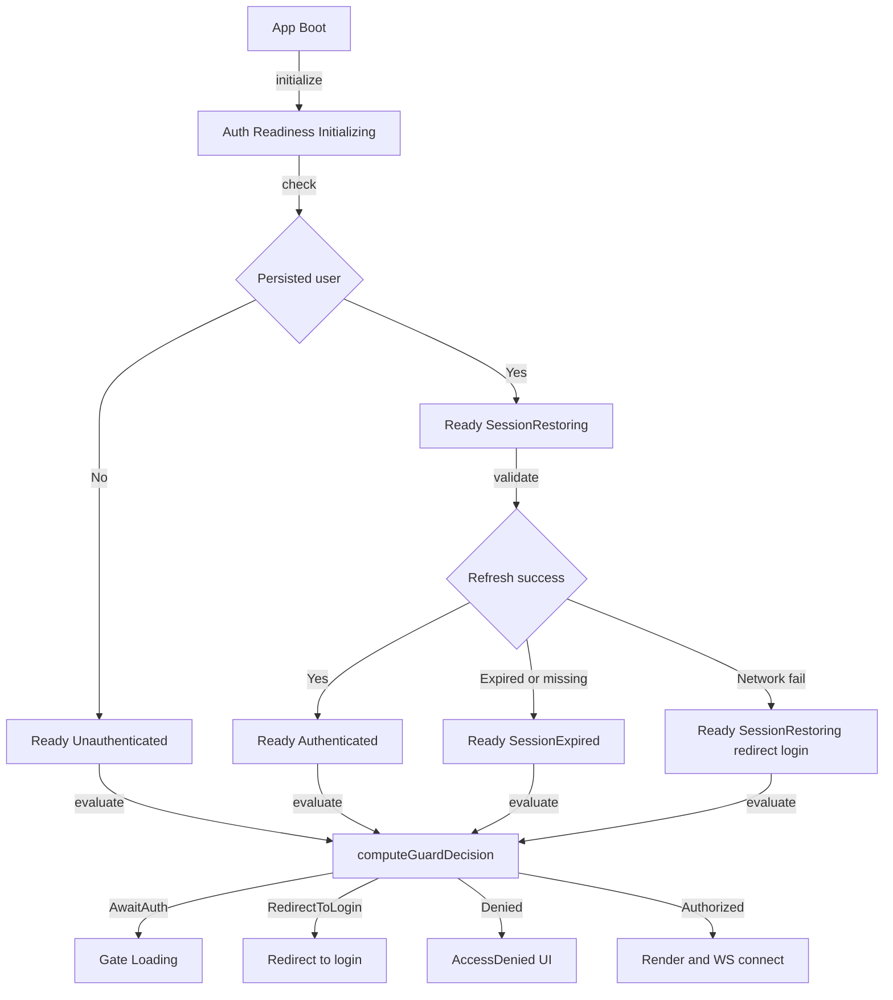
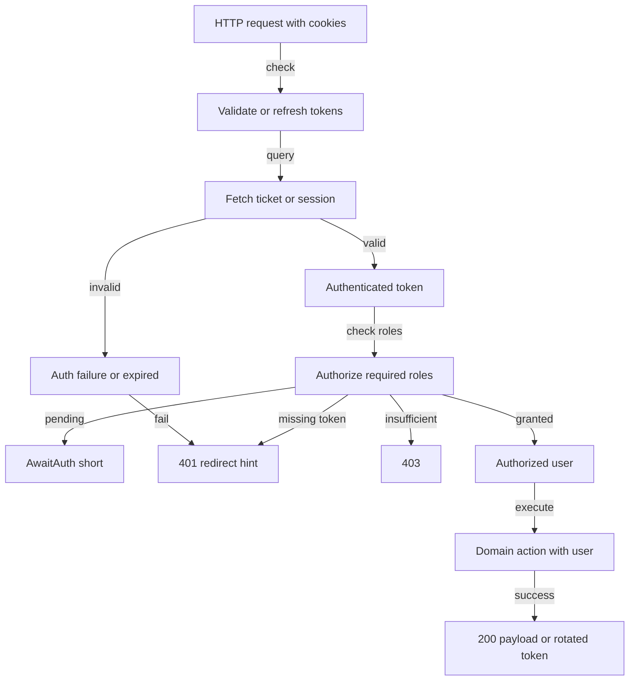

# Total Pure Modelling

**Status**: Authoritative source
**Supersedes**: none
**Referenced by**: [testing.md](testing.md#part-1-minimal-api-philosophy), [code_quality.md](code_quality.md), ../dsl/proof_boundary.md

> **Purpose**: A friendly, practical guide for modelling domain state with total, pure ADTs and state machines that match reality. Illegal states must be impossible to represent, and timing tricks or env toggles are off-limits. By separating pure decisions from side effects, we keep frontend and backend in lockstep, avoid ghost states, and stay resilient when real networks and devices misbehave.

## SSoT Link Map

| Need                      | Link                                                          |
| ------------------------- | ------------------------------------------------------------- |
| Boundary model            | [Boundary Model](boundary_model.md)                           |
| Testing standards         | [Testing](testing.md)                                         |
| Code quality              | [Code Quality](code_quality.md)                               |
| Authentication            | [Authentication](authentication.md)                           |
| Architecture              | [Architecture](architecture.md)                               |
| ADTs and Results tutorial | [ADTs and Results Tutorial](../tutorials/adts_and_results.md) |
| Effectful DSL             | [Effectful DSL Hub](../dsl/intro.md)                          |

______________________________________________________________________

## Relationship to Boundary Model

Total Pure Modelling (TPM) applies **within the purity boundary**. It is the discipline that makes the purity boundary meaningful:

```typescript
// diagram
┌─────────────────────────────────────────────────────────────────────────┐
│                       PURITY BOUNDARY                                    │
│                                                                          │
│  ┌─────────────────────────────────────────────────────────────────┐    │
│  │              TOTAL PURE MODELLING                                │    │
│  │  • Domain as pure mathematical state space                       │    │
│  │  • Events represent all possible inputs                          │    │
│  │  • Effects are pure data (not actions)                           │    │
│  │  • Step function is total (handles all cases)                    │    │
│  │  • Illegal states are unrepresentable                            │    │
│  └─────────────────────────────────────────────────────────────────┘    │
│                                                                          │
└─────────────────────────────────────────────────────────────────────────┘
```

### TPM as Purity Boundary Foundation

| TPM Principle                  | Boundary Implication                |
| ------------------------------ | ----------------------------------- |
| Pure state space               | All business logic is deterministic |
| Total step function            | No stuck states, no unhandled cases |
| Effects as data                | Clean handoff to proof boundary     |
| Illegal states unrepresentable | Type system prevents security bugs  |

### What TPM Enables

Within the purity boundary, TPM makes possible:

- **Formal verification**: TLA+ can check properties of total models
- **Exhaustive testing**: Property-based testing covers all states
- **LLM-friendly development**: Clear rules that LLMs can follow
- **Cross-platform consistency**: Frontend and backend share pure models

See [Boundary Model](boundary_model.md) for how TPM fits in the larger architecture.

______________________________________________________________________

## Why this exists

Pure modelling keeps the software and the real world in sync. When every legitimate state is explicit—and impossible states simply cannot be represented—we avoid whole classes of bugs: stuck spinners, ghost sessions, flaky tests, and security gaps from “truthy enough” checks. Without these guardrails, apps drift into partial states: a page shows “Welcome Alice” while the next API call 401s, or a websocket connects with a dead token because the UI assumed a role was present. Enforcing total models matters because auth is the foundation for everything else: if it drifts, every feature inherits intermittent 401s, confused UIs, and hard-to-reproduce failures. A boring, total model means predictable behavior, reliable rollback paths, and tests that mirror production reality instead of a happy-path mock.

## Auth concepts in plain language

> Canonical ADTs, guard decisions, and lifecycles now live in [authentication.md](authentication.md).

Key auth concepts: Hydration (check stored session), Session restoring (refresh token window), Guard (pure decision driving UI/WS), and Near expiry handling. See [authentication.md](authentication.md) for complete definitions and patterns.

## Principles (plainly)

- Model only what can really happen; impossible states do not exist in the types.
- Every variant must reach a decision; no “stuck” states like eternal Hydrating.
- No timing hacks or env flags to paper over gaps—solve the model instead.
- Frontend and backend share the same shapes and meanings.
- Compute pure decisions first; then perform redirects, renders, and connects.

## Meet the auth ADTs

### Frontend / Backend

- Full ADT definitions and guard pipeline are in [authentication.md](authentication.md); do not duplicate here.

## The user journey (frontend)

1. **Boot**: Start at `Initializing`; no UI should imply auth yet.
1. **Hydrate**: If nothing is persisted, jump straight to `Ready(Unauthenticated)` so the user can act (e.g., hit login) without waiting. If a session is stored, go to `Ready(SessionRestoring)` and immediately attempt a refresh.
1. **Refresh**: A successful refresh yields `Authenticated`. Expired or missing tokens become `SessionExpired` and trigger a redirect instead of silently downgrading the user. Network failures also end deterministically: redirect to login so the user regains control.
1. **Guard**: `computeGuardDecision(readiness, requiredRoles)` drives what the UI does: loading gate, redirect, deny page, or full render with websocket connect. The component does not guess or pre-render; it follows the guard.

## The request journey (backend)

1. **Authenticate**: Validate or refresh tokens; return `Authenticated(user)` with roles or a typed `AuthFailure` that names the reason (expired, invalid, redirect to login).
1. **Authorize**: Run `authorize(user, required_roles)` and return a guard decision that matches the frontend meanings so that both tiers agree on 401 vs 403 vs success.
1. **Respond**: Map `RedirectToLogin` to 401 with a clear hint, `Denied` to 403, and `Authorized` to domain work (optionally rotating tokens). `AwaitAuth` should be transient and resolved before responding so clients are never left hanging.

## Mermaid maps

### Frontend state and guard



### Backend auth + authz pipeline



## Concrete stories

- **Fresh visitor**: Nothing stored → `Ready(Unauthenticated)` → guard says `RedirectToLogin` → redirect happens immediately, no endless spinner.
- **Happy path session**: Stored session → `SessionRestoring` → refresh succeeds → `Authenticated` → guard `Authorized` → page renders and WS connects with token.
- **Network hiccup**: Stored session → refresh hits a network error → guard maps to `RedirectToLogin`. We do not pretend to be logged in; the user simply signs in again.
- **Expired token**: Refresh returns expired → `SessionExpired` → guard `RedirectToLogin`. Backend emits 401; frontend mirrors with a redirect.
- **Role mismatch**: Authenticated user without admin tries admin page → guard `Denied` → AccessDenied UI; backend returns 403; WS never connects.
- **Redis reset mid-flight**: Ticket missing → backend `AuthFailure(redirect_login)` → frontend sees 401 and redirects to login; after sign-in, a new ticket is issued.
- **Cookie removed**: Hydration sees nothing → `Ready(Unauthenticated)` → guard `RedirectToLogin`; there is no waiting period.
- **Avoiding stuck AwaitAuth**: Any lingering `AwaitAuth` is treated as a bug; code transitions quickly to a concrete decision or redirects.

## Where models drift from reality (and cause bugs)

- **Missing “expired but cached” state**: If the model jumps from Authenticated straight to Unauthenticated, a cached-but-dead token may keep WS connects alive briefly, leading to 401 storms and flaky e2e tests. Add an explicit `SessionExpired` and gate WS on it so sockets never connect with bad credentials.
- **No “refresh in flight” branch**: Treating refresh as synchronous can hide race conditions where two tabs race refresh and one overwrites tokens. Model `SessionRestoring` and serialize refreshes to avoid dual-issue tokens and mismatched cookies.
- **Assuming role data always present**: A model with `roles: string[]` but no `roles_missing` variant will treat `[]` and `None` the same, giving accidental access or blanket denial. Use a `RoleLookupFailed` or make `roles` part of the guard ADT, not a nullable field, so decisions stay explicit.
- **Ignoring clock skew**: If expiry checks assume perfect clocks, a user near expiry may pass frontend guard but fail backend, causing flapping tests and spurious logouts. Model a “near-expiry” grace path or always defer truth to backend and refresh eagerly before guarded actions.
- **Hydration without storage read failure**: Assuming local storage always works means private-mode browsers or quota errors leave the app stuck in Hydrating. Model a `HydrationFailed` → `Ready(Unauthenticated)` fallback so UI continues and users can log in.
- **Backend tickets lost mid-request**: A model that never emits “redirect to login” after an initial auth will treat missing Redis tickets as 500s. Include an `AuthFailure redirect_login` variant and map it to 401 so retries funnel through re-auth instead of error pages.
- **Tests stubbing only happy paths**: If fixtures set `Authenticated` but never emit `SessionExpired`, tests miss the logout redirect and WS teardown paths. Add fixtures for every variant and assert guard decisions explicitly to prevent regressions.
- **Mixed arrow meanings in diagrams vs. code**: If diagrams show dotted “maybe” edges but code forbids dotted arrows, engineers may assume optional flows exist. Keep diagrams on the safe subset and represent optionality with explicit nodes (`OptionalRefresh`) to avoid misaligned expectations.
- **Browser-specific blind spots**: We repeatedly saw e2e suites pass on Chrome and Firefox but fail on WebKit. Investigating root causes (different cookie persistence rules, stricter storage quotas, slightly different timing on navigation) led us to remove timeout hacks and instead model explicit states for “storage read failed,” “refresh in flight,” and “redirect after navigation.” Once the model captured those realities, a single pure guard path worked cleanly across all three browsers.

## Patterns to embrace

- Exhaustive matches on every ADT; MyPy enforces completeness, no default branches that hide work. Readers should see every variant handled on one screen.
- Deterministic hydration: empty storage jumps to `Ready(Unauthenticated)` with no delay; stored sessions always attempt one refresh and then resolve.
- Let `GuardDecision` drive everything: rendering, redirects, and whether WS connects. Avoid ad-hoc checks like `if (user) render`.
- Backend and frontend share meaning: 401 aligns with `RedirectToLogin`, 403 with `Denied`, 200 with `Authorized`. This symmetry keeps logs, UX, and tests consistent.
- Tests use fixtures or monkeypatches for cookies and tickets so production code stays deterministic. Include fixtures for happy paths, expiry, missing roles, and storage failures.

## Pitfalls to avoid

- Truthy shortcuts like `if (state.loading)` or `if (user.roles)` that skip explicit variants; they hide missing cases until production.
- Hydrating forever when no user exists; users should see login immediately on a clean boot.
- Sleeping or polling to “eventually” resolve auth; replace with explicit refresh outcomes.
- Env flags that change behavior for tests (e.g., `PYTEST_E2E`); keep behavior uniform and let fixtures drive variation.
- Any WS connection attempt outside `Authorized`; sockets must follow the same guard as pages.

## Small code postcards

### Hydration (frontend)

```ts
// file: examples/total_pure_modelling.ts
// WRONG: can stick in Hydrating with no exit
if (readiness.type === 'Hydrating') return <Spinner />;

// RIGHT: total transition
const toReady = persistedUser
  ? ready(sessionRestoringState(persistedUser))
  : ready(unauthenticatedState());
```

### Guard (frontend)

```ts
// file: examples/total_pure_modelling.ts
// WRONG: implicit access via truthy roles
if (!user.roles) return true;

// RIGHT: explicit GuardDecision
const decision = computeGuardDecision(readiness, [UserRole.ADMIN]);
if (decision.type === 'RedirectToLogin') redirect(login(), 'Auth required');
if (decision.type === 'Denied') return <AccessDenied />;
return <Admin />;
```

### Backend AuthZ

```python
# file: examples/total_pure_modelling.py
# WRONG: truthy/None role checks
if user and (user.roles or user.role == "admin"):
    return True

# RIGHT: ADT guard
decision = authorize(user, ["admin"])
match decision:
    case RedirectToLogin(): raise HTTPException(status_code=401)
    case Denied(): raise HTTPException(status_code=403)
    case Authorized(user=u): return u
```

### WS Connection

```ts
// file: examples/total_pure_modelling.ts
// WRONG: connect regardless of guard
ws.connect();

// RIGHT: guard-gated
if (guardDecision.type === 'Authorized') {
  ws.connect(token);
} else {
  ws.terminate('unauthorized');
}
```

## Cross-References

- [Authentication](authentication.md)
- [Code Quality](code_quality.md)
- [Testing](testing.md)
- [Documentation Standards](../documentation_standards.md)
