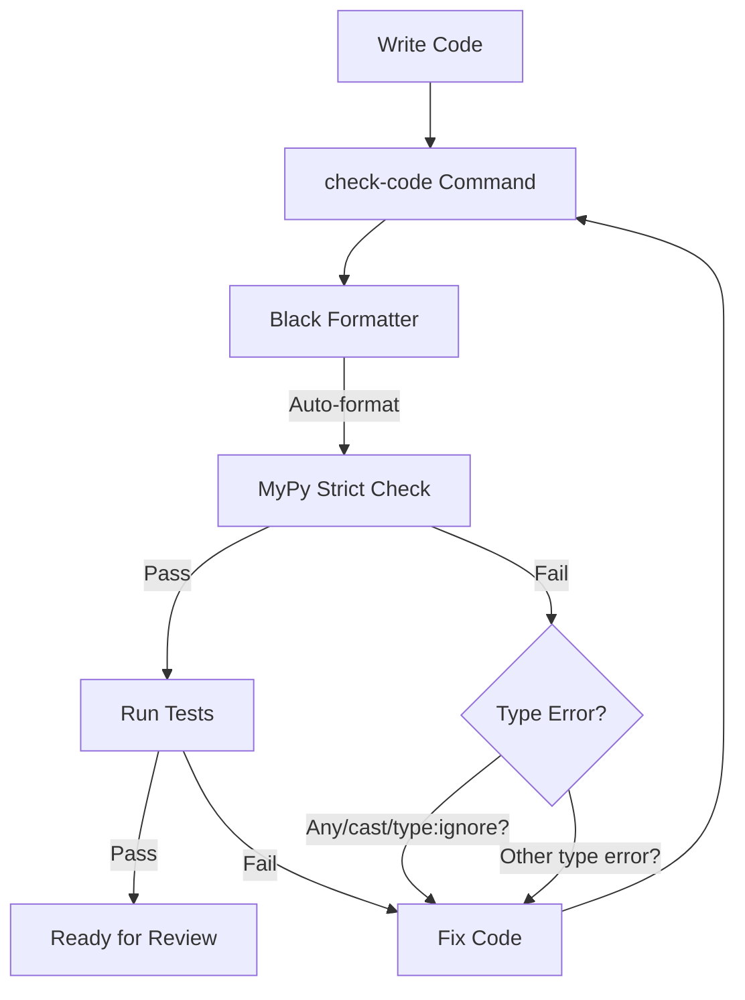
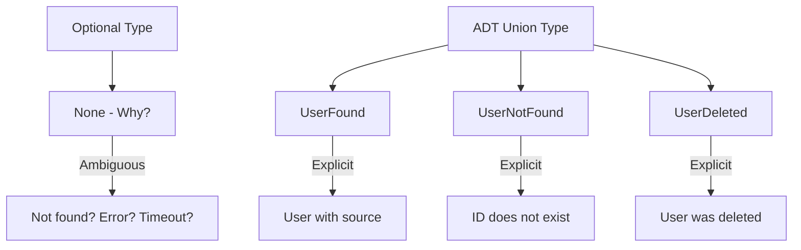
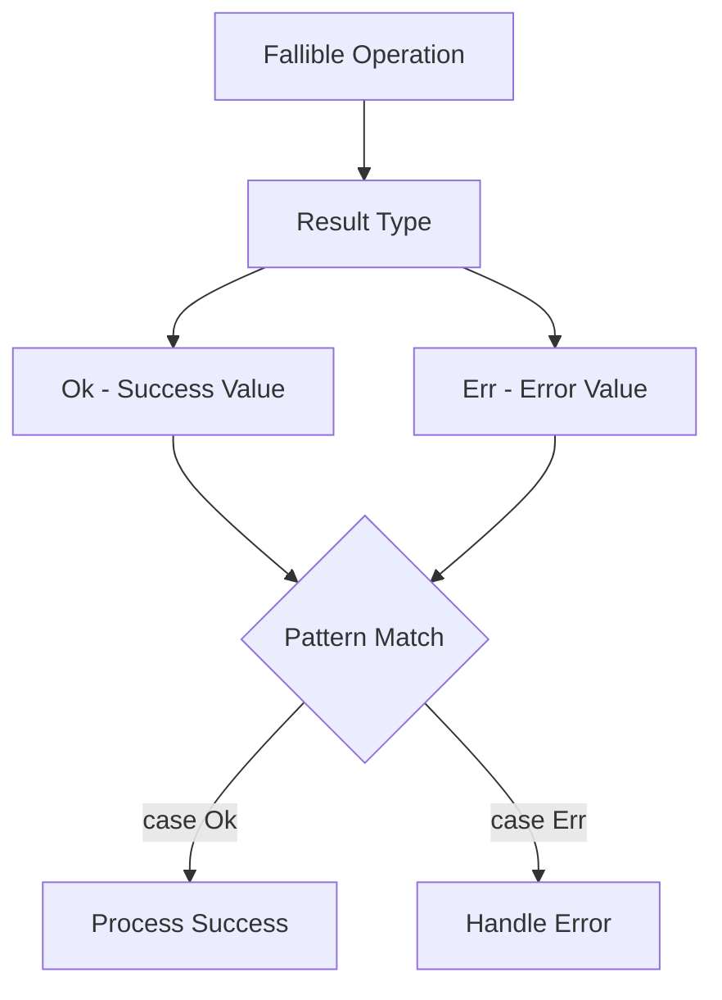
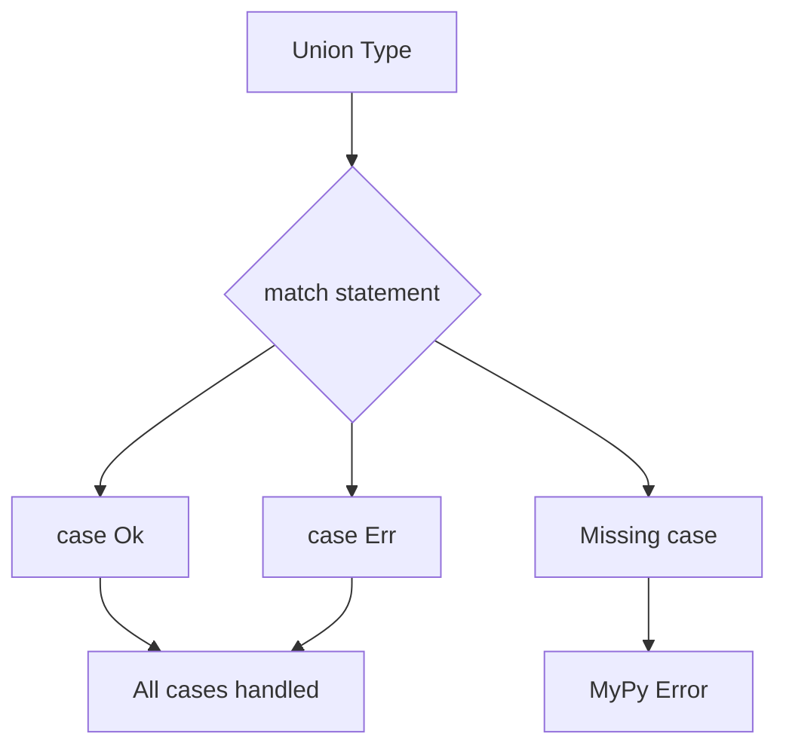
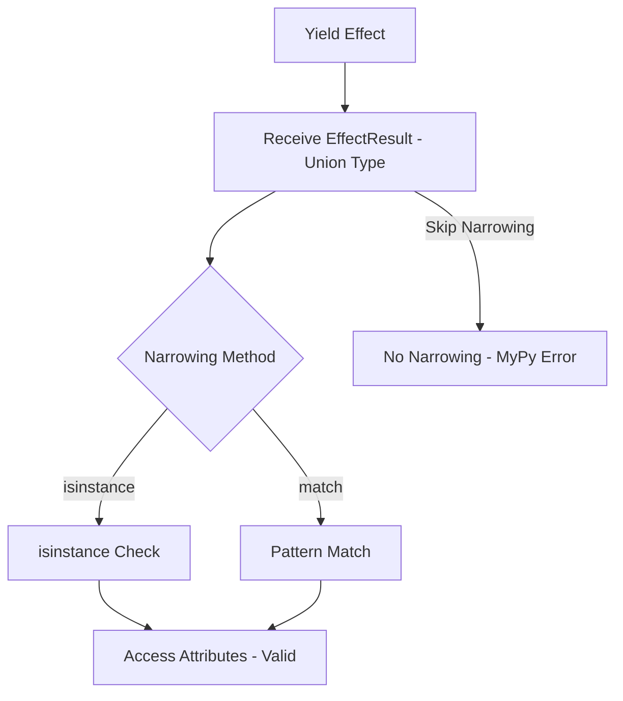
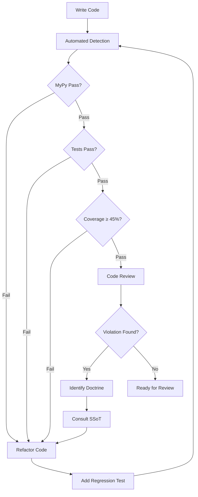

# Type Safety Enforcement

> **Single Source of Truth (SSoT)** for all type safety policy and code quality enforcement in Effectful.

## Core Principle

**Make invalid states unrepresentable through the type system.**

If the type checker passes, the program should be correct. The type system works for you, not against you.

---

## Zero-Tolerance Policy

**CRITICAL**: There are **ZERO** exceptions for type safety escape hatches. This policy has **NO** carve-outs:

- ❌ **FORBIDDEN**: `Any` type (including `from typing import Any`)
- ❌ **FORBIDDEN**: `cast()` function (including `from typing import cast`)
- ❌ **FORBIDDEN**: `# type: ignore` comments (in ANY code, including tests)

**This means:**
- Not in production code
- Not in test code
- Not in examples
- Not in scripts
- Not in __init__.py files
- Not ANYWHERE in the codebase

**Enforcement**: `mypy --strict` with `disallow_any_explicit = true` catches all violations.

**Testing frozen dataclasses**: Use `setattr(obj, "field", value)` instead of `obj.field = value  # type: ignore`

---

## Type Safety Workflow



**Enforcement:**
- `poetry run check-code` runs Black → MyPy with fail-fast behavior
- `mypy --strict` with `disallow_any_explicit = true`
- Zero tolerance for escape hatches
- All errors must be fixed before tests run
- Type checking is a gate, not a suggestion

---

## check-code Command

**Usage**: `docker compose -f docker/docker-compose.yml exec effectful poetry run check-code`

See [Command Reference](command_reference.md) for complete command table.

### Black + MyPy Workflow

Runs Black (formatter) → MyPy (strict type checker) with fail-fast behavior.

**Behavior**:
1. **Black**: Auto-formats Python code (line-length=100)
2. **MyPy**: Strict type checking with 30+ strict settings, disallow_any_explicit=true
3. **Fail-fast**: Exits on first failure

Must meet Universal Success Criteria (exit code 0, Black formatting applied, zero MyPy errors).

---

## Universal Success Criteria

All code changes must meet these requirements:

- ✅ Exit code 0 (all operations complete successfully)
- ✅ **Zero MyPy errors** (mypy --strict mandatory)
- ✅ Zero stderr output
- ✅ Zero console warnings/errors
- ✅ **Zero skipped tests** (pytest.skip() forbidden)
- ✅ 100% test pass rate
- ✅ **Zero `Any`, `cast()`, or `# type: ignore`** (escape hatches forbidden - NO exceptions)
- ✅ **Minimum 45% code coverage** (adapters excluded)
- ✅ **Integration tests cover all features** (conceptual coverage)

**Referenced by**: [Testing](testing.md), [Command Reference](command_reference.md), [Contributing](../CONTRIBUTING.md).

---

## Eight Type Safety Doctrines

### 1. NO Escape Hatches (ZERO Exceptions)

```python
# FORBIDDEN - These constructs are NEVER allowed ANYWHERE
from typing import Any, cast

def process(data: Any) -> Any:  # NO! Not in prod, not in tests!
    return cast(int, data)      # NO! Not in prod, not in tests!

def transform(x):  # type: ignore  # NO! Not in prod, not in tests!
    return x

# CORRECT - Explicit types always
from uuid import UUID
from effectful.algebraic.result import Result, Ok, Err
from effectful.domain.user import User

def process(user_id: UUID) -> Result[User, str]:
    if not isinstance(user_id, UUID):
        return Err("Invalid UUID")
    return Ok(User(id=user_id, email="test@example.com", name="Test"))

# CORRECT - Testing frozen dataclasses without type:ignore
from dataclasses import FrozenInstanceError
import pytest

def test_user_is_frozen() -> None:
    user = User(id=user_id, email="test@example.com", name="Alice")
    with pytest.raises((FrozenInstanceError, AttributeError)):
        setattr(user, "email", "hacker@example.com")  # Use setattr, NOT type:ignore!
```

**Enforcement:** `mypy --strict` with `disallow_any_explicit = true` in pyproject.toml

**Why:** Escape hatches defeat the purpose of static typing. If you need `Any`, your type design is wrong.

### 2. ADTs Over Optional Types



```python
# WRONG - Optional hides the reason for None
from typing import Optional

async def get_user(user_id: UUID) -> Optional[User]:
    user = await db.query(...)
    return user  # Why is it None? Not found? Error? Timeout?

# CORRECT - ADT makes all cases explicit
from dataclasses import dataclass
from effectful.domain.user import User

@dataclass(frozen=True)
class UserFound:
    user: User
    source: str  # "database" | "cache"

@dataclass(frozen=True)
class UserNotFound:
    user_id: UUID
    reason: str  # "does_not_exist" | "deleted" | "access_denied"

type UserLookupResult = UserFound | UserNotFound

async def get_user(user_id: UUID) -> UserLookupResult:
    user = await db.query(...)
    if user is not None:
        return UserFound(user=user, source="database")
    return UserNotFound(user_id=user_id, reason="does_not_exist")

# Usage with exhaustive pattern matching
match result:
    case UserFound(user=user, source=source):
        print(f"Found {user.name} from {source}")
    case UserNotFound(user_id=uid, reason=reason):
        print(f"User {uid} not found: {reason}")
```

**Why:** ADTs force callers to handle all cases explicitly. The type system prevents forgetting edge cases.

### 3. Result Type for Error Handling



```python
# WRONG - Exceptions are invisible in type signatures
async def save_message(user_id: UUID, text: str) -> ChatMessage:
    # Raises ValueError? DatabaseError? Who knows!
    return await db.save(...)

# CORRECT - Errors are part of the type signature
from effectful.algebraic.result import Result, Ok, Err
from effectful.interpreters.errors import DatabaseError

async def save_message(
    user_id: UUID, text: str
) -> Result[ChatMessage, DatabaseError]:
    try:
        msg = await db.save(...)
        return Ok(msg)
    except Exception as e:
        return Err(DatabaseError(
            effect=SaveChatMessage(user_id=user_id, text=text),
            db_error=str(e),
            is_retryable=True
        ))

# Caller MUST handle errors
match result:
    case Ok(message):
        print(f"Saved: {message.id}")
    case Err(error):
        print(f"Failed: {error.db_error}")
        if error.is_retryable:
            await retry_logic()
```

**Why:** Errors become type-checked documentation. Impossible to forget error handling.

### 4. Immutability by Default

```python
# WRONG - Mutable state allows invalid mutations
from dataclasses import dataclass

@dataclass
class User:
    id: UUID
    email: str
    name: str

user = User(id=uuid4(), email="test@example.com", name="Alice")
user.email = None  # Oops! Type checker doesn't prevent this at runtime

# CORRECT - Frozen dataclasses prevent mutation
@dataclass(frozen=True)
class User:
    id: UUID
    email: str
    name: str

user = User(id=uuid4(), email="test@example.com", name="Alice")
# user.email = None  # Error: cannot assign to field 'email'

# To "update", create new instance
updated_user = User(id=user.id, email="new@example.com", name=user.name)
```

**Why:** Immutability eliminates entire classes of bugs (race conditions, unexpected mutations, temporal coupling).

### 5. Exhaustive Pattern Matching



```python
# WRONG - Non-exhaustive matching
from effectful.algebraic.result import Result, Ok, Err

def process(result: Result[int, str]) -> int:
    match result:
        case Ok(value):
            return value
    # Missing Err case - mypy error!

# CORRECT - Exhaustive matching
def process(result: Result[int, str]) -> int:
    match result:
        case Ok(value):
            return value
        case Err(error):
            print(f"Error: {error}")
            return 0
```

**Why:** Type checker enforces handling all cases. No forgotten branches.

### 6. Type Narrowing for Union Types



```python
# WRONG - Accessing union type attributes without narrowing
from effectful.effects.database import SaveChatMessage

def program() -> Generator[AllEffects, EffectResult, str]:
    message = yield SaveChatMessage(user_id=user_id, text="Hello")
    # Error: EffectResult is str | User | ChatMessage | None
    return f"Saved: {message.text}"  # mypy error!

# CORRECT - Type narrowing with isinstance
def program() -> Generator[AllEffects, EffectResult, str]:
    message = yield SaveChatMessage(user_id=user_id, text="Hello")
    assert isinstance(message, ChatMessage)  # Type narrowing
    return f"Saved: {message.text}"  # OK - mypy knows it's ChatMessage

# ALTERNATIVE - Pattern matching
def program() -> Generator[AllEffects, EffectResult, str]:
    message = yield SaveChatMessage(user_id=user_id, text="Hello")
    match message:
        case ChatMessage(id=msg_id, text=text):
            return f"Saved: {text}"
        case _:
            return "Unexpected type"
```

**Why:** Union types require explicit narrowing. Type checker ensures runtime type safety.

**Required Practices:**
- Always narrow union types before accessing variant-specific attributes
- Use `isinstance` for single-variant narrowing
- Use pattern matching for multi-variant ADTs
- MyPy will error if you forget to narrow - this is intentional

### 7. Generic Type Parameters

```python
# WRONG - Bare generic types lose information
def process(items: list) -> dict:  # What kind of list? What dict structure?
    return {str(i): item for i, item in enumerate(items)}

# CORRECT - Fully parameterized generics
def process(items: list[str]) -> dict[str, str]:
    return {str(i): item for i, item in enumerate(items)}

# CORRECT - Generic functions with TypeVar
from typing import TypeVar

T = TypeVar("T")

def first_or_none(items: list[T]) -> T | None:
    return items[0] if items else None

# Type checker infers: first_or_none([1, 2, 3]) -> int | None
```

**Why:** Generic parameters preserve type information through transformations.

### 8. PEP 695 Type Aliases

```python
# WRONG - String-based type aliases (deprecated)
from typing import Generator

EffectResult = "str | User | ChatMessage | None"  # NO!

# CORRECT - PEP 695 type aliases (Python 3.12+)
from collections.abc import Generator

type EffectResult = str | User | ChatMessage | ProfileData | CacheLookupResult | None

type WSProgram = Generator[AllEffects, EffectResult, None]

# Usage
def my_program() -> WSProgram:
    yield SendText(text="Hello")
    return None
```

**Why:** Type aliases are first-class citizens with proper IDE support and type checking.

---

## Implementation Anti-Patterns

### 1. Using `Any` Types (FORBIDDEN - Zero Exceptions)
- **Wrong:** Function parameters or return types with `Any`
- **Right:** Explicit types always (see Doctrine 1)
- **Important:** No exceptions, not even in tests

### 2. Using `cast()` (FORBIDDEN - Zero Exceptions)
- **Wrong:** Using `cast()` to bypass type checker
- **Right:** Fix your type design instead
- **Important:** No exceptions, not even in tests

### 3. Using `# type: ignore` (FORBIDDEN - Zero Exceptions)
- **Wrong:** Using `# type: ignore` to silence MyPy
- **Right:** Fix the type error properly
- **Testing Frozen:** Use `setattr(obj, "field", value)` instead of `obj.field = value  # type: ignore`
- **Important:** No exceptions, not even in tests

### 4. Mutable Domain Models
- **Wrong:** Dataclasses without `frozen=True`
- **Right:** All domain models immutable: `@dataclass(frozen=True)`

### 5. Optional for Domain Logic
- **Wrong:** Returning `Optional[User]` from domain methods
- **Right:** ADT types: `UserLookupResult = UserFound | UserNotFound`

### 6. Exceptions for Expected Errors
- **Wrong:** Raising exceptions for expected failure cases
- **Right:** Result type: `Result[Success, Error]`

### 7. Imperative Effect Execution
- **Wrong:** Directly calling infrastructure in programs: `await db.query(...)`
- **Right:** Yield effects: `user = yield GetUserById(user_id=user_id)`

**Impact:** Breaks separation of concerns, makes testing difficult, couples business logic to infrastructure.

---

## Anti-Pattern Detection

### Automated Detection

**MyPy strict mode** catches:
- Any types (`disallow_any_explicit = true`)
- Missing type annotations
- Unhandled union cases
- Type narrowing violations
- Mutable default arguments
- Incomplete pattern matches

**pytest** catches:
- Missing tests (coverage < 45%)
- Skipped tests (forbidden - pytest.skip() not allowed)
- Test failures
- Assertion errors

**Black** catches:
- Formatting inconsistencies
- Line length violations (> 100 chars)
- Quote style inconsistencies

### Manual Detection

**Code review** catches:
- Mutable domain models (missing `frozen=True`)
- Optional instead of ADTs (semantic issue)
- Exceptions instead of Result (control flow anti-pattern)
- Imperative effect execution (architectural violation)
- Immutability library usage in adapters (over-engineering)

**Grep patterns** for static analysis:
```bash
# Find mutable dataclasses
grep -r "@dataclass" effectful/ | grep -v "frozen=True"

# Find Optional usage in domain
grep -r "Optional\[" effectful/domain/

# Find exception raising in business logic
grep -r "raise " effectful/programs/ effectful/domain/

# Find Any types
grep -r "Any" effectful/ tests/
```

### Remediation

**When anti-pattern detected**:
1. Stop immediately - do not proceed with broken code
2. Identify which doctrine is violated (reference section above)
3. Consult relevant SSoT document:
   - Type safety → this document
   - Purity → [purity.md](purity.md)
   - Testing → [testing.md](testing.md)
   - Docker → [docker_workflow.md](docker_workflow.md)
4. Refactor to correct pattern (see examples in relevant sections)
5. Add test to prevent regression
6. Verify fix with `poetry run check-code`

**Detection workflow**:


---

## MyPy Strict Configuration

**pyproject.toml settings** (30+ strict options enabled):

```toml
[tool.mypy]
python_version = "3.12"
strict = true
disallow_any_explicit = true       # CRITICAL: Forbids Any type EVERYWHERE
disallow_any_generics = true
disallow_subclassing_any = true
disallow_untyped_calls = true
disallow_untyped_defs = true
disallow_incomplete_defs = true
check_untyped_defs = true
disallow_untyped_decorators = true
warn_redundant_casts = true
warn_unused_ignores = true
warn_return_any = true
warn_no_return = true
warn_unreachable = true
no_implicit_optional = true
no_implicit_reexport = true
strict_equality = true
extra_checks = true
warn_unused_configs = true
```

**Critical Setting**: `disallow_any_explicit = true` - Forbids `Any` type in ALL code (production, tests, examples).

---

## Black Configuration

**Line length**: 100 characters (configured in pyproject.toml)

**Auto-formatting**: Black modifies files in-place to enforce consistent style.

**Target version**: Python 3.12+

---

## Coverage Requirements

**Minimum Coverage**: 45% overall (enforced by pytest-cov)

**Excluded from measurement**:
- `effectful/adapters/` - Real infrastructure implementations
- `effectful/infrastructure/` - Protocol definitions (no logic)
- Test files themselves

**Why 45%**: Balances quality signal vs. diminishing returns. Focus on:
- Core algebraic types (Result, EffectReturn)
- Domain models
- Interpreters
- Program runners
- Effect definitions

**Conceptual coverage**: Every feature must have integration tests, even if line coverage < 100%.

---

## Pre-commit Checks

Before committing code:

1. **Format**: `poetry run black effectful tests`
2. **Type check**: `poetry run check-code`
3. **Test**: `poetry run test-all` (see [Command Reference](command_reference.md))
4. **Coverage**: `poetry run pytest --cov=effectful --cov-report=term-missing`

All must meet Universal Success Criteria.

---

## Common Violations and Fixes

### Type Safety Violations

**❌ WRONG** - Using Any (FORBIDDEN):
```python
def process_data(data: Any) -> Any:  # Forbidden EVERYWHERE!
    return data
```

**✅ CORRECT** - Explicit types:
```python
def process_data(data: UserData) -> Result[ProcessedData, ProcessingError]:
    return Ok(ProcessedData(...))
```

**❌ WRONG** - Using type:ignore (FORBIDDEN):
```python
def test_user_frozen() -> None:
    user = User(...)
    user.email = "test"  # type: ignore  # FORBIDDEN!
```

**✅ CORRECT** - Use setattr():
```python
from dataclasses import FrozenInstanceError

def test_user_frozen() -> None:
    user = User(...)
    with pytest.raises((FrozenInstanceError, AttributeError)):
        setattr(user, "email", "test")  # No type:ignore needed!
```

### Coverage Violations

**❌ WRONG** - No tests for new feature:
```python
# Added new function, no tests = coverage drops below 45%
def calculate_metrics(data: MetricData) -> MetricResult:
    ...
```

**✅ CORRECT** - Tests for all features:
```python
# tests/test_metrics.py
def test_calculate_metrics():
    result = calculate_metrics(MetricData(...))
    assert_ok(result)
```

### Formatting Violations

Black automatically fixes these, but check-code will fail if code isn't formatted:

- Line length > 100 characters
- Inconsistent quote styles
- Missing trailing commas
- Inconsistent indentation

---

## Exit Codes

**Exit code 0**: All checks passed (Black formatting applied, zero MyPy errors)
**Exit code 1**: Black formatting needed OR MyPy errors found

**Fail-fast behavior**: check-code stops at first failure (Black or MyPy), does not continue.

---

## Integration with CI

**GitHub Actions** (future):
```yaml
- name: Check code quality
  run: docker compose -f docker/docker-compose.yml exec effectful poetry run check-code

- name: Run tests with coverage
  run: docker compose -f docker/docker-compose.yml exec effectful poetry run pytest --cov=effectful --cov-fail-under=45
```

---

## Related Documentation

- **Command Reference:** [command_reference.md](command_reference.md) - All Docker commands
- **Testing Standards:** [testing.md](testing.md) - 22 test anti-patterns
- **Development Workflow:** [development_workflow.md](development_workflow.md) - Daily development loop
- **Architecture:** [architecture.md](architecture.md) - 5-layer architecture design
- **Result Type:** `effectful/algebraic/result.py`
- **ADT Examples:** `effectful/domain/user.py`, `effectful/domain/profile.py`
- **Type Aliases:** `effectful/programs/program_types.py`

---

**Last Updated:** 2025-11-30
**Referenced by:** CLAUDE.md, development_workflow.md, CONTRIBUTING.md, testing.md, architecture.md, forbidden_patterns.md, docker_workflow.md
