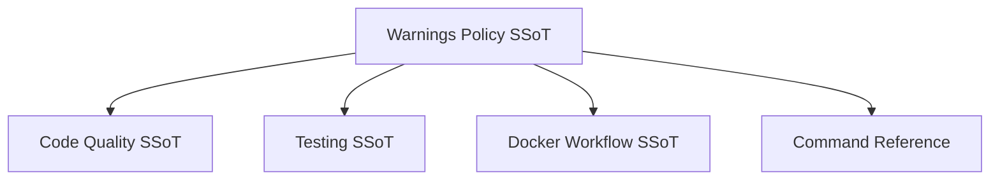

# Warnings Policy

**Status**: Authoritative source
**Supersedes**: none
**Referenced by**: engineering/README.md, engineering/code_quality.md, engineering/testing.md, engineering/docker_workflow.md, engineering/command_reference.md, demo/healthhub/documents/engineering/warnings_policy.md

> **Purpose**: Single Source of Truth for zero-warning expectations across linting, builds,
> tests, and runtime logs in Effectful.

## SSoT Link Map



## TL;DR

- Zero warnings is a release and review requirement.
- Fix root causes; do not mute or downgrade log levels.
- Upgrade deprecated APIs immediately.
- External-library warnings require documented, time-boxed exceptions.

## Policy

- Treat warnings as failures in local dev, CI, and runtime logs.
- Do not add warning filters in application code.
- Replace deprecated APIs instead of suppressing deprecations.
- If a warning appears in tests or tooling, fix the source before merging.

## Scope

- Type checking and linting (`poetry run check-code`).
- Tests (pytest/vitest/playwright) and collection warnings.
- Docker build and runtime warnings.
- Runtime warnings in application logs and browser consoles.

## Required Response

- Code quality warnings: follow [Code Quality](code_quality.md#cross-references) for
  strict typing and purity fixes.
- Test warnings: follow [Testing](testing.md#cross-references) for fixture and cleanup
  patterns.
- Docker warnings: follow [Docker Workflow](docker_workflow.md) for Dockerfile and
  compose corrections.
- Command usage and log review: use [Command Reference](command_reference.md).

## Exceptions (Rare)

Suppression is allowed only when all conditions are met:

1. The warning originates in a third-party dependency.
1. No supported API change eliminates it.
1. An upstream issue is open and linked.
1. Suppression is scoped and documented.
1. A review date is recorded (quarterly cadence).

**Example (documented exception):**

```toml
# pyproject.toml
[tool.pytest.ini_options]
filterwarnings = [
  # External library bug: https://github.com/org/lib/issues/123
  # Review: 2025-Q2
  "ignore::ResourceWarning:external_lib",
]
```

### Anti-Patterns

Wrong: blanket suppression.

```python
# app/main.py
import warnings

warnings.filterwarnings("ignore")
```

Right: fix the root cause or use a documented, time-boxed exception.

## Enforcement

- Run the full gate (code + docs) and review output carefully.
- CI must fail on warnings; do not downgrade warning severity.

```bash
# effectful container
docker compose -f docker/docker-compose.yml exec effectful poetry run check-code
```

## Demo Overlays

Demo documentation must link to this policy and list deltas only. See
[Documentation Standards](../documentation_standards.md#12-demo-overlays-and-functional-deltas).

## Cross-References

- [Engineering Standards](README.md) - SSoT map and navigation.
- [Code Quality](code_quality.md) - Type safety and strict enforcement.
- [Testing](testing.md) - Test execution rules and warning handling.
- [Docker Workflow](docker_workflow.md) - Container-only build and runtime policy.
- [Command Reference](command_reference.md) - Approved commands and log review.
- [Documentation Standards](../documentation_standards.md) - SSoT and DRY rules.
