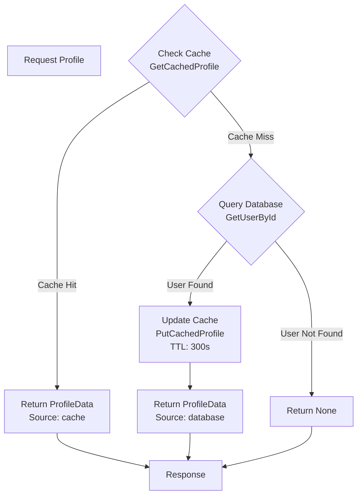
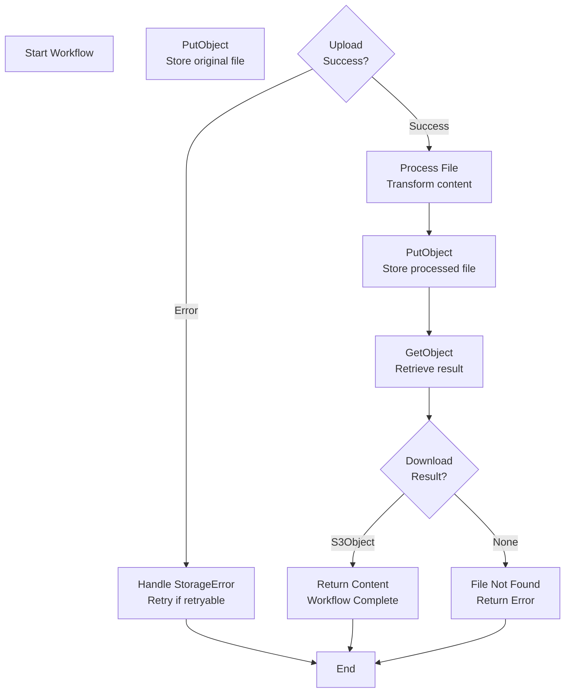
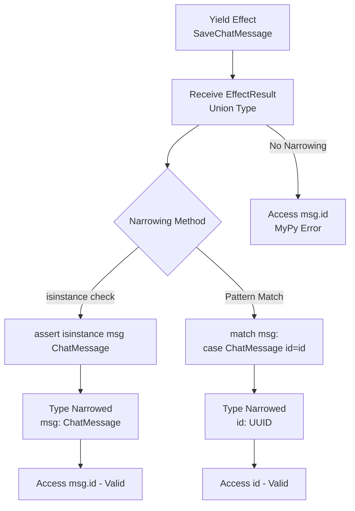

# Effect Types

This tutorial covers all available effect types in **effectful** and how to use them.

> **Core Doctrine**: For the complete architecture including effect hierarchy diagrams, see [architecture.md](../engineering/architecture.md).

## Effect Categories

effectful provides six categories of effects:

1. **WebSocket Effects** - Real-time communication
2. **Database Effects** - Data persistence
3. **Cache Effects** - Performance optimization
4. **Messaging Effects** - Pub/sub messaging
5. **Storage Effects** - Object storage
6. **Auth Effects** - Authentication

### Effect Type Hierarchy

> **Diagram**: See the complete Effect Type Hierarchy diagram in [architecture.md](../engineering/architecture.md#effect-type-hierarchy).

**Key Points:**
- All effects are frozen dataclasses (immutable)
- `AllEffects` is a type union of all effect categories
- Each effect yields a specific return type when interpreted
- Effects are pure data - they describe what to do, not how

## WebSocket Effects

### SendText

Send a text message over WebSocket.

```python
from effectful import SendText

def send_greeting() -> Generator[AllEffects, EffectResult, None]:
    yield SendText(text="Hello from the server!")
    return None
```

**Effect Signature:**
```python
@dataclass(frozen=True)
class SendText:
    text: str
```

**Returns:** `None` (no value returned)

**Errors:** `WebSocketClosedError` if connection is closed

### ReceiveText

Receive a text message from WebSocket.

```python
from effectful import ReceiveText

def receive_and_echo() -> Generator[AllEffects, EffectResult, str]:
    # Receive message
    message = yield ReceiveText()

    # Type narrowing
    assert isinstance(message, str)

    # Echo back
    yield SendText(text=f"You said: {message}")
    return message
```

**Effect Signature:**
```python
@dataclass(frozen=True)
class ReceiveText:
    pass
```

**Returns:** `str` (the received message)

**Errors:** `WebSocketClosedError` if connection is closed

### Close

Close the WebSocket connection with a reason.

```python
from effectful import Close, CloseNormal

def goodbye() -> Generator[AllEffects, EffectResult, None]:
    yield SendText(text="Goodbye!")
    yield Close(reason=CloseNormal())
    return None
```

**Effect Signature:**
```python
@dataclass(frozen=True)
class Close:
    reason: CloseReason

# CloseReason variants:
@dataclass(frozen=True)
class CloseNormal:
    pass

@dataclass(frozen=True)
class CloseGoingAway:
    pass

@dataclass(frozen=True)
class CloseProtocolError:
    pass

@dataclass(frozen=True)
class ClosePolicyViolation:
    pass
```

**Returns:** `None`

**Errors:** None (always succeeds)

## Database Effects

### GetUserById

Look up a user by UUID.

```python
from uuid import UUID
from effectful import GetUserById, User
from effectful.domain.user import UserNotFound

def lookup_user(user_id: UUID) -> Generator[AllEffects, EffectResult, str]:
    # Yield effect
    user_result = yield GetUserById(user_id=user_id)

    # Handle result (User or UserNotFound ADT)
    match user_result:
        case UserNotFound():
            return "User not found"
        case User(name=name, email=email):
            return f"{name} ({email})"
```

**Effect Signature:**
```python
@dataclass(frozen=True)
class GetUserById:
    user_id: UUID
```

**Returns:** `User | UserNotFound`

**Errors:** `DatabaseError` if query fails

**User Model:**
```python
@dataclass(frozen=True)
class User:
    id: UUID
    email: str
    name: str
```

### SaveChatMessage

Save a chat message to the database.

```python
from effectful import SaveChatMessage, ChatMessage

def save_user_message(user_id: UUID, text: str) -> Generator[AllEffects, EffectResult, UUID]:
    # Yield effect
    message = yield SaveChatMessage(user_id=user_id, text=text)

    # Type narrowing
    assert isinstance(message, ChatMessage)

    # Return message ID
    return message.id
```

**Effect Signature:**
```python
@dataclass(frozen=True)
class SaveChatMessage:
    user_id: UUID
    text: str
```

**Returns:** `ChatMessage`

**Errors:** `DatabaseError` if save fails

**ChatMessage Model:**
```python
@dataclass(frozen=True)
class ChatMessage:
    id: UUID
    user_id: UUID
    text: str
    created_at: datetime
```

## Cache Effects

### GetCachedProfile

Look up a cached user profile.

```python
from effectful import GetCachedProfile, ProfileData

def get_profile(user_id: UUID) -> Generator[AllEffects, EffectResult, ProfileData | None]:
    # Yield effect
    cached = yield GetCachedProfile(user_id=user_id)

    # Handle cache hit/miss
    match cached:
        case ProfileData(name=name):
            yield SendText(text=f"Found cached profile for {name}")
            return cached
        case _:
            yield SendText(text="Cache miss")
            return None
```

**Effect Signature:**
```python
@dataclass(frozen=True)
class GetCachedProfile:
    user_id: UUID
```

**Returns:** `ProfileData | None`

**Errors:** `CacheError` if cache access fails

**ProfileData Model:**
```python
@dataclass(frozen=True)
class ProfileData:
    id: str
    name: str
    email: str | None = None
```

### PutCachedProfile

Store a user profile in cache with TTL.

```python
from effectful import PutCachedProfile

def cache_profile(user_id: UUID, profile: ProfileData) -> Generator[AllEffects, EffectResult, None]:
    # Store in cache for 5 minutes
    yield PutCachedProfile(
        user_id=user_id,
        profile_data=profile,
        ttl_seconds=300
    )
    yield SendText(text="Profile cached")
    return None
```

**Effect Signature:**
```python
@dataclass(frozen=True)
class PutCachedProfile:
    user_id: UUID
    profile_data: ProfileData
    ttl_seconds: int
```

**Returns:** `None`

**Errors:** `CacheError` if cache write fails

### Cache-Aside Pattern

The following diagram shows the cache-aside pattern using cache effects:



**Pattern Benefits:**
- **Performance**: Cache hits avoid database queries
- **TTL Control**: Automatic expiration with `ttl_seconds`
- **Explicit**: Cache miss logic is clear in code
- **Type Safe**: Pattern matching ensures all cases handled

**Example Implementation:**
```python
def get_profile_cached(user_id: UUID) -> Generator[AllEffects, EffectResult, ProfileData | None]:
    # Try cache first
    cached = yield GetCachedProfile(user_id=user_id)
    if cached is not None:
        return cached  # Cache hit

    # Cache miss - query database
    user = yield GetUserById(user_id=user_id)
    match user:
        case UserNotFound():
            return None  # User not found
        case User():
            pass  # Continue below

    # Update cache
    profile = ProfileData(id=str(user_id), name=user.name, email=user.email)
    yield PutCachedProfile(user_id=user_id, profile_data=profile, ttl_seconds=300)

    return profile
```

## Messaging Effects

### PublishMessage

Publish a message to an Apache Pulsar topic.

```python
from effectful.effects.messaging import PublishMessage

def publish_notification(event: str) -> Generator[AllEffects, EffectResult, str]:
    # Publish event to topic
    message_id = yield PublishMessage(
        topic="notifications",
        payload=event.encode("utf-8"),
        properties={"type": "notification", "priority": "high"}
    )

    # Type narrowing
    assert isinstance(message_id, str)

    yield SendText(text=f"Published notification: {message_id}")
    return message_id
```

**Effect Signature:**
```python
@dataclass(frozen=True)
class PublishMessage:
    topic: str
    payload: bytes
    properties: dict[str, str] | None = None
```

**Returns:** `str` (message ID from Pulsar)

**Errors:** `MessagingError` with retryability flag

### ConsumeMessage

Consume a message from a Pulsar subscription.

```python
from effectful.effects.messaging import ConsumeMessage
from effectful.domain.message_envelope import MessageEnvelope

def process_notification() -> Generator[AllEffects, EffectResult, str]:
    # Consume message with timeout
    envelope = yield ConsumeMessage(
        subscription="notification-processor",
        timeout_ms=5000
    )

    # Handle timeout vs message received
    match envelope:
        case None:
            return "timeout"
        case MessageEnvelope(message_id=msg_id, payload=payload):
            text = payload.decode("utf-8")
            yield SendText(text=f"Processing: {text}")
            return msg_id
```

**Effect Signature:**
```python
@dataclass(frozen=True)
class ConsumeMessage:
    subscription: str
    timeout_ms: int = 5000
```

**Returns:** `MessageEnvelope | None` (None on timeout, not an error)

**Errors:** `MessagingError` if subscription access fails

See [Tutorial 08: Messaging Effects](08_messaging_effects.md) for comprehensive coverage including `AcknowledgeMessage` and `NegativeAcknowledge`.

## Storage Effects

### PutObject

Store an object in AWS S3 with metadata.

```python
from effectful.effects.storage import PutObject

def upload_document(filename: str, content: bytes) -> Generator[AllEffects, EffectResult, str]:
    # Store object with metadata
    object_key = yield PutObject(
        bucket="documents",
        key=f"uploads/{filename}",
        content=content,
        metadata={"uploaded-by": "user-123", "type": "document"},
        content_type="application/pdf"
    )

    # Type narrowing
    assert isinstance(object_key, str)

    yield SendText(text=f"Uploaded: {object_key}")
    return object_key
```

**Effect Signature:**
```python
@dataclass(frozen=True)
class PutObject:
    bucket: str
    key: str
    content: bytes
    metadata: dict[str, str] | None = None
    content_type: str | None = None
```

**Returns:** `str` (object key that was stored)

**Errors:** `StorageError` with retryability flag

### GetObject

Retrieve an object from AWS S3.

```python
from effectful.effects.storage import GetObject
from effectful.domain.s3_object import S3Object

def download_document(key: str) -> Generator[AllEffects, EffectResult, bytes]:
    # Retrieve object from S3
    s3_object = yield GetObject(bucket="documents", key=key)

    # Handle missing object
    match s3_object:
        case None:
            yield SendText(text="Document not found")
            return b""
        case S3Object(content=content, size=size):
            yield SendText(text=f"Downloaded {size} bytes")
            return content
```

**Effect Signature:**
```python
@dataclass(frozen=True)
class GetObject:
    bucket: str
    key: str
```

**Returns:** `S3Object | None` (None if object doesn't exist, not an error)

**Errors:** `StorageError` for permission/network failures

### Storage Workflow

The following diagram shows a typical storage upload-process-download workflow:



**Pattern Benefits:**
- **Idempotent Storage**: PutObject overwrites existing objects
- **Explicit Missing**: GetObject returns None for missing objects (not error)
- **Metadata Tracking**: Attach custom metadata for provenance
- **Type Safety**: Pattern matching ensures all cases handled

**Example Implementation:**
```python
def process_document(input_key: str) -> Generator[AllEffects, EffectResult, str]:
    # Step 1: Download original
    s3_object = yield GetObject(bucket="input", key=input_key)

    match s3_object:
        case None:
            return "not_found"
        case S3Object(content=content):
            # Step 2: Process content
            processed = content.upper()  # Example processing

            # Step 3: Upload result
            output_key = yield PutObject(
                bucket="output",
                key=f"processed/{input_key}",
                content=processed,
                metadata={"source": input_key, "processed": "true"}
            )
            assert isinstance(output_key, str)

            return output_key
```

See [Tutorial 09: Storage Effects](09_storage_effects.md) for comprehensive coverage including `DeleteObject` and `ListObjects`.

## Auth Effects

### ValidateToken

Validate a JWT token and extract user claims.

```python
from effectful import ValidateToken, TokenValid, TokenExpired, TokenInvalid

def authenticate(token: str) -> Generator[AllEffects, EffectResult, UUID | None]:
    result = yield ValidateToken(token=token)

    match result:
        case TokenValid(user_id=uid, claims=claims):
            yield SendText(text=f"Authenticated: {uid}")
            return uid
        case TokenExpired(expired_at=exp):
            yield SendText(text=f"Token expired at {exp}")
            return None
        case TokenInvalid(reason=reason):
            yield SendText(text=f"Invalid token: {reason}")
            return None
```

**Effect Signature:**
```python
@dataclass(frozen=True)
class ValidateToken:
    token: str
```

**Returns:** `TokenValidationResult` (ADT: `TokenValid | TokenExpired | TokenInvalid`)

**Errors:** `AuthError` if validation fails

### GenerateToken

Generate a new JWT token for a user.

```python
from effectful import GenerateToken

def create_session(user_id: UUID) -> Generator[AllEffects, EffectResult, str]:
    token = yield GenerateToken(
        user_id=user_id,
        claims={"role": "user", "type": "access"},
        ttl_seconds=3600
    )

    assert isinstance(token, str)
    return token
```

**Effect Signature:**
```python
@dataclass(frozen=True)
class GenerateToken:
    user_id: UUID
    claims: dict[str, str]
    ttl_seconds: int
```

**Returns:** `str` (encoded JWT token)

**Errors:** `AuthError` if generation fails

### Password Operations

Hash and validate passwords with bcrypt:

```python
from effectful import HashPassword, ValidatePassword

def register(password: str) -> Generator[AllEffects, EffectResult, str]:
    # Hash password
    hashed = yield HashPassword(password=password)
    assert isinstance(hashed, str)
    return hashed

def login(password: str, stored_hash: str) -> Generator[AllEffects, EffectResult, bool]:
    # Validate password
    is_valid = yield ValidatePassword(
        password=password,
        password_hash=stored_hash
    )
    return is_valid
```

See [Tutorial 10: Auth Effects](10_auth_effects.md) for comprehensive coverage including `RefreshToken`, `RevokeToken`, and `GetUserByEmail`.

## Composing Effects

### Sequential Effects

Effects execute in order:

```python
def multi_step() -> Generator[AllEffects, EffectResult, str]:
    # Step 1: Get user
    user_result = yield GetUserById(user_id=user_id)
    assert isinstance(user_result, User)

    # Step 2: Send greeting
    yield SendText(text=f"Hello {user_result.name}!")

    # Step 3: Save message
    message = yield SaveChatMessage(user_id=user_id, text="Greeting sent")
    assert isinstance(message, ChatMessage)

    # Step 4: Cache profile
    profile = ProfileData(id=str(user_id), name=user_result.name)
    yield PutCachedProfile(user_id=user_id, profile_data=profile, ttl_seconds=300)

    return "Workflow complete"
```

### Conditional Effects

Use pattern matching for conditional logic:

```python
def conditional_cache(user_id: UUID) -> Generator[AllEffects, EffectResult, str]:
    # Try cache first
    cached = yield GetCachedProfile(user_id=user_id)

    match cached:
        case ProfileData(name=name):
            # Cache hit - use cached data
            yield SendText(text=f"Hello {name} (from cache)!")
            return "cache_hit"
        case _:
            # Cache miss - lookup user
            user_result = yield GetUserById(user_id=user_id)
            match user_result:
                case UserNotFound():
                    yield SendText(text="User not found")
                    return "not_found"
                case User(name=name):
                    # Cache the profile
                    profile = ProfileData(id=str(user_id), name=name)
                    yield PutCachedProfile(user_id=user_id, profile_data=profile, ttl_seconds=300)
                    yield SendText(text=f"Hello {name}!")
                    return "cache_miss"
```

### Reusable Sub-Programs

Use `yield from` to call sub-programs:

```python
def lookup_and_cache(user_id: UUID) -> Generator[AllEffects, EffectResult, ProfileData | None]:
    """Reusable: lookup user and cache profile."""
    user_result = yield GetUserById(user_id=user_id)

    match user_result:
        case UserNotFound():
            return None
        case User(id=uid, name=name, email=email):
            profile = ProfileData(id=str(uid), name=name, email=email)
            yield PutCachedProfile(user_id=uid, profile_data=profile, ttl_seconds=300)
            return profile

def greet_with_caching(user_id: UUID) -> Generator[AllEffects, EffectResult, str]:
    """Use sub-program."""
    # Delegate to sub-program
    profile = yield from lookup_and_cache(user_id)

    match profile:
        case None:
            yield SendText(text="User not found")
            return "error"
        case ProfileData(name=name):
            yield SendText(text=f"Hello {name}!")
            return "success"
```

## Error Handling

### Fail-Fast Semantics

Programs stop on first error:

```python
def failing_program() -> Generator[AllEffects, EffectResult, str]:
    # This effect fails
    user_result = yield GetUserById(user_id=invalid_uuid)  # DatabaseError!

    # These effects NEVER execute
    yield SendText(text="This won't run")
    yield SaveChatMessage(user_id=user_id, text="This won't run")

    return "This won't return"
```

When run:
```python
result = await run_ws_program(failing_program(), interpreter)

match result:
    case Err(DatabaseError(db_error=error)):
        print(f"Failed at first effect: {error}")
```

### Testing Error Cases

Use failing fakes to test error handling:

```python
from pytest_mock import MockerFixture

@pytest.mark.asyncio
async def test_database_failure(mocker: MockerFixture):
    # Setup failing infrastructure with pytest-mock
    mock_repo = mocker.AsyncMock(spec=UserRepository)
    mock_repo.get_by_id.side_effect = Exception("Connection timeout")

    # Create interpreter with mocked infrastructure
    db_interp = DatabaseInterpreter(user_repo=mock_repo)
    interpreter = CompositeInterpreter(interpreters=[db_interp])

    # Run program
    result = await run_ws_program(my_program(), interpreter)

    # Assert error
    assert_err(result, DatabaseError)
    error = unwrap_err(result)
    assert "Connection timeout" in error.db_error
```

## Type Safety

### Effect Result Types

All effects return union types:

```python
# EffectResult = str | User | ChatMessage | ProfileData | None
type EffectResult = str | User | ChatMessage | ProfileData | CacheLookupResult | None
```

**Always use type narrowing:**

```python
# ❌ WRONG - mypy error
def program() -> Generator[AllEffects, EffectResult, str]:
    message = yield SaveChatMessage(user_id=user_id, text="Hello")
    return f"ID: {message.id}"  # Error: EffectResult has no attribute 'id'

# ✅ CORRECT - type narrowing
def program() -> Generator[AllEffects, EffectResult, str]:
    message = yield SaveChatMessage(user_id=user_id, text="Hello")
    assert isinstance(message, ChatMessage)  # Narrow type
    return f"ID: {message.id}"  # OK
```

**Type Narrowing Flow:**

The following diagram shows how type narrowing works with effect results:



**Type Narrowing Techniques:**

1. **isinstance assertion**: Best for single-type narrowing
   ```python
   assert isinstance(message, ChatMessage)
   # Now mypy knows message is ChatMessage
   ```

2. **Pattern matching**: Best for ADT with multiple variants
   ```python
   match user_result:
       case User(name=name):
           # mypy knows name is str
       case UserNotFound():
           # mypy enforces handling all cases
   ```

### Pattern Matching

Exhaustive matching ensures all cases are handled:

```python
def program() -> Generator[AllEffects, EffectResult, str]:
    user_result = yield GetUserById(user_id=user_id)

    match user_result:
        case UserNotFound():
            return "not_found"
        case User(name=name):
            return f"found: {name}"
        # mypy enforces exhaustive matching
```

## Next Steps

- [Tutorial 03: ADTs and Result Types](03_adts_and_results.md) - Deep dive into type safety
- [Tutorial 04: Testing Patterns](04_testing_guide.md) - Write comprehensive tests
- [API Reference](../api/effects.md) - Complete effect API documentation

---

**Previous**: [Tutorial 01: Quickstart](01_quickstart.md) | **Next**: [Tutorial 03: ADTs and Result Types](03_adts_and_results.md)
