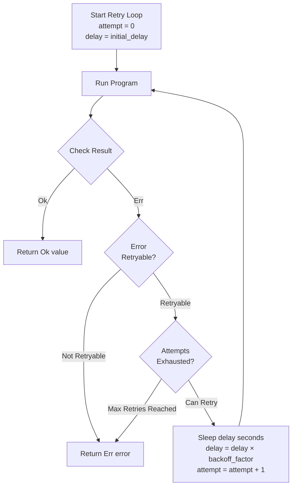
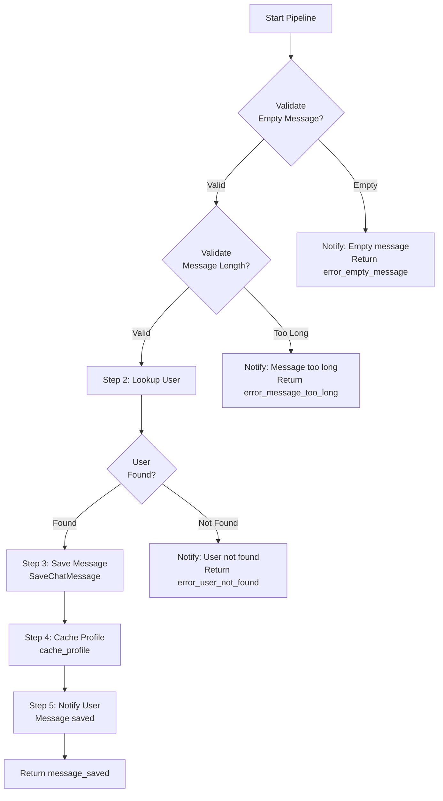

# Tutorial 06: Advanced Composition

This tutorial teaches you how to build complex workflows by composing smaller, reusable program components.

> **Core Doctrine**: For the complete program composition patterns and diagrams, see [architecture.md](../core/architecture.md#program-composition).

## Prerequisites

- Completed previous tutorials (01-05)
- Understanding of Python generators
- Familiarity with `yield from` delegation
- Knowledge of pattern matching

## Learning Objectives

By the end of this tutorial, you will:
- Build reusable program components
- Compose programs with `yield from`
- Implement conditional workflows and branching
- Create error recovery patterns
- Design retry mechanisms with exponential backoff
- Structure complex multi-step workflows

---

## Part 1: Reusable Components

### Basic Component Pattern

**Problem**: Programs often repeat similar logic (lookup user, send message, cache profile).

**Solution**: Extract reusable components that can be composed together.

```python
from collections.abc import Generator
from effectful import (
    AllEffects,
    EffectResult,
    GetUserById,
    SendText,
    PutCachedProfile,
)
from effectful.domain import User, ProfileData, UserNotFound
from uuid import UUID


def lookup_user(user_id: UUID) -> Generator[AllEffects, EffectResult, User | UserNotFound]:
    """Reusable component: lookup user by ID."""
    user = yield GetUserById(user_id=user_id)

    match user:
        case User():
            return user
        case UserNotFound():
            return user


def notify_user(message: str) -> Generator[AllEffects, EffectResult, None]:
    """Reusable component: send notification."""
    yield SendText(text=message)
    return None


def cache_profile(
    user_id: UUID, user: User, ttl_seconds: int = 300
) -> Generator[AllEffects, EffectResult, None]:
    """Reusable component: cache user profile."""
    profile = ProfileData(id=str(user_id), name=user.name)
    yield PutCachedProfile(user_id=user_id, profile_data=profile, ttl_seconds=ttl_seconds)
    return None
```

### Composing Components

**Pattern**: Use `yield from` to delegate to sub-programs.

```python
def greet_and_cache(user_id: UUID) -> Generator[AllEffects, EffectResult, str]:
    """Compose multiple components into a workflow."""
    # Step 1: Lookup user (delegate to reusable component)
    user = yield from lookup_user(user_id)

    match user:
        case UserNotFound():
            # Step 2a: User not found path
            yield from notify_user("User not found")
            return "not_found"
        case User(name=name):
            # Step 2b: User found path
            yield from notify_user(f"Hello {name}!")

            # Step 3: Cache profile (delegate to reusable component)
            yield from cache_profile(user_id, user)

            return "greeted"
```

**Benefits**:
- Single Responsibility: Each component does one thing
- Testable: Test components independently
- Reusable: Compose components in different workflows
- Type-Safe: Return types preserved through composition

---

## Part 2: Conditional Workflows

### Branching Logic

**Pattern**: Use pattern matching to branch workflows based on runtime conditions.

```python
from effectful import GetCachedProfile
from effectful.domain import ProfileData, CacheMiss


def get_profile_with_fallback(
    user_id: UUID,
) -> Generator[AllEffects, EffectResult, ProfileData | UserNotFound]:
    """Try cache first, fallback to database."""
    # Branch 1: Try cache
    cached = yield GetCachedProfile(user_id=user_id)

    match cached:
        case ProfileData():
            # Cache hit - return immediately
            return cached
        case CacheMiss():
            # Cache miss - fallback to database
            user = yield from lookup_user(user_id)

            match user:
                case User(name=name):
                    # Create profile from database user
                    profile = ProfileData(id=str(user_id), name=name)

                    # Populate cache for next time
                    yield from cache_profile(user_id, user)

                    return profile
                case UserNotFound():
                    return user
```

### Multi-Branch Workflows

**Pattern**: Complex branching with multiple paths.

```python
def handle_user_request(
    user_id: UUID, request_type: str
) -> Generator[AllEffects, EffectResult, str]:
    """Handle different request types with branching logic."""
    # Common: Lookup user
    user = yield from lookup_user(user_id)

    match user:
        case UserNotFound():
            yield from notify_user("Error: User not found")
            return "error_user_not_found"
        case User(name=name):
            # Branch on request type
            match request_type:
                case "greeting":
                    yield from notify_user(f"Hello {name}!")
                    return "greeting_sent"

                case "profile":
                    profile = yield from get_profile_with_fallback(user_id)

                    match profile:
                        case ProfileData(name=profile_name):
                            yield from notify_user(f"Profile: {profile_name}")
                            return "profile_sent"
                        case UserNotFound():
                            yield from notify_user("Profile not available")
                            return "profile_unavailable"

                case _:
                    yield from notify_user(f"Unknown request: {request_type}")
                    return "error_unknown_request"
```

---

## Part 3: Error Recovery Patterns

### Graceful Degradation

**Pattern**: Continue workflow even when non-critical effects fail.

**Limitation**: Effects return `Result[T, E]` only at program boundaries (`run_ws_program`). Individual effects within programs use fail-fast semantics.

**Solution**: Separate programs for critical vs. optional operations.

```python
from effectful import run_ws_program, Ok, Err, create_composite_interpreter


async def workflow_with_optional_cache(
    user_id: UUID, interpreter: EffectInterpreter
) -> str:
    """Workflow with optional caching (graceful degradation)."""

    # Critical: Lookup user (must succeed)
    user_program = lookup_user(user_id)
    user_result = await run_ws_program(user_program, interpreter)

    match user_result:
        case Err(error):
            # Critical failure - propagate error
            return f"error: {error}"
        case Ok(None):
            return "not_found"
        case Ok(User(name=name)):
            # Success - continue workflow

            # Optional: Try to cache profile (can fail)
            cache_program = cache_profile(user_id, User(id=user_id, name=name, email=""))
            cache_result = await run_ws_program(cache_program, interpreter)

            match cache_result:
                case Err(_):
                    # Non-critical failure - log and continue
                    print(f"Warning: Cache failed for {user_id}")
                case Ok(_):
                    print(f"Cached profile for {user_id}")

            # Continue with main workflow regardless of cache result
            notify_program = notify_user(f"Hello {name}!")
            await run_ws_program(notify_program, interpreter)

            return "greeted"
```

### Retry with Exponential Backoff

**Pattern**: Retry failed operations with increasing delays.

**Retry Flow Diagram:**

The following diagram shows the retry algorithm with exponential backoff:



**Algorithm Properties:**
- **Exponential backoff**: Delay doubles each retry (1s → 2s → 4s → 8s...)
- **Retryability check**: Only retries if error has `is_retryable=True`
- **Max attempts**: Fails after exhausting retry limit
- **Immediate success**: Returns on first Ok result

**Example Implementation:**

```python
import asyncio
from typing import Callable


async def retry_with_backoff[T](
    program_factory: Callable[[], Generator[AllEffects, EffectResult, T]],
    interpreter: EffectInterpreter,
    max_retries: int = 3,
    initial_delay: float = 1.0,
    backoff_factor: float = 2.0,
) -> Result[T, InterpreterError]:
    """Retry program with exponential backoff."""
    delay = initial_delay

    for attempt in range(max_retries):
        result = await run_ws_program(program_factory(), interpreter)

        match result:
            case Ok(value):
                # Success - return immediately
                return Ok(value)
            case Err(error):
                # Check if retryable
                is_retryable = getattr(error, "is_retryable", False)

                if not is_retryable or attempt == max_retries - 1:
                    # Non-retryable or exhausted retries
                    return Err(error)

                # Wait before retry
                print(f"Retry {attempt + 1}/{max_retries} after {delay}s...")
                await asyncio.sleep(delay)
                delay *= backoff_factor

    # Should never reach here due to logic above
    return result
```

**Usage**:

```python
# Retry user lookup with exponential backoff
result = await retry_with_backoff(
    program_factory=lambda: lookup_user(user_id),
    interpreter=interpreter,
    max_retries=3,
    initial_delay=1.0,
    backoff_factor=2.0,
)

match result:
    case Ok(user):
        print(f"Found user after retries: {user}")
    case Err(error):
        print(f"Failed after retries: {error}")
```

---

## Part 4: Batch Operations

### Sequential Processing

**Pattern**: Process multiple items sequentially with individual error handling.

```python
def process_user_batch(
    user_ids: list[UUID],
) -> Generator[AllEffects, EffectResult, dict[str, int]]:
    """Process multiple users sequentially."""
    stats = {"found": 0, "not_found": 0, "errors": 0}

    for uid in user_ids:
        # Lookup each user
        user = yield from lookup_user(uid)

        match user:
            case User(name=name):
                yield from notify_user(f"Processing {name}")
                stats["found"] += 1
            case UserNotFound():
                stats["not_found"] += 1

    # Send summary
    yield from notify_user(
        f"Batch complete: {stats['found']} found, {stats['not_found']} not found"
    )

    return stats
```

### Parallel Execution Pattern

**Note**: Programs execute effects sequentially by design. For true parallelism, use `asyncio.gather` with separate program runs.

```python
async def process_users_parallel(
    user_ids: list[UUID], interpreter: EffectInterpreter
) -> list[Result[User | None, InterpreterError]]:
    """Process multiple users in parallel."""

    # Create separate programs for each user
    programs = [lookup_user(uid) for uid in user_ids]

    # Run all programs in parallel
    results = await asyncio.gather(
        *[run_ws_program(program, interpreter) for program in programs],
        return_exceptions=False,
    )

    return results
```

---

## Part 5: Multi-Step Workflows

### Pipeline Pattern

**Pattern**: Chain multiple processing steps together.

**Pipeline Flow Diagram:**

The following diagram shows the multi-step pipeline with early returns on validation failures:



**Key Features:**
- **Early returns**: Validation failures exit pipeline immediately
- **Sequential steps**: Each step depends on previous step success
- **Composed helpers**: Uses `yield from` to delegate to reusable components
- **Type narrowing**: Pattern matching ensures type safety at each step

**Example Implementation:**

```python
from effectful import SaveChatMessage
from effectful.domain import ChatMessage


def validate_and_save_message(
    user_id: UUID, message_text: str
) -> Generator[AllEffects, EffectResult, str]:
    """Multi-step pipeline: validate → lookup → save → cache → notify."""

    # Step 1: Validate input
    if len(message_text.strip()) == 0:
        yield from notify_user("Error: Empty message")
        return "error_empty_message"

    if len(message_text) > 1000:
        yield from notify_user("Error: Message too long")
        return "error_message_too_long"

    # Step 2: Lookup user
    user = yield from lookup_user(user_id)

    match user:
        case UserNotFound():
            yield from notify_user("Error: User not found")
            return "error_user_not_found"
        case User(name=name):
            # Step 3: Save message
            message = yield SaveChatMessage(user_id=user_id, text=message_text)
            assert isinstance(message, ChatMessage)

            # Step 4: Cache user profile
            yield from cache_profile(user_id, user)

            # Step 5: Notify user
            yield from notify_user(f"Message saved: {message.id}")

            return "message_saved"
```

### Workflow with Checkpoints

**Pattern**: Track progress through multi-step workflow.

```python
from dataclasses import dataclass
from typing import Literal


@dataclass(frozen=True)
class WorkflowCheckpoint:
    """Track workflow progress."""
    stage: Literal["validation", "lookup", "save", "cache", "notify", "complete"]
    user_id: UUID
    message_id: UUID | None = None


def workflow_with_checkpoints(
    user_id: UUID, message_text: str
) -> Generator[AllEffects, EffectResult, list[WorkflowCheckpoint]]:
    """Multi-step workflow with explicit checkpoints."""
    checkpoints: list[WorkflowCheckpoint] = []

    # Checkpoint 1: Validation
    checkpoints.append(WorkflowCheckpoint(stage="validation", user_id=user_id))

    if len(message_text.strip()) == 0:
        yield from notify_user("Error: Empty message")
        return checkpoints

    # Checkpoint 2: User lookup
    checkpoints.append(WorkflowCheckpoint(stage="lookup", user_id=user_id))
    user = yield from lookup_user(user_id)

    match user:
        case UserNotFound():
            yield from notify_user("Error: User not found")
            return checkpoints
        case User(name=name):
            # Checkpoint 3: Save message
            checkpoints.append(WorkflowCheckpoint(stage="save", user_id=user_id))
            message = yield SaveChatMessage(user_id=user_id, text=message_text)
            assert isinstance(message, ChatMessage)

            # Checkpoint 4: Cache
            checkpoints.append(
                WorkflowCheckpoint(stage="cache", user_id=user_id, message_id=message.id)
            )
            yield from cache_profile(user_id, user)

            # Checkpoint 5: Notify
            checkpoints.append(
                WorkflowCheckpoint(stage="notify", user_id=user_id, message_id=message.id)
            )
            yield from notify_user(f"Message saved: {message.id}")

            # Checkpoint 6: Complete
            checkpoints.append(
                WorkflowCheckpoint(stage="complete", user_id=user_id, message_id=message.id)
            )

            return checkpoints
```

---

## Part 6: Advanced Patterns

### Builder Pattern for Programs

**Pattern**: Fluent API for constructing programs.

```python
from typing import Callable


class WorkflowBuilder:
    """Builder for constructing complex workflows."""

    def __init__(self, user_id: UUID) -> None:
        self.user_id = user_id
        self.steps: list[Callable[[], Generator[AllEffects, EffectResult, None]]] = []

    def lookup_user(self) -> "WorkflowBuilder":
        """Add user lookup step."""
        def step() -> Generator[AllEffects, EffectResult, None]:
            yield from lookup_user(self.user_id)
            return None

        self.steps.append(step)
        return self

    def send_greeting(self, greeting: str) -> "WorkflowBuilder":
        """Add greeting step."""
        def step() -> Generator[AllEffects, EffectResult, None]:
            yield from notify_user(greeting)
            return None

        self.steps.append(step)
        return self

    def cache_profile(self, ttl_seconds: int = 300) -> "WorkflowBuilder":
        """Add cache step."""
        def step() -> Generator[AllEffects, EffectResult, None]:
            user = yield from lookup_user(self.user_id)
            match user:
                case User():
                    yield from cache_profile(self.user_id, user, ttl_seconds)
                case UserNotFound():
                    pass
            return None

        self.steps.append(step)
        return self

    def build(self) -> Generator[AllEffects, EffectResult, str]:
        """Build and execute workflow."""
        for step in self.steps:
            yield from step()

        return "workflow_complete"
```

**Usage**:

```python
# Build workflow using fluent API
workflow = (
    WorkflowBuilder(user_id)
    .lookup_user()
    .send_greeting("Hello!")
    .cache_profile(ttl_seconds=600)
    .build()
)

result = await run_ws_program(workflow, interpreter)
```

### Saga Pattern

**Pattern**: Compensating transactions for distributed workflows.

```python
from typing import Protocol


class CompensatingAction(Protocol):
    """Action to undo a completed step."""

    def __call__(self) -> Generator[AllEffects, EffectResult, None]:
        """Execute compensation."""
        ...


@dataclass(frozen=True)
class SagaStep:
    """Workflow step with compensation."""
    name: str
    action: Callable[[], Generator[AllEffects, EffectResult, None]]
    compensation: CompensatingAction | None = None


def execute_saga(
    steps: list[SagaStep],
) -> Generator[AllEffects, EffectResult, str]:
    """Execute workflow with compensating transactions."""
    completed: list[SagaStep] = []

    try:
        # Execute each step
        for step in steps:
            yield from step.action()
            completed.append(step)

        return "saga_complete"

    except Exception as error:
        # Rollback completed steps in reverse order
        yield from notify_user(f"Error: {error}. Rolling back...")

        for step in reversed(completed):
            if step.compensation is not None:
                yield from step.compensation()

        return "saga_rolled_back"
```

**Usage**:

```python
def save_message_action(
    user_id: UUID, text: str
) -> Generator[AllEffects, EffectResult, None]:
    """Save message (forward action)."""
    yield SaveChatMessage(user_id=user_id, text=text)
    return None


def delete_message_compensation(
    message_id: UUID,
) -> Generator[AllEffects, EffectResult, None]:
    """Delete message (compensation)."""
    # Would use DeleteChatMessage effect if it existed
    yield from notify_user(f"Compensating: delete message {message_id}")
    return None


# Define saga with compensations
saga_steps = [
    SagaStep(
        name="save_message",
        action=lambda: save_message_action(user_id, "Hello"),
        compensation=lambda: delete_message_compensation(message_id),
    ),
    SagaStep(
        name="cache_profile",
        action=lambda: cache_profile(user_id, user),
        compensation=None,  # Cache expiration is automatic
    ),
]

result = yield from execute_saga(saga_steps)
```

---

## Best Practices

### ✅ DO

1. **Extract Reusable Components**
   ```python
   # ✅ Small, focused, reusable
   def lookup_user(user_id: UUID) -> Generator[AllEffects, EffectResult, User | None]:
       user = yield GetUserById(user_id=user_id)
       return user if isinstance(user, User) else None
   ```

2. **Use `yield from` for Composition**
   ```python
   # ✅ Delegate to sub-programs
   user = yield from lookup_user(user_id)
   ```

3. **Pattern Match for Branching**
   ```python
   # ✅ Exhaustive matching
   match user:
       case User(name=name):
           # Handle user found
           pass
       case UserNotFound():
           # Handle user not found
           pass
   ```

4. **Separate Critical from Optional**
   ```python
   # ✅ Critical failure stops workflow
   user = yield from lookup_user(user_id)
   match user:
       case UserNotFound():
           return "error"
       case User():
           pass

   # ✅ Optional failure continues workflow
   cache_result = await run_ws_program(cache_profile(user_id, user), interpreter)
   # Continue regardless of cache result
   ```

5. **Use Type-Safe Builders**
   ```python
   # ✅ Fluent API with type safety
   workflow = (
       WorkflowBuilder(user_id)
       .lookup_user()
       .send_greeting("Hello!")
       .build()
   )
   ```

### ❌ DON'T

1. **Don't Duplicate Logic**
   ```python
   # ❌ Repeated user lookup logic
   def program_a(user_id: UUID) -> Generator[...]:
       user = yield GetUserById(user_id=user_id)
       # ... process user

   def program_b(user_id: UUID) -> Generator[...]:
       user = yield GetUserById(user_id=user_id)  # Duplicate!
       # ... process user

   # ✅ Extract to reusable component
   user = yield from lookup_user(user_id)
   ```

2. **Don't Swallow Errors Silently**
   ```python
   # ❌ Silent failure
   try:
       user = yield from lookup_user(user_id)
   except:
       pass  # Lost error information!

   # ✅ Handle errors explicitly with Result
   result = await run_ws_program(lookup_user(user_id), interpreter)
   match result:
       case Err(error):
           logger.error(f"Lookup failed: {error}")
   ```

3. **Don't Mix Abstraction Levels**
   ```python
   # ❌ High-level and low-level mixed
   def workflow(user_id: UUID) -> Generator[...]:
       user = yield GetUserById(user_id=user_id)  # Low-level
       yield from notify_user("Hello")  # High-level

   # ✅ Consistent abstraction level
   def workflow(user_id: UUID) -> Generator[...]:
       user = yield from lookup_user(user_id)  # High-level
       yield from notify_user("Hello")  # High-level
   ```

4. **Don't Hardcode Retry Logic**
   ```python
   # ❌ Hardcoded retry in every program
   result = await run_ws_program(program(), interpreter)
   if result.is_err():
       result = await run_ws_program(program(), interpreter)  # Retry once

   # ✅ Reusable retry utility
   result = await retry_with_backoff(
       program_factory=program,
       interpreter=interpreter,
       max_retries=3,
   )
   ```

---

## Next Steps

- Read [Tutorial 07: Migration Guide](./07_migration_guide.md) for migrating from imperative code
- Explore production examples in `examples/`
- Read [API Reference: Programs](../api/programs.md) for detailed program API

## Summary

You learned how to:
- ✅ Build reusable program components
- ✅ Compose programs with `yield from`
- ✅ Implement conditional workflows and branching
- ✅ Design error recovery patterns
- ✅ Create retry mechanisms with exponential backoff
- ✅ Structure complex multi-step workflows with pipelines and checkpoints
- ✅ Apply advanced patterns (Builder, Saga)

Your programs are now composable and maintainable! 🎯
