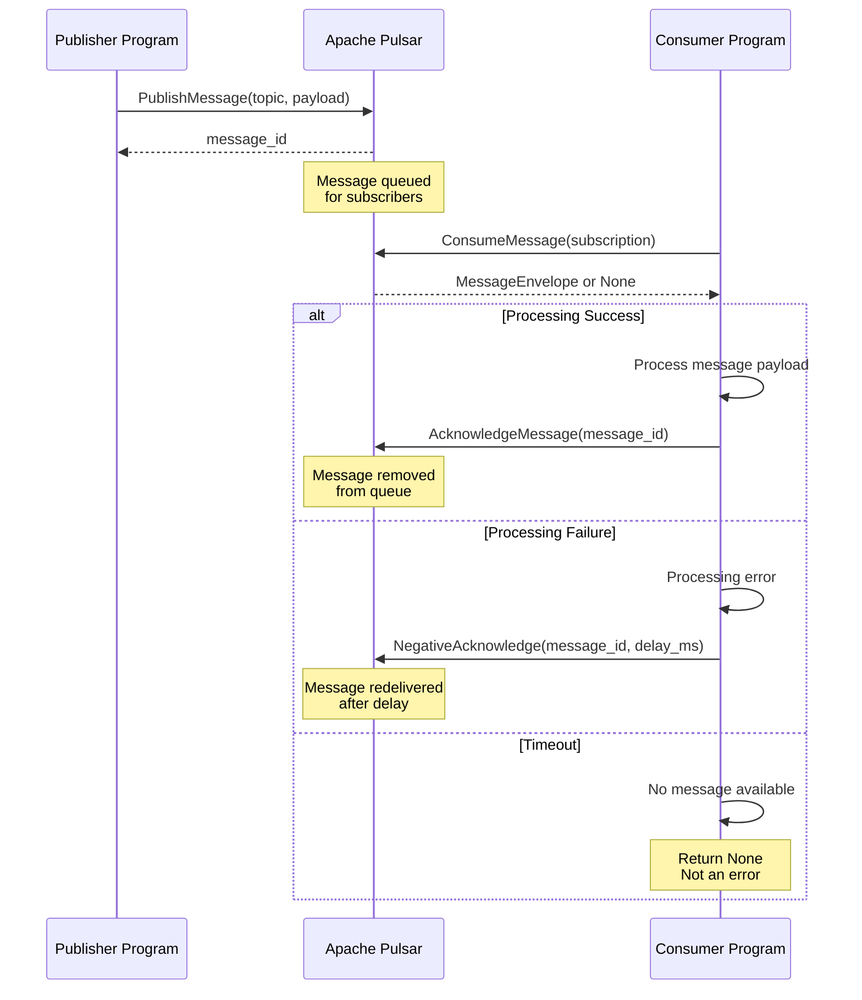

# Messaging Effects

This tutorial covers messaging effects for **Apache Pulsar** publish/subscribe workflows in **effectful**.

## Messaging Category

effectful provides messaging effects for pub/sub communication:

- **PublishMessage** - Publish messages to topics
- **ConsumeMessage** - Consume messages from subscriptions
- **AcknowledgeMessage** - Acknowledge successful processing
- **NegativeAcknowledge** - Reject message for redelivery

### Message Lifecycle

The following diagram shows the complete pub/sub message lifecycle:



**Key Properties:**
- **At-Least-Once Delivery**: Messages redelivered if not acknowledged
- **Timeout Handling**: `ConsumeMessage` returns `None` on timeout (not an error)
- **Redelivery Control**: Use `NegativeAcknowledge` with `delay_ms` for backoff
- **Idempotency**: Consumers must handle duplicate messages

## PublishMessage

Publish a message to a Pulsar topic.

```python
from effectful.effects.messaging import PublishMessage

def publish_event(event: str) -> Generator[AllEffects, EffectResult, str]:
    # Publish event to topic
    message_id = yield PublishMessage(
        topic="user-events",
        payload=event.encode("utf-8"),
        properties={"type": "event", "version": "1.0"}
    )

    # Type narrowing
    assert isinstance(message_id, str)

    return message_id
```

**Effect Signature:**
```python
@dataclass(frozen=True)
class PublishMessage:
    topic: str
    payload: bytes
    properties: dict[str, str] | None = None
```

**Returns:** `str` (message ID from Pulsar)

**Errors:** `MessagingError` with retryability flag

**Domain Results:**
```python
# Success case
@dataclass(frozen=True)
class PublishSuccess:
    message_id: str
    topic: str

# Failure cases
@dataclass(frozen=True)
class PublishFailure:
    topic: str
    reason: Literal["timeout", "quota_exceeded", "topic_not_found"]

type PublishResult = PublishSuccess | PublishFailure
```

### Publish Error Handling

PublishMessage can fail with specific reasons:

```python
def robust_publish(event: str) -> Generator[AllEffects, EffectResult, bool]:
    try:
        message_id = yield PublishMessage(
            topic="events",
            payload=event.encode("utf-8")
        )
        assert isinstance(message_id, str)
        return True
    except MessagingError as e:
        # Check if retryable
        if e.is_retryable:
            # timeout or quota_exceeded - can retry
            yield SendText(text=f"Publish failed (retryable): {e.messaging_error}")
        else:
            # topic_not_found - configuration error, don't retry
            yield SendText(text=f"Publish failed (permanent): {e.messaging_error}")
        return False
```

**Retryable failures:**
- `timeout` - Network timeout, backoff and retry
- `quota_exceeded` - Publisher queue full, backoff and retry

**Non-retryable failures:**
- `topic_not_found` - Topic doesn't exist, fix configuration

## ConsumeMessage

Receive a message from a Pulsar subscription.

```python
from effectful.effects.messaging import ConsumeMessage
from effectful.domain.message_envelope import MessageEnvelope

def consume_event() -> Generator[AllEffects, EffectResult, str]:
    # Consume with timeout
    envelope = yield ConsumeMessage(
        subscription="event-processor",
        timeout_ms=1000
    )

    # Handle timeout (not an error!)
    match envelope:
        case None:
            return "timeout"
        case MessageEnvelope(message_id=msg_id, payload=payload, properties=props):
            text = payload.decode("utf-8")
            return f"Received: {text} (ID: {msg_id})"
```

**Effect Signature:**
```python
@dataclass(frozen=True)
class ConsumeMessage:
    subscription: str
    timeout_ms: int = 5000  # Default 5 seconds
```

**Returns:** `MessageEnvelope | None`
- `MessageEnvelope` if message received
- `None` if timeout (not an error)

**Errors:** `MessagingError` if subscription access fails

**MessageEnvelope Model:**
```python
@dataclass(frozen=True)
class MessageEnvelope:
    message_id: str
    payload: bytes
    properties: dict[str, str]
    publish_time: datetime
    topic: str
```

### Consume Timeout Behavior

Timeout is **not an error** - it's a normal outcome:

```python
def poll_messages() -> Generator[AllEffects, EffectResult, int]:
    """Poll for messages until timeout."""
    count = 0

    while True:
        envelope = yield ConsumeMessage(
            subscription="my-sub",
            timeout_ms=1000
        )

        match envelope:
            case None:
                # No more messages - exit loop
                break
            case MessageEnvelope(message_id=msg_id):
                count += 1
                # Process message...
                yield AcknowledgeMessage(message_id=msg_id)

    return count
```

## AcknowledgeMessage

Acknowledge successful message processing.

```python
from effectful.effects.messaging import AcknowledgeMessage

def process_and_ack() -> Generator[AllEffects, EffectResult, bool]:
    # Consume message
    envelope = yield ConsumeMessage(subscription="my-sub", timeout_ms=1000)

    match envelope:
        case MessageEnvelope(message_id=msg_id, payload=payload):
            # Process message
            text = payload.decode("utf-8")
            yield SendText(text=f"Processing: {text}")

            # Acknowledge success
            yield AcknowledgeMessage(message_id=msg_id)
            return True
        case None:
            return False
```

**Effect Signature:**
```python
@dataclass(frozen=True)
class AcknowledgeMessage:
    message_id: str
```

**Returns:** `None`

**Errors:** `MessagingError` if acknowledgment fails (retryable)

### Acknowledgment Guarantees

- **At-least-once delivery**: Messages redelivered if not acknowledged
- **Idempotent processing**: Design processors to handle duplicate messages
- **Acknowledgment timeout**: Pulsar redelivers if ack not received in time

## NegativeAcknowledge

Reject a message for redelivery after processing failure.

```python
from effectful.effects.messaging import NegativeAcknowledge

def process_with_retry() -> Generator[AllEffects, EffectResult, str]:
    # Consume message
    envelope = yield ConsumeMessage(subscription="my-sub", timeout_ms=1000)

    match envelope:
        case MessageEnvelope(message_id=msg_id, payload=payload):
            # Try to process
            try:
                data = payload.decode("utf-8")

                # Validate
                if "invalid" in data.lower():
                    # Reject with delay - will be redelivered after 5 seconds
                    yield NegativeAcknowledge(message_id=msg_id, delay_ms=5000)
                    return "rejected"

                # Process successfully
                yield SendText(text=f"Processed: {data}")
                yield AcknowledgeMessage(message_id=msg_id)
                return "success"

            except Exception as e:
                # Processing error - reject with short delay for retry
                yield NegativeAcknowledge(message_id=msg_id, delay_ms=1000)
                return "error"
        case None:
            return "timeout"
```

**Effect Signature:**
```python
@dataclass(frozen=True)
class NegativeAcknowledge:
    message_id: str
    delay_ms: int = 0  # Redelivery delay in milliseconds
```

**Returns:** `None`

**Errors:** `MessagingError` if nack fails (retryable)

### Negative Acknowledgment Patterns

**Immediate redelivery** (delay_ms=0):
```python
# Temporary error - retry immediately
yield NegativeAcknowledge(message_id=msg_id, delay_ms=0)
```

**Delayed redelivery** (delay_ms > 0):
```python
# Rate limiting or backoff - retry after delay
yield NegativeAcknowledge(message_id=msg_id, delay_ms=5000)  # 5 seconds
```

**Permanent failure:**
```python
# After max retries, send to dead letter queue
# (Configured at subscription level in Pulsar)
```

## Composing Messaging Effects

### Publish-Consume Workflow

Complete end-to-end messaging workflow:

```python
def publish_consume_workflow(events: list[str]) -> Generator[AllEffects, EffectResult, dict[str, int]]:
    """Publish events, then consume and process them."""
    stats = {"published": 0, "processed": 0, "failed": 0}

    # Phase 1: Publish events
    for event in events:
        message_id = yield PublishMessage(
            topic="events",
            payload=event.encode("utf-8"),
            properties={"source": "workflow"}
        )
        assert isinstance(message_id, str)
        stats["published"] += 1

    # Phase 2: Consume and process
    while True:
        envelope = yield ConsumeMessage(
            subscription="event-processor",
            timeout_ms=1000
        )

        match envelope:
            case None:
                # No more messages
                break
            case MessageEnvelope(message_id=msg_id, payload=payload):
                # Process
                try:
                    text = payload.decode("utf-8")
                    yield SendText(text=f"Processing: {text}")

                    # Success - acknowledge
                    yield AcknowledgeMessage(message_id=msg_id)
                    stats["processed"] += 1
                except Exception:
                    # Failure - negative acknowledge
                    yield NegativeAcknowledge(message_id=msg_id, delay_ms=1000)
                    stats["failed"] += 1

    return stats
```

### Conditional Processing

Use pattern matching for message routing:

```python
def route_message() -> Generator[AllEffects, EffectResult, str]:
    """Route message based on properties."""
    envelope = yield ConsumeMessage(subscription="router", timeout_ms=1000)

    match envelope:
        case MessageEnvelope(message_id=msg_id, properties=props):
            # Route based on message type
            message_type = props.get("type", "unknown")

            match message_type:
                case "user_event":
                    # Republish to user-events topic
                    new_id = yield PublishMessage(
                        topic="user-events",
                        payload=envelope.payload,
                        properties=props
                    )
                    yield AcknowledgeMessage(message_id=msg_id)
                    return f"routed_to_user_events: {new_id}"

                case "system_event":
                    # Republish to system-events topic
                    new_id = yield PublishMessage(
                        topic="system-events",
                        payload=envelope.payload,
                        properties=props
                    )
                    yield AcknowledgeMessage(message_id=msg_id)
                    return f"routed_to_system_events: {new_id}"

                case _:
                    # Unknown type - reject
                    yield NegativeAcknowledge(message_id=msg_id, delay_ms=0)
                    return "unknown_type"
        case None:
            return "timeout"
```

### Reusable Sub-Programs

Create reusable message processing logic:

```python
def process_single_message(
    subscription: str
) -> Generator[AllEffects, EffectResult, str]:
    """Reusable: consume and process one message."""
    envelope = yield ConsumeMessage(subscription=subscription, timeout_ms=1000)

    match envelope:
        case None:
            return "timeout"
        case MessageEnvelope(message_id=msg_id, payload=payload):
            # Process payload
            text = payload.decode("utf-8")
            yield SendText(text=f"Processing: {text}")

            # Validate
            if len(text) < 10:
                yield NegativeAcknowledge(message_id=msg_id, delay_ms=5000)
                return "rejected"

            # Success
            yield AcknowledgeMessage(message_id=msg_id)
            return "success"

def batch_processor(
    subscription: str,
    batch_size: int
) -> Generator[AllEffects, EffectResult, int]:
    """Process batch of messages using sub-program."""
    processed = 0

    for _ in range(batch_size):
        # Delegate to sub-program
        result = yield from process_single_message(subscription)

        if result == "success":
            processed += 1
        elif result == "timeout":
            break  # No more messages

    return processed
```

## Error Handling

### Retryability Detection

MessagingError includes retryability flag:

```python
def handle_messaging_error() -> Generator[AllEffects, EffectResult, str]:
    try:
        message_id = yield PublishMessage(
            topic="events",
            payload=b"data"
        )
        return "success"
    except MessagingError as e:
        # Inspect error
        if e.is_retryable:
            # Transient error - safe to retry
            # Reasons: timeout, quota_exceeded, connection errors
            yield SendText(text=f"Retryable error: {e.messaging_error}")
            return "retry"
        else:
            # Permanent error - don't retry
            # Reasons: topic_not_found, authentication failed
            yield SendText(text=f"Permanent error: {e.messaging_error}")
            return "abort"
```

**Retryable patterns detected:**
- "connection" - Connection refused, connection timeout
- "timeout" - Request timeout, publish timeout
- "unavailable" - Service unavailable
- "backpressure" - Queue full, backpressure limit exceeded

**Non-retryable patterns:**
- "configuration" - Invalid configuration
- "authentication" - Authentication failed
- "authorization" - Permission denied
- "not_found" - Topic not found

### Testing Error Cases

Use pytest-mock to test error handling:

```python
@pytest.mark.asyncio
async def test_publish_failure(mocker):
    # Setup failing producer with pytest-mock
    mock_producer = mocker.AsyncMock(spec=MessageProducer)
    mock_producer.publish.side_effect = Exception("timeout")

    interpreter = MessagingInterpreter(
        producer=mock_producer,
        consumer=mocker.AsyncMock(spec=MessageConsumer)
    )

    # Run program
    result = await run_ws_program(my_publish_program(), interpreter)

    # Assert error
    match result:
        case Err(MessagingError(messaging_error=msg, is_retryable=True)):
            assert "timeout" in msg
```

## Production Deployment

### Pulsar Configuration

Install Apache Pulsar client:

```bash
pip install pulsar-client
```

Create production adapters:

```python
import pulsar
from effectful.adapters.pulsar_messaging import (
    PulsarMessageProducer,
    PulsarMessageConsumer,
)

# Initialize Pulsar client
client = pulsar.Client("pulsar://localhost:6650")

# Create adapters
producer = PulsarMessageProducer(client)
consumer = PulsarMessageConsumer(client)

# Create interpreter
interpreter = MessagingInterpreter(
    producer=producer,
    consumer=consumer
)

# Run programs
result = await run_ws_program(my_program(), interpreter)
```

### Subscription Patterns

**Exclusive subscription** (single consumer):
```python
# Only one consumer can subscribe
# Best for ordered processing
subscription = "my-topic/exclusive-sub"
```

**Shared subscription** (multiple consumers):
```python
# Multiple consumers share subscription
# Messages distributed round-robin
# Best for scalability
subscription = "my-topic/shared-sub"
```

**Failover subscription** (active-standby):
```python
# One active consumer, others on standby
# Automatic failover if active fails
# Best for high availability
subscription = "my-topic/failover-sub"
```

### Message Ordering

Pulsar guarantees ordering within a single partition:

```python
# Use message key for partitioning
message_id = yield PublishMessage(
    topic="events",
    payload=data,
    properties={"key": user_id}  # Messages with same key go to same partition
)
```

## Type Safety

### Effect Result Types

Messaging effects return specific types:

```python
# PublishMessage returns str (message ID)
message_id = yield PublishMessage(topic="events", payload=b"data")
assert isinstance(message_id, str)  # Type narrowing

# ConsumeMessage returns MessageEnvelope | None
envelope = yield ConsumeMessage(subscription="my-sub", timeout_ms=1000)
match envelope:
    case None:
        # Timeout
        pass
    case MessageEnvelope(message_id=msg_id):
        # Message received
        pass

# AcknowledgeMessage returns None
result = yield AcknowledgeMessage(message_id=msg_id)
# result is None

# NegativeAcknowledge returns None
result = yield NegativeAcknowledge(message_id=msg_id, delay_ms=1000)
# result is None
```

### Pattern Matching

Exhaustive matching for message handling:

```python
def handle_message() -> Generator[AllEffects, EffectResult, str]:
    envelope = yield ConsumeMessage(subscription="my-sub", timeout_ms=1000)

    match envelope:
        case None:
            return "timeout"
        case MessageEnvelope(message_id=msg_id, payload=payload):
            # Process message
            yield AcknowledgeMessage(message_id=msg_id)
            return "success"
        # mypy enforces exhaustive matching
```

## Testing Patterns

### Generator-Based Testing

Test programs by stepping through the generator:

```python
def test_publish_message():
    # Create generator
    def publish_program() -> Generator[AllEffects, EffectResult, str]:
        yield PublishMessage(
            topic="test-topic",
            payload=b"test data",
            properties={"key": "value"}
        )
        return "published"

    gen = publish_program()

    # Step through effects
    effect = next(gen)
    assert effect.__class__.__name__ == "PublishMessage"
    assert effect.topic == "test-topic"
    assert effect.payload == b"test data"

    # Send response
    try:
        gen.send(None)
    except StopIteration as e:
        result = e.value

    assert result == "published"
```

### Testing with pytest-mock

Use pytest-mock for interpreter-level testing:

```python
@pytest.mark.asyncio
async def test_consume_with_mock(mocker):
    # Setup mocks
    mock_consumer = mocker.AsyncMock(spec=MessageConsumer)
    envelope = MessageEnvelope(
        message_id="msg-1",
        payload=b"test data",
        properties={},
        publish_time=datetime.now(UTC),
        topic="test-topic"
    )
    mock_consumer.consume.return_value = envelope

    # Create interpreter
    interpreter = MessagingInterpreter(
        producer=mocker.AsyncMock(spec=MessageProducer),
        consumer=mock_consumer
    )

    # Run program
    result = await run_ws_program(consume_program(), interpreter)

    # Verify
    value = unwrap_ok(result)
    assert value == "success"
    mock_consumer.consume.assert_called_once()
```

### Testing Error Paths

Test error handling with side_effect:

```python
@pytest.mark.asyncio
async def test_consume_timeout(mocker):
    # Setup timeout
    mock_consumer = mocker.AsyncMock(spec=MessageConsumer)
    mock_consumer.consume.return_value = None  # Timeout

    interpreter = MessagingInterpreter(
        producer=mocker.AsyncMock(spec=MessageProducer),
        consumer=mock_consumer
    )

    # Run program
    result = await run_ws_program(consume_program(), interpreter)

    # Assert timeout handled
    match result:
        case Ok(value):
            assert value == "timeout"
```

## Next Steps

- [Example 05: Messaging Workflow](../../examples/05_messaging_workflow.py) - Complete working example
- [Tutorial 04: Testing Guide](04_testing_guide.md) - Comprehensive testing patterns
- [API Reference: Messaging](../api/messaging.md) - Complete messaging API documentation

---

**Previous**: [Tutorial 07: Migration Guide](07_migration_guide.md) | **Next**: [Example 05: Messaging Workflow](../../examples/05_messaging_workflow.py)
