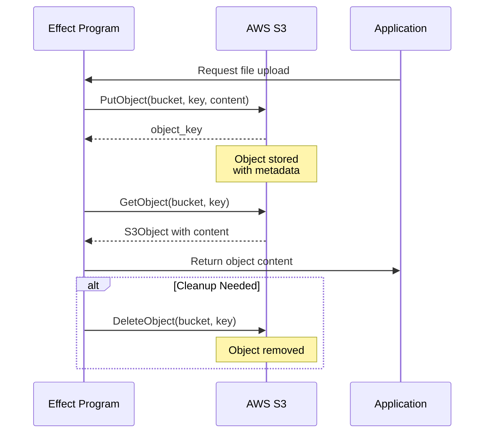

# Storage Effects

This tutorial covers storage effects for **AWS S3** object storage operations in **effectful**.

## Storage Category

effectful provides storage effects for object storage operations:

- **GetObject** - Retrieve objects from S3
- **PutObject** - Store objects in S3
- **DeleteObject** - Remove objects from S3
- **ListObjects** - List objects in buckets with prefix filtering

### Storage Workflow

The following diagram shows a typical storage workflow:



**Key Properties:**
- **Immutable Objects**: Once stored, objects are immutable (create new versions instead)
- **Idempotent Deletes**: Deleting non-existent objects is not an error
- **Metadata Support**: Attach custom metadata key-value pairs
- **Content Types**: Specify MIME types for proper handling

## GetObject

Retrieve an object from S3 storage.

```python
from effectful.effects.storage import GetObject
from effectful.domain.s3_object import S3Object

def download_file(file_key: str) -> Generator[AllEffects, EffectResult, bytes]:
    # Retrieve object from S3
    s3_object = yield GetObject(
        bucket="my-bucket",
        key=file_key
    )

    # Handle missing object
    match s3_object:
        case None:
            yield SendText(text="File not found")
            return b""
        case S3Object(content=content, metadata=meta):
            yield SendText(text=f"Downloaded {len(content)} bytes")
            return content
```

**Effect Signature:**
```python
@dataclass(frozen=True)
class GetObject:
    bucket: str
    key: str
```

**Returns:** `S3Object | None`
- `S3Object` if object exists
- `None` if object does not exist (not an error)

**Errors:** `StorageError` with retryability flag for permission/network errors

**S3Object Model:**
```python
@dataclass(frozen=True)
class S3Object:
    key: str
    content: bytes
    metadata: dict[str, str]
    content_type: str | None
    last_modified: datetime
    size: int
```

### Get Error Handling

GetObject returns `None` for missing objects, but raises `StorageError` for other failures:

```python
def robust_download(key: str) -> Generator[AllEffects, EffectResult, str]:
    try:
        s3_object = yield GetObject(bucket="my-bucket", key=key)

        match s3_object:
            case None:
                # Not found - not an error
                return "not_found"
            case S3Object(content=content):
                # Success
                yield SendText(text=f"Downloaded {len(content)} bytes")
                return "success"

    except StorageError as e:
        # Permission denied, network error, etc.
        if e.is_retryable:
            # Network timeout, service unavailable - retry
            yield SendText(text=f"Retrieval failed (retryable): {e.storage_error}")
            return "retry"
        else:
            # Permission denied, bucket not found - don't retry
            yield SendText(text=f"Retrieval failed (permanent): {e.storage_error}")
            return "abort"
```

**Retryable failures:**
- Network timeouts
- Service unavailable (503)
- Rate limiting (429)

**Non-retryable failures:**
- Permission denied (403)
- Bucket not found (404)
- Invalid bucket name

## PutObject

Store an object in S3 storage with metadata and content type.

```python
from effectful.effects.storage import PutObject

def upload_file(data: bytes, filename: str) -> Generator[AllEffects, EffectResult, str]:
    # Store object with metadata
    object_key = yield PutObject(
        bucket="my-bucket",
        key=f"uploads/{filename}",
        content=data,
        metadata={
            "uploaded-by": "user-123",
            "upload-time": datetime.now(UTC).isoformat(),
            "original-filename": filename
        },
        content_type="application/octet-stream"
    )

    # Type narrowing
    assert isinstance(object_key, str)

    yield SendText(text=f"Uploaded: {object_key}")
    return object_key
```

**Effect Signature:**
```python
@dataclass(frozen=True)
class PutObject:
    bucket: str
    key: str
    content: bytes
    metadata: dict[str, str] | None = None
    content_type: str | None = None
```

**Returns:** `str` (object key that was stored)

**Errors:** `StorageError` with retryability flag

**Domain Results:**
```python
# Success case
@dataclass(frozen=True)
class UploadSuccess:
    object_key: str
    size: int
    bucket: str

# Failure cases
@dataclass(frozen=True)
class UploadFailure:
    key: str
    reason: Literal["quota_exceeded", "invalid_key", "permission_denied"]

type UploadResult = UploadSuccess | UploadFailure
```

### Put Error Handling

PutObject can fail with specific reasons:

```python
def robust_upload(data: bytes, key: str) -> Generator[AllEffects, EffectResult, bool]:
    try:
        object_key = yield PutObject(
            bucket="my-bucket",
            key=key,
            content=data,
            content_type="text/plain"
        )
        assert isinstance(object_key, str)
        yield SendText(text=f"Stored: {object_key}")
        return True

    except StorageError as e:
        if e.is_retryable:
            # Quota exceeded, rate limiting - can retry
            yield SendText(text=f"Upload failed (retryable): {e.storage_error}")
        else:
            # Permission denied, invalid bucket - configuration error
            yield SendText(text=f"Upload failed (permanent): {e.storage_error}")
        return False
```

**Retryable failures:**
- `quota_exceeded` - Storage quota limit reached, retry later
- `rate_limited` - Too many requests, backoff and retry
- Network timeouts

**Non-retryable failures:**
- `permission_denied` - Insufficient permissions
- `invalid_key` - Invalid object key format
- `bucket_not_found` - Bucket doesn't exist

## DeleteObject

Remove an object from S3 storage. Idempotent operation - deleting non-existent objects is not an error.

```python
from effectful.effects.storage import DeleteObject

def cleanup_file(file_key: str) -> Generator[AllEffects, EffectResult, bool]:
    # Delete object (idempotent)
    yield DeleteObject(bucket="my-bucket", key=file_key)
    yield SendText(text="File deleted")
    return True
```

**Effect Signature:**
```python
@dataclass(frozen=True)
class DeleteObject:
    bucket: str
    key: str
```

**Returns:** `None` (deletion always succeeds)

**Errors:** `StorageError` only for permission/network errors, NOT for missing objects

### Delete Idempotency

Deleting non-existent objects is a successful no-op:

```python
def safe_cleanup(keys: list[str]) -> Generator[AllEffects, EffectResult, int]:
    """Delete multiple objects - no errors for missing files."""
    deleted = 0

    for key in keys:
        try:
            yield DeleteObject(bucket="my-bucket", key=key)
            deleted += 1
        except StorageError as e:
            # Only fails for permission/network issues
            yield SendText(text=f"Delete failed for {key}: {e.storage_error}")

    yield SendText(text=f"Deleted {deleted}/{len(keys)} objects")
    return deleted
```

**Key Properties:**
- Deleting non-existent object returns success
- No need to check existence before deleting
- Only fails for permission denied or network errors
- Atomic operation - either succeeds or raises error

## ListObjects

List objects in a bucket with optional prefix filtering and pagination.

```python
from effectful.effects.storage import ListObjects

def list_user_files(user_id: str) -> Generator[AllEffects, EffectResult, int]:
    # List all objects under user's prefix
    keys = yield ListObjects(
        bucket="my-bucket",
        prefix=f"users/{user_id}/",
        max_keys=100
    )

    # Type narrowing
    assert isinstance(keys, list)

    yield SendText(text=f"Found {len(keys)} files for user {user_id}")
    return len(keys)
```

**Effect Signature:**
```python
@dataclass(frozen=True)
class ListObjects:
    bucket: str
    prefix: str | None = None
    max_keys: int = 1000
```

**Returns:** `list[str]` (list of object keys)

**Errors:** `StorageError` for permission/bucket access failures

### List Pagination

Handle large result sets with pagination:

```python
def list_all_objects(prefix: str) -> Generator[AllEffects, EffectResult, list[str]]:
    """List all objects, handling pagination automatically."""
    all_keys: list[str] = []
    marker: str | None = None

    while True:
        # List batch of objects
        keys = yield ListObjects(
            bucket="my-bucket",
            prefix=prefix,
            max_keys=1000
        )
        assert isinstance(keys, list)

        if not keys:
            # No more objects
            break

        all_keys.extend(keys)
        marker = keys[-1]  # Use last key as marker for next batch

        # Check if we got fewer than max_keys (last page)
        if len(keys) < 1000:
            break

    yield SendText(text=f"Total objects: {len(all_keys)}")
    return all_keys
```

### Prefix Filtering

Use prefix filtering for hierarchical organization:

```python
def list_by_category() -> Generator[AllEffects, EffectResult, dict[str, int]]:
    """Count objects by category prefix."""
    categories = ["images/", "documents/", "videos/"]
    counts: dict[str, int] = {}

    for category in categories:
        keys = yield ListObjects(
            bucket="my-bucket",
            prefix=category,
            max_keys=1000
        )
        assert isinstance(keys, list)
        counts[category] = len(keys)

    return counts
```

## Composing Storage Effects

### Upload-Download Workflow

Complete end-to-end storage workflow:

```python
def upload_process_download(
    input_key: str,
    output_key: str
) -> Generator[AllEffects, EffectResult, bool]:
    """Download file, process it, upload result."""

    # Step 1: Download input file
    s3_object = yield GetObject(bucket="input-bucket", key=input_key)

    match s3_object:
        case None:
            yield SendText(text="Input file not found")
            return False
        case S3Object(content=content):
            yield SendText(text=f"Downloaded {len(content)} bytes")

    # Step 2: Process content (example: uppercase text)
    processed = content.upper()

    # Step 3: Upload processed result
    try:
        result_key = yield PutObject(
            bucket="output-bucket",
            key=output_key,
            content=processed,
            metadata={"source": input_key, "processed": "true"},
            content_type="text/plain"
        )
        assert isinstance(result_key, str)

        yield SendText(text=f"Uploaded processed result: {result_key}")
        return True

    except StorageError as e:
        yield SendText(text=f"Upload failed: {e.storage_error}")
        return False
```

### Conditional Storage

Use pattern matching for conditional storage:

```python
def store_if_not_exists(
    key: str,
    content: bytes
) -> Generator[AllEffects, EffectResult, str]:
    """Only store object if it doesn't already exist."""

    # Check if object exists
    existing = yield GetObject(bucket="my-bucket", key=key)

    match existing:
        case S3Object():
            # Already exists
            yield SendText(text=f"Object {key} already exists")
            return "exists"

        case None:
            # Doesn't exist - store it
            object_key = yield PutObject(
                bucket="my-bucket",
                key=key,
                content=content
            )
            assert isinstance(object_key, str)
            yield SendText(text=f"Stored new object: {object_key}")
            return "created"
```

### Batch Operations

Process multiple objects efficiently:

```python
def batch_upload(files: dict[str, bytes]) -> Generator[AllEffects, EffectResult, dict[str, str]]:
    """Upload multiple files in batch."""
    results: dict[str, str] = {}  # filename -> status

    for filename, content in files.items():
        try:
            object_key = yield PutObject(
                bucket="my-bucket",
                key=f"batch/{filename}",
                content=content,
                metadata={"batch": "true"}
            )
            assert isinstance(object_key, str)
            results[filename] = "success"

        except StorageError as e:
            if e.is_retryable:
                results[filename] = "retry"
            else:
                results[filename] = "failed"

    # Summarize results
    success_count = sum(1 for status in results.values() if status == "success")
    yield SendText(text=f"Uploaded {success_count}/{len(files)} files")

    return results
```

### Reusable Sub-Programs

Create reusable storage logic:

```python
def download_or_default(
    key: str,
    default: bytes
) -> Generator[AllEffects, EffectResult, bytes]:
    """Reusable: download object or return default if not found."""
    s3_object = yield GetObject(bucket="my-bucket", key=key)

    match s3_object:
        case S3Object(content=content):
            return content
        case None:
            return default

def process_with_fallback(key: str) -> Generator[AllEffects, EffectResult, str]:
    """Use sub-program for download with fallback."""
    # Delegate to sub-program
    content = yield from download_or_default(key, default=b"empty")

    # Process content
    text = content.decode("utf-8")
    yield SendText(text=f"Processing: {text}")

    return text
```

## Error Handling

### Retryability Detection

StorageError includes retryability flag:

```python
def handle_storage_error() -> Generator[AllEffects, EffectResult, str]:
    try:
        object_key = yield PutObject(
            bucket="my-bucket",
            key="data/file.txt",
            content=b"data"
        )
        return "success"

    except StorageError as e:
        # Inspect error
        if e.is_retryable:
            # Transient error - safe to retry
            # Reasons: timeout, rate_limited, quota_exceeded
            yield SendText(text=f"Retryable error: {e.storage_error}")
            return "retry"
        else:
            # Permanent error - don't retry
            # Reasons: permission_denied, bucket_not_found, invalid_key
            yield SendText(text=f"Permanent error: {e.storage_error}")
            return "abort"
```

**Retryable patterns detected:**
- "timeout" - Request timeout, network timeout
- "unavailable" - Service unavailable (503)
- "rate" - Rate limiting, throttling
- "quota" - Storage quota exceeded

**Non-retryable patterns:**
- "permission" - Permission denied (403)
- "not_found" - Bucket not found (404)
- "invalid" - Invalid bucket/key name
- "authentication" - Authentication failed

### Testing Error Cases

Use failing fakes to test error handling:

```python
from effectful.testing.failing import FailingStorageAdapter

@pytest.mark.asyncio
async def test_upload_failure():
    # Setup failing storage
    failing_storage = FailingStorageAdapter(reason="quota_exceeded")
    interpreter = StorageInterpreter(storage=failing_storage)

    # Run program
    result = await run_ws_program(my_upload_program(), interpreter)

    # Assert error
    match result:
        case Err(StorageError(storage_error=msg, is_retryable=True)):
            assert "quota" in msg
```

## Production Deployment

### AWS S3 Configuration

Install AWS SDK:

```bash
pip install boto3
```

Create production adapters:

```python
import boto3
from effectful.adapters.s3_storage import S3StorageAdapter

# Initialize S3 client
s3_client = boto3.client(
    "s3",
    region_name="us-west-2",
    aws_access_key_id="YOUR_ACCESS_KEY",
    aws_secret_access_key="YOUR_SECRET_KEY"
)

# Create adapter
storage = S3StorageAdapter(client=s3_client)

# Create interpreter
interpreter = StorageInterpreter(storage=storage)

# Run programs
result = await run_ws_program(my_program(), interpreter)
```

### Bucket Organization

**Flat structure** (simple):
```python
# All objects at root level
"file1.txt"
"file2.txt"
"file3.txt"
```

**Hierarchical structure** (recommended):
```python
# Use prefixes for organization (S3 doesn't have real directories)
"users/user-123/profile.jpg"
"users/user-123/documents/file.pdf"
"images/thumbnails/img-1.jpg"
"images/originals/img-1.jpg"
```

**Time-based partitioning**:
```python
# Partition by date for efficient queries
"logs/2025/01/19/app.log"
"uploads/2025/01/user-123/file.txt"
```

### Object Versioning

S3 versioning must be configured at bucket level:

```python
# Versioning enabled - S3 keeps all versions
object_key = yield PutObject(
    bucket="versioned-bucket",
    key="data/file.txt",
    content=b"version 2"
)
# Old version preserved automatically by S3
```

### Lifecycle Policies

Configure lifecycle policies for automatic cleanup:

```python
# Example: Delete objects after 30 days
# (Configured in S3 bucket lifecycle rules, not in code)

# Tag objects for lifecycle rules
object_key = yield PutObject(
    bucket="my-bucket",
    key="temp/file.txt",
    content=data,
    metadata={"lifecycle": "delete-after-30-days"}
)
```

## Type Safety

### Effect Result Types

Storage effects return specific types:

```python
# GetObject returns S3Object | None
s3_object = yield GetObject(bucket="my-bucket", key="file.txt")
match s3_object:
    case None:
        # Not found
        pass
    case S3Object(content=content, metadata=meta):
        # Object retrieved
        pass

# PutObject returns str (object key)
object_key = yield PutObject(bucket="my-bucket", key="file.txt", content=b"data")
assert isinstance(object_key, str)  # Type narrowing

# DeleteObject returns None
result = yield DeleteObject(bucket="my-bucket", key="file.txt")
# result is None

# ListObjects returns list[str]
keys = yield ListObjects(bucket="my-bucket", prefix="data/")
assert isinstance(keys, list)  # Type narrowing
for key in keys:
    assert isinstance(key, str)
```

### Pattern Matching

Exhaustive matching for storage results:

```python
def handle_storage_result() -> Generator[AllEffects, EffectResult, str]:
    s3_object = yield GetObject(bucket="my-bucket", key="file.txt")

    match s3_object:
        case None:
            return "not_found"
        case S3Object(content=content, size=size):
            # Process object
            yield SendText(text=f"Downloaded {size} bytes")
            return "success"
        # mypy enforces exhaustive matching
```

## Testing Patterns

### Using Fakes

Fakes provide in-memory storage for tests:

```python
from effectful.testing.fakes import FakeStorageAdapter

@pytest.mark.asyncio
async def test_upload_download():
    # Setup fake storage
    fake_storage = FakeStorageAdapter()

    # Pre-populate storage
    fake_storage._objects["my-bucket/existing.txt"] = S3Object(
        key="existing.txt",
        content=b"test data",
        metadata={},
        content_type="text/plain",
        last_modified=datetime.now(UTC),
        size=9
    )

    # Create interpreter
    interpreter = StorageInterpreter(storage=fake_storage)

    # Run program
    result = await run_ws_program(my_program(), interpreter)

    # Inspect state
    assert "my-bucket/new.txt" in fake_storage._objects
    assert fake_storage._objects["my-bucket/new.txt"].content == b"new data"
```

### Using Failing Variants

Test error paths with failing implementations:

```python
from effectful.testing.failing import FailingStorageAdapter

@pytest.mark.asyncio
async def test_upload_quota_exceeded():
    # Setup failing storage
    failing_storage = FailingStorageAdapter(
        fail_on_put=True,
        error_message="Storage quota exceeded"
    )

    interpreter = StorageInterpreter(storage=failing_storage)

    # Run program
    result = await run_ws_program(upload_program(), interpreter)

    # Assert error
    match result:
        case Err(StorageError(storage_error=msg, is_retryable=True)):
            assert "quota" in msg
```

## Next Steps

- [Example 06: Storage Workflow](../../examples/06_storage_workflow.py) - Complete working example
- [Tutorial 04: Testing Guide](04_testing_guide.md) - Comprehensive testing patterns
- [API Reference: Storage](../api/storage.md) - Complete storage API documentation

---

**Previous**: [Tutorial 08: Messaging Effects](08_messaging_effects.md) | **Next**: [Example 06: Storage Workflow](../../examples/06_storage_workflow.py)
