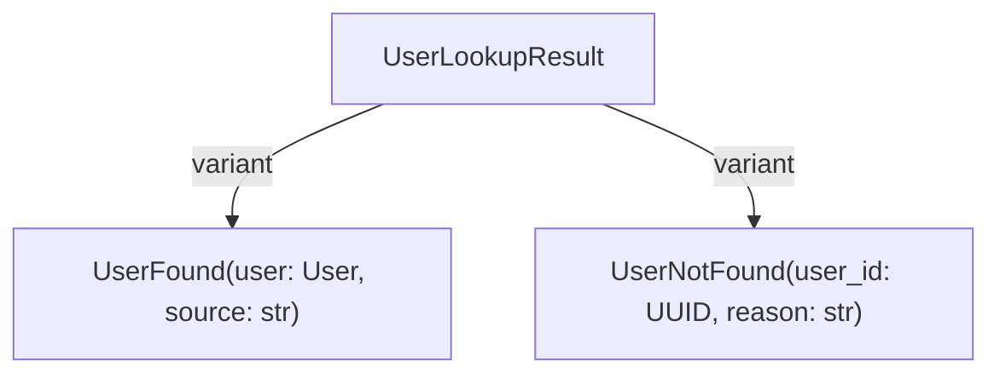
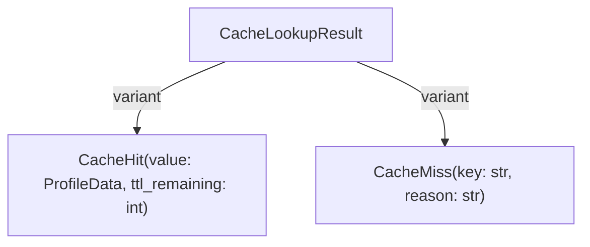
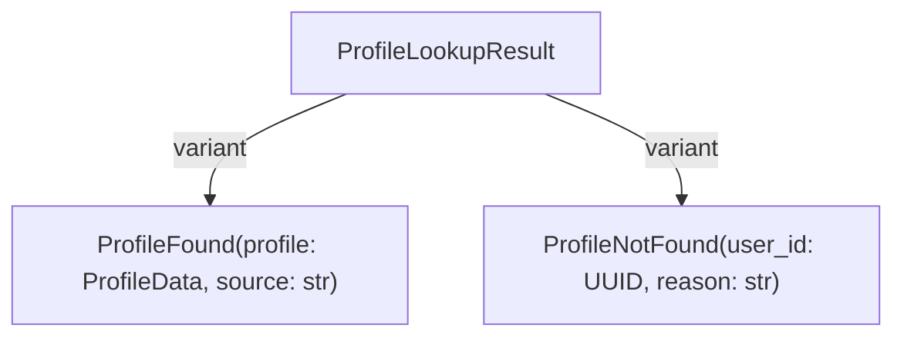

# ADTs and Result Types

**Status**: Authoritative source\
**Supersedes**: none\
**Referenced by**: documents/readme.md

> **Purpose**: Tutorial on using Algebraic Data Types (ADTs) and the Result type to write type-safe, self-documenting code.

> **Core Doctrine**: For the complete type safety patterns and diagrams, see [Code Quality](../engineering/code_quality.md#type-safety-doctrines).

## Prerequisites

- Docker workflow running; commands executed via `docker compose ... exec effectful`.
- Completed [Tutorial 01: Quickstart](quickstart.md) and [Tutorial 02: Effect Types](effect_types.md).
- Familiarity with Result/ADT philosophy in [Code Quality](../engineering/code_quality.md).

## Learning Objectives

- Model failures and alternatives with explicit ADTs instead of `Optional` or exceptions.
- Use the Result type to encode success/failure and exhaustively pattern match in programs.
- Test ADT- and Result-based flows with deterministic generator stepping.

## Step 1: Why ADTs?

### The Problem with Optional

```python
# file: examples/03_adts_and_results.py
# ❌ BAD - Optional hides information
from typing import Optional

async def get_user(user_id: UUID) -> Optional[User]:
    user = await db.query(...)
    return user  # Why None? Not found? Deleted? Access denied? Timeout?
```

**Problems:**

- Why is it `None`? Impossible to know without reading implementation
- Caller can't handle different failure cases differently
- No documentation of failure modes

### The Solution: ADTs

```python
# file: examples/03_adts_and_results.py
# ✅ GOOD - ADT makes all cases explicit
from dataclasses import dataclass

@dataclass(frozen=True)
class UserFound:
    user: User
    source: str  # "database" | "cache"

@dataclass(frozen=True)
class UserNotFound:
    user_id: UUID
    reason: str  # "does_not_exist" | "deleted" | "access_denied"

type UserLookupResult = UserFound | UserNotFound

async def get_user(user_id: UUID) -> UserLookupResult:
    ...
```



**Benefits:**

- All cases **explicit** and **self-documenting**
- Caller **forced to handle** all cases (type checker enforces)
- Easy to **add new cases** (type errors guide extensions)

### Visual Comparison: Optional vs ADT

> **Diagram**: See the ADT vs Optional comparison diagram in [Code Quality](../engineering/code_quality.md#2-adts-over-optional-types).

**Key Differences:**

- **Optional**: Single `None` value, many possible meanings (ambiguous)
- **ADT**: Distinct types for each case, explicit data for each scenario
- **Optional**: No guidance on why failure occurred
- **ADT**: Each variant carries context (reason, source, metadata)
- **Optional**: Easy to forget to check for `None`
- **ADT**: Type checker enforces exhaustive pattern matching

## Step 2: Define ADTs

### Basic Pattern

```python
# file: examples/03_adts_and_results.py
from dataclasses import dataclass

# Step 1: Define variants (frozen dataclasses)
@dataclass(frozen=True)
class Success:
    value: int

@dataclass(frozen=True)
class Failure:
    error: str

# Step 2: Define union type (PEP 695 syntax)
type Outcome = Success | Failure
```

### Real Example: Cache Lookup

```python
# file: examples/03_adts_and_results.py
from dataclasses import dataclass
from uuid import UUID

@dataclass(frozen=True)
class CacheHit:
    """Cache contained the value."""
    value: ProfileData
    ttl_remaining: int  # seconds until expiry

@dataclass(frozen=True)
class CacheMiss:
    """Cache did not contain the value."""
    key: str
    reason: str  # "not_found" | "expired" | "evicted"

type CacheLookupResult = CacheHit | CacheMiss

# Usage
async def get_profile(user_id: UUID) -> CacheLookupResult:
    profile = await cache.get(str(user_id))
    if profile is not None:
        return CacheHit(value=profile, ttl_remaining=300)
    return CacheMiss(key=str(user_id), reason="not_found")
```



## Step 3: Pattern match on ADTs

### Exhaustive Matching

```python
# file: examples/03_adts_and_results.py
def handle_cache_result(result: CacheLookupResult) -> str:
    match result:
        case CacheHit(value=profile, ttl_remaining=ttl):
            return f"Found {profile.name} (expires in {ttl}s)"
        case CacheMiss(key=key, reason=reason):
            return f"Miss for {key}: {reason}"
        # mypy enforces exhaustive matching - no case forgotten!
```

### Extracting Values

```python
# file: examples/03_adts_and_results.py
def program() -> Generator[AllEffects, EffectResult, str]:
    cached = yield GetCachedProfile(user_id=user_id)

    # Pattern match with extraction
    match cached:
        case ProfileData(name=name, email=email):
            # name and email are extracted
            yield SendText(text=f"{name} ({email})")
            return "cache_hit"
        case _:
            # Cache miss
            return "cache_miss"
```

### Nested Matching

```python
# file: examples/03_adts_and_results.py
def complex_workflow(user_id: UUID) -> Generator[AllEffects, EffectResult, str]:
    # Try cache first
    cached = yield GetCachedProfile(user_id=user_id)

    match cached:
        case ProfileData(name=name):
            # Cache hit - use it
            yield SendText(text=f"Hello {name} (cached)!")
            return "cache_hit"
        case _:
            # Cache miss - lookup user
            user_result = yield GetUserById(user_id=user_id)

            match user_result:
                case UserNotFound():
                    yield SendText(text="User not found")
                    return "not_found"
                case User(name=name, email=email):
                    # Found - cache and use
                    profile = ProfileData(id=str(user_id), name=name, email=email)
                    yield PutCachedProfile(user_id=user_id, profile_data=profile, ttl_seconds=300)
                    yield SendText(text=f"Hello {name}!")
                    return "success"
```

## Step 4: Use the Result type

### The Problem with Exceptions

```python
# file: examples/03_adts_and_results.py
# ❌ BAD - Exceptions invisible in signature
async def divide(a: int, b: int) -> float:
    if b == 0:
        raise ValueError("Division by zero")  # Invisible!
    return a / b

# Caller has no idea this can raise
result = await divide(10, 0)  # Surprise exception!
```

**Problems:**

- Exceptions **not in signature** (invisible failure modes)
- Easy to **forget error handling** (no type checker enforcement)
- **Invisible control flow** (try/except archaeology)

### The Solution: Result Type

```python
# file: examples/03_adts_and_results.py
# ✅ GOOD - Errors explicit in signature
from effectful.algebraic.result import Result, Ok, Err

def divide(a: int, b: int) -> Result[float, str]:
    if b == 0:
        return Err("Division by zero")  # Explicit error
    return Ok(a / b)  # Explicit success

# Caller MUST handle error
result = divide(10, 0)
match result:
    case Ok(value):
        print(f"Result: {value}")
    case Err(error):
        print(f"Error: {error}")
```

**Benefits:**

- Errors **visible in type signature**
- Type checker **enforces error handling**
- **Explicit control flow** (no hidden exceptions)

### Result Definition

```python
# file: examples/03_adts_and_results.py
from dataclasses import dataclass
from typing import TypeVar

T = TypeVar("T")  # Success type
E = TypeVar("E")  # Error type

@dataclass(frozen=True)
class Ok[T]:
    """Success case containing value."""
    value: T

@dataclass(frozen=True)
class Err[E]:
    """Failure case containing error."""
    error: E

type Result[T, E] = Ok[T] | Err[E]
```

### Using Result

#### Basic Usage

```python
# file: examples/03_adts_and_results.py
from effectful.algebraic.result import Result, Ok, Err

def parse_int(s: str) -> Result[int, str]:
    """Parse string to int, returning Result."""
    try:
        return Ok(int(s))
    except ValueError:
        return Err(f"Not a valid integer: {s}")

# Usage
result = parse_int("42")
match result:
    case Ok(value):
        print(f"Parsed: {value}")
    case Err(error):
        print(f"Error: {error}")
```

#### In Effect Programs

```python
# file: examples/03_adts_and_results.py
from effectful import run_ws_program
from effectful.interpreters.errors import InterpreterError

async def execute() -> None:
    # run_ws_program returns Result[T, InterpreterError]
    result: Result[str, InterpreterError] = await run_ws_program(
        my_program(),
        interpreter
    )

    match result:
        case Ok(value):
            print(f"Program succeeded: {value}")
        case Err(error):
            # error is one of: DatabaseError | WebSocketClosedError | CacheError
            print(f"Program failed: {error}")
```

#### Error Type Matching

```python
# file: examples/03_adts_and_results.py
from effectful.interpreters.errors import DatabaseError, WebSocketClosedError

result = await run_ws_program(program(), interpreter)

match result:
    case Ok(value):
        print(f"Success: {value}")
    case Err(DatabaseError(db_error=error, is_retryable=True)):
        print(f"Retryable DB error: {error}")
        # Retry logic
    case Err(DatabaseError(db_error=error, is_retryable=False)):
        print(f"Fatal DB error: {error}")
        # Give up
    case Err(WebSocketClosedError(close_code=code)):
        print(f"WebSocket closed: {code}")
    case Err(error):
        print(f"Other error: {error}")
```

### Transforming Results

#### Map (Transform Success)

```python
# file: examples/03_adts_and_results.py
def map_result(result: Result[int, str]) -> Result[str, str]:
    """Transform Ok value, preserve Err."""
    match result:
        case Ok(value):
            return Ok(f"Value: {value}")
        case Err(error):
            return Err(error)

# Example
result = Ok(42)
mapped = map_result(result)  # Ok("Value: 42")

result = Err("failed")
mapped = map_result(result)  # Err("failed")
```

#### Map Error (Transform Failure)

```python
# file: examples/03_adts_and_results.py
def map_error(result: Result[int, str]) -> Result[int, int]:
    """Transform Err value, preserve Ok."""
    match result:
        case Ok(value):
            return Ok(value)
        case Err(error):
            return Err(len(error))  # Convert error to error length

# Example
result = Err("failed")
mapped = map_error(result)  # Err(6)
```

#### FlatMap (Chain Operations)

```python
# file: examples/03_adts_and_results.py
def flat_map(
    result: Result[int, str],
    f: Callable[[int], Result[str, str]]
) -> Result[str, str]:
    """Chain operations that return Result."""
    match result:
        case Ok(value):
            return f(value)  # f returns Result
        case Err(error):
            return Err(error)

# Example
def double_then_stringify(n: int) -> Result[str, str]:
    if n > 100:
        return Err("Too large to double")
    return Ok(str(n * 2))

result = Ok(42)
chained = flat_map(result, double_then_stringify)  # Ok("84")

result = Ok(60)
chained = flat_map(result, double_then_stringify)  # Err("Too large to double")
```

## Step 5: Model domains with ADTs

### User Lookup

```python
# file: examples/03_adts_and_results.py
from dataclasses import dataclass
from uuid import UUID

@dataclass(frozen=True)
class UserFound:
    """User exists and was retrieved."""
    user: User
    source: str  # Where found: "database" | "cache"

@dataclass(frozen=True)
class UserNotFound:
    """User does not exist or is not accessible."""
    user_id: UUID
    reason: str  # Why not found: "does_not_exist" | "deleted" | "access_denied"

type UserLookupResult = UserFound | UserNotFound

# Usage in programs
def program(user_id: UUID) -> Generator[AllEffects, EffectResult, str]:
    user_result = yield GetUserById(user_id=user_id)

    match user_result:
        case UserNotFound(user_id=uid, reason=reason):
            return f"User {uid} not found: {reason}"
        case User(name=name):
            return f"Hello {name}"
```

### Profile Lookup

```python
# file: examples/03_adts_and_results.py
from dataclasses import dataclass

@dataclass(frozen=True)
class ProfileFound:
    """Profile was found (cache or database)."""
    profile: ProfileData
    source: str  # "cache" | "database"

@dataclass(frozen=True)
class ProfileNotFound:
    """Profile could not be retrieved."""
    user_id: UUID
    reason: str  # "cache_miss_no_user" | "user_has_no_profile" | "access_denied"

type ProfileLookupResult = ProfileFound | ProfileNotFound

# Composed workflow
def get_profile_with_fallback(user_id: UUID) -> Generator[AllEffects, EffectResult, ProfileLookupResult]:
    """Try cache, fall back to database."""
    # Try cache first
    cached = yield GetCachedProfile(user_id=user_id)

    match cached:
        case ProfileData() as profile:
            return ProfileFound(profile=profile, source="cache")
        case _:
            # Cache miss - try database
            user_result = yield GetUserById(user_id=user_id)

            match user_result:
                case UserNotFound():
                    return ProfileNotFound(user_id=user_id, reason="cache_miss_no_user")
                case User(name=name, email=email):
                    profile = ProfileData(id=str(user_id), name=name, email=email)
                    # Cache for next time
                    yield PutCachedProfile(user_id=user_id, profile_data=profile, ttl_seconds=300)
                    return ProfileFound(profile=profile, source="database")
```



______________________________________________________________________

## Step 6: OptionalValue - The Pre-Built ADT

### When Custom ADTs Are Overkill

You've learned to create custom ADTs like `UserFound | UserNotFound | UserDeleted`. But sometimes a simpler approach is better.

**Example: Patient Demographics**

```python
# ❌ Overly complex for generic optional fields
@dataclass(frozen=True)
class BloodTypeProvided:
    value: str

@dataclass(frozen=True)
class BloodTypeNotProvided:
    pass

type BloodTypeField = BloodTypeProvided | BloodTypeNotProvided

# ✅ Better: Use OptionalValue for generic presence/absence
from effectful.domain.optional_value import OptionalValue, Provided, Absent

@dataclass(frozen=True)
class Patient:
    id: UUID
    name: str
    blood_type: OptionalValue[str]  # Simple: present or absent
```

### The OptionalValue ADT

OptionalValue is a pre-built ADT with two variants:

- `Provided[T]` - Value is present
- `Absent[T]` - Value is intentionally missing with a reason

```python
# snippet
from effectful.domain.optional_value import OptionalValue, Provided, Absent, to_optional_value

# Construction
blood_type = Provided(value="O+")
blood_type = Absent(reason="not_provided")
blood_type = to_optional_value("O+")  # Helper: T | None → OptionalValue[T]
blood_type = to_optional_value(None)  # → Absent(reason="not_provided")

# Pattern matching
match patient.blood_type:
    case Provided(value=bt):
        print(f"Blood type: {bt}")
    case Absent(reason=r):
        print(f"Blood type unknown: {r}")
```

### Decision Tree: When to Use What?

```text
# optional type decision tree
Does the field have domain-specific absence reasons?
├─ YES → Custom ADT (UserFound | UserNotFound | UserDeleted)
└─ NO → Is it optional with generic "not provided" semantics?
    ├─ YES → OptionalValue[T]
    └─ NO → Use concrete type (not optional)
```

**Examples:**

| Field              | Choice              | Reason                                            |
| ------------------ | ------------------- | ------------------------------------------------- |
| User lookup result | Custom ADT          | Domain reasons: not_found, deleted, access_denied |
| Blood type         | OptionalValue[str]  | Generic: provided or not_provided                 |
| Effect metadata    | OptionalValue[dict] | Generic optional parameter                        |
| Patient age        | int                 | Always present (not optional)                     |

### Testing OptionalValue

```python
# snippet
def test_patient_with_blood_type() -> None:
    patient = Patient(id=uuid4(), name="Alice", blood_type=Provided(value="O+"))

    match patient.blood_type:
        case Provided(value=bt):
            assert bt == "O+"
        case Absent():
            pytest.fail("Expected blood type to be provided")

def test_patient_without_blood_type() -> None:
    patient = Patient(
        id=uuid4(),
        name="Bob",
        blood_type=Absent(reason="not_disclosed")
    )

    assert isinstance(patient.blood_type, Absent)
    assert patient.blood_type.reason == "not_disclosed"
```

### Common Mistake: Using Optional

```python
# ❌ WRONG: Optional hides WHY it's None
@dataclass(frozen=True)
class Patient:
    blood_type: Optional[str]  # None - why? Not provided? Unknown? Refused?

# ✅ CORRECT: OptionalValue makes absence explicit
@dataclass(frozen=True)
class Patient:
    blood_type: OptionalValue[str]  # Absent(reason="not_provided")
```

**See [OptionalValue API Reference](../api/optional_value.md) for complete documentation.**

______________________________________________________________________

## Step 7: Test ADT-driven code

### Testing Success Cases

Test programs by stepping through the generator:

```python
# file: examples/03_adts_and_results.py
def test_user_found() -> None:
    user_id = uuid4()
    user = User(id=user_id, email="test@example.com", name="Alice")

    # Create generator
    def program() -> Generator[AllEffects, EffectResult, str]:
        user_result = yield GetUserById(user_id=user_id)
        match user_result:
            case User(name=name):
                return name
            case _:
                return "not_found"

    gen = program()

    # Step 1: GetUserById effect
    effect = next(gen)
    assert effect.__class__.__name__ == "GetUserById"
    assert effect.user_id == user_id

    # Send user response
    try:
        gen.send(user)
    except StopIteration as e:
        result = e.value

    assert result == "Alice"
```

### Testing Failure Cases

```python
# file: examples/03_adts_and_results.py
def test_user_not_found() -> None:
    # Create generator
    def program() -> Generator[AllEffects, EffectResult, str]:
        user_result = yield GetUserById(user_id=uuid4())
        match user_result:
            case User(name=name):
                return name
            case _:
                return "not_found"

    gen = program()

    # Step 1: GetUserById effect
    effect = next(gen)
    assert effect.__class__.__name__ == "GetUserById"

    # Send None (user not found)
    try:
        gen.send(None)
    except StopIteration as e:
        result = e.value

    assert result == "not_found"
```

### Testing Error Cases with pytest-mock

```python
# file: examples/03_adts_and_results.py
@pytest.mark.asyncio
async def test_database_error(mocker) -> None:
    # Setup failing repository with pytest-mock
    mock_repo = mocker.AsyncMock(spec=UserRepository)
    mock_repo.get_by_id.side_effect = Exception("Connection timeout")

    interpreter = DatabaseInterpreter(user_repo=mock_repo, message_repo=mocker.AsyncMock())

    # Test
    effect = GetUserById(user_id=uuid4())
    result = await interpreter.interpret(effect)

    # Assert error case
    assert_err(result)
    error = unwrap_err(result)
    assert isinstance(error, DatabaseError)
    assert "Connection timeout" in error.db_error
```

## Step 8: Apply best practices

### 1. Always Use Frozen Dataclasses

```python
# file: examples/03_adts_and_results.py
# ✅ CORRECT
@dataclass(frozen=True)
class MyData:
    value: str

# ❌ WRONG - mutable
@dataclass
class MyData:
    value: str
```

### 2. Make All Cases Explicit

```python
# file: examples/03_adts_and_results.py
# ✅ CORRECT - all reasons documented
@dataclass(frozen=True)
class UserNotFound:
    user_id: UUID
    reason: str  # "does_not_exist" | "deleted" | "access_denied"

# ❌ WRONG - no context
def get_user(user_id: UUID) -> User | None:
    ...
```

### 3. Use Exhaustive Matching

```python
# file: examples/03_adts_and_results.py
# ✅ CORRECT - all cases handled
match result:
    case Ok(value):
        ...
    case Err(error):
        ...

# ❌ WRONG - non-exhaustive
match result:
    case Ok(value):
        ...
    # Missing Err case - mypy error!
```

### 4. Narrow Types Before Using

```python
# file: examples/03_adts_and_results.py
# ✅ CORRECT - type narrowing
message = yield SaveChatMessage(user_id=user_id, text="Hello")
assert isinstance(message, ChatMessage)
print(message.id)  # OK

# ❌ WRONG - no narrowing
message = yield SaveChatMessage(user_id=user_id, text="Hello")
print(message.id)  # mypy error: EffectResult has no attribute 'id'
```

## Summary

- Replaced ambiguous `Optional`/exception flows with explicit ADT variants.
- Used the Result type to encode success/failure and enforced exhaustive handling.
- Tested ADT-based generators deterministically with pytest/pytest-mock.

## Next Steps

- [Tutorial 04: Testing Patterns](testing_guide.md) - Write comprehensive tests
- [Tutorial 05: Production Deployment](production_deployment.md) - Deploy to production
- [API Reference: Result Type](../api/result.md) - Complete Result API

______________________________________________________________________

**Previous**: [Tutorial 02: Effect Types](effect_types.md) | **Next**: [Tutorial 04: Testing Patterns](testing_guide.md)

## Cross-References

- [Documentation Standards](../documentation_standards.md)
- [Engineering Standards](../engineering/README.md)
