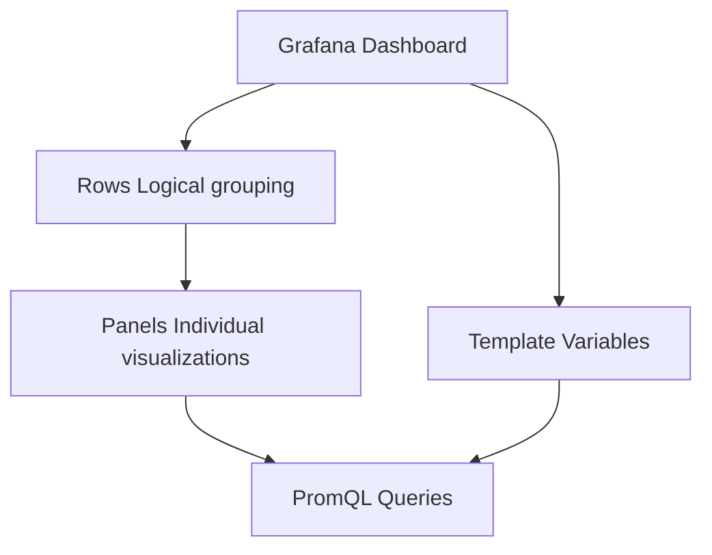

# Grafana Dashboards Tutorial

**Status**: Authoritative source
**Supersedes**: none
**Referenced by**: readme.md, tutorials/alert_rules.md, tutorials/prometheus_setup.md, tutorials/metrics_quickstart.md, engineering/docker_workflow.md

> **Purpose**: Tutorial for building actionable Grafana dashboards for effectful metrics.

**Build beautiful, actionable dashboards for effectful metrics.**

> **Tutorial**: For Prometheus setup, see [prometheus_setup.md](./prometheus_setup.md)

> **Core Doctrine**: For observability philosophy, see [observability.md](../engineering/observability.md)

## SSoT Link Map

| Need                     | Link                                                                   |
| ------------------------ | ---------------------------------------------------------------------- |
| Observability philosophy | [Observability](../engineering/observability.md)                       |
| Prometheus setup         | [Prometheus Setup](./prometheus_setup.md)                              |
| Docker Grafana container | [Docker Workflow](../engineering/docker_workflow.md#grafana-container) |
| Alert rules              | [Alert Rules](./alert_rules.md)                                        |

______________________________________________________________________

## Prerequisites

- Prometheus and Grafana running from [prometheus_setup.md](./prometheus_setup.md).
- Metrics exposed from your application per [metrics_quickstart.md](./metrics_quickstart.md).
- Familiar with alert rules to align dashboards with signals in [alert_rules.md](./alert_rules.md).

## Learning Objectives

By the end of this tutorial, you will:

1. ✅ Create Grafana dashboards from scratch
1. ✅ Write PromQL queries for visualization
1. ✅ Use templates for dynamic filtering
1. ✅ Configure panel types (graph, gauge, stat, table)
1. ✅ Export and version-control dashboards as JSON

**Time**: 30 minutes

______________________________________________________________________

## Dashboard Architecture



**Hierarchy**:

- **Dashboard**: Top-level container (e.g., "Effectful Metrics")
- **Rows**: Logical groupings (e.g., "Effect System", "Database", "Cache")
- **Panels**: Individual visualizations (graphs, gauges, stats)
- **Queries**: PromQL expressions pulling data from Prometheus
- **Variables**: Dynamic filters (e.g., `$namespace`, `$effect_type`)

______________________________________________________________________

## Step 1: Access Grafana

```bash
# Ensure Grafana is running
docker compose -f docker/docker-compose.yml ps grafana

# Access Grafana UI
open http://localhost:3000
```

**Login**: `admin` / `admin` (change password when prompted)

**Verify Data Source**:

1. Navigate to **Configuration → Data Sources**
1. Click **Prometheus**
1. Verify "Data source is working" (green checkmark)

______________________________________________________________________

## Step 2: Create Your First Dashboard

### Create Dashboard

1. Click **Create → Dashboard** (+ icon in left sidebar)
1. Click **Add new panel**
1. You'll see the panel editor

### Configure First Panel

**Panel Title**: "Effect Execution Rate"

**Query Tab**:

```promql
# file: examples/15_grafana_dashboards.promql
sum(rate(effectful_effects_total[5m])) by (effect_type)
```

**Legend Format**: `{{effect_type}}`

**Panel Settings** (right sidebar):

- Title: "Effect Execution Rate"
- Description: "Per-second rate of effect executions by type"

**Visualization**: Time series (default)

**Click Apply** to save panel.

______________________________________________________________________

## Step 3: Add More Panels

### Panel 2: Effect Error Rate

**Query**:

```promql
# file: examples/15_grafana_dashboards.promql
sum(rate(effectful_effects_total{result="error"}[5m]))
/
sum(rate(effectful_effects_total[5m]))
```

**Visualization**: Gauge

**Settings**:

- Title: "Effect Error Rate"
- Unit: Percent (0-1.0)
- Thresholds:
  - Green: 0 - 0.01 (0-1%)
  - Yellow: 0.01 - 0.05 (1-5%)
  - Red: 0.05+ (5%+)

### Panel 3: Effect Duration P95

**Query**:

```promql
# file: examples/15_grafana_dashboards.promql
histogram_quantile(0.95,
  sum by (effect_type, le) (
    rate(effectful_effect_duration_seconds_bucket[5m])
  )
)
```

**Visualization**: Time series

**Settings**:

- Title: "Effect Duration (P95)"
- Unit: seconds
- Legend: `{{effect_type}}`

### Panel 4: Active Programs

**Query**:

```promql
# file: examples/15_grafana_dashboards.promql
effectful_programs_active
```

**Visualization**: Stat

**Settings**:

- Title: "Active Programs"
- Color mode: Background
- Thresholds:
  - Green: 0 - 10
  - Yellow: 10 - 50
  - Red: 50+

______________________________________________________________________

## Step 4: Organize with Rows

### Create Row

1. Click **Add → Row** at top of dashboard
1. Click row title to edit: "Effect System Metrics"
1. Drag panels into row

### Add More Rows

Create logical groupings:

- **Effect System Metrics** (error rate, duration, throughput)
- **Database Metrics** (query duration, connection pool)
- **Cache Metrics** (hit rate, evictions, memory usage)
- **WebSocket Metrics** (active connections, message rate)

**Collapse Rows**: Click row title to toggle visibility.

______________________________________________________________________

## Step 5: Add Template Variables

Template variables enable dynamic filtering across all panels.

### Add Namespace Variable

1. Click **Dashboard settings** (gear icon, top right)
1. Navigate to **Variables**
1. Click **Add variable**

**Configuration**:

- Name: `namespace`
- Type: Query
- Label: Namespace
- Data source: Prometheus
- Query: `label_values(effectful_effects_total, namespace)`
- Multi-value: ✅ Enabled
- Include All option: ✅ Enabled

### Add Effect Type Variable

**Configuration**:

- Name: `effect_type`
- Type: Query
- Label: Effect Type
- Data source: Prometheus
- Query: `label_values(effectful_effects_total, effect_type)`
- Multi-value: ✅ Enabled
- Include All option: ✅ Enabled

### Use Variables in Queries

Update panel queries to use variables:

```promql
# file: examples/15_grafana_dashboards.promql
# Before (static)
sum(rate(effectful_effects_total[5m])) by (effect_type)

# After (dynamic with variables)
sum(rate(effectful_effects_total{namespace=~"$namespace", effect_type=~"$effect_type"}[5m])) by (effect_type)
```

**Variable Syntax**:

- `$namespace` - Single value
- `$effect_type` - Single value
- `=~"$namespace"` - Regex match (supports multi-value)

______________________________________________________________________

## Step 6: Advanced Panel Types

### Heatmap Panel

**Use Case**: Visualize latency distribution over time.

**Query**:

```promql
# file: examples/15_grafana_dashboards.promql
sum by (le) (
  increase(http_request_duration_seconds_bucket[1m])
)
```

**Visualization**: Heatmap

**Settings**:

- Y-Axis: le (buckets)
- Color scheme: Spectral
- Data format: Time series buckets

### Table Panel

**Use Case**: Show top N slow queries.

**Query**:

```promql
# file: examples/15_grafana_dashboards.promql
topk(10,
  histogram_quantile(0.99,
    sum by (query_type, le) (
      rate(database_query_duration_seconds_bucket[5m])
    )
  )
)
```

**Visualization**: Table

**Transformations**:

- Organize fields by name
- Hide unnecessary columns (Time, le)

### Bar Gauge Panel

**Use Case**: Show resource utilization (CPU, memory, connections).

**Query**:

```promql
# file: examples/15_grafana_dashboards.promql
database_connections_active / database_connections_max
```

**Visualization**: Bar gauge

**Settings**:

- Orientation: Horizontal
- Display mode: Gradient
- Unit: Percent (0-1.0)

______________________________________________________________________

## Step 7: PromQL Query Patterns

### Pattern 1: Rate of Counters

```promql
# file: examples/15_grafana_dashboards.promql
# Requests per second
rate(http_requests_total[5m])

# Errors per second
rate(http_requests_total{status=~"5.."}[5m])

# Total requests in last hour
increase(http_requests_total[1h])
```

### Pattern 2: Histogram Quantiles

```promql
# file: examples/15_grafana_dashboards.promql
# P50 latency
histogram_quantile(0.5, rate(duration_seconds_bucket[5m]))

# P95 latency by endpoint
histogram_quantile(0.95,
  sum by (endpoint, le) (rate(duration_seconds_bucket[5m]))
)

# Average latency
rate(duration_seconds_sum[5m]) / rate(duration_seconds_count[5m])
```

### Pattern 3: Gauge Aggregations

```promql
# file: examples/15_grafana_dashboards.promql
# Current value
active_connections

# Average over time
avg_over_time(active_connections[1h])

# Maximum over time
max_over_time(active_connections[1h])

# Prediction (linear regression)
predict_linear(active_connections[1h], 3600)  # Predict 1h ahead
```

### Pattern 4: Error Rates

```promql
# file: examples/15_grafana_dashboards.promql
# Error rate (percentage)
sum(rate(requests_total{status=~"5.."}[5m]))
/
sum(rate(requests_total[5m]))

# Success rate
sum(rate(requests_total{status!~"5.."}[5m]))
/
sum(rate(requests_total[5m]))
```

### Pattern 5: Top N

```promql
# file: examples/15_grafana_dashboards.promql
# Top 10 slowest endpoints
topk(10, histogram_quantile(0.95,
  sum by (endpoint, le) (rate(duration_seconds_bucket[5m]))
))

# Bottom 10 (lowest cache hit rate)
bottomk(10, cache_hit_rate)
```

### Pattern 6: Aggregations

```promql
# file: examples/15_grafana_dashboards.promql
# Sum across all instances
sum(rate(requests_total[5m]))

# Sum by label (group by)
sum by (endpoint) (rate(requests_total[5m]))

# Average by label
avg by (instance) (cpu_usage_percent)

# Count number of timeseries
count(up{job="effectful"})
```

______________________________________________________________________

## Step 8: Configure Time Ranges

### Dashboard Time Picker

Located in top-right corner:

- **Last 5 minutes** - Real-time monitoring
- **Last 1 hour** - Recent trends
- **Last 6 hours** - Incident investigation
- **Last 24 hours** - Daily patterns
- **Last 7 days** - Weekly trends

### Panel Time Overrides

Override dashboard time range for specific panels:

**Panel Settings → Time regions**:

- Relative time: Override dashboard time
- Time shift: Show data from X time ago

**Use Case**: Compare current hour to same hour yesterday:

```text
# file: dashboards/panel_time_overrides.txt
Panel 1: Last 1 hour (dashboard time)
Panel 2: Last 1 hour, shifted back 24 hours
```

### Auto-Refresh

Enable auto-refresh for live dashboards:

- Click time picker dropdown
- Select refresh interval (5s, 10s, 30s, 1m, 5m)

______________________________________________________________________

## Step 9: Alerts in Grafana

Grafana can generate alerts directly from panel queries.

### Create Alert from Panel

1. Edit panel
1. Click **Alert** tab
1. Click **Create alert rule from this panel**

**Alert Configuration**:

```text
# file: dashboards/alert_rule_notes.txt
Rule name: High Effect Error Rate
Evaluate: every 1m for 5m
Condition: WHEN last() OF query(A) IS ABOVE 0.05
```

**Notifications**:

- Contact point: Slack, PagerDuty, Email
- Severity: Critical, Warning, Info

**See Also**: [Alert Rules Tutorial](./alert_rules.md) for complete guide.

______________________________________________________________________

## Step 10: Save and Export Dashboard

### Save Dashboard

1. Click **Save dashboard** (floppy disk icon, top right)
1. Enter name: "Effectful Metrics"
1. (Optional) Add description
1. Click **Save**

### Export as JSON

1. Click **Dashboard settings** (gear icon)
1. Navigate to **JSON Model**
1. Click **Copy to Clipboard**
1. Save to file: `docker/grafana/dashboards/effectful.json`

**Version Control**:

```bash
# Add to git
git add docker/grafana/dashboards/effectful.json
git commit -m "Add Effectful metrics dashboard"
```

### Import Dashboard

1. Click **Create → Import** (+ icon)
1. Paste JSON or upload file
1. Select Prometheus data source
1. Click **Import**

______________________________________________________________________

## Complete Dashboard Example

### Effectful Metrics Dashboard JSON

```json
// file: configs/15_grafana_dashboards.json
{
  "dashboard": {
    "title": "Effectful Metrics",
    "tags": ["effectful", "metrics"],
    "timezone": "browser",
    "refresh": "30s",
    "rows": [
      {
        "title": "Effect System Metrics",
        "panels": [
          {
            "id": 1,
            "title": "Effect Execution Rate",
            "type": "graph",
            "targets": [
              {
                "expr": "sum(rate(effectful_effects_total{namespace=~\"$namespace\"}[5m])) by (effect_type)",
                "legendFormat": "{{effect_type}}"
              }
            ],
            "yaxes": [
              {
                "label": "ops/sec",
                "format": "short"
              }
            ]
          },
          {
            "id": 2,
            "title": "Effect Error Rate",
            "type": "gauge",
            "targets": [
              {
                "expr": "sum(rate(effectful_effects_total{result=\"error\"}[5m])) / sum(rate(effectful_effects_total[5m]))"
              }
            ],
            "fieldConfig": {
              "defaults": {
                "unit": "percentunit",
                "thresholds": {
                  "mode": "absolute",
                  "steps": [
                    {"value": 0, "color": "green"},
                    {"value": 0.01, "color": "yellow"},
                    {"value": 0.05, "color": "red"}
                  ]
                }
              }
            }
          }
        ]
      }
    ],
    "templating": {
      "list": [
        {
          "name": "namespace",
          "type": "query",
          "datasource": "Prometheus",
          "query": "label_values(effectful_effects_total, namespace)",
          "multi": true,
          "includeAll": true
        }
      ]
    }
  }
}
```

______________________________________________________________________

## Best Practices

### DO

**✅ Use Consistent Colors**

```text
# file: dashboards/grafana_color_conventions.txt
Green: Good (success, low latency, high cache hit)
Yellow: Warning (degraded, approaching threshold)
Red: Critical (errors, high latency, resource exhaustion)
```

**✅ Add Panel Descriptions**

```text
# file: dashboards/panel_description_template.txt
Description: "P95 latency should be < 1s (SLO: 99% of requests < 2s)"
```

**✅ Use Template Variables**

```promql
# file: examples/15_grafana_dashboards.promql
# Allows filtering by namespace, effect_type, etc.
effectful_effects_total{namespace=~"$namespace", effect_type=~"$effect_type"}
```

**✅ Set Meaningful Units**

```text
# file: dashboards/metric_units_reference.txt
Time: seconds (s), milliseconds (ms)
Data: bytes (bytes), megabytes (MB)
Throughput: ops/sec, req/sec
```

**✅ Group Related Panels**

```text
# file: dashboards/panel_grouping_examples.txt
Row 1: SLOs (error rate, latency)
Row 2: Throughput (requests/sec, events/sec)
Row 3: Resources (CPU, memory, connections)
```

### DON'T

**❌ Overload Dashboards**

```text
# file: dashboards/dashboard_density_guidance.txt
# Bad: 50+ panels on one dashboard
# Good: 10-15 panels per dashboard, multiple dashboards
```

**❌ Use Default Panel Titles**

```text
# file: dashboards/panel_title_examples.txt
# Bad: "Panel Title"
# Good: "Effect Error Rate (Last 5m)"
```

**❌ Forget to Save**

```text
# file: dashboards/dashboard_persistence_warning.txt
# Grafana dashboards are ephemeral unless saved!
# Export to JSON and version-control
```

**❌ Hard-Code Label Values**

```text
# file: dashboards/label_variable_examples.txt
# Bad: {namespace="production"}
# Good: {namespace=~"$namespace"}
```

______________________________________________________________________

## Dashboard Gallery

### Effectful Overview Dashboard

**Rows**:

1. **SLO Metrics** (3 panels)

   - Effect error rate (gauge)
   - Effect p95 latency (graph)
   - Active programs (stat)

1. **Effect System** (4 panels)

   - Effect execution rate by type (graph)
   - Effect duration heatmap (heatmap)
   - Top 10 slowest effects (table)
   - Effect result breakdown (pie chart)

1. **Infrastructure** (3 panels)

   - Database connections (gauge)
   - Cache hit rate (graph)
   - WebSocket connections (stat)

### HealthHub Dashboard

**Rows**:

1. **Clinical Metrics** (4 panels)

   - Appointments created (stat)
   - Unreviewed critical lab results (gauge)
   - Prescription interaction checks (graph)
   - HIPAA audit events (table)

1. **Performance** (3 panels)

   - API latency p95 (graph)
   - Database query duration (heatmap)
   - Cache effectiveness (graph)

1. **Business Metrics** (3 panels)

   - Active patients (stat)
   - Appointments per specialization (bar chart)
   - Revenue (graph)

______________________________________________________________________

## Troubleshooting

### No Data in Panel

**Check**:

1. Time range includes data (widen time picker)
1. PromQL query valid (test in Prometheus UI)
1. Metric exists (check /metrics endpoint)
1. Template variables filtering too aggressively

**Debug**:

```bash
# Query Prometheus directly
curl 'http://localhost:9090/api/v1/query?query=effectful_effects_total'
```

### Query Too Slow

**Optimize**:

- Reduce time range (last 1h instead of 7d)
- Use shorter rate window (`[5m]` instead of `[1h]`)
- Aggregate with `sum by` to reduce cardinality
- Use recording rules for complex queries

### Panel Shows "N/A"

**Causes**:

- Query returns no data points
- Metric name typo
- Label filter excludes all data

**Fix**:

- Test query in Prometheus UI
- Verify metric name with `curl http://localhost:8000/metrics`
- Remove label filters temporarily

______________________________________________________________________

## Summary

- Built Grafana dashboards with panels, rows, variables, and time controls tailored to effectful metrics.
- Authored PromQL queries and aligned visualizations with alerts for actionable insights.
- Exported dashboards as JSON to version-control and automate provisioning.

## Next Steps

1. **Create Custom Dashboards** - Build dashboards for your application
1. **Export to Git** - Version-control dashboard JSON
1. **Set Up Alerts** - Configure Grafana alerts for critical panels
1. **Explore Plugins** - Install community plugins (worldmap, diagram)

______________________________________________________________________

## See Also

- [Prometheus Setup](./prometheus_setup.md) - Docker integration
- [Alert Rules](./alert_rules.md) - Creating Prometheus alerts
- [Metrics Quickstart](./metrics_quickstart.md) - Getting started with metrics
- [Observability](../engineering/observability.md) - Metrics philosophy

______________________________________________________________________

## Cross-References

- [Documentation Standards](../documentation_standards.md)
- [Engineering Standards](../engineering/README.md)
