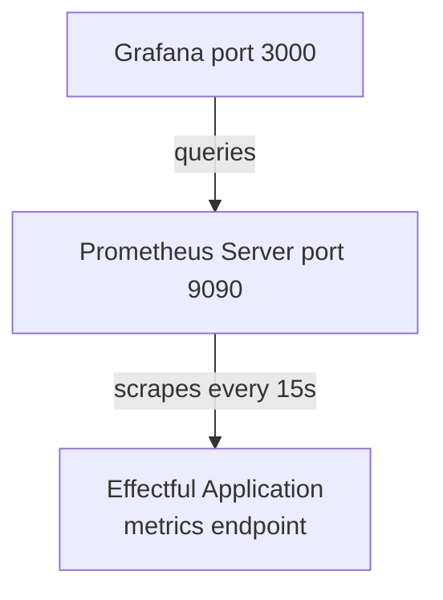

# Prometheus Setup

**Status**: Authoritative source
**Supersedes**: none
**Referenced by**: readme.md, tutorials/grafana_dashboards.md, tutorials/alert_rules.md, api/metrics.md, tutorials/metrics_quickstart.md, tutorials/metric_types_guide.md

> **Purpose**: Tutorial for setting up Prometheus and Grafana with Docker for effectful applications.

> **Note**: This tutorial covers the legacy Python effectful library. For the Effectful Language (Haskell-derived DSL for distributed systems), see [DSL Documentation](../dsl/intro.md).

**Set up Prometheus and Grafana with Docker for effectful applications.**

> **Core Doctrine**: For Docker services overview, see [docker_workflow.md](../engineering/docker_workflow.md)

> **Core Doctrine**: For observability architecture, see [observability.md](../engineering/observability.md)

## SSoT Link Map

| Need                     | Link                                                 |
| ------------------------ | ---------------------------------------------------- |
| Observability philosophy | [Observability](../engineering/observability.md)     |
| Docker services setup    | [Docker Workflow](../engineering/docker_workflow.md) |
| Metrics quickstart       | [Metrics Quickstart](./metrics_quickstart.md)        |
| Alert rules              | [Alert Rules](./alert_rules.md)                      |
| Grafana dashboards       | [Grafana Dashboards](./grafana_dashboards.md)        |
| Metric types reference   | [Metric Types Guide](./metric_types_guide.md)        |

______________________________________________________________________

## Prerequisites

- Docker and Docker Compose installed and running.
- Base services available via `docker/docker-compose.yml`; comfort with `docker compose ... exec`.
- Completed [Metrics Quickstart](metrics_quickstart.md) and reviewed observability doctrine in [observability.md](../engineering/observability.md).

## Learning Objectives

By the end of this tutorial, you will:

1. ✅ Add Prometheus and Grafana to Docker Compose
1. ✅ Configure Prometheus to scrape metrics endpoints
1. ✅ Expose `/metrics` endpoint from effectful applications
1. ✅ Query metrics in Prometheus UI
1. ✅ Understand scrape intervals and retention

**Time**: 20 minutes

______________________________________________________________________

## Architecture Overview



**Data Flow**:

1. Effectful application exposes `/metrics` HTTP endpoint (Prometheus text format)
1. Prometheus scrapes `/metrics` every 15 seconds
1. Prometheus stores time-series data locally
1. Grafana queries Prometheus for visualization

______________________________________________________________________

## Step 1: Add Services to Docker Compose

Add Prometheus and Grafana services to your `docker/docker-compose.yml`:

```yaml
# file: configs/13_prometheus_setup.yaml
version: '3.8'

services:
  # Existing effectful service
  effectful:
    build:
      context: ..
      dockerfile: docker/Dockerfile
    volumes:
      - ../effectful:/app/effectful
      - ../tests:/app/tests
    ports:
      - "8000:8000"  # FastAPI + /metrics endpoint
    depends_on:
      - postgres
      - redis
      - prometheus
    environment:
      PROMETHEUS_URL: http://prometheus:9090

  # Prometheus service
  prometheus:
    image: prom/prometheus:latest
    container_name: prometheus
    ports:
      - "9090:9090"
    volumes:
      - ./prometheus/prometheus.yml:/etc/prometheus/prometheus.yml:ro
      - ./prometheus/alerts.yml:/etc/prometheus/alerts.yml:ro
      - prometheusdata:/prometheus
    command:
      - '--config.file=/etc/prometheus/prometheus.yml'
      - '--storage.tsdb.path=/prometheus'
      - '--storage.tsdb.retention.time=30d'
      - '--web.console.libraries=/usr/share/prometheus/console_libraries'
      - '--web.console.templates=/usr/share/prometheus/consoles'
    restart: unless-stopped

  # Grafana service
  grafana:
    image: grafana/grafana:latest
    container_name: grafana
    ports:
      - "3000:3000"
    volumes:
      - ./grafana/datasources:/etc/grafana/provisioning/datasources:ro
      - ./grafana/dashboards:/etc/grafana/provisioning/dashboards:ro
      - grafanadata:/var/lib/grafana
    environment:
      GF_SECURITY_ADMIN_USER: admin
      GF_SECURITY_ADMIN_PASSWORD: admin
      GF_INSTALL_PLUGINS: ""
    depends_on:
      - prometheus
    restart: unless-stopped

  # Existing services...
  postgres:
    image: postgres:15
    # ... existing config

  redis:
    image: redis:7
    # ... existing config

volumes:
  prometheusdata:
  grafanadata:
  pgdata:
  redisdata:
```

**Key Configuration**:

- Prometheus port: `9090` (web UI + API)
- Grafana port: `3000` (web UI)
- Data retention: `30d` (30 days of metrics)
- Named volumes for data persistence

______________________________________________________________________

## Step 2: Configure Prometheus Scrape Targets

Create `docker/prometheus/prometheus.yml`:

```yaml
# file: configs/13_prometheus_setup.yaml
# Prometheus configuration file
global:
  scrape_interval: 15s       # Scrape targets every 15 seconds
  evaluation_interval: 15s   # Evaluate alert rules every 15 seconds
  external_labels:
    cluster: 'dev'
    environment: 'local'

# Load alert rules
rule_files:
  - '/etc/prometheus/alerts.yml'

# Scrape configurations
scrape_configs:
  # Prometheus itself
  - job_name: 'prometheus'
    static_configs:
      - targets: ['localhost:9090']
        labels:
          service: 'prometheus'

  # Effectful application
  - job_name: 'effectful'
    static_configs:
      - targets: ['effectful:8000']
        labels:
          service: 'effectful'
          app: 'main'
    metrics_path: '/metrics'
    scrape_interval: 15s
    scrape_timeout: 10s

  # HealthHub application (if using demo)
  - job_name: 'healthhub'
    static_configs:
      - targets: ['healthhub:8000']
        labels:
          service: 'healthhub'
          app: 'backend'
    metrics_path: '/metrics'
    scrape_interval: 15s
```

**Configuration Breakdown**:

- `scrape_interval: 15s` - How often to scrape metrics (balance between freshness and overhead)
- `targets: ['effectful:8000']` - Docker service name + port
- `metrics_path: '/metrics'` - HTTP endpoint path (standard)
- `scrape_timeout: 10s` - Fail if scrape takes > 10 seconds

______________________________________________________________________

## Step 3: Create Alert Rules File

Create `docker/prometheus/alerts.yml`:

```yaml
# file: configs/13_prometheus_setup.yaml
# Prometheus alert rules
groups:
  - name: effectful_alerts
    interval: 30s
    rules:
      # High effect error rate
      - alert: HighEffectErrorRate
        expr: |
          sum(rate(effectful_effects_total{result="error"}[5m]))
          /
          sum(rate(effectful_effects_total[5m]))
          > 0.05
        for: 5m
        labels:
          severity: critical
          component: effect_system
        annotations:
          summary: "High effect error rate detected"
          description: "Effect error rate is {{ $value | humanizePercentage }} (threshold: 5%)"

      # Slow effect execution
      - alert: SlowEffectExecution
        expr: |
          histogram_quantile(0.95,
            sum by (effect_type, le) (
              rate(effectful_effect_duration_seconds_bucket[5m])
            )
          ) > 5.0
        for: 10m
        labels:
          severity: warning
          component: effect_system
        annotations:
          summary: "Slow effect execution detected"
          description: "P95 effect duration is {{ $value }}s for {{ $labels.effect_type }}"
```

**See Also**: [Alert Rules Tutorial](./alert_rules.md) for complete guide.

______________________________________________________________________

## Step 4: Configure Grafana Data Source

Create `docker/grafana/datasources/prometheus.yml`:

```yaml
# file: configs/13_prometheus_setup.yaml
# Grafana datasource configuration
apiVersion: 1

datasources:
  - name: Prometheus
    type: prometheus
    access: proxy
    url: http://prometheus:9090
    isDefault: true
    editable: true
    jsonData:
      timeInterval: "15s"
      queryTimeout: "60s"
```

Create `docker/grafana/dashboards/dashboard.yml`:

````yaml
# file: configs/13_prometheus_setup.yaml
# Grafana dashboard provisioning
apiVersion: 1

providers:
  - name: 'Effectful Dashboards'
    orgId: 1
    folder: ''
    type: file
    disableDeletion: false
    updateIntervalSeconds: 10
    allowUiUpdates: true
    options:
      path: /etc/grafana/provisioning/dashboards
```text

______________________________________________________________________

## Step 5: Expose /metrics Endpoint in Application

Expose `/metrics` via the **pure runtime-effects** assembly (no globals). See `examples/07_metrics_endpoint.py` for a complete reference.

```python
# Expose /metrics route using runtime assembly
from collections.abc import Generator
from contextlib import asynccontextmanager
from dataclasses import dataclass

from fastapi import FastAPI
from fastapi.routing import APIRoute
from fastapi.responses import Response
from prometheus_client import CollectorRegistry, CONTENT_TYPE_LATEST, generate_latest

from effectful.adapters.prometheus_metrics import PrometheusMetricsCollector
from effectful.algebraic.result import Err, Ok
from effectful.effects.runtime import (
    CloseObservabilityInterpreter,
    CreateObservabilityInterpreter,
    RegisterHttpRoute,
    ResourceHandle,
    RuntimeEffect,
    SetAppMetadata,
)
from effectful.interpreters.metrics import MetricsInterpreter
from effectful.interpreters.runtime import RuntimeInterpreter
from effectful.observability import MetricsRegistry, CounterDefinition
from effectful.observability.instrumentation import create_instrumented_interpreter
from effectful.programs.runners import run_ws_program


APP_METRICS = MetricsRegistry(
    counters=(
        CounterDefinition(
            name="app_requests_total",
            help_text="Total requests by endpoint",
            label_names=("endpoint",),
        ),
    ),
    gauges=(),
    histograms=(),
    summaries=(),
)


@dataclass(frozen=True)
class MetricsRuntime:
    collector: PrometheusMetricsCollector
    interpreter: object
    registry: CollectorRegistry

    def render_latest(self) -> bytes:
        return generate_latest(self.registry)

    async def close(self) -> None:
        return None


@dataclass(frozen=True)
class StartupAssembly:
    app: ResourceHandle[FastAPI]
    metrics: ResourceHandle[MetricsRuntime]


def startup_program(
    app_handle: ResourceHandle[FastAPI],
) -> Generator[RuntimeEffect, ResourceHandle[object], StartupAssembly]:
    yield SetAppMetadata(
        app=app_handle,
        title="Effectful Metrics Example",
        description="Pure runtime effects wiring",
        version="1.0.0",
    )

    metrics_runtime = yield CreateObservabilityInterpreter(metrics_registry=APP_METRICS)

    async def _metrics() -> Response:
        return Response(
            content=metrics_runtime.resource.render_latest(),
            media_type=CONTENT_TYPE_LATEST,
        )

    yield RegisterHttpRoute(
        app=app_handle,
        path="/metrics",
        endpoint=_metrics,
        methods=("GET",),
        include_in_schema=False,
        response_model=None,
    )

    return StartupAssembly(app=app_handle, metrics=metrics_runtime)


def shutdown_program(
    assembly: StartupAssembly,
) -> Generator[RuntimeEffect, object, None]:
    yield CloseObservabilityInterpreter(handle=assembly.metrics)


async def _create_observability_interpreter(
    effect: CreateObservabilityInterpreter,
) -> ResourceHandle[MetricsRuntime]:
    registry = CollectorRegistry()
    collector = PrometheusMetricsCollector(registry=registry)
    if effect.metrics_registry is not None:
        await collector.register_metrics(effect.metrics_registry)

    metrics_interp = MetricsInterpreter(metrics_collector=collector)
    instrumented = await create_instrumented_interpreter(
        wrapped=metrics_interp, metrics_collector=collector
    )

    return ResourceHandle(
        kind="metrics_runtime",
        resource=MetricsRuntime(
            collector=collector,
            interpreter=instrumented,
            registry=registry,
        ),
    )


def build_runtime_interpreter() -> RuntimeInterpreter:
    async def _set_app_metadata(effect: SetAppMetadata) -> None:
        app = effect.app.resource
        app.title = effect.title
        app.description = effect.description
        app.version = effect.version

    async def _register_route(effect: RegisterHttpRoute) -> None:
        app = effect.app.resource
        app.router.routes.append(
            APIRoute(
                path=effect.path,
                endpoint=effect.endpoint,
                methods=list(effect.methods),
                include_in_schema=effect.include_in_schema,
                response_model=effect.response_model,
            )
        )

    return RuntimeInterpreter(
        set_app_metadata=_set_app_metadata,
        register_route=_register_route,
        create_observability_interpreter=_create_observability_interpreter,
        close_observability_interpreter=lambda effect: effect.handle.resource.close(),
    )


@asynccontextmanager
async def lifespan(app: FastAPI):
    app_handle = ResourceHandle(kind="fastapi_app", resource=app)
    runtime = build_runtime_interpreter()
    startup = await run_ws_program(startup_program(app_handle), runtime)
    if isinstance(startup, Err):
        raise RuntimeError(startup.error)

    assembly = startup.value
    app.state.metrics_runtime = assembly.metrics.resource
    try:
        yield
    finally:
        await run_ws_program(shutdown_program(assembly), runtime)


app = FastAPI(lifespan=lifespan)
````

**Metrics Endpoint Output**:

````text
# file: examples/13_prometheus_metrics_output.txt
# HELP effectful_effects_total Total effects executed
# TYPE effectful_effects_total counter
effectful_effects_total{effect_type="GetUserById",result="ok"} 142.0
effectful_effects_total{effect_type="GetUserById",result="error"} 3.0

# HELP effectful_effect_duration_seconds Effect execution duration
# TYPE effectful_effect_duration_seconds histogram
effectful_effect_duration_seconds_bucket{effect_type="GetUserById",le="0.001"} 12.0
effectful_effect_duration_seconds_bucket{effect_type="GetUserById",le="0.01"} 89.0
effectful_effect_duration_seconds_bucket{effect_type="GetUserById",le="0.1"} 134.0
effectful_effect_duration_seconds_bucket{effect_type="GetUserById",le="+Inf"} 145.0
effectful_effect_duration_seconds_sum{effect_type="GetUserById"} 12.34
effectful_effect_duration_seconds_count{effect_type="GetUserById"} 145.0
```text

______________________________________________________________________

## Step 6: Start Services

```bash
# Build and start all services
docker compose -f docker/docker-compose.yml up -d

# Verify services are running
docker compose -f docker/docker-compose.yml ps

# Check Prometheus logs
docker compose -f docker/docker-compose.yml logs prometheus

# Check Grafana logs
docker compose -f docker/docker-compose.yml logs grafana
````

**Expected Output**:

````text
# example docker compose ps output
NAME         IMAGE                    STATUS    PORTS
effectful    effectful:latest         Up        0.0.0.0:8000->8000/tcp
prometheus   prom/prometheus:latest   Up        0.0.0.0:9090->9090/tcp
grafana      grafana/grafana:latest   Up        0.0.0.0:3000->3000/tcp
postgres     postgres:15              Up        5432/tcp
redis        redis:7                  Up        6379/tcp
```text

______________________________________________________________________

## Step 7: Verify Prometheus is Scraping

### Access Prometheus UI

Open http://localhost:9090

### Check Targets

1. Navigate to **Status → Targets**
1. Verify `effectful` job shows **UP** state
1. Check "Last Scrape" timestamp (should be recent)

**Healthy Target**:

```text
# file: docs/prometheus_target_status.txt
Job: effectful
State: UP
Endpoint: http://effectful:8000/metrics
Last Scrape: 2s ago
Scrape Duration: 15ms
````

**Unhealthy Target** (troubleshoot):

```text
# file: docs/prometheus_target_status.txt
Job: effectful
State: DOWN
Error: Get "http://effectful:8000/metrics": connection refused
```

### Query Metrics

1. Navigate to **Graph** tab
1. Enter query: `effectful_effects_total`
1. Click **Execute**
1. View table or graph output

**Example Queries**:

````promql
# file: examples/13_prometheus_setup.promql
# All effects
effectful_effects_total

# Success rate
sum(rate(effectful_effects_total{result="ok"}[5m]))
/
sum(rate(effectful_effects_total[5m]))

# P95 effect duration
histogram_quantile(0.95,
  sum by (le) (rate(effectful_effect_duration_seconds_bucket[5m]))
)
```text

______________________________________________________________________

## Step 8: Access Grafana

### Login

1. Open http://localhost:3000
1. Login with `admin` / `admin`
1. (Optional) Change password when prompted

### Verify Data Source

1. Navigate to **Configuration → Data Sources**
1. Click **Prometheus** (should be green with "Data source is working")
1. Test query: `up`

### Create First Dashboard

1. Navigate to **Create → Dashboard**
1. Click **Add new panel**
1. Enter query: `rate(effectful_effects_total[5m])`
1. Configure panel:
   - Title: "Effect Execution Rate"
   - Legend: `{{effect_type}} - {{result}}`
   - Unit: ops/sec
1. Click **Apply**
1. Save dashboard

**See Also**: [Grafana Dashboards Tutorial](./grafana_dashboards.md) for complete guide.

______________________________________________________________________

## Configuration Reference

### Prometheus Configuration Options

```yaml
# file: configs/13_prometheus_setup.yaml
global:
  scrape_interval: 15s           # Default scrape frequency
  scrape_timeout: 10s            # Scrape timeout (< interval)
  evaluation_interval: 15s       # Alert rule evaluation frequency

  # Optional: External labels for federation
  external_labels:
    cluster: 'production'
    region: 'us-east-1'

# Storage configuration
storage:
  tsdb:
    path: /prometheus
    retention.time: 30d          # Keep 30 days of data
    retention.size: 10GB         # Or 10GB, whichever comes first

# Alertmanager configuration (optional)
alerting:
  alertmanagers:
    - static_configs:
        - targets:
            - alertmanager:9093
````

### Scrape Interval Guidelines

| Interval | Use Case                  | Pros                     | Cons                   |
| -------- | ------------------------- | ------------------------ | ---------------------- |
| `5s`     | High-frequency monitoring | Fresh data, catch spikes | High overhead, storage |
| `15s`    | **Recommended default**   | Good balance             | -                      |
| `30s`    | Low-traffic services      | Lower overhead           | May miss short spikes  |
| `60s`    | Batch jobs                | Minimal overhead         | Coarse granularity     |

**Recommendation**: Start with `15s`, increase if needed.

### Retention Guidelines

| Retention | Storage (rough) | Use Case           |
| --------- | --------------- | ------------------ |
| `7d`      | ~500MB          | Development        |
| `15d`     | ~1GB            | Staging            |
| `30d`     | ~2GB            | **Recommended**    |
| `90d`     | ~6GB            | Compliance         |
| `1y`      | ~24GB           | Long-term analysis |

**Formula**: `storage ≈ samples_per_second × scrape_interval × retention × 1.5 bytes`

______________________________________________________________________

## Troubleshooting

### Issue 1: Prometheus Can't Scrape Application

**Symptom**: Target shows `DOWN`, error: "connection refused"

**Causes**:

- Application not exposing `/metrics` endpoint
- Application not listening on `0.0.0.0` (listening on `127.0.0.1` only)
- Port mismatch in `prometheus.yml`

**Solution**:

````python
# Ensure FastAPI listens on 0.0.0.0
if __name__ == "__main__":
    import uvicorn
    uvicorn.run(app, host="0.0.0.0", port=8000)
```text

```yaml
# file: configs/13_prometheus_setup.yaml
# Verify target in prometheus.yml
- targets: ['effectful:8000']  # Docker service name, not localhost!
````

### Issue 2: Metrics Not Appearing

**Symptom**: Prometheus scrapes successfully, but queries return empty

**Causes**:

- Metrics not being recorded (no effects executed)
- Metric name mismatch between code and query
- No data in time range

**Solution**:

```bash
# Check /metrics endpoint directly
curl http://localhost:8000/metrics

# Verify metrics appear in output
# Look for: effectful_effects_total{...}
```

### Issue 3: Grafana Can't Connect to Prometheus

**Symptom**: Data source test fails

**Causes**:

- Prometheus not running
- Wrong URL in datasource config
- Network isolation

**Solution**:

```yaml
# file: configs/13_prometheus_setup.yaml
# Use Docker service name, not localhost
url: http://prometheus:9090  # ✅ Correct
url: http://localhost:9090   # ❌ Wrong (from Grafana container)
```

### Issue 4: High Disk Usage

**Symptom**: Docker volume `prometheusdata` consuming lots of disk

**Causes**:

- High cardinality metrics (too many label combinations)
- Long retention period
- High scrape frequency

**Solution**:

````bash
# Check volume size
docker volume inspect prometheusdata

# Reduce retention
# In docker-compose.yml:
command:
  - '--storage.tsdb.retention.time=7d'  # Reduce from 30d to 7d

# Restart Prometheus
docker compose -f docker/docker-compose.yml restart prometheus
```text

______________________________________________________________________

## Production Considerations

### Security

**Authentication**:

```yaml
# file: configs/13_prometheus_setup.yaml
# prometheus.yml - Basic auth for scrape targets
scrape_configs:
  - job_name: 'effectful'
    basic_auth:
      username: 'prometheus'
      password: 'secret'
    static_configs:
      - targets: ['effectful:8000']
````

**Network Isolation**:

```yaml
# file: configs/13_prometheus_setup.yaml
# docker-compose.yml
networks:
  monitoring:
    driver: bridge

services:
  prometheus:
    networks:
      - monitoring
  effectful:
    networks:
      - monitoring
      - default
```

### High Availability

**Prometheus HA**:

- Run 2+ Prometheus instances scraping same targets
- Use external storage (Thanos, Cortex) for long-term retention
- Configure federation for multi-cluster setups

**Grafana HA**:

- Use external database (PostgreSQL) for dashboard storage
- Run multiple Grafana instances behind load balancer

### Alerting

**Alertmanager Configuration**:

```yaml
# file: configs/13_prometheus_setup.yaml
# alertmanager.yml
route:
  receiver: 'slack'
  group_by: ['alertname', 'severity']
  group_wait: 30s
  group_interval: 5m
  repeat_interval: 4h

receivers:
  - name: 'slack'
    slack_configs:
      - api_url: 'https://hooks.slack.com/services/XXX'
        channel: '#alerts'
        title: '{{ .GroupLabels.alertname }}'
        text: '{{ .CommonAnnotations.description }}'
```

**See Also**: [Alert Rules Tutorial](./alert_rules.md)

## Summary

- Added Prometheus and Grafana services to the Docker stack and configured scrape targets plus alerting.
- Exposed `/metrics` from the effectful app and validated ingestion and dashboards.
- Reviewed production hardening: auth, network isolation, HA, and Alertmanager routing.

______________________________________________________________________

## Next Steps

1. **Create Alert Rules** - Set up alerts for high error rates, slow queries

   - See [alert_rules.md](./alert_rules.md)

1. **Build Grafana Dashboards** - Visualize metrics with beautiful dashboards

   - See [grafana_dashboards.md](./grafana_dashboards.md)

1. **Integrate with Applications** - Add metrics to your effectful programs

   - See [metrics_quickstart.md](./metrics_quickstart.md)

______________________________________________________________________

## Complete Directory Structure

```text
# file: docker/README.txt
docker/
├── docker-compose.yml
├── prometheus/
│   ├── prometheus.yml          # Main config
│   └── alerts.yml              # Alert rules
├── grafana/
│   ├── datasources/
│   │   └── prometheus.yml      # Data source config
│   └── dashboards/
│       ├── dashboard.yml       # Provisioning config
│       └── effectful.json      # Dashboard JSON (optional)
└── Dockerfile
```

______________________________________________________________________

## See Also

- [Docker Workflow](../engineering/docker_workflow.md) - Container services overview
- [Observability](../engineering/observability.md) - Metrics philosophy
- [Alert Rules Tutorial](./alert_rules.md) - Creating alerts
- [Grafana Dashboards](./grafana_dashboards.md) - Building dashboards

______________________________________________________________________

## Cross-References

- [Documentation Standards](../documentation_standards.md)
- [Engineering Standards](../engineering/README.md)
